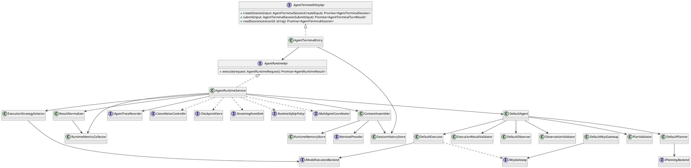
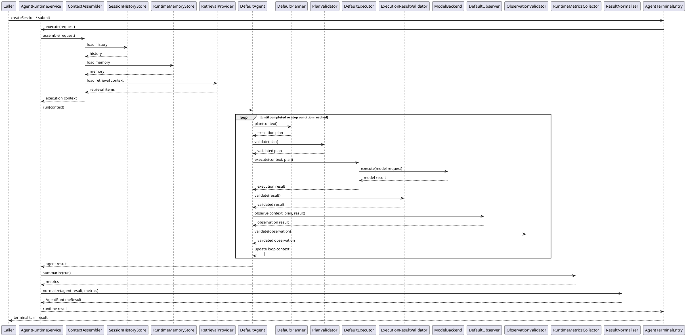
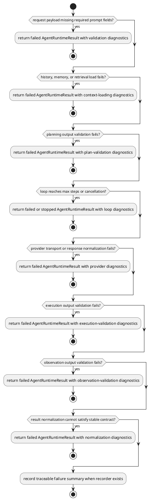

# AgentRuntime Design

## 0. Document Type

- type: `functional_group_design`
- scope: define the external `AgentRuntimeApi` boundary and the P0 runtime internals for context assembly, multi-step planning loop, provider adaptation, result stabilization, and runtime observability, while keeping P1 and P2 capabilities at reuse-boundary or interface level
- includes: `AgentRuntimeApi`, `AgentTerminalEntryApi`, `AgentRuntimeService`, `AgentTerminalEntry`, `ContextAssembler`, `SessionHistoryStore`, `RuntimeMemoryStore`, `RetrievalProvider`, `DefaultAgent`, `DefaultPlanner`, `PlanValidator`, `DefaultExecutor`, `ExecutionResultValidator`, `DefaultObserver`, `ObservationValidator`, `ExecutionStrategySelector`, `ResultNormalizer`, `RuntimeMetricsCollector`, `DefaultMcpGateway`
- downstream usage: guide follow-up implementation and integration for a standalone agent runtime SDK with context-aware prompting, stable runtime result contracts, trace and metric alignment, and later P1 extension work

## 1. Goal

### 1.1 Purpose

Define the module-level design of `AgentRuntime` as a standalone SDK runtime boundary that accepts normalized execution requests, assembles runtime context from session and memory sources, runs one controlled multi-step planning loop, and returns stable runtime results to external callers.

### 1.2 Involved Items

This design document directly covers:

- `AgentRuntimeApi`
- `AgentTerminalEntryApi`
- `AgentRuntimeService`
- `AgentTerminalEntry`
- `ContextAssembler`
- `SessionHistoryStore`
- `RuntimeMemoryStore`
- `RetrievalProvider`
- `DefaultAgent`
- `DefaultPlanner`
- `DefaultExecutor`
- `DefaultObserver`
- `ExecutionStrategySelector`
- `ResultNormalizer`
- `RuntimeMetricsCollector`
- `DefaultMcpGateway`

This design document collaborates with:

- external SDK callers
- trace consumers
- external model providers
- MCP tool handlers

### 1.3 Core Functions

`AgentRuntime` is the design item for one standalone execution runtime with a stable external API, context-aware execution control, and stable result normalization.

Its core functions are:

- Accept normalized runtime requests from callers through one stable `execute` boundary.
- Load session history, short-term memory, and retrieval-backed context before execution begins.
- Normalize each request into one internal agent context for planning, repeated execution, observation, metrics, and trace emission.
- Run one controlled `plan -> execute -> observe -> re-plan` loop until completion or runtime stop conditions are reached.
- Validate planning output and execution output before they enter the next runtime stage.
- Select mock or real model execution strategy without exposing provider-specific details to callers.
- Normalize execution output into one stable success or failure contract with diagnostics and metrics.

`AgentRuntime` does not own business-specific orchestration, external artifact persistence, workflow gating, or domain-specific sequencing.

## 2. Core Classes

### 2.1 Class Diagram



### 2.2 Core Class Responsibilities

#### 2.2.1 `AgentRuntimeService`

Role:

- Stable external runtime API implementation for SDK callers.

Responsibilities:

- Accept one normalized `AgentRuntimeRequest`.
- Validate request shape and runtime-level execution limits.
- Load execution context through `ContextAssembler`.
- Assemble runtime dependencies for loop execution, normalization, metrics, and trace.
- Control loop entry, continuation, and stop conditions.
- Convert internal execution output into stable `AgentRuntimeResult`.

#### 2.2.2 `AgentTerminalEntry`

Role:

- Terminal-facing entry adapter for standalone interactive runtime usage and terminal-driven tests.

Responsibilities:

- Create terminal sessions with stable `sessionId`.
- Map terminal turn input into `AgentRuntimeRequest`.
- Submit terminal turns through `AgentRuntimeApi`.
- Read and return terminal session transcript and latest runtime result.

#### 2.2.3 `ContextAssembler`

Role:

- Build one execution-ready context from request data and runtime context sources.

Responsibilities:

- Read session history from `SessionHistoryStore`.
- Read short-term runtime memory from `RuntimeMemoryStore`.
- Load optional retrieval-backed context through `RetrievalProvider`.
- Merge caller payload and loaded context into one stable `AgentContext`.

#### 2.2.3 `SessionHistoryStore`

Role:

- Runtime-owned boundary for session-level message history.

Responsibilities:

- Load ordered message history by session identity.
- Return empty history when the caller does not provide session state.
- Keep persistence details outside `AgentRuntimeService`.

#### 2.2.4 `RuntimeMemoryStore`

Role:

- Runtime-owned boundary for short-term memory state.

Responsibilities:

- Load short-lived memory fragments relevant to the current request.
- Save updated memory summary after successful execution when configured.
- Keep memory lifecycle separate from model execution logic.

#### 2.2.5 `RetrievalProvider`

Role:

- Optional retrieval boundary for external context loading.

Responsibilities:

- Accept retrieval query input derived from the runtime request.
- Return retrieval-backed context items in one normalized shape.
- Keep retrieval implementation replaceable without changing runtime control flow.

#### 2.2.6 `DefaultAgent`

Role:

- Runtime pipeline coordinator for one multi-step execution loop.

Responsibilities:

- Call planner, executor, and observer repeatedly until completion or stop.
- Validate plan, execution result, and observation result before advancing loop state.
- Record trace checkpoints for plan, execution, tool use, and observation.
- Return one aggregated runtime output.

#### 2.2.7 `DefaultPlanner`

Role:

- Decide the current execution plan shape.

Responsibilities:

- Read normalized runtime context, loaded memory, and retrieval fragments.
- Decide the current execution step and completion state.
- Generate the next-step execution plan from the current runtime context and prior step outputs.
- Call `IPlanningBackend` to produce structured planning output.
- Emit ordered tool steps only when the runtime plan requires external tool use.

#### 2.2.8 `PlanValidator`

Role:

- Validate structured planning output before execution begins.

Responsibilities:

- Validate that planning output conforms to the `ExecutionPlan` contract.
- Reject invalid plan shape, invalid tool-step shape, and inconsistent stop-state combinations.
- Return normalized plan-validation diagnostics for runtime handling.

#### 2.2.9 `DefaultExecutor`

Role:

- Run the execution plan against tools and model backend.

Responsibilities:

- Invoke external tools through optional reusable gateway boundaries when the plan requires them.
- Build one backend-ready request from normalized prompt data, runtime context, and tool results.
- Return one step result together with execution metadata for the next planning round.

#### 2.2.10 `ExecutionResultValidator`

Role:

- Validate execution-stage output before observation begins.

Responsibilities:

- Validate that model output conforms to the requested response contract.
- Validate structured JSON outputs when `responseFormat` is `json`.
- Return normalized result-validation diagnostics for runtime handling.

#### 2.2.11 `DefaultObserver`

Role:

- Provide post-execution acceptance evaluation.

Responsibilities:

- Read execution context, plan, and execution result.
- Emit one stable observation result and completion signal.
- Emit structured issues and continuation hints for the next planning round when needed.
- Apply rule-based observation logic in P0 without requiring an additional LLM call.
- Keep acceptance policy replaceable without changing the runtime API.

#### 2.2.12 `ObservationValidator`

Role:

- Validate observation output before loop continuation logic consumes it.

Responsibilities:

- Validate `accepted`, `completed`, `issues`, and `continueReason` field consistency.
- Reject invalid observation output shape before loop continuation.
- Return normalized observation diagnostics for runtime handling.

#### 2.2.13 `ExecutionStrategySelector`

Role:

- Resolve the current model execution backend.

Responsibilities:

- Select mock execution for local and deterministic usage.
- Select real-provider execution for provider-backed execution.
- Hide provider transport details behind one backend interface.

#### 2.2.14 `ResultNormalizer`

Role:

- Convert runtime outputs into stable success and failure contracts.

Responsibilities:

- Normalize model output, observation output, tool results, and metrics into one result shape.
- Build failure results with stable diagnostics instead of leaking raw runtime exceptions.
- Keep caller-facing contract stable across provider and runtime changes.

#### 2.2.15 `RuntimeMetricsCollector`

Role:

- Runtime-owned metrics aggregation boundary.

Responsibilities:

- Record step count, provider latency, token usage, and tool latency when available.
- Emit one normalized metrics summary for result normalization and trace correlation.
- Keep metric collection decoupled from planner and executor logic.

#### 2.2.16 `DefaultMcpGateway`

Role:

- Reusable P2 MCP tool invocation boundary inside the runtime.

Responsibilities:

- Dispatch one tool request to the matching MCP tool handler.
- Return one normalized tool result.
- Keep tool-handler registration separate from planner and executor logic.

## 3. Core Runtime Flow

### 3.1 Main Sequence Diagram



## 4. Detailed Design

### 4.1 Core APIs And Types

#### 4.1.1 Public API

```typescript
interface AgentRuntimeApi {
  execute(request: AgentRuntimeRequest): Promise<AgentRuntimeResult>
}

function createAgentRuntime(dependencies?: AgentRuntimeDependencies): AgentRuntimeApi

interface AgentTerminalEntryApi {
  createSession(input: AgentTerminalSessionCreateInput): Promise<AgentTerminalSession>
  submit(input: AgentTerminalSessionSubmitInput): Promise<AgentTerminalTurnResult>
  readSession(sessionId: string): Promise<AgentTerminalSession>
}

function createAgentTerminalEntry(runtime: AgentRuntimeApi): AgentTerminalEntryApi

interface AgentRuntimeDependencies {
  planningBackend?: IPlanningBackend
  traceRecorder?: IAgentTraceRecorder
}
```

#### 4.1.2 Input Types

```typescript
interface AgentRuntimeRequest {
  payload: AgentPromptPayload
  metadata?: RequestMetadata
}

interface AgentTerminalSessionCreateInput {
  title?: string
  initialSystemPrompt?: string[]
  initialUserPrompt?: Record<string, unknown>
  metadata?: RequestMetadata
}

interface AgentTerminalSessionSubmitInput {
  sessionId: string
  userPrompt: Record<string, unknown>
  metadata?: RequestMetadata
}

interface AgentPromptPayload {
  prompt: {
    systemPrompt: string[]
    userPrompt: Record<string, unknown>
  }
  responseFormat: "text" | "json"
  sessionId?: string
  memoryScope?: string
  retrievalQuery?: string
  mcpToolCalls?: McpToolRequest[]
}

interface RequestMetadata {
  requestId?: string
  runId?: string
  caller?: string
  traceId?: string
  labels?: Record<string, string>
}
```

#### 4.1.3 Runtime Types

```typescript
interface AgentContext {
  request: {
    prompt: {
      systemPrompt: string[]
      userPrompt: Record<string, unknown>
    }
    responseFormat: "text" | "json"
    metadata?: RequestMetadata
  }
  runtimeContext: {
    sessionId?: string
    history?: MessageTurn[]
    memory?: MemoryEntry[]
    retrievalContext?: RetrievalItem[]
    mcpToolCalls?: McpToolRequest[]
  }
}

interface AgentTerminalSession {
  sessionId: string
  title?: string
  createdAt: string
  status: "active" | "completed" | "failed"
  initialRequest?: AgentRuntimeRequest
  transcript: MessageTurn[]
  metadata?: RequestMetadata
}

interface AgentTerminalTurnResult {
  session: AgentTerminalSession
  runtimeResult: AgentRuntimeResult
}

interface MessageTurn {
  role: "system" | "user" | "assistant" | "tool"
  content: string
}

interface MemoryEntry {
  key: string
  content: string
}

interface RetrievalItem {
  ref: string
  content: string
  metadata?: Record<string, string>
}

interface RetrievalRequest {
  query: string
  candidateSources: string[]
  metadata?: RequestMetadata
}

interface ExecutionPlan {
  mode: "direct_generation" | "tool_augmented_generation"
  summary: string
  stepIndex: number
  nextStepGoal: string
  completed?: boolean
  stopReason?: "completed" | "max_steps" | "cancelled" | "failed"
  toolSteps?: McpToolRequest[]
}

interface ExecutionResult {
  content: string
  responseFormat: "text" | "json"
  toolResults?: McpToolResult[]
  metadata?: RequestMetadata
}

interface ValidationIssue {
  code: string
  message: string
  severity?: "low" | "medium" | "high"
}

interface ValidationResult<T> {
  ok: boolean
  value?: T
  issues?: ValidationIssue[]
}

interface McpToolRequest {
  toolName: string
  arguments: Record<string, unknown>
}

interface McpToolResult {
  toolName: string
  success: boolean
  content: string
  metadata?: Record<string, string>
}

type ObservationIssue = ValidationIssue

interface ObservationResult {
  accepted: boolean
  summary: string
  completed?: boolean
  issues?: ObservationIssue[]
  continueReason?: string
}

interface RuntimeMetrics {
  stepCount: number
  modelLatencyMs?: number
  toolLatencyMs?: number
  inputTokens?: number
  outputTokens?: number
}

interface AgentTraceEvent {
  traceId: string
  runId: string
  sessionId?: string
  stepIndex?: number
  eventType: string
  timestamp: string
  caller: string
  summary: string
  payload?: Record<string, unknown>
  diagnostics?: Array<Record<string, unknown>>
}

interface IAgentTraceRecorder {
  record(event: AgentTraceEvent): Promise<void>
}

interface IPlanningBackend {
  plan(context: AgentContext): Promise<ExecutionPlan>
}

interface CancellationController {
  isCancelled(runId: string): Promise<boolean>
}

interface CheckpointStore {
  save(runId: string, payload: Record<string, unknown>): Promise<void>
}

interface StreamingEventSink {
  emit(event: Record<string, unknown>): Promise<void>
}

interface RuntimeSafetyPolicy {
  check(input: Record<string, unknown>): Promise<void>
}

interface MultiAgentCoordinator {
  handoff(input: Record<string, unknown>): Promise<Record<string, unknown>>
}
```

#### 4.1.4 Output Types

```typescript
interface AgentRuntimeResult {
  status: "success" | "failed"
  payload: {
    content?: string
    responseFormat?: "text" | "json"
    history?: MessageTurn[]
    memory?: MemoryEntry[]
    retrievalContext?: RetrievalItem[]
    toolResults?: McpToolResult[]
    accepted?: boolean
    completed?: boolean
    summary?: string
    stopReason?: "completed" | "max_steps" | "cancelled" | "failed"
    lastStepIndex?: number
    metrics?: RuntimeMetrics
  }
  diagnostics?: Array<Record<string, unknown>>
}
```

#### 4.1.5 Item-Specific Boundary Rules

- Upstream callers must use `AgentRuntimeApi.execute` instead of calling planner, executor, observer, or provider backends directly.
- `AgentRuntime` keeps `payload` and `metadata` as the stable caller-facing boundary even when internal prompt or provider handling changes.
- Session history, memory, and retrieval loading belong to runtime-owned context assembly and must complete before planning begins.
- P0 retrieval source selection must be rule-driven from request fields and explicit runtime conventions instead of delegating source selection to LLM reasoning.
- P0 planning output must pass `ExecutionPlan` validation before execution begins.
- P0 execution output must pass response-contract validation before observation begins.
- P0 observation output must pass observation validation before loop continuation logic consumes it.
- Tool execution is runtime-internal behavior selected by planning output and remains a reusable P2 capability rather than the primary P0 design center.
- Real-provider selection, HTTP transport, and model-specific payload formatting must remain behind the execution-strategy boundary.
- Result normalization, diagnostics, and metrics belong to runtime-owned output stabilization and must not leak provider-specific result shapes.
- Trace emission belongs to the runtime pipeline and must not change the caller-facing request or result contract.

### 4.2 Internal Runtime Skeleton


### 4.3 Runtime Processing Details

#### 4.3.1 `AgentRuntimeService.execute`

Input loading:

- read one `AgentRuntimeRequest`
- read optional request metadata for trace and provider execution

Processing:

- validate the stable request shape
- assemble history, memory, and retrieval context through `ContextAssembler`
- select mock or real backend through `ExecutionStrategySelector`
- assemble runtime dependencies and delegate to `DefaultAgent`
- enforce loop stop conditions such as completion, cancellation, failure, and step limits
- collect run metrics and normalize internal execution output into one stable runtime result

Output emission:

- emit one `AgentRuntimeResult`
- preserve diagnostics when validation or provider execution fails

#### 4.3.2 `AgentTerminalEntry`

Input loading:

- read terminal session creation input or terminal turn input
- read optional existing `sessionId`

Processing:

- create a new terminal session when the caller starts a session
- map terminal input into one `AgentRuntimeRequest`
- submit the mapped request through `AgentRuntimeApi`
- append terminal user and assistant turns into session transcript

Output emission:

- emit one `AgentTerminalSession` for create or read operations
- emit one `AgentTerminalTurnResult` for submitted terminal turns

#### 4.3.3 `ContextAssembler.assemble`

Input loading:

- read one normalized `AgentRuntimeRequest`
- read optional `sessionId`, `memoryScope`, and `retrievalQuery`

Processing:

- load session history from `SessionHistoryStore`
- load short-term runtime memory from `RuntimeMemoryStore`
- build one rule-driven retrieval request when `retrievalQuery` is provided
- choose candidate retrieval sources from runtime conventions, configured source policy, and explicit target scope
- load retrieval-backed context through `RetrievalProvider` without letting LLM choose retrieval sources in P0
- merge loaded context with caller prompt payload into one stable `AgentContext`

Output emission:

- emit one execution-ready `AgentContext`
- preserve empty collections instead of missing structures when no prior context exists

#### 4.3.4 `DefaultPlanner.plan`

Input loading:

- read normalized `AgentContext`
- read loaded history, memory, and retrieval context
- read prior step outputs and observation feedback from the current loop context

Processing:

- call `IPlanningBackend` to generate the next-step plan from current context, prior step outputs, and completion state
- choose the current execution mode based on available context and request shape
- decide whether the current step can complete directly or needs another controlled step
- preserve tool-call order for downstream executor use when the reusable P2 tool path is enabled

Output emission:

- emit one `ExecutionPlan`
- include `stepIndex` and `nextStepGoal` for loop control
- include `completed` when the planner can determine early completion
- include `toolSteps` only when tool-augmented execution is required

#### 4.3.5 `PlanValidator.validate`

Input loading:

- read one candidate `ExecutionPlan`

Processing:

- validate the structured plan shape
- validate allowed `mode` and `stopReason` values
- validate `toolSteps` shape and consistency with `mode`
- reject invalid loop-state combinations such as `completed=true` together with unresolved required tool steps

Output emission:

- emit one `ValidationResult<ExecutionPlan>`

#### 4.3.6 `DefaultExecutor.execute`

Input loading:

- read `AgentContext`
- read one `ExecutionPlan`

Processing:

- invoke MCP tools through reusable `IMcpGateway` only when the current plan contains tool steps
- append normalized history, memory, retrieval context, and tool results to the model-facing request context
- send one execution request to the selected model backend
- return output in a form that can be fed back into the next planning round

Output emission:

- emit one execution result with model output
- include tool results when tool execution happened

#### 4.3.7 `ExecutionResultValidator.validate`

Input loading:

- read one execution result candidate
- read expected `responseFormat`

Processing:

- validate that the execution result contains output in the expected format
- parse and validate JSON output when `responseFormat` is `json`
- reject invalid result structure before observation begins

Output emission:

- emit one `ValidationResult<ExecutionResult>`

#### 4.3.8 `DefaultObserver.observe`

Input loading:

- read execution context
- read plan and execution result

Processing:

- evaluate whether the current result is accepted by the observer policy
- decide whether the runtime can stop after the current step
- build one stable observation summary, structured issue list, and continuation hint when needed
- apply rule-based observation logic in P0 without requiring an additional model call

Output emission:

- emit one `ObservationResult`

#### 4.3.9 `ObservationValidator.validate`

Input loading:

- read one `ObservationResult`

Processing:

- validate `accepted` and `completed` field consistency
- validate `issues` structure
- reject invalid continuation state before loop continuation logic consumes the result

Output emission:

- emit one `ValidationResult<ObservationResult>`

#### 4.3.10 `ResultNormalizer.normalize`

Input loading:

- read aggregated agent result
- read runtime metrics

Processing:

- build one stable success result when execution and observation both succeed
- build one stable failed result with diagnostics when runtime execution fails
- preserve observation issues as structured diagnostics input when observation does not accept the result
- preserve final loop state and stop reason in stable caller-facing fields when available
- attach normalized metrics, context echoes, and tool results only in stable caller-facing fields

Output emission:

- emit one normalized `AgentRuntimeResult`

#### 4.3.11 `P1 And P2 Extension Capabilities`

Input loading:

- read tool-use requests, cancellation signals, checkpoint payloads, streaming sinks, safety policy input, and multi-agent handoff input only when the corresponding P1 or P2 capability is enabled

Processing:

- keep `MultiAgentCoordinator` at P1 interface boundary until dedicated runtime collaboration behavior is added
- reuse the current `DefaultMcpGateway`, `FileReadMcpToolHandler`, and `FileWriteMcpToolHandler` for implemented P2 MCP capability
- keep cancellation, checkpoint, streaming, and safety at interface boundary only until dedicated runtime behavior is added

Output emission:

- emit no mandatory P0 runtime behavior from these interfaces
- preserve backward-compatible extension slots for later implementation

### 4.4 Error Handling Skeleton



### 4.5 Extension Points

- Extension point: `execution strategy selector`
  - support additional providers without changing `AgentRuntimeApi`
  - replace mock or real backend policy without changing planner or observer boundaries
- Extension point: `context assembly`
  - replace history, memory, or retrieval loading implementation without changing caller request shape
  - keep context-source composition separate from planner and executor logic
- Extension point: `retrieval planning`
  - P0 uses rule-driven candidate-source selection from runtime conventions and request metadata
  - P2 may add LLM-assisted retrieval choice only inside an already bounded candidate-source set
- Extension point: `observation policy`
  - replace simple rule-based observation behavior with richer evaluation logic
  - allow later LLM-assisted observation without changing the result contract
  - preserve the same runtime result boundary
- Extension point: `P1 runtime interfaces`
  - support multi-agent coordination without changing the P0 result contract
  - keep unimplemented P1 behavior at interface level until dedicated runtime flow is introduced
- Extension point: `P2 runtime interfaces`
  - support cancellation, checkpoint, streaming, safety policy, and MCP tool governance without changing the P0 result contract
  - keep unimplemented P2 behavior at interface level until dedicated runtime flow is introduced

### 4.6 Constraints

- `AgentRuntime` belongs to the SDK layer and must remain independent from caller-specific workflow or domain logic.
- `AgentRuntime` must not own external artifact storage, business gating, or domain-specific continuation control.
- Public caller integration must remain stable at the `AgentRuntimeApi.execute` boundary even when internal agent composition changes.
- Provider-specific request formatting and HTTP details must stay behind adapter-style runtime internals.
- P0 design must provide concrete runtime behavior for execution control, context loading, result stabilization, and observability.
- P1 and P2 capabilities must not change the P0 runtime contract before their dedicated runtime behavior is introduced.

### 4.7 Expected Directory Structure

```text
infra_projects/projects/agent_runtime/
  package.json
  tsconfig.json

  src/
    index.ts

    api/
      agent-runtime-api.ts
      agent-terminal-entry-api.ts
      request-types.ts
      result-types.ts
      session-types.ts

    runtime/
      agent-runtime-service.ts
      agent-context.ts
      execution-plan.ts
      execution-result.ts
      observation-result.ts
      validation-result.ts
      runtime-metrics.ts

    loop/
      default-agent.ts
      default-planner.ts
      plan-validator.ts
      default-executor.ts
      execution-result-validator.ts
      default-observer.ts
      observation-validator.ts
      result-normalizer.ts

    context/
      context-assembler.ts
      session-history-store.ts
      runtime-memory-store.ts
      retrieval-provider.ts
      retrieval-request.ts

    model/
      execution-strategy-selector.ts
      real-provider-config.ts
      http-json-client.ts

    mcp/
      default-mcp-gateway.ts
      mcp-tool-registry.ts
      file-read-mcp-tool-handler.ts
      file-write-mcp-tool-handler.ts

    terminal/
      agent-terminal-entry.ts

    trace/
      agent-trace-api.ts
      agent-trace-events.ts
      agent-trace-recorder.ts

    extensions/
      cancellation-controller.ts
      checkpoint-store.ts
      streaming-event-sink.ts
      runtime-safety-policy.ts
      multi-agent-coordinator.ts

  tests/
    run-tests.ts

    runtime/
      agent-runtime-service.test.ts

    loop/
      default-planner.test.ts
      plan-validator.test.ts
      default-executor.test.ts
      execution-result-validator.test.ts
      default-observer.test.ts
      observation-validator.test.ts
      result-normalizer.test.ts

    context/
      context-assembler.test.ts
      session-history-store.test.ts
      runtime-memory-store.test.ts
      retrieval-provider.test.ts

    model/
      execution-strategy-selector.test.ts

    mcp/
      default-mcp-gateway.test.ts

    terminal/
      agent-terminal-entry.test.ts

    trace/
      agent-trace-api.test.ts
```

Directory intent:

- `api/`: stable caller-facing APIs and DTO contracts.
- `runtime/`: runtime core service and shared runtime data structures.
- `loop/`: multi-step loop execution components and validators.
- `context/`: context assembly, history, memory, and retrieval boundaries.
- `model/`: provider strategy selection and transport adaptation.
- `mcp/`: tool gateway, registry, and built-in MCP tool handlers.
- `terminal/`: minimal terminal entry that depends on `AgentRuntimeApi` for standalone terminal execution.
- `trace/`: trace contract, event builders, and trace recorder abstraction.
- `extensions/`: P1 and P2 extension interfaces that remain outside the P0 loop core.

## 5. Capability View By Functional Dimension

This section groups common Agent SDK capabilities by functional dimension and marks current `agent_runtime` coverage with priority and implementation status.

### 5.1 Runtime Entry And Execution Control

- `P0` ☑️ core multi-step runtime loop through `DefaultAgent`, `DefaultPlanner`, `DefaultExecutor`, and `DefaultObserver`
- `P0` stable public `AgentRuntimeApi.execute` implementation as the primary exported SDK boundary
- `P0` controlled multi-step runtime loop with repeated plan, execute, observe, and re-plan control
- `P2` cancellation support
- `P2` run-state persistence
- `P2` checkpoint and resumable execution

### 5.2 Model Backend And Provider Adaptation

- `P0` ☑️ model backend strategy selection through `ExecutionStrategySelector`
- `P0` ☑️ mock execution mode for deterministic local use
- `P0` ☑️ real-provider execution mode
- `P0` ☑️ current real-provider support for `openai`
- `P0` ☑️ current real-provider support for `deepseek`
- `P2` provider fallback policy across multiple configured backends

### 5.3 Tool Use And MCP Integration

- `P2` ☑️ MCP gateway boundary for request-scoped tool execution
- `P2` ☑️ default MCP file-read tool handler
- `P2` ☑️ default MCP file-write tool handler
- `P2` structured tool schema validation
- `P2` tool permission model and allowlist control
- `P2` tool timeout policy
- `P2` tool retry policy and fallback policy
- `P2` richer default tool set beyond file read and file write

### 5.4 Output Contract And Result Stability

- `P0` structured output schema validation and repair for downstream stability
- `P0` run-level diagnostics with stable failure result shape
- `P2` streaming token output and intermediate runtime events

### 5.5 Context, Memory, And Retrieval

- `P0` session-level message history
- `P0` short-term runtime memory
- `P0` long-term memory or retrieval-backed context loading
- `P0` rule-driven retrieval candidate-source selection from request fields and runtime conventions
- `P2` LLM-assisted retrieval planning inside a bounded candidate-source set

### 5.6 Trace, Metrics, And Runtime Observability

- `P0` ☑️ basic trace checkpoints for plan, execution, tool result, and observation
- `P0` token usage, latency, and cost accounting
- `P2` richer aggregated metrics and run analytics

### 5.7 Safety And Runtime Governance

- `P2` safety policy for prompt injection
- `P2` tool-output sanitization
- `P2` secret redaction

### 5.8 Multi-Agent Collaboration

- `P1` multi-agent delegation and handoff
- `P1` coordinator-worker execution modes

These capability gaps belong to `AgentRuntime` because they improve standalone runtime execution quality without binding the SDK to a caller-specific domain model.
