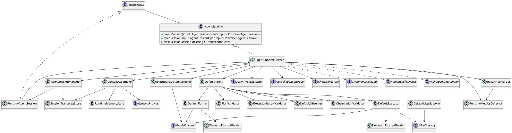
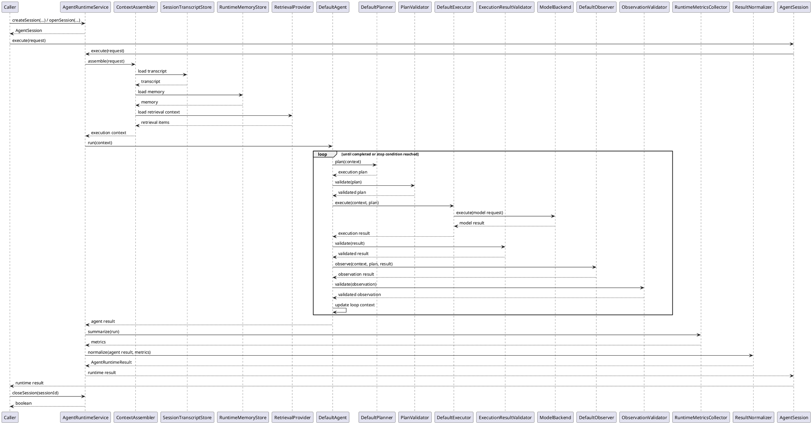
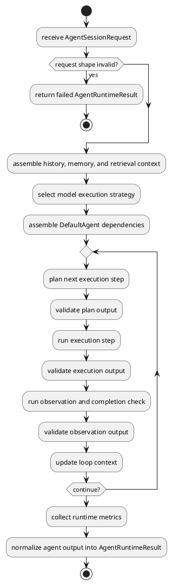
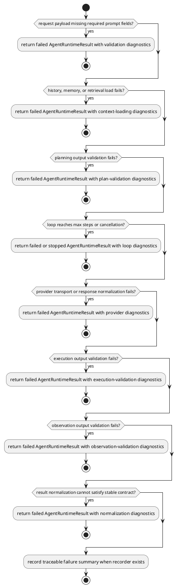

# AgentRuntime Design

## 0. Document Type

- type: `functional_group_design`
- scope: define the external `AgentRuntime` boundary and the P0 runtime internals for session lifecycle management, context assembly, multi-step planning loop, provider adaptation, result stabilization, and runtime observability, while keeping P1 and P2 capabilities at reuse-boundary or interface level
- includes: `AgentRuntime`, session lifecycle management, session-bound execution, context assembly, multi-step runtime loop, model backend adaptation, result normalization, runtime trace, runtime metrics, MCP tool gateway
- downstream usage: guide follow-up implementation and integration for a standalone agent runtime SDK with context-aware prompting, stable runtime result contracts, trace and metric alignment, and later P1 extension work

## 1. Goal

### 1.1 Purpose

Define the module-level design of `AgentRuntime` as a standalone SDK runtime boundary that manages session lifecycle, accepts normalized execution requests, assembles runtime context from session and memory sources, runs one controlled multi-step planning loop, and returns stable runtime results to external callers.

### 1.2 Involved Items

This design document directly covers:

- `AgentRuntime`
- `AgentRuntimeService`
- `AgentSessionManager`
- `RuntimeAgentSession`
- `ContextAssembler`
- `SessionTranscriptStore`
- `RuntimeMemoryStore`
- `RetrievalProvider`
- `DefaultAgent`
- `DefaultPlanner`
- `PlanningPromptBuilder`
- `DefaultExecutor`
- `ExecutionPromptBuilder`
- `DefaultObserver`
- `ExecutionStrategySelector`
- `ResultNormalizer`
- `RuntimeMetricsCollector`
- `DefaultMcpGateway`

This design document collaborates with:

- external SDK callers
- trace consumers
- external model providers
- MCP tool handlers

### 1.3 Core Functions

`AgentRuntime` is the design item for one standalone execution runtime with a stable external API, context-aware execution control, and stable result normalization.

Its core functions are:

- Create, close, and route runtime sessions through one stable SDK boundary.
- Accept normalized runtime requests through session-bound operations instead of exposing runtime execution as a root-level public entry.
- Load session history, short-term memory, and retrieval-backed context before execution begins.
- Normalize each request into one internal agent context for planning, repeated execution, observation, metrics, and trace emission.
- Run one controlled `plan -> execute -> observe -> re-plan` loop until completion or runtime stop conditions are reached.
- Validate planning output and execution output before they enter the next runtime stage.
- Select mock or real model execution strategy without exposing provider-specific details to callers.
- Normalize execution output into one stable success or failure contract with diagnostics and metrics.

`AgentRuntime` does not own business-specific orchestration, external artifact persistence, workflow gating, or domain-specific sequencing.

## 2. Core Classes

### 2.1 Class Diagram



### 2.2 Core Class Responsibilities

#### 2.2.1 `AgentRuntimeService`

Role:

- Stable external runtime API implementation for SDK callers.

Responsibilities:

- Accept one normalized `AgentSessionRequest` through a bound session handle.
- Validate request shape and runtime-level execution limits.
- Resolve the target session through `AgentSessionManager`.
- Load execution context through `ContextAssembler`.
- Assemble runtime dependencies for loop execution, normalization, metrics, and trace.
- Control loop entry, continuation, and stop conditions.
- Convert internal execution output into stable `AgentRuntimeResult`.

#### 2.2.2 `AgentSessionManager`

Role:

- Runtime-owned session lifecycle manager.

Responsibilities:

- Create runtime sessions with stable `sessionId`.
- Open existing runtime sessions through one stable SDK boundary.
- Return session-bound runtime handles for external use.
- Support session close requests issued through `AgentRuntime`.
- Route runtime requests to the correct session and transcript context.
- Write updated session transcript state after each completed session run.

#### 2.2.3 `RuntimeAgentSession`

Role:

- Concrete session-bound handle implementation for external callers.

Responsibilities:

- Bind one stable `sessionId` to runtime execution operations.
- Delegate `execute(...)` and `read()` to `AgentRuntimeService` with the bound session identity.
- Keep caller-facing session operations independent from internal session storage details.

#### 2.2.4 `AgentSession`

Role:

- Session-bound external runtime handle.

Responsibilities:

- Accept per-session execution requests without exposing raw `sessionId` as the primary external operation key.
- Expose session read and execution operations through the session handle.
- Keep session lifecycle stable for callers while allowing SDK-internal session routing.

#### 2.2.5 `ContextAssembler`

Role:

- Build one execution-ready context from request data and runtime context sources.

Responsibilities:

- Read session transcript from `SessionTranscriptStore`.
- Read short-term runtime memory from `RuntimeMemoryStore`.
- Merge stable runtime-memory summaries into `AgentContext.runtimeContext.memory` as bounded follow-up context for the next run.
- Load optional retrieval-backed context through `RetrievalProvider`.
- Load SDK-level `workdir` into runtime context.
- Merge caller payload and loaded context into one stable `AgentContext`.

#### 2.2.6 `SessionTranscriptStore`

Role:

- Runtime-owned boundary for session-level message transcript.

Responsibilities:

- Load ordered message transcript by session identity.
- Append normalized user, assistant, and tool turns to the bound session transcript after run completion.
- Return empty history when the bound session has no prior transcript.
- Keep persistence details outside `AgentRuntimeService`.

#### 2.2.7 `RuntimeMemoryStore`

Role:

- Runtime-owned boundary for short-term runtime memory.

Responsibilities:

- Load short-lived memory fragments relevant to the current request.
- Save updated runtime-memory summary after successful execution when configured.
- Preserve stable request constraints that should continue across later runs under the same `memoryScope`.
- Preserve the last successful run result summary for short follow-up context reuse.
- Preserve observation-confirmed run status summary for later execution control context.
- Keep runtime memory scoped, bounded, and summary-oriented instead of acting as full history, long-term knowledge, or retrieval storage.
- Keep memory lifecycle separate from model execution logic.

Runtime memory functional boundary:

- purpose:
  - save stable constraints from the current request
  - save the prior run result summary
  - save observation-confirmed run status summary
  - provide short summary context to the next execution under the same `memoryScope`
  - reduce reliance on re-summarizing long transcript windows every time
- current minimal stored items:
  - `request_constraints`
  - `result_summary`
  - `observation_status`
- non-goals:
  - full history persistence
  - long-term knowledge base
  - complex semantic summarization
  - automatic conflict merge
  - vector retrieval

#### 2.2.8 `RetrievalProvider`

Role:

- Optional retrieval boundary for external context loading.

Responsibilities:

- Accept retrieval query input derived from the runtime request.
- Return retrieval-backed context items in one normalized shape.
- Keep retrieval implementation replaceable without changing runtime control flow.

#### 2.2.9 `DefaultAgent`

Role:

- Runtime pipeline coordinator for one multi-step execution loop.

Responsibilities:

- Call planner, executor, and observer repeatedly until completion or stop.
- Validate plan, execution result, and observation result before advancing loop state.
- Record trace checkpoints for plan, execution, tool use, and observation.
- Return one aggregated runtime output.

#### 2.2.10 `DefaultPlanner`

Role:

- Decide the current execution plan shape.

Responsibilities:

- Read normalized runtime context, loaded memory, and retrieval fragments.
- Decide the current execution step and completion state.
- Generate the next-step execution plan from the current runtime context and prior step outputs.
- Call `IModelBackend` in planning mode to produce structured planning output.
- Emit ordered tool steps only when the runtime plan requires external tool use.

#### 2.2.11 `PlanValidator`

Role:

- Validate structured planning output before execution begins.

Responsibilities:

- Validate that planning output conforms to the `ExecutionPlan` contract.
- Reject invalid plan shape, invalid tool-step shape, and inconsistent stop-state combinations.
- Return normalized plan-validation diagnostics for runtime handling.

#### 2.2.12 `PlanningPromptBuilder`

Role:

- Build backend-ready planning prompts from runtime context.

Responsibilities:

- Implement `build(input: PlanningPromptBuilderInput): ModelBackendRequest`.
- Keep planning-specific prompt shaping separate from planner loop control logic.
- Produce one `ModelBackendRequest` with `mode="planning"`.

#### 2.2.13 `DefaultExecutor`

Role:

- Run the execution plan against tools and model backend.

Responsibilities:

- Invoke external tools through optional reusable gateway boundaries when the plan requires them.
- Build one backend-ready request from normalized prompt data, runtime context, and tool results.
- Return one step result together with execution metadata for the next planning round.

#### 2.2.14 `ExecutionPromptBuilder`

Role:

- Build backend-ready execution prompts from runtime context and validated plan state.

Responsibilities:

- Implement `build(input: ExecutionPromptBuilderInput): ModelBackendRequest`.
- Keep execution-specific prompt shaping separate from executor control and tool dispatch logic.
- Produce one `ModelBackendRequest` with `mode="execution"`.

#### 2.2.15 `ExecutionResultValidator`

Role:

- Validate execution-stage output before observation begins.

Responsibilities:

- Validate that model output conforms to the requested response contract.
- Validate structured JSON outputs when `responseFormat` is `json`.
- Return normalized result-validation diagnostics for runtime handling.

#### 2.2.16 `DefaultObserver`

Role:

- Provide post-execution acceptance evaluation.

Responsibilities:

- Read execution context, plan, and execution result.
- Emit one stable observation result and completion signal.
- Emit structured issues and continuation hints for the next planning round when needed.
- Apply rule-based observation logic in P0 without requiring an additional LLM call.
- Keep acceptance policy replaceable without changing the runtime API.

#### 2.2.17 `ObservationValidator`

Role:

- Validate observation output before loop continuation logic consumes it.

Responsibilities:

- Validate `accepted`, `completed`, `issues`, and `continueReason` field consistency.
- Reject invalid observation output shape before loop continuation.
- Return normalized observation diagnostics for runtime handling.

#### 2.2.18 `ExecutionStrategySelector`

Role:

- Resolve the current model execution backend.

Responsibilities:

- Select mock execution for local and deterministic usage.
- Select real-provider execution for provider-backed execution.
- Hide provider transport details behind one `IModelBackend` interface.

#### 2.2.19 `ResultNormalizer`

Role:

- Convert runtime outputs into stable success and failure contracts.

Responsibilities:

- Normalize model output, observation output, tool results, and metrics into one result shape.
- Build failure results with stable diagnostics instead of leaking raw runtime exceptions.
- Keep caller-facing contract stable across provider and runtime changes.

#### 2.2.20 `RuntimeMetricsCollector`

Role:

- Runtime-owned metrics aggregation boundary.

Responsibilities:

- Record step count, provider latency, token usage, and tool latency when available.
- Emit one normalized metrics summary for result normalization and trace correlation.
- Keep metric collection decoupled from planner and executor logic.

#### 2.2.21 `DefaultMcpGateway`

Role:

- Reusable P2 MCP tool invocation boundary inside the runtime.

Responsibilities:

- Dispatch one tool request to the matching MCP tool handler.
- Return one normalized tool result.
- Keep tool-handler registration separate from planner and executor logic.

## 3. Core Runtime Flow

### 3.1 Main Sequence Diagram



## 4. Detailed Design

### 4.1 Core APIs And Types

#### 4.1.1 Public API

```typescript
interface AgentRuntime {
  createSession(input: AgentSessionCreateInput): Promise<AgentSession>
  openSession(input: AgentSessionOpenInput): Promise<AgentSession>
  closeSession(sessionId: string): Promise<boolean>
}

function createAgentRuntime(dependencies: AgentRuntimeDependencies): AgentRuntime

interface AgentSession {
  execute(request: AgentSessionRequest): Promise<AgentRuntimeResult>
  read(): Promise<AgentSessionState>
}

interface AgentRuntimeDependencies {
  workdir: string
  traceRecorder?: IAgentTraceRecorder
}
```

#### 4.1.2 Input Types

```typescript
interface AgentSessionRequest {
  payload: AgentPromptPayload
  metadata?: RequestMetadata
}

interface AgentSessionCreateInput {
  title?: string
  initialSystemPrompt?: string[]
  initialUserPrompt?: Record<string, unknown>
  metadata?: RequestMetadata
}

interface AgentSessionOpenInput {
  sessionId: string
}

interface AgentPromptPayload {
  prompt: {
    systemPrompt: string[]
    userPrompt: Record<string, unknown>
  }
  responseFormat: "text" | "json"
  memoryScope?: string
  retrievalQuery?: string
  mcpToolCalls?: McpToolRequest[]
}

interface RequestMetadata {
  requestId?: string
  caller?: string
  traceId?: string
  labels?: Record<string, string>
}
```

#### 4.1.3 Runtime Types

```typescript
interface AgentContext {
  request: {
    prompt: {
      systemPrompt: string[]
      userPrompt: Record<string, unknown>
    }
    responseFormat: "text" | "json"
    metadata?: RequestMetadata
  }
  runtimeContext: {
    sessionId: string
    workdir: string
    history?: MessageTurn[]
    memory?: MemoryEntry[]
    retrievalContext?: RetrievalItem[]
    mcpToolCalls?: McpToolRequest[]
  }
}

interface AgentSessionState {
  sessionId: string
  title?: string
  createdAt: string
  status: "active" | "completed" | "failed" | "closed"
  initialRequest?: AgentSessionRequest
  transcript: MessageTurn[]
  metadata?: RequestMetadata
}

interface MessageTurn {
  role: "system" | "user" | "assistant" | "tool"
  content: string
}

interface MemoryEntry {
  key: string
  content: string
}

interface RetrievalItem {
  ref: string
  content: string
  metadata?: Record<string, string>
}

interface RetrievalRequest {
  query: string
  candidateSources: string[]
  metadata?: RequestMetadata
}

interface ExecutionPlan {
  mode: "direct_generation" | "tool_augmented_generation"
  summary: string
  stepIndex: number
  nextStepGoal: string
  completed?: boolean
  stopReason?: "completed" | "max_steps" | "cancelled" | "failed"
  toolSteps?: McpToolRequest[]
}

interface ExecutionResult {
  content: ModelBackendResult["content"]
  responseFormat: ModelBackendResult["responseFormat"]
  toolResults?: McpToolResult[]
  metadata?: ModelBackendResult["metadata"]
}

interface ModelBackendRequest {
  mode: "planning" | "execution"
  prompt: {
    systemPrompt: string[]
    userPrompt: Record<string, unknown>
  }
  responseFormat: "text" | "json"
  metadata?: RequestMetadata
}

interface ModelBackendResult {
  content: string
  responseFormat: "text" | "json"
  metadata?: RequestMetadata
}

interface PlanningPromptBuilderInput {
  context: AgentContext
  priorStepResults?: ExecutionResult[]
  priorObservation?: ObservationResult
}

interface ExecutionPromptBuilderInput {
  context: AgentContext
  plan: ExecutionPlan
  toolResults?: McpToolResult[]
}

interface ValidationIssue {
  code: string
  message: string
  severity?: "low" | "medium" | "high"
}

interface ValidationResult<T> {
  ok: boolean
  value?: T
  issues?: ValidationIssue[]
}

interface McpToolRequest {
  toolName: string
  arguments: Record<string, unknown>
}

interface McpToolResult {
  toolName: string
  success: boolean
  content: string
  metadata?: Record<string, string>
}

type ObservationIssue = ValidationIssue

interface ObservationResult {
  accepted: boolean
  summary: string
  completed?: boolean
  issues?: ObservationIssue[]
  continueReason?: string
}

interface RuntimeMetrics {
  stepCount: number
  modelLatencyMs?: number
  toolLatencyMs?: number
  inputTokens?: number
  outputTokens?: number
}

type AgentTraceEventType =
  | "session_create_requested"
  | "session_created"
  | "session_open_requested"
  | "session_opened"
  | "session_closed"
  | "run_started"
  | "plan_generated"
  | "tool_called"
  | "tool_result_recorded"
  | "execution_finished"
  | "observation_finished"
  | "validation_failed"
  | "run_finished"

type AgentTraceScope = "sdk" | "session"

interface AgentTraceEventBase {
  traceId: string
  stepIndex?: number
  timestamp: string
  caller: string
  summary: string
  payload?: Record<string, unknown>
}

interface SdkTraceEvent extends AgentTraceEventBase {
  scope: "sdk"
  eventType:
    | "session_create_requested"
    | "session_created"
    | "session_open_requested"
    | "session_opened"
    | "session_closed"
  runId?: never
  sessionId?: string
  diagnostics?: never
}

interface SessionRunTraceEvent extends AgentTraceEventBase {
  scope: "session"
  eventType:
    | "run_started"
    | "plan_generated"
    | "tool_called"
    | "tool_result_recorded"
    | "execution_finished"
    | "observation_finished"
    | "validation_failed"
    | "run_finished"
  sessionId: string
  runId: string
  diagnostics?: ValidationIssue[]
}

type AgentTraceEvent =
  | SdkTraceEvent
  | SessionRunTraceEvent

Trace constraints:

- `session_created`, `session_opened`, and `session_closed` must use `scope="sdk"` and must carry `sessionId`.
- runtime execution events must use `scope="session"`.
- runtime execution events must carry both `sessionId` and `runId`.
- `validation_failed` events should carry structured `diagnostics`.

interface IAgentTraceRecorder {
  record(event: AgentTraceEvent): Promise<void>
}

interface IModelBackend {
  execute(request: ModelBackendRequest): Promise<ModelBackendResult>
}

interface CancellationController {
  isCancelled(runId: string): Promise<boolean>
}

interface CheckpointStore {
  save(runId: string, payload: Record<string, unknown>): Promise<void>
}

interface StreamingEventSink {
  emit(event: Record<string, unknown>): Promise<void>
}

interface RuntimeSafetyPolicy {
  check(input: Record<string, unknown>): Promise<void>
}

interface MultiAgentCoordinator {
  handoff(input: Record<string, unknown>): Promise<Record<string, unknown>>
}
```

#### 4.1.4 Output Types

```typescript
interface AgentRuntimeResult {
  status: "success" | "failed"
  payload: {
    content?: string
    responseFormat?: "text" | "json"
    history?: MessageTurn[]
    memory?: MemoryEntry[]
    retrievalContext?: RetrievalItem[]
    toolResults?: McpToolResult[]
    accepted?: boolean
    completed?: boolean
    summary?: string
    stopReason?: "completed" | "max_steps" | "cancelled" | "failed"
    lastStepIndex?: number
    metrics?: RuntimeMetrics
  }
  diagnostics?: ValidationIssue[]
}
```

#### 4.1.5 Item-Specific Boundary Rules

- Upstream callers must use `AgentRuntime.createSession(...)` first and then call `AgentSession.execute(...)` through the returned session handle.
- Existing sessions may be reattached through `AgentRuntime.openSession(...)` before session-bound execution continues.
- `AgentRuntime.closeSession(...)` must accept `sessionId` instead of a session handle and return close success as `boolean`.
- `AgentRuntime.closeSession(...)` should return `false` when the target session does not exist or is already closed.
- `workdir` is SDK-scoped runtime configuration and must be provided through `createAgentRuntime(...)`.
- `AgentRuntime` keeps `payload` and `metadata` as the stable caller-facing boundary even when internal prompt or provider handling changes.
- SDK-scoped `workdir` must be loaded from runtime dependencies instead of being passed per request or per session.
- Real-provider selection, HTTP transport, and model-specific payload formatting must remain behind the execution-strategy boundary.
- Session transcript write-back belongs to session/history boundaries and must not be mixed into trace or metrics persistence.
- Runtime metrics are run-scoped output data and are not written back into session transcript by default.
- Trace events are recorder-scoped runtime diagnostics and are not written back into session transcript by default.

### 4.2 Internal Runtime Skeleton



### 4.3 Runtime Processing Details

#### 4.3.1 `AgentRuntimeService.execute`

Input loading:

- read one `AgentSessionRequest`
- read optional request metadata for trace and provider execution

Processing:

- validate the stable request shape
- resolve the target session through `AgentSessionManager`
- assemble history, memory, and retrieval context through `ContextAssembler`
- select mock or real backend through `ExecutionStrategySelector`
- assemble runtime dependencies and delegate to `DefaultAgent`
- enforce loop stop conditions such as completion, cancellation, failure, and step limits
- write normalized transcript updates back through session/history boundaries after run completion
- collect run metrics and normalize internal execution output into one stable runtime result

Output emission:

- emit one `AgentRuntimeResult`
- preserve diagnostics when validation or provider execution fails

#### 4.3.2 `AgentSessionManager`

Input loading:

- read session creation input, session open input, `sessionId`, or close request

Processing:

- emit SDK-scoped `session_create_requested` trace before session allocation when recorder exists
- create a new runtime session with stable `sessionId`
- emit SDK-scoped session create trace when recorder exists
- emit SDK-scoped `session_open_requested` trace before existing-session lookup when recorder exists
- open an existing runtime session by `sessionId` and return a bound session handle
- emit SDK-scoped session open trace when recorder exists
- read current session state and transcript by `sessionId`
- close an active session and mark it unavailable for future writes
- emit SDK-scoped session close trace when close succeeds
- return `false` when close is requested for a missing or already closed session
- route each runtime request to the corresponding session object
- persist session transcript updates after successful run completion

Output emission:

- emit one bound `AgentSession` for create/open operations
- emit one `AgentSessionState` for session read operations
- emit one `boolean` for close operations

#### 4.3.3 `ContextAssembler.assemble`

Input loading:

- read one normalized `AgentSessionRequest`
- read the bound session from `AgentSessionManager`
- read SDK-level `workdir`
- read optional `memoryScope` and `retrievalQuery`

Processing:

- load session transcript from `SessionTranscriptStore`
- load short-term runtime memory from `RuntimeMemoryStore`
- treat runtime memory as bounded summary context instead of full history replay
- build one rule-driven retrieval request when `retrievalQuery` is provided
- choose candidate retrieval sources from runtime conventions, configured source policy, and explicit target scope
- load retrieval-backed context through `RetrievalProvider` without letting LLM choose retrieval sources in P0
- place SDK-level `workdir` into `AgentContext.runtimeContext`
- merge loaded context with caller prompt payload into one stable `AgentContext`

Output emission:

- emit one execution-ready `AgentContext`
- preserve empty collections instead of missing structures when no prior context exists

#### 4.3.4 `DefaultPlanner.plan`

Input loading:

- read normalized `AgentContext`
- read loaded history, memory, and retrieval context
- read prior step outputs and observation feedback from the current loop context

Processing:

- build one planning-mode `ModelBackendRequest` through `PlanningPromptBuilder`
- call `IModelBackend` in planning mode to generate the next-step plan from current context, prior step outputs, and completion state
- choose the current execution mode based on available context and request shape
- decide whether the current step can complete directly or needs another controlled step
- preserve tool-call order for downstream executor use when the reusable P2 tool path is enabled

Output emission:

- emit one `ExecutionPlan`
- include `stepIndex` and `nextStepGoal` for loop control
- include `completed` when the planner can determine early completion
- include `toolSteps` only when tool-augmented execution is required

#### 4.3.5 `PlanningPromptBuilder.build`

```typescript
build(input: PlanningPromptBuilderInput): ModelBackendRequest
```

Input fields:

- `input.context.request.prompt.systemPrompt`
- `input.context.request.prompt.userPrompt`
- `input.context.runtimeContext.transcript`
- `input.context.runtimeContext.memory`
- `input.context.runtimeContext.retrievalContext`
- `input.priorStepResults`
- `input.priorObservation`

Output constraints:

- `mode` must be `"planning"`.
- `responseFormat` must be `"json"`.
- `systemPrompt` must place runtime planning rules before caller-provided prompt fragments.
- `userPrompt` must include current task input, bounded transcript context, stable runtime memory, retrieval context, prior step results, and prior observation when present.
- planning request must describe the expected `ExecutionPlan` contract.
- `transcript` should be recent-context or summarized-context data, not unbounded full transcript append.
- `memory` should contain only bounded runtime-memory summary items such as stable request constraints, prior result summary, and observation-confirmed status.
- `retrievalContext` should contain only runtime-selected bounded reference items.

Output emission:

- emit one `ModelBackendRequest` for planning

#### 4.3.6 `PlanValidator.validate`

Input loading:

- read one candidate `ExecutionPlan`

Processing:

- validate the structured plan shape
- validate allowed `mode` and `stopReason` values
- validate `toolSteps` shape and consistency with `mode`
- reject invalid loop-state combinations such as `completed=true` together with unresolved required tool steps

Schema rules:

- `stepIndex` must be an integer greater than or equal to `1`.
- `summary` must be non-empty.
- `nextStepGoal` must be non-empty.
- `toolSteps` may appear only when `mode` is `tool_augmented_generation`.
- each `toolSteps` item must provide non-empty `toolName`.
- `completed=true` must not be combined with unresolved required `toolSteps`.
- `stopReason` may appear only when the current plan indicates stop or completion intent.
- `stopReason="completed"` requires `completed=true`.

Output emission:

- emit one `ValidationResult<ExecutionPlan>`

#### 4.3.7 `DefaultExecutor.execute`

Input loading:

- read `AgentContext`
- read one `ExecutionPlan`

Processing:

- invoke MCP tools through reusable `IMcpGateway` only when the current plan contains tool steps
- build one execution-mode `ModelBackendRequest` through `ExecutionPromptBuilder`
- send one execution request to the selected model backend
- return output in a form that can be fed back into the next planning round

Output emission:

- emit one execution result with model output
- include tool results when tool execution happened

#### 4.3.8 `ExecutionPromptBuilder.build`

```typescript
build(input: ExecutionPromptBuilderInput): ModelBackendRequest
```

Input fields:

- `input.context.request.prompt.systemPrompt`
- `input.context.request.prompt.userPrompt`
- `input.plan.nextStepGoal`
- `input.context.runtimeContext.transcript`
- `input.context.runtimeContext.memory`
- `input.context.runtimeContext.retrievalContext`
- `input.toolResults`

Output constraints:

- `mode` must be `"execution"`.
- `responseFormat` must equal `input.context.request.responseFormat`.
- `systemPrompt` must place runtime execution rules before caller-provided prompt fragments.
- `userPrompt` must include current task input, validated `nextStepGoal`, bounded transcript context, stable runtime memory, retrieval context, and tool results when present.
- execution request must describe the expected output format from the current request.
- `transcript` should be recent-context or summarized-context data, not unbounded full transcript append.
- `memory` should contain only bounded runtime-memory summary items such as stable request constraints, prior result summary, and observation-confirmed status.
- `toolResults` should be injected only when the current execution step used tools.
- `retrievalContext` should contain only runtime-selected bounded reference items.

Output emission:

- emit one `ModelBackendRequest` for execution

#### 4.3.9 `ExecutionResultValidator.validate`

Input loading:

- read one execution result candidate
- read expected `responseFormat`

Processing:

- validate that the execution result contains output in the expected format
- parse and validate JSON output when `responseFormat` is `json`
- reject invalid result structure before observation begins

Schema rules:

- `content` must be present and non-empty.
- `responseFormat` must equal the expected response format from the current request.
- when `responseFormat` is `text`, `content` must be handled as plain text output.
- when `responseFormat` is `json`, `content` must be parseable JSON.
- when `responseFormat` is `json`, parse failure must produce `validation_failed` diagnostics instead of continuing to observation.
- `toolResults`, when present, must conform to `McpToolResult[]`.
- each `toolResults` item must include `toolName`, `success`, and `content`.

Output emission:

- emit one `ValidationResult<ExecutionResult>`

#### 4.3.10 `DefaultObserver.observe`

Input loading:

- read execution context
- read plan and execution result

Processing:

- evaluate whether the current result is accepted by the observer policy
- decide whether the runtime can stop after the current step
- build one stable observation summary, structured issue list, and continuation hint when needed
- apply rule-based observation logic in P0 without requiring an additional model call

Output emission:

- emit one `ObservationResult`

#### 4.3.11 `ObservationValidator.validate`

Input loading:

- read one `ObservationResult`

Processing:

- validate `accepted` and `completed` field consistency
- validate `issues` structure
- reject invalid continuation state before loop continuation logic consumes the result

Schema rules:

- `summary` must be non-empty.
- `accepted` must be present.
- `accepted=false` should include at least one `issues` entry.
- each `issues` item must include `code` and `message`.
- `completed=true` must not be combined with non-empty `continueReason`.
- `accepted=true` and `completed=false` is valid and indicates loop continuation.
- `accepted=false` does not automatically imply terminal failure; the runtime may still stop or continue according to normalized observation handling.

Output emission:

- emit one `ValidationResult<ObservationResult>`

#### 4.3.12 `ResultNormalizer.normalize`

Input loading:

- read aggregated agent result
- read runtime metrics

Processing:

- build one stable success result when execution and observation both succeed
- build one stable failed result with diagnostics when runtime execution fails
- preserve observation issues as structured diagnostics input when observation does not accept the result
- preserve final loop state and stop reason in stable caller-facing fields when available
- attach normalized metrics, context echoes, and tool results only in stable caller-facing fields
- keep metrics in run-scoped result output instead of session transcript state
- keep trace outside result payload except for optional diagnostics already normalized into the result

Output emission:

- emit one normalized `AgentRuntimeResult`

#### 4.3.13 `P1 And P2 Extension Capabilities`

Input loading:

- read tool-use requests, cancellation signals, checkpoint payloads, streaming sinks, safety policy input, and multi-agent handoff input only when the corresponding P1 or P2 capability is enabled

Processing:

- keep `MultiAgentCoordinator` at P1 interface boundary until dedicated runtime collaboration behavior is added
- reuse the current `DefaultMcpGateway`, `FileReadMcpToolHandler`, and `FileWriteMcpToolHandler` for implemented P2 MCP capability
- keep cancellation, checkpoint, streaming, and safety at interface boundary only until dedicated runtime behavior is added

Output emission:

- emit no mandatory P0 runtime behavior from these interfaces
- preserve backward-compatible extension slots for later implementation

### 4.4 Error Handling Skeleton



### 4.5 Extension Points

- Extension point: `execution strategy selector`
  - support additional providers without changing `AgentRuntime`
  - replace mock or real backend policy without changing planner or observer boundaries
- Extension point: `model backend`
  - keep planning and execution on the same `IModelBackend` abstraction
  - allow planning-mode and execution-mode request shaping without splitting backend abstractions
- Extension point: `context assembly`
  - replace history, memory, or retrieval loading implementation without changing caller request shape
  - keep context-source composition separate from planner and executor logic
- Extension point: `retrieval planning`
  - P0 uses rule-driven candidate-source selection from runtime conventions and request metadata
  - P2 may add LLM-assisted retrieval choice only inside an already bounded candidate-source set
- Extension point: `observation policy`
  - replace simple rule-based observation behavior with richer evaluation logic
  - allow later LLM-assisted observation without changing the result contract
  - preserve the same runtime result boundary
- Extension point: `P1 runtime interfaces`
  - support multi-agent coordination without changing the P0 result contract
  - keep unimplemented P1 behavior at interface level until dedicated runtime flow is introduced
- Extension point: `P2 runtime interfaces`
  - support cancellation, checkpoint, streaming, safety policy, and MCP tool governance without changing the P0 result contract
  - keep unimplemented P2 behavior at interface level until dedicated runtime flow is introduced

### 4.6 Constraints

- `AgentRuntime` belongs to the SDK layer and must remain independent from caller-specific workflow or domain logic.
- `AgentRuntime` must not own external artifact storage, business gating, or domain-specific continuation control.
- Public caller integration must remain stable at the `AgentRuntime.createSession(...)`, `AgentRuntime.openSession(...)`, `AgentRuntime.closeSession(...)`, and `AgentSession.execute(...)` boundaries even when internal agent composition changes.
- Provider-specific request formatting and HTTP details must stay behind adapter-style runtime internals.
- P0 design must provide concrete runtime behavior for execution control, context loading, result stabilization, and observability.
- P1 and P2 capabilities must not change the P0 runtime contract before their dedicated runtime behavior is introduced.

### 4.7 Expected Directory Structure

```text
infra_projects/projects/agent_runtime/
  package.json
  tsconfig.json

  examples/
    terminal-session-demo.ts

  src/
    index.ts

    api/
      agent-runtime-api.ts
      request-types.ts
      result-types.ts
      session-types.ts

    runtime/
      agent-runtime-service.ts
      agent-session-manager.ts
      runtime-agent-session.ts
      agent-context.ts
      execution-plan.ts
      execution-result.ts
      observation-result.ts
      validation-result.ts
      runtime-metrics.ts

    loop/
      default-agent.ts
      default-planner.ts
      planning-prompt-builder.ts
      plan-validator.ts
      default-executor.ts
      execution-prompt-builder.ts
      execution-result-validator.ts
      default-observer.ts
      observation-validator.ts
      result-normalizer.ts

    context/
      context-assembler.ts
      session-transcript-store.ts
      runtime-memory-store.ts
      retrieval-provider.ts
      retrieval-request.ts

    model/
      execution-strategy-selector.ts
      real-provider-config.ts
      http-json-client.ts

    mcp/
      default-mcp-gateway.ts
      mcp-tool-registry.ts
      file-read-mcp-tool-handler.ts
      file-write-mcp-tool-handler.ts

    trace/
      agent-trace-api.ts
      agent-trace-events.ts
      agent-trace-recorder.ts

    extensions/
      cancellation-controller.ts
      checkpoint-store.ts
      streaming-event-sink.ts
      runtime-safety-policy.ts
      multi-agent-coordinator.ts

  tests/
    run-tests.ts

    runtime/
      agent-runtime-service.test.ts
      runtime-agent-session.test.ts

    loop/
      default-planner.test.ts
      plan-validator.test.ts
      default-executor.test.ts
      execution-result-validator.test.ts
      default-observer.test.ts
      observation-validator.test.ts
      result-normalizer.test.ts

    context/
      context-assembler.test.ts
      session-transcript-store.test.ts
      runtime-memory-store.test.ts
      retrieval-provider.test.ts

    model/
      execution-strategy-selector.test.ts

    mcp/
      default-mcp-gateway.test.ts

    trace/
      agent-trace-api.test.ts
```

Directory intent:

- `examples/terminal-session-demo.ts`: manual terminal usage example that creates a session, loops over user input, calls `AgentSession.execute(...)`, prints runtime output, and closes the session when finished.
- `api/`: stable caller-facing APIs and DTO contracts.
- `runtime/`: runtime core service, session manager, and shared runtime data structures.
- `loop/`: multi-step loop execution components and validators.
- `context/`: context assembly, history, memory, and retrieval boundaries.
- `model/`: provider strategy selection and transport adaptation.
- `mcp/`: tool gateway, registry, and built-in MCP tool handlers.
- `trace/`: trace contract, event builders, and trace recorder abstraction.
- `extensions/`: P1 and P2 extension interfaces that remain outside the P0 loop core.

## 5. Capability View By Functional Dimension

This section groups common Agent SDK capabilities by functional dimension and marks current `agent_runtime` coverage with priority and implementation status.

### 5.1 Runtime Entry And Execution Control

- `P0` ☑️ core multi-step runtime loop through `DefaultAgent`, `DefaultPlanner`, `DefaultExecutor`, and `DefaultObserver`
- `P0` stable public session lifecycle API through `AgentRuntime` and stable per-session execution through `AgentSession`
- `P0` controlled multi-step runtime loop with repeated plan, execute, observe, and re-plan control
- `P2` cancellation support
- `P2` run-state persistence
- `P2` checkpoint and resumable execution

### 5.2 Model Backend And Provider Adaptation

- `P0` ☑️ model backend strategy selection through `ExecutionStrategySelector`
- `P0` ☑️ mock execution mode for deterministic local use
- `P0` ☑️ real-provider execution mode
- `P0` ☑️ current real-provider support for `openai`
- `P0` ☑️ current real-provider support for `deepseek`
- `P2` provider fallback policy across multiple configured backends

### 5.3 Tool Use And MCP Integration

- `P2` ☑️ MCP gateway boundary for request-scoped tool execution
- `P2` ☑️ default MCP file-read tool handler
- `P2` ☑️ default MCP file-write tool handler
- `P2` structured tool schema validation
- `P2` tool permission model and allowlist control
- `P2` tool timeout policy
- `P2` tool retry policy and fallback policy
- `P2` richer default tool set beyond file read and file write

### 5.4 Output Contract And Result Stability

- `P0` structured output schema validation and repair for downstream stability
- `P0` run-level diagnostics with stable failure result shape
- `P2` streaming token output and intermediate runtime events

### 5.5 Context, Memory, And Retrieval

- `P0` session-level message history
- `P0` short-term runtime memory
- `P0` long-term memory or retrieval-backed context loading
- `P0` rule-driven retrieval candidate-source selection from request fields and runtime conventions
- `P2` LLM-assisted retrieval planning inside a bounded candidate-source set

### 5.6 Trace, Metrics, And Runtime Observability

- `P0` ☑️ basic trace checkpoints for plan, execution, tool result, and observation
- `P0` token usage, latency, and cost accounting
- `P2` richer aggregated metrics and run analytics

### 5.7 Safety And Runtime Governance

- `P2` safety policy for prompt injection
- `P2` tool-output sanitization
- `P2` secret redaction

### 5.8 Multi-Agent Collaboration

- `P1` multi-agent delegation and handoff
- `P1` coordinator-worker execution modes

These capability gaps belong to `AgentRuntime` because they improve standalone runtime execution quality without binding the SDK to a caller-specific domain model.
