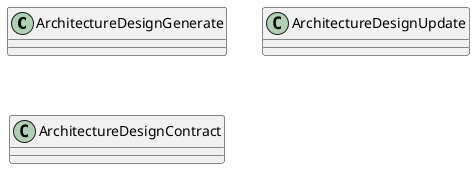
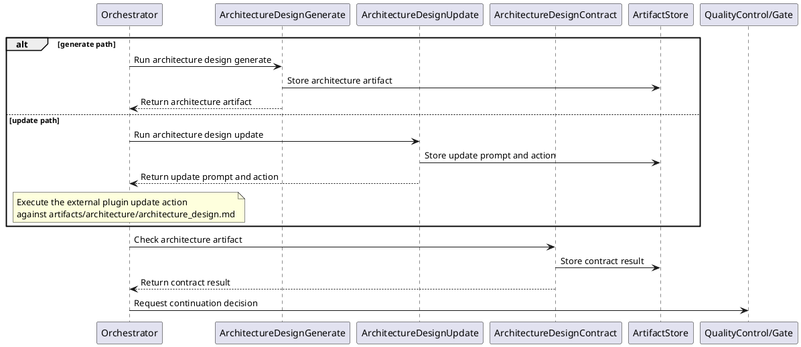
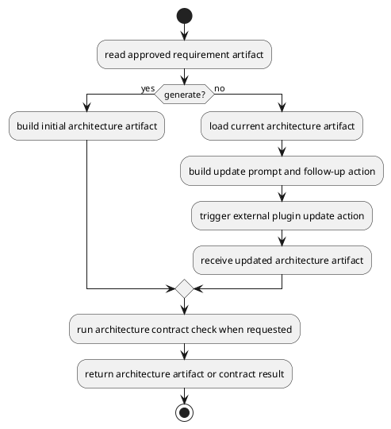
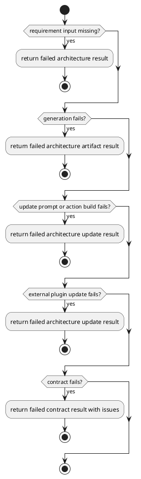

# Architecture Design

## 0. Document Type

- type: `functional_group_design`
- scope: define architecture artifact generation, early-stage architecture update prompt/action production through one external plugin update path, and architecture contract checking
- include: `ArchitectureDesignGenerate`, `ArchitectureDesignUpdate`, `ArchitectureDesignContract`
- downstream usage: guide follow-up design for architecture artifact production, update flow, and architecture-level validation rules

## 1. Goal

### 1.1 Purpose

Define the architecture-design basic units for generation, early-stage update prompt/action production through one external plugin update path, and contract checking.

### 1.2 Involved Items

This design document directly covers:

- `ArchitectureDesignGenerate`
- `ArchitectureDesignUpdate`
- `ArchitectureDesignContract`

This design document collaborates with:

- `Orchestrator`
- `LlmExecutor`
- `ArtifactStore`
- `QualityControl`

### 1.3 Core Functions

`Architecture Design` is the design item for architecture document generation, early-stage external-plugin-assisted update, and validation.

Its core functions are:

- Generate architecture artifacts from approved upstream inputs.
- Produce one update prompt and follow-up action for an external plugin update path after requirement changes.
- Validate architecture outputs against architecture rules.
- Expose stable architecture artifacts to item design and work planning.
- Write each generated, updated, or contract output to `ArtifactStore` before returning.
- Remain independently callable and composable as basic execution units through the unified `Runtime` entry and current `Orchestrator` dispatch path.

`Architecture Design` does not own cross-document consistency beyond its own contract boundary, runtime control, or gate policy.

## 2. Core Classes

### 2.1 Class Diagram



### 2.2 Core Class Responsibilities

#### 2.2.1 `ArchitectureDesignGenerate`

Role:

- Produce initial architecture outputs.

Responsibilities:

- Read approved requirement artifacts.
- Generate architecture content.
- Return architecture artifacts for downstream use.

#### 2.2.2 `ArchitectureDesignUpdate`

Role:

- Produce one early-stage update prompt and follow-up action for an existing architecture artifact.

Responsibilities:

- Read the current architecture artifact together with approved requirement changes.
- Preserve stable reusable sections when possible.
- Return one update prompt and follow-up action for downstream external plugin execution.

#### 2.2.3 `ArchitectureDesignContract`

Role:

- Validate architecture outputs.

Responsibilities:

- Check structure and rule compliance.
- Report architecture issues.
- Gate downstream use of architecture artifacts.

## 3. Core Runtime Flow

### 3.1 Main Sequence Diagram



## 4. Detailed Design

### 4.1 Core APIs And Types

#### 4.1.1 Public API

```typescript
interface ArchitectureDesignApi {
  generate(input: ArchitectureDesignInput): Promise<ArchitectureArtifact>
  update(input: ArchitectureDesignUpdateInput): Promise<ArchitectureDesignUpdateResult>
  contract(input: ArchitectureContractInput): Promise<ArchitectureContractResult>
}
```

#### 4.1.2 Input Types

```typescript
interface ArchitectureDesignInput {
  requirementArtifact: FileArtifactMap
  userInput?: string
}

interface ArchitectureDesignUpdateInput {
  requirementArtifact: FileArtifactMap
  currentArchitectureArtifact: FileArtifactMap
}

interface ArchitectureContractInput {
  architectureArtifact: FileArtifactMap
}

interface FileArtifact {
  path: string
  content?: string
}

type FileArtifactMap = Record<string, FileArtifact>
type ArtifactContentMap = Record<string, FileArtifactMap>
```

#### 4.1.3 Runtime Types

```typescript
interface ArchitectureWorkingContext {
  requirementArtifact: FileArtifactMap
  userInput?: string
  currentArchitectureArtifact?: FileArtifactMap
}

interface ExternalAction {
  tool: "external_plugin"
  operation: "update_markdown"
  targetPath: "artifacts/architecture/architecture_design.md"
}
```

#### 4.1.4 Output Types

```typescript
interface ArchitectureArtifact {
  content: FileArtifactMap
}

interface ArchitectureDesignUpdateResult {
  prompt: string
  action: ExternalAction
}

interface ArchitectureContractResult {
  passed: boolean
  issues: Array<Record<string, unknown>>
}
```

#### 4.1.5 Item-Specific Boundary Rules

- Architecture generation depends on stable requirement input.
- The current early-stage `update` unit returns a prompt plus one follow-up external plugin action instead of mutating the architecture artifact by itself.
- Contract output must be usable by runtime continuation logic.
- External composition may select these basic execution units independently, but unified-entry ownership remains with `Runtime`, currently implemented through `Orchestrator`.
- Each basic unit must write its own output artifact or contract result to `ArtifactStore` before returning control.
- Template input should use the stable logical artifact name `architecture_design_template`.
- Generated and updated architecture output should use the stable logical artifact name `architecture_design`.
- Contract result output should use the stable logical artifact name `architecture_design_contract_result`.

### 4.2 Internal Runtime Skeleton



### 4.3 Runtime Processing Details

#### 4.3.1 ArchitectureDesignGenerate

Input loading:

- `ArchitectureDesignInput.requirementArtifact.requirement_design.path`: default input path `artifacts/requirement/requirement_design.md`
- `ArchitectureDesignInput.requirementArtifact.requirement_design.content`: optional `requirement_design.md` markdown content
- `ArchitectureDesignInput.userInput`: current `user_comment` when provided
- template source: `architecture_design_template.md` from context or `templates/architecture_design_template.md`

Processing:

- read requirement content, optional template content, and optional user input into one `ArchitectureWorkingContext`
- build one architecture-generation prompt from the working context
- call `LlmExecutor` with the generation prompt
- parse the returned model result into one architecture artifact payload

Output emission:

- write the generated architecture artifact to `ArtifactStore`
- `ArchitectureArtifact.content.architecture_design.path`: default output path `artifacts/architecture/architecture_design.md`
- `ArchitectureArtifact.content.architecture_design.content`: optional generated `architecture_design.md` markdown content
- output file name: `architecture_design.md`
- output path: `artifacts/architecture/architecture_design.md`

#### 4.3.2 ArchitectureDesignUpdate

Input loading:

- `ArchitectureDesignUpdateInput.requirementArtifact.requirement_design.path`: default input path `artifacts/requirement/requirement_design.md`
- `ArchitectureDesignUpdateInput.requirementArtifact.requirement_design.content`: optional `requirement_design.md` markdown content
- `ArchitectureDesignUpdateInput.currentArchitectureArtifact.architecture_design.path`: default current artifact path `artifacts/architecture/architecture_design.md`
- `ArchitectureDesignUpdateInput.currentArchitectureArtifact.architecture_design.content`: optional current `architecture_design.md` markdown content
- `ArchitectureDesignUpdateResult.action.targetPath`: `artifacts/architecture/architecture_design.md`

Processing:

- load the current architecture artifact
- identify unchanged sections and changed sections
- build one update prompt that describes required markdown changes
- build one `ExternalAction` for downstream external plugin execution
- return one external-plugin-oriented update payload instead of mutating the artifact inside `ArchitectureDesignUpdate`

Output emission:

- write the update prompt/action output to `ArtifactStore`
- `ArchitectureDesignUpdateResult.prompt`: update prompt text for the external plugin
- `ArchitectureDesignUpdateResult.action.tool`: `external_plugin`
- `ArchitectureDesignUpdateResult.action.operation`: `update_markdown`
- `ArchitectureDesignUpdateResult.action.targetPath`: `artifacts/architecture/architecture_design.md`
- downstream plugin result: updated `ArchitectureArtifact.content.architecture_design.path` and optional `.content`

#### 4.3.3 ArchitectureDesignContract

Input loading:

- `ArchitectureContractInput.architectureArtifact.architecture_design.path`: default artifact path `artifacts/architecture/architecture_design.md`
- `ArchitectureContractInput.architectureArtifact.architecture_design.content`: optional `architecture_design.md` markdown content
- template check source: `architecture_design_template.md` from context or `templates/architecture_design_template.md`

Processing:

- read architecture artifact content into one contract-check context
- execute one local-rule validation path when the check can be completed by local rules and template-alignment rules
- or build one contract-check prompt and call `LlmExecutor` when the check requires model-supported validation
- normalize returned findings into one contract issue json list

Output emission:

- write the contract result to `ArtifactStore`
- `ArchitectureContractResult.passed`: contract pass/fail status
- `ArchitectureContractResult.issues`: contract issue json list
- output file name: `architecture_design_contract_result.json`
- output path: `artifacts/architecture/architecture_design_contract_result.json`

### 4.4 Error Handling Skeleton



### 4.5 Extension Points

- Extension point: `architecture contract rules`
  - extend architecture rule sets
  - refine architecture issue reporting and stability rules

### 4.6 Constraints

- Architecture design must not bypass approved requirement artifacts.
- Cross-document consistency beyond architecture scope belongs to `OverallDesignContract`.
- LLM-dependent work must go through `LlmExecutor`.
- Persistence remains external to this design item.
