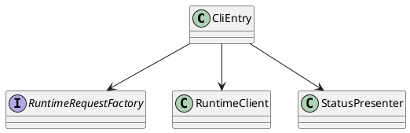
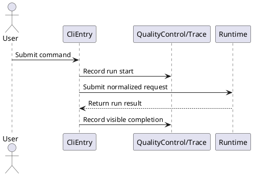
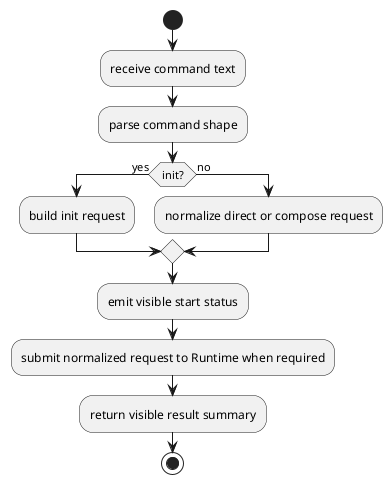
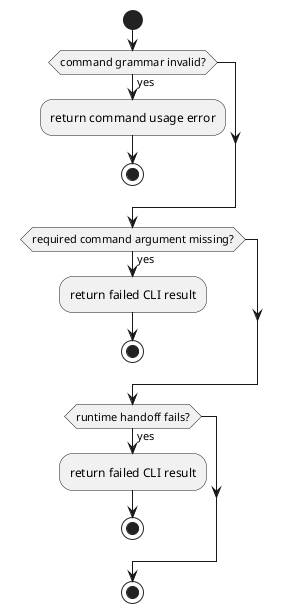

# CliEntry Design

## 0. Document Type

- type: `functional_group_design`
- scope: define current CLI entry behavior, request normalization, and user-facing control handoff
- include: `CliEntry`
- downstream usage: guide follow-up design for command parsing, runtime request normalization, and interface-to-runtime handoff

## 1. Goal

### 1.1 Purpose

Define the CLI entry boundary for user commands, request normalization, and handoff into runtime control.

### 1.2 Involved Items

This design document directly covers:

- `CliEntry`

This design document collaborates with:

- `Runtime`
- `QualityControl/Trace`

### 1.3 Core Functions

`CliEntry` is the design item for current CLI entry and user-facing handoff into the unified runtime entry.

Its core functions are:

- Initialize one working context before runtime execution starts.
- Parse direct-run and compose-run commands.
- Normalize user input into stable runtime request shapes.
- Expose stable usage entry for independently composable execution-unit runs and compose-runs.
- Show visible run status, prompts, and final results.
- Hand off all execution requests to `Runtime` as the unified runtime entry.

`CliEntry` does not own execution logic, contract logic, or persistence policy.

## 2. Core Classes

### 2.1 Class Diagram



### 2.2 Core Class Responsibilities

#### 2.2.1 `CliEntry`

Role:

- Own the current CLI command boundary.

Responsibilities:

- Parse initialization commands.
- Parse user commands.
- Select direct-run or compose-run mode.
- Delegate normalized requests to `Runtime` as the unified runtime entry.

#### 2.2.2 `RuntimeRequestFactory`

Role:

- Normalize CLI input into stable runtime requests.

Responsibilities:

- Map commands to runtime mode.
- Resolve initial request fields.
- Keep CLI parsing separate from runtime execution.

## 3. Core Runtime Flow

### 3.1 Main Sequence Diagram



## 4. Detailed Design

### 4.1 Core APIs And Types

#### 4.1.1 Public API

```typescript
interface CliEntryApi {
  run(commandText: string): Promise<CliRunResult>
}
```

#### 4.1.2 Input Types

```typescript
interface CliCommandInput {
  commandText: string
  workingDirectory?: string
}

interface ParsedCliCommand {
  mode: "init" | "direct" | "compose"
  target?: string
  inputText?: string
  artifactRefs?: string[]
  workDir: string
  runId: string
}
```

#### 4.1.3 Output Types

```typescript
interface CliRunResult {
  mode: "init" | "direct" | "compose"
  status: "success" | "failed"
  summary: string
}
```

#### 4.1.4 Item-Specific Boundary Rules

- CLI usage must expose one explicit initialization command before execution commands when workspace bootstrap is required.
- CLI usage must distinguish one direct execution-unit run from one compose-run.
- Direct-run commands must name the selected independently composable basic execution unit explicitly.
- Compose-run commands must allow starting from the standard path or from one selected execution point when required inputs are available.
- `workDir` must be passed explicitly to runtime-related commands.
- `runId` may be passed explicitly; when it is omitted, `CliEntry` must generate one before handing the request to `Runtime`.
- `CliEntry` must assemble `RuntimeContext` before handing the request to `Runtime`.
- `CliEntry` must normalize commands before handing off to the unified runtime entry.
- `CliEntry` must not contain capability-specific execution branches.
- Visible messages should be derived from runtime results rather than internal CLI state guesses.

#### 4.1.5 Command Entry Shape

Usage:

```shell
ai-rd init --workdir <path> [--runid <id>]
ai-rd run unit <basic_execution_unit> --input "<text>" [--artifacts <artifact_ref_list>] --workdir <path> [--runid <id>]
ai-rd run compose standard --input "<text>" [--artifacts <artifact_ref_list>] --workdir <path> [--runid <id>]
ai-rd run compose from <basic_execution_unit> [--artifacts <artifact_ref_list>] --workdir <path> [--runid <id>]
```

Init examples:

```shell
ai-rd init --workdir ./workspace
ai-rd init --workdir ./workspace --runid run-001
```

Direct-run examples:

```shell
ai-rd run unit requirement_design_generate --input "draft requirement for ..." --workdir ./workspace
ai-rd run unit item_design_update --input "update payment item design" --artifacts requirement.md architecture.md item_payment.md --workdir ./workspace
ai-rd run unit work_execute --artifacts requirement.md architecture.md item_payment.md work_plan.md --workdir ./workspace
```

Compose-run examples:

```shell
ai-rd run compose standard --input "implement current approved design" --workdir ./workspace
ai-rd run compose from work_plan_generate --artifacts requirement.md architecture.md item_a.md item_b.md --workdir ./workspace
```

### 4.2 Internal Runtime Skeleton



### 4.3 Runtime Processing Details

#### 4.3.1 InitCommand

Input loading:

- read one raw CLI command text
- resolve optional workspace target from parsed arguments

Processing:

- parse one init command shape
- require one explicit `workDir`
- use caller-provided `runId` when present; otherwise generate one in the entry stage
- load runtime config from `workDir/sdlc/local_env.json`
- normalize one initialization request when bootstrap is required

Output emission:

- emit one visible initialization result

#### 4.3.2 RuntimeCommand

Input loading:

- read one raw CLI command text
- parse selected execution-unit target or compose-run mode
- require one explicit `workDir`
- read optional `runId`

Processing:

- normalize one direct-run or compose-run request
- use caller-provided `runId` when present; otherwise generate one in the entry stage
- assemble `RuntimeContext` from `workDir` plus `workDir/sdlc/local_env.json`
- pass `workDir` into `Runtime` as a mandatory request field
- pass one already prepared `runId` into `Runtime`
- hand off one stable runtime request to `Runtime`
- translate the runtime result into one visible CLI summary

Output emission:

- emit one `CliRunResult`
- preserve stable visible status for direct-run and compose-run modes

### 4.4 Error Handling Skeleton



### 4.5 Extension Points

- Extension point: `runtime request normalization rules`
  - refine command normalization rules
  - support future command aliases without changing the runtime boundary

- Extension point: `visible status formatting rules`
  - refine visible output formatting
  - support future UI-facing presentation reuse

### 4.6 Constraints

- `CliEntry` owns command parsing only.
- CLI command grammar must stay stable across direct-run and compose-run entry modes.
- Initialization must stay separate from runtime execution commands.
- Runtime continuation logic and unified entry ownership belong to `Runtime`.
- Trace visibility must use stable collaboration boundaries.
- Future UI should reuse the same runtime request boundary.
