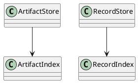
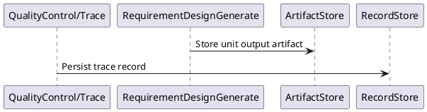
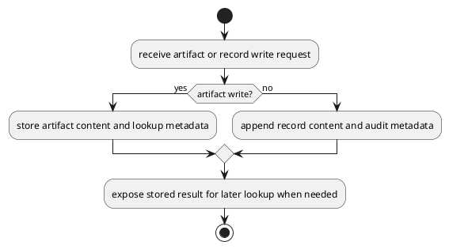
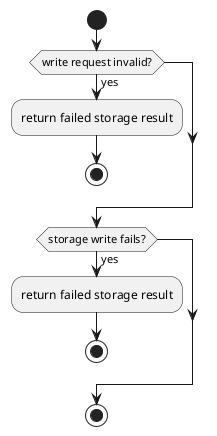

# DataStore Design

## 0. Document Type

- type: `functional_group_design`
- scope: define artifact persistence, record storage, downstream lookup, and runtime auditability boundaries
- include: `ArtifactStore`, `RecordStore`
- downstream usage: guide follow-up design for storage APIs, persistence layout, lookup behavior, and audit record handling

## 1. Goal

### 1.1 Purpose

Define shared data persistence behavior for `ArtifactStore` and `RecordStore`.

### 1.2 Involved Items

This design document directly covers:

- `ArtifactStore`
- `RecordStore`

This design document collaborates with:

- `Orchestrator`
- `QualityControl`
- `TestRunner`

### 1.3 Core Functions

`DataStore` is the design item for artifact persistence and runtime record storage.

Its core functions are:

- Persist unit outputs for downstream lookup and resume.
- Persist gate decisions and trace records emitted by `Trace` for audit and visibility.
- Provide stable read boundaries for runtime and test usage.
- Keep data persistence separate from capability and review logic.

`DataStore` does not decide runtime continuation, review outcomes, or capability-specific rules, and does not take over artifact-persistence ownership from units.

## 2. Core Classes

### 2.1 Class Diagram



### 2.2 Core Class Responsibilities

#### 2.2.1 `ArtifactStore`

Role:

- Persist visible artifacts.

Responsibilities:

- Store generated artifacts, update outputs, contract results, and execution-related artifacts written directly by units.
- Support downstream lookup.
- Support resume and review access.

#### 2.2.2 `RecordStore`

Role:

- Persist runtime records.

Responsibilities:

- Persist trace records emitted by `Trace`.
- Store gate decisions.
- Store execution records for audit.

## 3. Core Runtime Flow

### 3.1 Main Sequence Diagram



## 4. Detailed Design

### 4.1 Core APIs And Types

#### 4.1.1 Public API

```typescript
interface ArtifactStoreApi {
  put(input: ArtifactPutInput): Promise<boolean>
  get(input: ArtifactGetInput): Promise<StoredArtifact | null>
}

interface RecordStoreApi {
  append(input: RecordAppendInput): Promise<void>
}
```

#### 4.1.2 Input Types

```typescript
interface ArtifactPutInput {
  dirPath: string
  fileName: string
  content: string
}

interface ArtifactGetInput {
  dirPath: string
  fileName: string
}

interface RecordAppendInput {
  recordType: string
  content: string
  runId: string
  caller: string
  eventType: string
  payload?: Record<string, unknown>
}
```

#### 4.1.3 Output Types

```typescript
interface StoredArtifact {
  dirPath: string
  fileName: string
  content: string
}
```

#### 4.1.4 Item-Specific Boundary Rules

- Artifact and record storage must remain separate responsibilities.
- Artifact persistence ownership belongs to units, which must call `ArtifactStore` directly.
- Stored outputs must be runtime-readable for resume and downstream use.
- Persistence format should stay stable across direct runs and compose-runs.
- Template, generated artifact, and contract result persistence should preserve stable directory and file naming conventions for lookup.
- Artifact persistence should preserve file-name conventions such as `*_template.md`, `*_design.md`, `*.yaml`, and `*_contract_result.json`.
- Record persistence should preserve stable logical record names for gate decisions, trace records, and execution records.
- Trace and record persistence must require `runId`, `caller`, and `eventType` as mandatory fields.

### 4.2 Internal Runtime Skeleton



### 4.3 Runtime Processing Details

#### 4.3.1 ArtifactStoreWriteAndRead

Input loading:

- read one `ArtifactPutInput` for writes
- read one `ArtifactGetInput` for lookups

Processing:

- accept artifact writes directly from the unit that owns the output
- persist one unit output artifact payload with stable lookup metadata, directory path, and file name
- resolve one stored artifact by directory path and file name when requested

Output emission:

- emit one `boolean` artifact write result
- emit one `StoredArtifact | null` lookup result

#### 4.3.2 RecordStoreAppend

Input loading:

- read one `RecordAppendInput`

Processing:

- append one trace record emitted by `Trace`, one gate decision record, or one execution-related record
- preserve mandatory structured trace fields `runId`, `caller`, and `eventType`, plus optional `payload`
- preserve stable logical record naming for later lookup

Output emission:

- emit one durable record append result

### 4.4 Error Handling Skeleton



### 4.5 Extension Points

- Extension point: `ArtifactStore`
  - refine artifact indexing and lookup rules
  - support future storage-backend replacement

- Extension point: `RecordStore`
  - refine record append and audit lookup rules
  - support future record retention or partition rules

### 4.6 Constraints

- `Data` is a lower partition and must not depend on upper partitions.
- Storage APIs should remain simple and stable.
- Auditability requires durable records.
- Local-file implementation details are follow-up design concerns.
