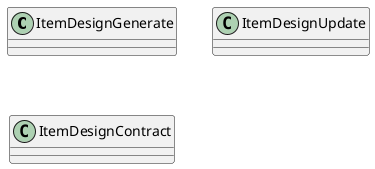
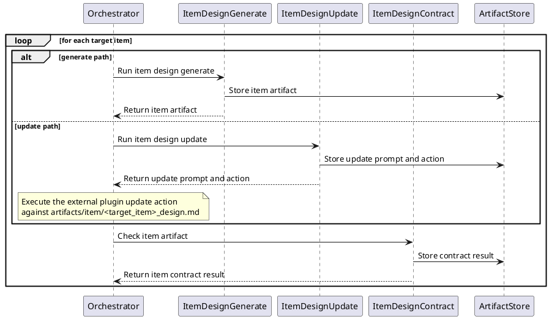
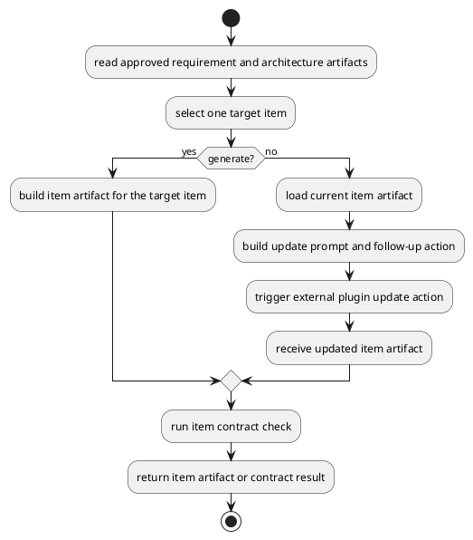
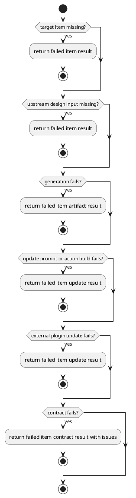

# Item Design

## 0. Document Type

- type: `functional_group_design`
- scope: define item-level design generation, early-stage item update prompt/action production through one external plugin update path, and item contract checking
- include: `ItemDesignGenerate`, `ItemDesignUpdate`, `ItemDesignContract`
- downstream usage: guide follow-up design for per-item artifact production, per-item update flow, and item-level validation rules

## 1. Goal

### 1.1 Purpose

Define item-design basic units, including generation, early-stage update prompt/action production through one external plugin update path, and item contract checking.

### 1.2 Involved Items

This design document directly covers:

- `ItemDesignGenerate`
- `ItemDesignUpdate`
- `ItemDesignContract`

This design document collaborates with:

- `Orchestrator`
- `LlmExecutor`
- `ArtifactStore`
- `QualityControl`

### 1.3 Core Functions

`Item Design` is the design item for per-item design outputs.

Its core functions are:

- Generate item design artifacts for one target item.
- Produce one update prompt and follow-up action for an external plugin update path for one target item.
- Validate item-level design outputs.
- Write each generated, updated, or contract output to `ArtifactStore` before returning.
- Remain independently callable and composable as basic execution units through the unified `Runtime` entry and current `Orchestrator` dispatch path.

`Item Design` does not own cross-document consistency checking, runtime loops, gate decisions, or downstream work execution behavior.

## 2. Core Classes

### 2.1 Class Diagram



### 2.2 Core Class Responsibilities

#### 2.2.1 `ItemDesignGenerate`

Role:

- Produce one item-design artifact for one target item.

Responsibilities:

- Read approved upstream design inputs.
- Generate per-item design output.
- Return one item artifact per target.

#### 2.2.2 `ItemDesignUpdate`

Role:

- Produce one early-stage update prompt and follow-up action for one existing item-design artifact.

Responsibilities:

- Read the current item artifact together with approved upstream design inputs.
- Preserve stable unchanged sections when possible.
- Return one update prompt and follow-up action for downstream external plugin execution.

#### 2.2.3 `ItemDesignContract`

Role:

- Validate item-level design output.

Responsibilities:

- Read one item-design artifact against its rules.
- Report item-level issues.
- Stabilize downstream use of item design outputs.

## 3. Core Runtime Flow

### 3.1 Main Sequence Diagram



## 4. Detailed Design

### 4.1 Core APIs And Types

#### 4.1.1 Public API

```typescript
interface ItemDesignApi {
  generate(input: ItemDesignInput): Promise<ItemDesignArtifact>
  update(input: ItemDesignUpdateInput): Promise<ItemDesignUpdateResult>
  contract(input: ItemDesignContractInput): Promise<ItemDesignContractResult>
}
```

#### 4.1.2 Input Types

```typescript
interface ItemDesignInput {
  requirementArtifact: FileArtifactMap
  architectureArtifact: FileArtifactMap
  targetItem: string
}

interface ItemDesignUpdateInput {
  requirementArtifact: FileArtifactMap
  architectureArtifact: FileArtifactMap
  currentItemArtifact: FileArtifactMap
  targetItem: string
}

interface ItemDesignContractInput {
  itemArtifact: FileArtifactMap
  targetItem: string
}

interface FileArtifact {
  path: string
  content?: string
}

type FileArtifactMap = Record<string, FileArtifact>
type ArtifactContentMap = Record<string, FileArtifactMap>
```

#### 4.1.3 Runtime Types

```typescript
interface ItemDesignWorkingContext {
  requirementArtifact: FileArtifactMap
  architectureArtifact: FileArtifactMap
  targetItem: string
  currentItemArtifact?: FileArtifactMap
}

interface ExternalAction {
  tool: "external_plugin"
  operation: "update_markdown"
  targetPath: string
}
```

#### 4.1.4 Output Types

```typescript
interface ItemDesignArtifact {
  targetItem: string
  content: FileArtifactMap
}

interface ItemDesignUpdateResult {
  prompt: string
  action: ExternalAction
}

interface ItemDesignContractResult {
  passed: boolean
  issues: Array<Record<string, unknown>>
}
```

#### 4.1.5 Item-Specific Boundary Rules

- Item design runs once per target item.
- Item contract checks one item-design artifact at a time.
- Item-level pass does not imply cross-document consistency.
- The current early-stage `update` unit returns a prompt plus one follow-up external plugin action instead of mutating the item artifact by itself.
- External composition may select these basic execution units independently, but unified-entry ownership remains with `Runtime`, currently implemented through `Orchestrator`.
- Each basic unit must write its own output artifact or contract result to `ArtifactStore` before returning control.
- Template input should use the stable logical artifact name `item_design_template`.
- Generated and updated item output should use the target-specific logical artifact name `<target_item>_design`.
- Contract result output should use the target-specific logical artifact name `<target_item>_design_contract_result`.

### 4.2 Internal Runtime Skeleton



### 4.3 Runtime Processing Details

#### 4.3.1 ItemDesignGenerate

Input loading:

- `ItemDesignInput.requirementArtifact.requirement_design.path`: default input path `artifacts/requirement/requirement_design.md`
- `ItemDesignInput.requirementArtifact.requirement_design.content`: optional `requirement_design.md` markdown content
- `ItemDesignInput.architectureArtifact.architecture_design.path`: default input path `artifacts/architecture/architecture_design.md`
- `ItemDesignInput.architectureArtifact.architecture_design.content`: optional `architecture_design.md` markdown content
- `ItemDesignInput.targetItem`: target item name that maps to `item_name_design.md`

Processing:

- read requirement content, architecture content, and target-item scope into one `ItemDesignWorkingContext`
- build one item-design-generation prompt for the selected target item
- call `LlmExecutor` with the generation prompt
- parse the returned model result into one item-design artifact payload

Output emission:

- write the generated item artifact to `ArtifactStore`
- `ItemDesignArtifact.targetItem`: target item name
- `ItemDesignArtifact.content["<target_item>_design"].path`: default output path `artifacts/item/<target_item>_design.md`
- `ItemDesignArtifact.content["<target_item>_design"].content`: optional generated `item_name_design.md` markdown content
- output file name: `item_name_design.md`
- output path: `artifacts/item/<target_item>_design.md`

#### 4.3.2 ItemDesignUpdate

Input loading:

- `ItemDesignUpdateInput.requirementArtifact.requirement_design.path`: default input path `artifacts/requirement/requirement_design.md`
- `ItemDesignUpdateInput.requirementArtifact.requirement_design.content`: optional `requirement_design.md` markdown content
- `ItemDesignUpdateInput.architectureArtifact.architecture_design.path`: default input path `artifacts/architecture/architecture_design.md`
- `ItemDesignUpdateInput.architectureArtifact.architecture_design.content`: optional `architecture_design.md` markdown content
- `ItemDesignUpdateInput.currentItemArtifact["<target_item>_design"].path`: default current artifact path `artifacts/item/<target_item>_design.md`
- `ItemDesignUpdateInput.currentItemArtifact["<target_item>_design"].content`: optional current `item_name_design.md` markdown content
- `ItemDesignUpdateInput.targetItem`: target item name
- `ItemDesignUpdateResult.action.targetPath`: `artifacts/item/<target_item>_design.md`

Processing:

- load the current target-item design artifact
- identify unchanged sections and changed sections
- build one update prompt that describes required markdown changes
- build one `ExternalAction` for downstream external plugin execution
- return one external-plugin-oriented update payload instead of mutating the artifact inside `ItemDesignUpdate`

Output emission:

- write the update prompt/action output to `ArtifactStore`
- `ItemDesignUpdateResult.prompt`: update prompt text for the external plugin
- `ItemDesignUpdateResult.action.tool`: `external_plugin`
- `ItemDesignUpdateResult.action.operation`: `update_markdown`
- `ItemDesignUpdateResult.action.targetPath`: `artifacts/item/<target_item>_design.md`
- downstream plugin result: updated `ItemDesignArtifact.content["<target_item>_design"].path` and optional `.content`

#### 4.3.3 ItemDesignContract

Input loading:

- `ItemDesignContractInput.itemArtifact["<target_item>_design"].path`: default artifact path `artifacts/item/<target_item>_design.md`
- `ItemDesignContractInput.itemArtifact["<target_item>_design"].content`: optional `item_name_design.md` markdown content
- `ItemDesignContractInput.targetItem`: target item name
- template check source: `item_design_template.md` from context or `templates/item_design_template.md`

Processing:

- read the selected item-design artifact into one contract-check context
- execute one local-rule validation path when the check can be completed by local rules and template-alignment rules
- or build one contract-check prompt and call `LlmExecutor` when the check requires model-supported validation
- normalize returned findings into one item contract issue json list

Output emission:

- write the contract result to `ArtifactStore`
- `ItemDesignContractResult.passed`: contract pass/fail status
- `ItemDesignContractResult.issues`: contract issue json list
- output file name: `item_name_design_contract_result.json`
- output path: `artifacts/item/<target_item>_design_contract_result.json`

### 4.4 Error Handling Skeleton



### 4.5 Extension Points

- Extension point: `target-item selection rules`
  - refine target-item selection rules
  - support future item grouping or filtering rules

- Extension point: `item-design contract rules`
  - extend item-level rule sets
  - refine item issue reporting and stability rules

### 4.6 Constraints

- Looping across target items belongs to runtime control.
- Item outputs must remain independently addressable artifacts.
- Cross-item parallelism must respect upstream input stability.
- Cross-document consistency checking belongs to `OverallDesignContract`.
