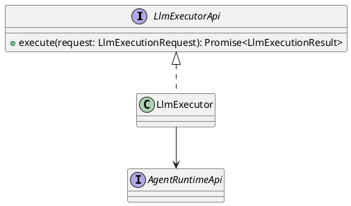
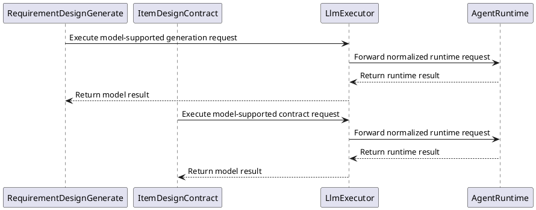
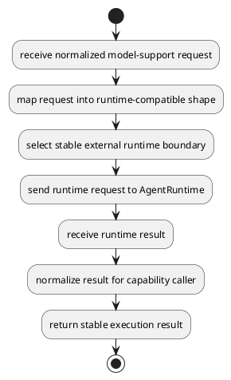
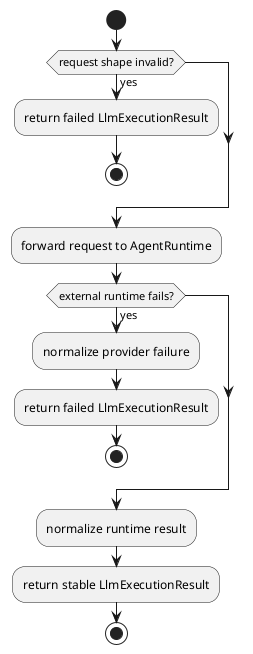

# LlmCapability Design

## 0. Document Type

- type: `functional_group_design`
- scope: define the internal LLM adapter boundary and the external runtime capability reference boundary
- include: `LlmExecutor`, `AgentRuntime`
- downstream usage: guide follow-up design for adapter normalization, capability-to-runtime collaboration, and external runtime reference linkage

## 1. Goal

### 1.1 Purpose

Define the internal adapter design for `LlmExecutor` and the external reference boundary for `AgentRuntime`.

### 1.2 Involved Items

This design document directly covers:

- `LlmExecutor`
- `AgentRuntime`

This design document collaborates with:

- `RequirementDesignGenerate`
- `ItemDesignContract`

### 1.3 Core Functions

`LlmCapability` is the design item for model-supported execution through one internal adapter plus one external runtime capability reference.

Its core functions are:

- Accept normalized model-execution requests from capability modules.
- Adapt internal requests into the external runtime capability boundary.
- Return stable model-execution results to capability callers.
- Keep external runtime dependency details behind a stable adapter boundary.

`LlmCapability` does not own business capability sequencing, artifact persistence, or review decisions.

## 2. Core Classes

### 2.1 Class Diagram



### 2.2 Core Class Responsibilities

#### 2.2.1 `LlmExecutor`

Role:

- Internal adapter between capability modules and external runtime capability.

Responsibilities:

- Accept normalized execution requests.
- Map internal request shape to external runtime request shape.
- Call `AgentRuntime`.
- Return normalized execution results to capability modules.

#### 2.2.2 `AgentRuntimeApi`

Role:

- External runtime capability boundary.

Responsibilities:

- Execute runtime requests.
- Return runtime execution results.
- Keep provider-specific details outside project capability modules.

## 3. Core Runtime Flow

### 3.1 Main Sequence Diagram



## 4. Detailed Design

### 4.1 Core APIs And Types

#### 4.1.1 Public API

```typescript
interface LlmExecutorApi {
  execute(request: LlmExecutionRequest): Promise<LlmExecutionResult>
}
```

#### 4.1.2 Input Types

```typescript
interface LlmExecutionRequest {
  operation: string
  payload: Record<string, unknown>
  metadata?: Record<string, string>
}
```

#### 4.1.3 Runtime Types

```typescript
interface AgentRuntimeApi {
  execute(request: AgentRuntimeRequest): Promise<AgentRuntimeResult>
}

interface AgentRuntimeRequest {
  operation: string
  payload: Record<string, unknown>
  metadata?: Record<string, string>
}

interface AgentRuntimeResult {
  status: "success" | "failed"
  payload: Record<string, unknown>
  diagnostics?: Array<Record<string, unknown>>
}
```

#### 4.1.4 Output Types

```typescript
interface LlmExecutionResult {
  status: "success" | "failed"
  payload: Record<string, unknown>
  diagnostics?: Array<Record<string, unknown>>
}
```

#### 4.1.5 Item-Specific Boundary Rules

- Capability modules must call `LlmExecutor`, not `AgentRuntime`, directly.
- `LlmExecutor` must keep request and result normalization stable.
- External runtime replacement should not force capability-module API changes.
- The external runtime reference remains defined in [AgentRuntime](../design_docs/SDK/AgentRuntime.md).

### 4.2 Internal Runtime Skeleton



### 4.3 Runtime Processing Details

#### 4.3.1 LlmExecutorRequestHandling

Input loading:

- read one normalized `LlmExecutionRequest`
- read optional request metadata needed for runtime adaptation

Processing:

- map the request into one runtime-compatible request shape
- send the mapped request to `AgentRuntime`
- normalize the returned runtime result for capability callers

Output emission:

- emit one `LlmExecutionResult`
- preserve a stable capability-facing boundary independent of external runtime shape

### 4.4 Error Handling Skeleton



### 4.5 Extension Points

- Extension point: `external runtime boundary`
  - support future external runtime replacement
  - support additional model-supported caller types without changing capability-module boundaries

### 4.6 Constraints

- `LlmExecutor` belongs to `Capability`.
- `AgentRuntime` belongs to `SDK`.
- Retry and provider-specific runtime policy remain outside this design document.
- LLM capability boundaries must remain separate from runtime orchestration and quality control.
