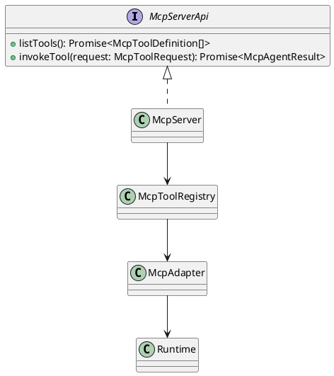
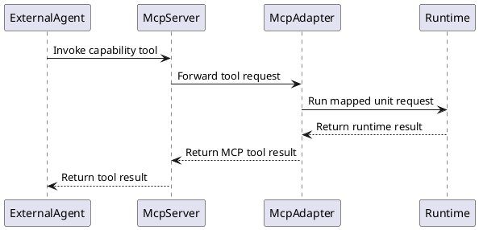
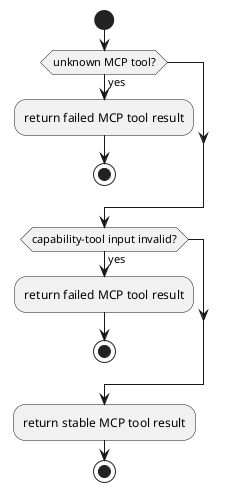

# McpAdapter Design

## 0. Document Type

- type: `functional_group_design`
- scope: define the external MCP server boundary, exposed atomic capability tools, returned external action shape, and external-agent interaction model
- include: `McpServer`, `McpToolRegistry`, `McpAdapter`
- downstream usage: guide follow-up design for MCP tool schemas, capability exposure, and external-agent consumption of returned external actions

## 1. Goal

### 1.1 Purpose

Define one stable MCP-facing adapter layer so external agents can call documented SDLC atomic capabilities and consume returned agent-facing action payloads without directly coupling to internal runtime classes.

### 1.2 Involved Items

This design document directly covers:

- `McpServer`
- `McpToolRegistry`
- `McpAdapter`

This design document collaborates with:

- `Runtime`
- `Orchestrator`
- `RequirementDesignGenerate`
- `RequirementDesignUpdate`
- `ArchitectureDesignGenerate`
- `ArchitectureDesignUpdate`
- `ItemDesignGenerate`
- `ItemDesignUpdate`
- `WorkPlanGenerate`
- `WorkPlanUpdate`
- `RequirementDesignContract`
- `ArchitectureDesignContract`
- `ItemDesignContract`
- `WorkPlanContract`
- `OverallDesignContract`
- `WorkExecute`
- `WorkExecuteContract`

### 1.3 Core Functions

`McpAdapter` is the design item for external MCP exposure and external-agent collaboration.

Its core functions are:

- Expose selected SDLC atomic capabilities as stable MCP tools.
- Expose one directly startable stdio MCP server process on top of the documented atomic capability set.
- Map MCP tool arguments into normalized runtime requests.
- Return stable MCP-facing results without leaking internal runtime classes.
- Project one internally returned `ExternalAction` into one agent-facing `agentAction` for direct external execution.

`McpAdapter` does not own capability semantics, compose-run orchestration, per-capability business rules, or external action execution.

## 2. Core Classes

### 2.1 Class Diagram



### 2.2 Core Class Responsibilities

#### 2.2.1 `McpServer`

Role:

- External MCP entry boundary.

Responsibilities:

- Serve one stdio MCP transport entry for direct external startup.
- Publish tool definitions.
- Accept tool invocations from external agents.
- Return stable MCP tool results.

#### 2.2.2 `McpToolRegistry`

Role:

- Stable tool-definition registry.

Responsibilities:

- Map tool names to one documented capability.
- Keep tool schema and runtime mapping explicit.
- Prevent per-agent ad hoc tool naming.

#### 2.2.3 `McpAdapter`

Role:

- Adapter between MCP tool calls and internal runtime boundaries.

Responsibilities:

- Normalize MCP arguments.
- Build runtime requests for exposed capability tools.
- Return stable MCP-facing result payloads.
- Project internal `ExternalAction` into one returned `agentAction` when the invoked capability requires external execution.

## 3. Core Runtime Flow

### 3.1 Main Sequence Diagram



## 4. Detailed Design

### 4.1 Core APIs And Types

#### 4.1.1 Public API

```typescript
interface McpServerApi {
  listTools(): Promise<McpToolDefinition[]>
  invokeTool(request: McpToolRequest): Promise<McpAgentResult>
}
```

#### 4.1.2 Input Types

```typescript
interface McpToolRequest {
  name: string
  arguments: Record<string, unknown>
}

interface CapabilityToolArguments {
  project_name?: string
  user_comment?: string
  item_descriptor_path?: string
  test_command?: string
}

interface RegisteredProject {
  project_name: string
  project_dir: string
}

interface RegisteredProjectConfig {
  default_project?: string
  projects: RegisteredProject[]
}
```

#### 4.1.3 Runtime Types

```typescript
interface McpToolDefinition {
  name: string
  description: string
  inputSchema: Record<string, unknown>
}

interface McpAgentResult {
  status: "success" | "failed"
  message: string
  files?: Array<{
    path: string
    role: string
  }>
  issues?: Array<{
    severity?: "low" | "medium" | "high"
    message: string
  }>
  agentAction?: AgentAction
}

interface AgentAction {
  actionType: string
  targetPath: string
  instructions: string
}
```

Registered-project mapping example:

```json
{
  "default_project": "hello-service",
  "projects": [
    {
      "project_name": "hello-service",
      "project_dir": "/abs/path/to/user_projects/hello-service"
    }
  ]
}
```

Project-resolution rules:

- MCP server must resolve `project_name` through one registered-project mapping table.
- By default, MCP server must read that registered-project mapping table from `/infra_projects/config/mcp_projects.json` under the repository root.
- If MCP input omits `project_name`, MCP must read `default_project` from `/infra_projects/config/mcp_projects.json`.
- If MCP input provides `project_name`, that explicit value overrides `default_project`.
- The resolved `project_dir` is the only target project directory for the current invocation.
- MCP must use the resolved `project_dir` directly as the workspace root.
- MCP must not apply one second-stage `workdir` translation through `package.json`.
- MCP must not use upward-search or nearest-parent fallback to infer another project root.
- If neither explicit `project_name` nor `default_project` can be resolved to one registered `project_dir`, MCP must fail the invocation with one configuration error result.

#### 4.1.5 Item-Specific Boundary Rules

- MCP tools must expose stable names and must not mirror internal class names or file paths.
- First-version MCP capability exposure is limited to direct unit-run tools and must not claim full compose-run support.
- MCP callers may omit `project_name`; MCP resolves the target project directory through one registered-project mapping and optional `default_project`.
- MCP callers must not provide `run_id`; the MCP entry or CI boundary generates one stable run id when the request starts.
- MCP callers must not provide `workdir`; the MCP adapter uses the resolved `project_dir` directly as the workspace root.
- Update tools return one `ExternalAction`; they must not directly mutate workspace files through the capability tool itself.
- `work_execute` returns one `ExternalAction`; it must not directly mutate workspace files through the capability tool itself.
- MCP only exposes atomic capability calls.
- External action execution happens outside the MCP server boundary.
- MCP must project internally returned `ExternalAction` into `agentAction` before returning to external agents.
- MCP must not expose the internal `ExternalAction` contract directly to external agents.
- External agents should prefer `agentAction` and do not need to parse the internal `externalAction.payload` shape.
- `external_plugin/update_markdown` and `external_execution/apply_workspace_change` remain distinct external action families even though MCP does not expose dedicated adapter tools for them.

#### 4.1.6 Tool Input Mapping

| tool name | required fields | optional fields |
| --- | --- | --- |
| `requirement_design_generate` | none | `project_name`, `user_comment` |
| `architecture_design_generate` | none | `project_name`, `user_comment` |
| `item_design_generate` | `item_descriptor_path` | `project_name`, `user_comment` |
| `work_plan_generate` | none | `project_name`, `user_comment` |
| `requirement_design_update` | `user_comment` | `project_name` |
| `architecture_design_update` | `user_comment` | `project_name` |
| `item_design_update` | `user_comment`, `item_descriptor_path` | `project_name` |
| `work_plan_update` | none | `project_name`, `user_comment` |
| `requirement_design_contract` | none | `project_name`, `user_comment` |
| `architecture_design_contract` | none | `project_name`, `user_comment` |
| `item_design_contract` | none | `project_name`, `user_comment` |
| `work_plan_contract` | none | `project_name`, `user_comment` |
| `overall_design_contract` | none | `project_name`, `user_comment` |
| `work_execute` | none | `project_name`, `user_comment` |
| `work_execute_contract` | `test_command` | `project_name`, `user_comment` |

Input-mapping rules:

- MCP schema must reject fields not listed for the selected tool.
- `project_name` is optional for every MCP capability tool invocation only because MCP may fall back to `default_project`.
- `item_descriptor_path` is only valid for `item_design_generate` and `item_design_update`.
- `test_command` is only valid for `work_execute_contract`.
- `user_comment` remains optional unless the table marks it as required.

### 4.2 Exposed Tool Set

#### 4.2.0 Exposed Function Matrix

| tool family | exposed function | purpose | returns |
| --- | --- | --- | --- |
| capability tool | document generate | generate one design or work-plan artifact | `status`, `message`, `files` |
| capability tool | document update | generate one external update handoff | `status`, `message`, `files`, `agentAction` |
| capability tool | work execute | generate one workspace-change handoff | `status`, `message`, `agentAction` |
| capability tool | document contract | validate one document or cross-document result | `status`, `message`, `files`, optional `issues` |
| capability tool | work execute contract | validate one workspace state by command execution | `status`, `message`, `files`, optional `issues` |

#### 4.2.1 Capability Tools

First-version capability tools:

- `requirement_design_generate`
- `architecture_design_generate`
- `item_design_generate`
- `work_plan_generate`
- `requirement_design_update`
- `architecture_design_update`
- `item_design_update`
- `work_plan_update`
- `requirement_design_contract`
- `architecture_design_contract`
- `item_design_contract`
- `work_plan_contract`
- `overall_design_contract`
- `work_execute`
- `work_execute_contract`

### 4.3 Input And Output By Tool Family

#### 4.3.1 Generate Tool Input

Stable input fields:

- optional `user_comment`
- optional `item_descriptor_path` for item-design generate

Example:

```json
{
  "project_name": "hello-service",
  "user_comment": "Generate requirement for hello-service"
}
```

Generate tool output:

```json
{
  "status": "success",
  "message": "Requirement document generated.",
  "files": [
    {
      "path": "sdlc/docs/Requirement.md",
      "role": "requirement_design"
    }
  ]
}
```

#### 4.3.2 Update Tool Input

Stable input fields:

- `user_comment`
- optional `item_descriptor_path` for item-design update

Example:

```json
{
  "project_name": "hello-service",
  "user_comment": "Add one deployment validation scenario"
}
```

Update tool output:

```json
{
  "status": "success",
  "message": "Requirement update prompt generated.",
  "files": [
    {
      "path": "sdlc/docs/Requirement.md",
      "role": "requirement_design"
    }
  ],
  "agentAction": {
    "actionType": "update_markdown",
    "targetPath": "sdlc/docs/Requirement.md",
    "instructions": "Update the existing requirement markdown document..."
  }
}
```

#### 4.3.3 WorkExecute Tool Input

Stable input fields:

- optional `user_comment`

Example:

```json
{
  "project_name": "hello-service",
  "user_comment": "Implement the approved hello-service baseline"
}
```

WorkExecute tool output:

```json
{
  "status": "success",
  "message": "Work execute prompt generated.",
  "agentAction": {
    "actionType": "apply_workspace_change",
    "targetPath": "/abs/workspace",
    "instructions": "Apply the approved changes for hello-service in the target workspace..."
  }
}
```

#### 4.3.4 Contract Tool Input

Stable input fields:

- optional `user_comment`
- optional `test_command` for `work_execute_contract`

Example:

```json
{
  "project_name": "hello-service"
}
```

Contract tool output:

```json
{
  "status": "success",
  "message": "Requirement design contract passed.",
  "files": [
    {
      "path": "dist/sdlc/run-1003/requirement_design_contract_result.json",
      "role": "requirement_design_contract_result"
    }
  ]
}
```

### 4.4 Runtime Processing Details

#### 4.4.1 ExternalAction To AgentAction Projection

| internal field | agent field | rule |
| --- | --- | --- |
| `ExternalAction.operation` | `agentAction.actionType` | copy exact string value |
| `ExternalAction.targetPath` | `agentAction.targetPath` | copy exact string value |
| `ExternalAction.payload.prompt` | `agentAction.instructions` | copy exact string value |

Projection rules:

- MCP must build `agentAction` only when the runtime result contains one internal `ExternalAction`.
- If `payload.prompt` is missing or is not a string, MCP must fail the tool invocation instead of returning a partial `agentAction`.
- MCP must not expose internal fields such as `tool`, `payload`, `handoffType`, or `targetArtifact` in the returned MCP payload.

#### 4.4.2 Files Projection Rules

| internal artifact kind | returned `files.role` |
| --- | --- |
| requirement design document | `requirement_design` |
| architecture design document | `architecture_design` |
| item design document | `<item_name>_design` |
| work plan document | `work_plan` |
| requirement contract result | `requirement_design_contract_result` |
| architecture contract result | `architecture_design_contract_result` |
| item contract result | `item_design_contract_result` |
| work plan contract result | `work_plan_contract_result` |
| overall design contract result | `overall_design_contract_result` |
| work execute contract result | `work_execute_contract_result` |

Files-projection rules:

- `files.path` must be one stable workspace-relative path or one stable run-output-relative path.
- `files.role` must be derived from the logical artifact kind, not from an arbitrary filename.
- If the capability produces no file output, MCP should omit `files` instead of returning an empty placeholder entry.

#### 4.4.3 CapabilityToolInvocation

Input loading:

- read one MCP tool name
- read one stable capability argument set
- resolve the target project directory from `project_name`
- use the resolved `project_dir` as the workspace root
- generate one stable run id through the MCP entry or CI boundary

Processing:

- map the MCP tool name to one execution unit id
- normalize MCP arguments into one unit-run request with resolved project directory, workspace root equal to `project_dir`, and generated run id
- call `Runtime` through the unified runtime entry
- project the returned runtime result into one Codex-facing result payload with `status`, `message`, `files`, optional `issues`, and optional `agentAction`
- when a capability returns `ExternalAction`, build one agent-facing `agentAction` from the internal action contract
- do not expose the internal `ExternalAction` contract in the returned MCP payload

Output emission:

- emit one stable capability-tool result
- convert internal success/failure state into `status`
- convert internal summary into `message`
- convert internal artifact refs into `files`
- convert internal contract issues into `issues` when they exist
- include `agentAction` when the invoked capability returns one handoff

### 4.5 External Agent Interaction Model

#### 4.5.1 Standard Document Update Path

For one document update path, the external agent should follow this order:

1. call one update capability tool such as `requirement_design_update`
2. read the returned `agentAction`
3. read `agentAction.instructions`
4. execute the document update outside MCP

#### 4.5.2 Codex Document-Update Example

For Codex or a similar external agent plugin, the document-update interaction model is:

1. Codex calls `requirement_design_update`
2. MCP returns one `agentAction` with:
   - `actionType`
   - `targetPath`
   - `instructions`
3. Codex reads `agentAction.instructions`
4. Codex executes the document update outside MCP

#### 4.5.3 WorkExecute Path

For one workspace-change path, the external agent should follow this order:

1. call `work_execute`
2. read the returned `agentAction`
3. read `agentAction.instructions`
4. execute workspace changes outside MCP

#### 4.5.4 Codex WorkExecute Example

For Codex or a similar external agent plugin, the work-execute interaction model is:

1. Codex calls `work_execute`
2. MCP returns one `agentAction` with:
   - `actionType`
   - `targetPath`
   - `instructions`
3. Codex reads `agentAction.instructions`
4. Codex executes the workspace change outside MCP

Codex must not treat `work_execute` itself as permission to mutate the workspace without the explicit external execution step.

#### 4.5.5 End-To-End Interaction Sequence

For one atomic interaction path, the interaction sequence is:

1. external agent lists MCP tools
   - through one directly started stdio MCP server process
2. external agent invokes one capability tool
3. MCP entry resolves `project_name` into the target project directory
4. MCP entry uses the resolved `project_dir` directly as `workdir` and generates `run_id`
5. MCP returns either:
   - direct capability result
   - or one `agentAction`
6. if an `agentAction` is returned, the external agent reads `instructions`
7. the external agent executes the action outside MCP
8. the current MCP interaction ends after the atomic capability result is returned

### 4.6 Error Handling Skeleton



### 4.7 Constraints

- MCP exposure must keep capability semantics unchanged.
- MCP tools must not reopen the old update boundary by scanning files implicitly.
- The first version must not mix compose-run delivery with MCP tool exposure.
- MCP must expose atomic capabilities only; orchestration, stateful continuation control, and external action execution remain outside this MCP boundary.
