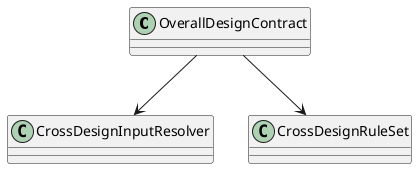
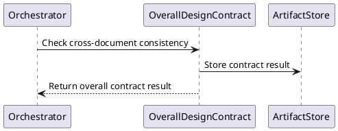
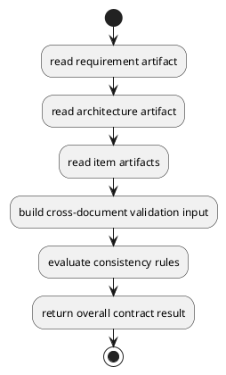
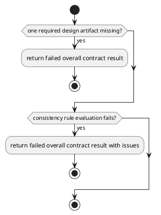

# OverallDesignContract Design

## 0. Document Type

- type: `functional_group_design`
- scope: define cross-document consistency checking across requirement, architecture, and item design outputs
- include: `OverallDesignContract`
- downstream usage: guide follow-up design for cross-document validation rules, aggregated design inputs, and downstream planning gates

## 1. Goal

### 1.1 Purpose

Define cross-document consistency checking across requirement, architecture, and item design outputs.

### 1.2 Involved Items

This design document directly covers:

- `OverallDesignContract`

This design document collaborates with:

- `Orchestrator`

### 1.3 Core Functions

`OverallDesignContract` is the design item for cross-document consistency validation.

Its core functions are:

- Read requirement, architecture, and item design artifacts together.
- Check cross-document consistency before downstream planning.
- Report design-level issues across document boundaries.
- Return stable contract results for runtime continuation decisions.
- Write the contract result to `ArtifactStore` before returning.
- Remain independently callable and composable as one basic execution unit through the unified `Runtime` entry and current `Orchestrator` dispatch path.

`OverallDesignContract` does not own item generation, item-level contract execution, or runtime sequencing.

## 2. Core Classes

### 2.1 Class Diagram



### 2.2 Core Class Responsibilities

#### 2.2.1 `OverallDesignContract`

Role:

- Validate consistency across design documents.

Responsibilities:

- Read multiple upstream design artifacts together.
- Check cross-document consistency rules.
- Return overall contract results for downstream control.

## 3. Core Runtime Flow

### 3.1 Main Sequence Diagram



## 4. Detailed Design

### 4.1 Core APIs And Types

#### 4.1.1 Public API

```typescript
interface OverallDesignContractApi {
  contract(input: OverallDesignContractInput): Promise<OverallDesignContractResult>
}
```

#### 4.1.2 Input Types

```typescript
interface OverallDesignContractInput {
  requirementArtifact: FileArtifactMap
  architectureArtifact: FileArtifactMap
  itemArtifacts: Record<string, ArtifactContentMap>
  userInput?: string
}

interface FileArtifact {
  path: string
  content?: string
}

type FileArtifactMap = Record<string, FileArtifact>
type ArtifactContentMap = Record<string, FileArtifactMap>
```

#### 4.1.3 Output Types

```typescript
interface OverallDesignContractResult {
  passed: boolean
  issues: Array<Record<string, unknown>>
}
```

#### 4.1.4 Item-Specific Boundary Rules

- Cross-document consistency must consume multiple design artifacts together.
- Overall consistency checking must remain separate from item-level contract checks.
- Downstream work planning must not rely on unstable overall design outputs.
- External composition may select this basic execution unit independently, but unified-entry ownership remains with `Runtime`, currently implemented through `Orchestrator`.
- This basic unit must write its own contract result to `ArtifactStore` before returning control.
- Input artifact paths should keep the logical artifact names `requirement_design`, `architecture_design`, and `<target_item>_design`.
- Overall contract result paths should use the logical artifact name `overall_design_contract_result` and the file name `overall_design_contract_result.json`.

### 4.2 Internal Runtime Skeleton



### 4.3 Runtime Processing Details

#### 4.3.1 OverallDesignContract

Input loading:

- `OverallDesignContractInput.requirementArtifact.requirement_design.path`: default input path `artifacts/requirement/requirement_design.md`
- `OverallDesignContractInput.requirementArtifact.requirement_design.content`: optional `requirement_design.md` markdown content
- `OverallDesignContractInput.architectureArtifact.architecture_design.path`: default input path `artifacts/architecture/architecture_design.md`
- `OverallDesignContractInput.architectureArtifact.architecture_design.content`: optional `architecture_design.md` markdown content
- `OverallDesignContractInput.itemArtifacts["<target_item>_design"]["<target_item>_design"].path`: default input path for each `item_name_design.md`
- `OverallDesignContractInput.itemArtifacts["<target_item>_design"]["<target_item>_design"].content`: optional content for each `item_name_design.md`
- `OverallDesignContractInput.userInput`: current `user_comment` when provided by the runtime request

Processing:

- aggregate the cross-design artifact set into one contract-check context
- execute one local-rule validation path when the consistency check can be completed by local cross-design rules
- or build one consistency-check prompt and call `LlmExecutor` when the check requires model-supported validation
- normalize returned findings into one overall contract issue json list

Output emission:

- write the contract result to `ArtifactStore`
- `OverallDesignContractResult.passed`: contract pass/fail status
- `OverallDesignContractResult.issues`: contract issue json list
- output file name: `overall_design_contract_result.json`
- output path: `artifacts/design/overall_design_contract_result.json`

### 4.4 Error Handling Skeleton



### 4.5 Extension Points

- Extension point: `cross-design contract rules`
  - extend consistency rules across requirement, architecture, and item design artifacts
  - refine issue grouping or severity rules for cross-document mismatches

- Extension point: `cross-design input aggregation rules`
  - refine artifact aggregation rules
  - support future design-document set expansion

### 4.6 Constraints

- `OverallDesignContract` belongs to the contract capability set.
- Runtime control decides when to invoke the overall contract.
- Cross-document rules must remain readable and stable.
- This design item must not absorb generation behavior.
