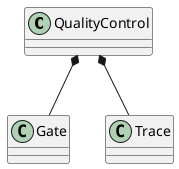
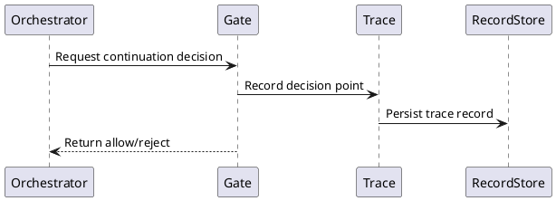
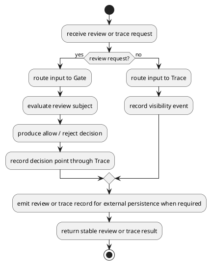
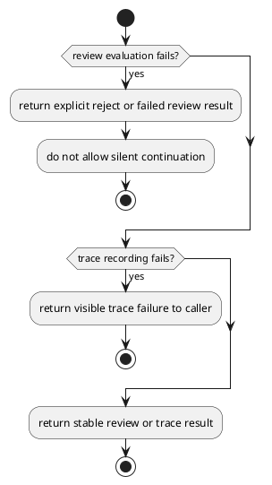

# QualityControl Design

## 0. Document Type

- type: `functional_group_design`
- scope: define review decision handling and execution visibility boundaries inside the quality-control subsystem
- include: `QualityControl`, `Gate`, `Trace`
- downstream usage: guide follow-up design for review decision rules, trace recording, and quality-control collaboration boundaries

## 1. Goal

### 1.1 Purpose

Define review decision and execution visibility behavior inside the SDK-contained `QualityControl` module.

### 1.2 Involved Items

This design document directly covers:

- `QualityControl`
- `Gate`
- `Trace`

This design document collaborates with:

- `Orchestrator`
- `CliEntry`
- `ArtifactStore`
- `RecordStore`

### 1.3 Core Functions

`QualityControl` is the design item for review decision and runtime visibility.

Its core functions are:

- Provide `Gate` decisions for contract results, validation outputs, and checked change sets.
- Provide `Trace` records for runtime visibility.
- Trace emits trace records, and `RecordStore` persists them.
- Return stable review outcomes to callers.
- Keep review and visibility separate from execution-unit logic.

`QualityControl` does not decide how artifacts are stored or used after a decision is returned.

## 2. Core Classes

### 2.1 Class Diagram



### 2.2 Core Class Responsibilities

#### 2.2.1 `Gate`

Role:

- Return change review decisions.

Responsibilities:

- Read generated outputs and contract results.
- Return allow or reject.
- Record decision points through `Trace`.

#### 2.2.2 `Trace`

Role:

- Provide execution visibility.

Responsibilities:

- Record run start, transitions, and decision points.
- Emit stable trace records.
- Support visible runtime summaries.

## 3. Core Runtime Flow

### 3.1 Main Sequence Diagram



## 4. Detailed Design

### 4.1 Core APIs And Types

#### 4.1.1 Public API

```typescript
interface QualityControlApi {
  review(input: GateInput): Promise<GateResult>
  trace(input: TraceInput): Promise<void>
}
```

#### 4.1.2 Input Types

```typescript
interface GateInput {
  runId: string
  caller: string
  reviewSubject: {
    type: "contract_result" | "validation_result" | "checked_change_set"
    summary?: string
    entries?: Array<{
      path?: string
      summary?: string
      old?: string
      new?: string
      diff?: string
      payload?: Record<string, unknown>
    }>
  }
}

interface TraceInput {
  runId: string
  caller: string
  eventType: string
  message: string
  payload?: Record<string, unknown>
}
```

#### 4.1.3 Output Types

```typescript
interface GateResult {
  decision: "allow" | "reject"
  reasons: string[]
}
```

#### 4.1.4 Item-Specific Boundary Rules

- `Gate` returns decisions only.
- `Trace` records visibility events only.
- Artifact usage after review is owned by the caller.
- Runtime owns continuation branching after `Gate` returns `apply`, `reject`, or `wait`.
- `Gate` should consume one explicit review subject that represents a contract result, validation result, or checked change set.
- `reviewSubject.entries` is the shared review-content shape for contract issues, validation diagnostics, and checked changes.
- `checked_change_set` entries should prefer `diff` for direct review and use `old`/`new` as supplementary context when available.
- `contract_result` and `validation_result` entries should use `summary` plus optional structured `payload`.
- `Trace` and gate-related records should emit stable logical record names for downstream persistence and lookup.
- `TraceInput.runId`, `TraceInput.caller`, and `TraceInput.eventType` are mandatory for downstream record persistence.

### 4.2 Internal Runtime Skeleton



### 4.3 Runtime Processing Details

#### 4.3.1 GateReview

Input loading:

- `GateInput.runId`: stable run identifier for the current review flow
- `GateInput.caller`: caller identity for the current review request
- `GateInput.reviewSubject.type`: review-subject type, limited to `contract_result`, `validation_result`, or `checked_change_set`
- `GateInput.reviewSubject.summary`: optional caller-provided summary for fast review context
- `GateInput.reviewSubject.entries`: optional concrete review content list, shared across contract issues, validation diagnostics, and checked changes, including per-entry `summary`, optional `payload`, and optional `path`/`diff`/`old`/`new`

Processing:

- use `reviewSubject` as the direct review input
- use `reviewSubject.entries` as the shared concrete review content inside that review input
- for `contract_result` and `validation_result`, interpret entries as issue or diagnostic items through `summary` and optional structured `payload`
- for `checked_change_set`, interpret entries as file-level changes and prefer `diff` for direct review while using `old`/`new` as supplementary context when needed
- produce one allow / reject decision
- allow `wait` as the stable decision for caller-owned resumable continuation
- trigger one traceable decision-point event

Output emission:

- emit one `GateResult`
- emit one review event for downstream record persistence

#### 4.3.2 TraceRecording

Input loading:

- `TraceInput.runId`: stable run identifier for the current trace flow
- `TraceInput.caller`: caller identity for the current trace event
- read one `TraceInput`
- `TraceInput.payload`: optional structured trace payload for the current event

Processing:

- normalize one trace event
- preserve caller identity and structured payload for downstream trace records
- prepare one trace record for downstream persistence

Output emission:

- emit one stable trace event payload through collaboration boundaries
- emit one trace record for downstream persistence by `RecordStore`

### 4.4 Error Handling Skeleton



### 4.5 Extension Points

- Extension point: `Gate`
  - evolve review rule sets
  - refine allow and reject decision policy

- Extension point: `Trace`
  - extend trace event taxonomy
  - refine runtime summary formatting for future interface surfaces

### 4.6 Constraints

- `QualityControl` belongs to `SDK`.
- `Gate` and `Trace` must stay separate concerns inside the same module.
- Persistence uses collaboration boundaries rather than internal storage ownership.
- Review policy details may evolve without changing execution-unit boundaries.
