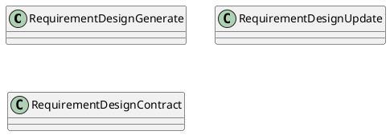
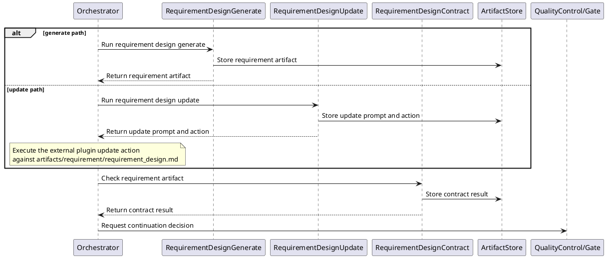
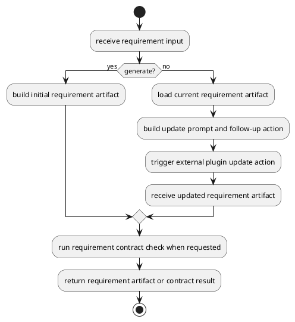
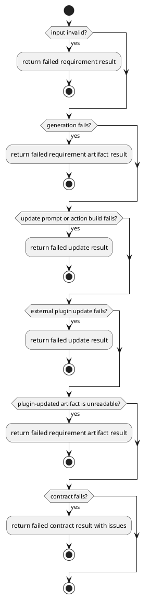

# Requirement Design

## 0. Document Type

- type: `functional_group_design`
- scope: define requirement artifact generation, early-stage requirement update prompt/action production through one external plugin update path, and requirement contract checking
- include: `RequirementDesignGenerate`, `RequirementDesignUpdate`, `RequirementDesignContract`
- downstream usage: guide follow-up design for requirement artifact production, update flow, and requirement-level validation rules

## 1. Goal

### 1.1 Purpose

Define the requirement-design basic units for generation, early-stage update prompt/action production through one external plugin update path, and contract checking.

### 1.2 Involved Items

This design document directly covers:

- `RequirementDesignGenerate`
- `RequirementDesignUpdate`
- `RequirementDesignContract`

This design document collaborates with:

- `Orchestrator`
- `LlmExecutor`
- `ArtifactStore`
- `QualityControl`

### 1.3 Core Functions

`Requirement Design` is the design item for requirement document generation, early-stage external-plugin-assisted update, and validation.

Its core functions are:

- Generate requirement artifacts from user input.
- Produce one update prompt and follow-up action for an external plugin update path to update requirement artifacts incrementally in the current stage.
- Validate requirement outputs before downstream use.
- Expose stable requirement artifacts to later capability items.
- Write each generated, updated, or contract output to `ArtifactStore` before returning.
- Remain independently callable and composable as basic execution units through the unified `Runtime` entry and current `Orchestrator` dispatch path.

`Requirement Design` does not own runtime continuation decisions, global persistence policy beyond its own output write, or cross-document consistency checks outside requirement scope.

## 2. Core Classes

### 2.1 Class Diagram



### 2.2 Core Class Responsibilities

#### 2.2.1 `RequirementDesignGenerate`

Role:

- Produce initial requirement artifacts.

Responsibilities:

- Interpret user intent.
- Build requirement outputs.
- Return stable artifacts to runtime control.

#### 2.2.2 `RequirementDesignUpdate`

Role:

- Produce one early-stage update prompt and follow-up action for an existing requirement artifact.

Responsibilities:

- Read the current requirement artifact together with new user input.
- Preserve stable unchanged sections when possible.
- Return one update prompt and follow-up action for downstream external plugin execution.

#### 2.2.3 `RequirementDesignContract`

Role:

- Validate requirement outputs.

Responsibilities:

- Check structure and rule compliance.
- Report issues and pass/fail status.
- Support downstream stabilization.

## 3. Core Runtime Flow

### 3.1 Main Sequence Diagram



## 4. Detailed Design

### 4.1 Core APIs And Types

#### 4.1.1 Public API

```typescript
interface RequirementDesignApi {
  generate(input: RequirementDesignInput): Promise<RequirementArtifact>
  update(input: RequirementDesignUpdateInput): Promise<RequirementDesignUpdateResult>
  contract(input: RequirementContractInput): Promise<RequirementContractResult>
}
```

#### 4.1.2 Input Types

```typescript
interface RequirementDesignInput {
  userInput: string
  contextArtifacts?: ArtifactContentMap
}

interface RequirementDesignUpdateInput {
  userInput: string
  currentRequirementArtifact: FileArtifactMap
}

interface RequirementContractInput {
  requirementArtifact: FileArtifactMap
}

interface FileArtifact {
  path: string
  content?: string
}

type FileArtifactMap = Record<string, FileArtifact>
type ArtifactContentMap = Record<string, FileArtifactMap>
```

#### 4.1.3 Runtime Types

```typescript
interface RequirementWorkingContext {
  userInput: string
  templateArtifact?: ArtifactContentMap
  currentRequirementArtifact?: FileArtifactMap
}

interface ExternalAction {
  tool: "external_plugin"
  operation: "update_markdown"
  targetPath: "artifacts/requirement/requirement_design.md"
}
```

#### 4.1.4 Output Types

```typescript
interface RequirementArtifact {
  content: FileArtifactMap
}

interface RequirementDesignUpdateResult {
  prompt: string
  action: ExternalAction
}

interface RequirementContractResult {
  passed: boolean
  issues: Array<Record<string, unknown>>
}
```

#### 4.1.5 Item-Specific Boundary Rules

- `generate` and `update` are separate basic units even when they share helpers.
- External composition may select these basic execution units independently, but unified-entry ownership remains with `Runtime`, currently implemented through `Orchestrator`.
- Each basic unit must write its own output artifact or contract result to `ArtifactStore` before returning control.
- Template input should use the stable logical artifact name `requirement_design_template`.
- The current early-stage `update` unit returns a prompt plus one follow-up external plugin action instead of mutating the requirement artifact by itself.
- Contract output must be stable enough for runtime continuation decisions.
- Generated and updated requirement output should use the stable logical artifact name `requirement_design`.
- Contract result output should use the stable logical artifact name `requirement_design_contract_result`.

### 4.2 Internal Runtime Skeleton



### 4.3 Runtime Processing Details

#### 4.3.1 RequirementDesignGenerate

Input loading:

- `RequirementDesignInput.userInput`: current `user_comment`
- `RequirementDesignInput.contextArtifacts.requirement_design_template.requirement_design_template.path`: default template path, usually `templates/requirement_design_template.md`
- `RequirementDesignInput.contextArtifacts.requirement_design_template.requirement_design_template.content`: optional in-memory `requirement_design_template.md` content
- fallback template source: `templates/requirement_design_template.md`

Processing:

- read template content and user input into one `RequirementWorkingContext`
- build one requirement-generation prompt from the working context
- call `LlmExecutor` with the generation prompt
- parse the returned model result into one requirement artifact payload

Output emission:

- write the generated requirement artifact to `ArtifactStore`
- `RequirementArtifact.content.requirement_design.path`: default output path `artifacts/requirement/requirement_design.md`
- `RequirementArtifact.content.requirement_design.content`: optional generated `requirement_design.md` markdown content
- output file name: `requirement_design.md`
- output path: `artifacts/requirement/requirement_design.md`

#### 4.3.2 RequirementDesignUpdate

Input loading:

- `RequirementDesignUpdateInput.userInput`: current `user_comment`
- `RequirementDesignUpdateInput.currentRequirementArtifact.requirement_design.path`: default current artifact path `artifacts/requirement/requirement_design.md`
- `RequirementDesignUpdateInput.currentRequirementArtifact.requirement_design.content`: optional current `requirement_design.md` markdown content
- fallback current artifact source: `artifacts/requirement/requirement_design.md`
- `RequirementDesignUpdateResult.action.targetPath`: `artifacts/requirement/requirement_design.md`

Processing:

- normalize `userInput`
- load the current requirement markdown from `currentRequirementArtifact.requirement_design`
- identify unchanged sections and changed sections
- build one update prompt that describes the required markdown changes
- build one `ExternalAction` for downstream external plugin execution
- return one external-plugin-oriented update payload instead of mutating the artifact inside `RequirementDesignUpdate`

Output emission:

- write the update prompt/action output to `ArtifactStore`
- `RequirementDesignUpdateResult.prompt`: update prompt text for the external plugin
- `RequirementDesignUpdateResult.action.tool`: `external_plugin`
- `RequirementDesignUpdateResult.action.operation`: `update_markdown`
- `RequirementDesignUpdateResult.action.targetPath`: `artifacts/requirement/requirement_design.md`
- downstream plugin result: updated `RequirementArtifact.content.requirement_design.path` and optional `.content`

#### 4.3.3 RequirementDesignContract

Input loading:

- `RequirementContractInput.requirementArtifact.requirement_design.path`: default artifact path `artifacts/requirement/requirement_design.md`
- `RequirementContractInput.requirementArtifact.requirement_design.content`: optional `requirement_design.md` markdown content
- fallback artifact source: `artifacts/requirement/requirement_design.md`
- template check source: `templates/requirement_design_template.md` when template-alignment rules are enabled

Processing:

- read requirement artifact content into one contract-check context
- execute one local-rule validation path when the check can be completed by local rules and template-alignment rules
- or build one contract-check prompt and call `LlmExecutor` when the check requires model-supported validation
- normalize returned findings into one contract issue json list and produce one `RequirementContractResult`

Output emission:

- write the contract result to `ArtifactStore`
- `RequirementContractResult.passed`: contract pass/fail status
- `RequirementContractResult.issues`: contract issue json list
- output file name: `requirement_design_contract_result.json`
- output path: `artifacts/requirement/requirement_design_contract_result.json`

### 4.4 Error Handling Skeleton



### 4.5 Extension Points

- Extension point: `requirement contract rules`
  - extend requirement rule sets
  - refine issue reporting shape and severity rules

### 4.6 Constraints

- Requirement logic must not own cross-document validation.
- Runtime sequencing belongs to `Runtime`, currently handled by `Orchestrator`.
- LLM access, when needed, must go through `LlmExecutor`.
- Requirement outputs must remain readable by downstream design items.
