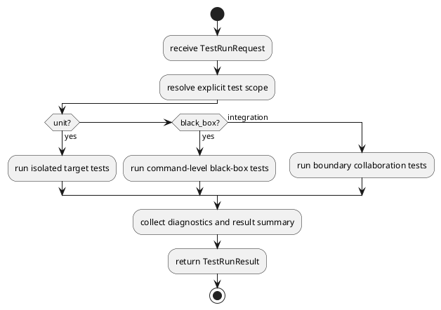
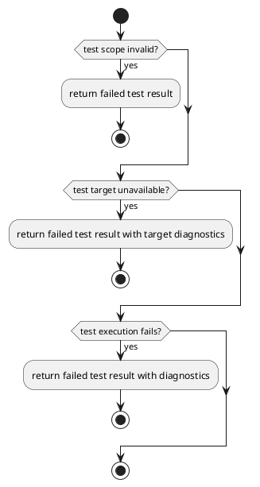

# Test Design

## 0. Document Type

- type: `test_design`
- scope: define test objectives, test scope, test layers, execution strategy, and returned outputs including pass/fail status, failed cases, and diagnostics for the current architecture
- include: `unit testing`, `black-box testing`, `integration testing`
- downstream usage: guide follow-up test planning, concrete test-case design, execution setup, and returned test-result handling

## 1. Goal

### 1.1 Purpose

Define the common test design for unit testing, black-box testing, and integration testing.

### 1.2 Test Targets

This design document directly covers:

- `TestRunner`

This design document validates:

- `Interface`
- `Runtime`
- `Capability`
- `SDK`
- `Data`

### 1.3 Test Objectives

The test design has these objectives:

- verify that each partition and key module behaves correctly in isolation
- verify that cross-partition collaboration follows the architecture document
- verify that direct execution-unit runs and compose-runs both work as expected
- verify that accepted artifacts, decisions, and records remain readable and stable
- return stable diagnostics for implementation review and regression control

This design document does not define concrete test cases, testing framework internals, or deployment-stage operational checks.

## 2. Test Scope

### 2.1 In Scope

- unit testing for isolated modules and helpers
- black-box testing for user-visible command behavior
- integration testing across partition boundaries

### 2.2 Out Of Scope

- performance benchmarking beyond basic execution success
- production deployment verification
- security penetration testing
- external provider SLA verification

## 3. Test Layers

### 3.1 Unit

- target: one module, helper, or adapter
- goal: verify local behavior with controlled inputs
- typical focus:
  - local logic
  - mapping
  - branching
  - explicit error returns
- API-focused unit coverage:
  - `CliEntryApi.run`
  - `RuntimeApi.run`
  - `RequirementDesignApi.generate`
  - `RequirementDesignApi.update`
  - `RequirementDesignApi.contract`
  - `ArchitectureDesignApi.generate`
  - `ArchitectureDesignApi.update`
  - `ArchitectureDesignApi.contract`
  - `ItemDesignApi.generate`
  - `ItemDesignApi.update`
  - `ItemDesignApi.contract`
  - `OverallDesignContractApi.contract`
  - `WorkPlanApi.generate`
  - `WorkPlanApi.update`
  - `WorkPlanApi.contract`
  - `WorkExecuteApi.execute`
  - `WorkExecuteApi.contract`
  - `QualityControlApi.review`
  - `QualityControlApi.trace`
  - `LlmExecutorApi.execute`
  - `ArtifactStoreApi.put`
  - `ArtifactStoreApi.get`
  - `RecordStoreApi.append`
- unit design rule:
  - each API should have focused behavior tests for success path, invalid input path, and boundary result shape
  - unit tests should isolate the current design item and replace collaborators with controlled doubles when needed

### 3.2 BlackBox

- target: `hello-service` as the current verification sample for user-visible target behavior and returned result shape
- goal: verify command behavior without depending on internal module knowledge
- typical focus:
  - command grammar
  - usage path
  - visible result shape
- target usage:
  - run CLI-facing flows against one `hello-service` workspace as the current stable verification sample
  - verify visible command results, generated artifacts, and runnable output from the user perspective
- sample constraint:
  - `hello-service` is the current verification sample, not the only possible future validation target
- black-box checkpoints:
  - initialization on `hello-service`
  - direct execution-unit command behavior on `hello-service`
  - compose-run command behavior on `hello-service`
  - visible validation result on `hello-service`

### 3.3 Integration

- target: `hello-service`-based collaboration boundaries as the current verification sample, such as `Interface -> Runtime`, `Runtime -> Orchestrator`, `Orchestrator -> Capability`, `Capability -> SDK`, `Capability -> Data`, and `QualityControl -> Data`
- goal: verify boundary compatibility and collaboration correctness
- typical focus:
  - input and output compatibility
  - collaboration order
  - persistence handoff
- integration target:
  - use `hello-service` as the current shared verification sample for boundary validation
- integration checkpoints:
  - `CliEntry -> Runtime` request handoff on `hello-service`
  - `Runtime -> Orchestrator` request forwarding on `hello-service`
  - `Orchestrator -> basic execution unit` dispatch on `hello-service`
  - `Capability -> LlmExecutor -> AgentRuntime` adapter path on `hello-service`
  - `basic execution unit -> ArtifactStore` persistence path on `hello-service`
  - `QualityControl/Trace -> RecordStore` record path on `hello-service`

## 4. Test Execution Design

### 4.1 Entry And Control

- `TestRunner` owns test-scope selection and test execution entry.
- One test run must declare one explicit scope.
- Product partitions may be invoked by `TestRunner`.
- Product partitions must not depend on `Test`.

### 4.2 Execution Skeleton

### 4.3 Error Handling Skeleton

### 4.4 Test Result Boundary

- `TestRunResult` must contain explicit pass/fail status.
- Failed cases must remain identifiable.
- Diagnostics must remain readable by implementation review and audit flows.
- Test results may be persisted or reviewed by caller-owned flows, but storage policy is outside this document.

## 5. Test Organization Guidance

### 5.1 Test Case Organization

- organize tests first by test layer
- within each layer, group by target boundary or target behavior
- keep one focused behavior per test case where practical
- prefer one test entry with multiple focused behavior cases over one oversized mixed test

### 5.2 Recommended Focus By Partition

- `Interface`
  - command parsing
  - usage validation
  - visible result formatting

- `Runtime`
  - mode selection
  - required-input resolution
  - continuation decisions

- `Capability`
  - generate, update, contract, and execute behavior
  - item loop behavior
  - work execution validation handoff

- `SDK`
  - `LlmExecutor -> AgentRuntime` adapter boundary
  - `QualityControl` review and trace collaboration

- `Data`
  - artifact lookup
  - record append behavior
  - readable persistence results

### 5.3 Recommended Target Mapping

- `Unit`
  - use the public APIs defined in `breakdown_docs` as the primary test entry

- `BlackBox`
  - use `hello-service` as the current user-visible verification sample

- `Integration`
  - use `hello-service` as the current shared boundary-verification sample

## 6. Constraints

- test execution may run in a separate runtime from product execution
- test scope selection must remain explicit
- product runtime logic must not be embedded into test-only helpers
- test design must cover both isolated behavior and integration behavior
- this document defines test structure and coverage guidance, not concrete case inventory
