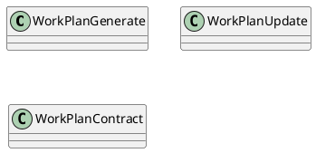
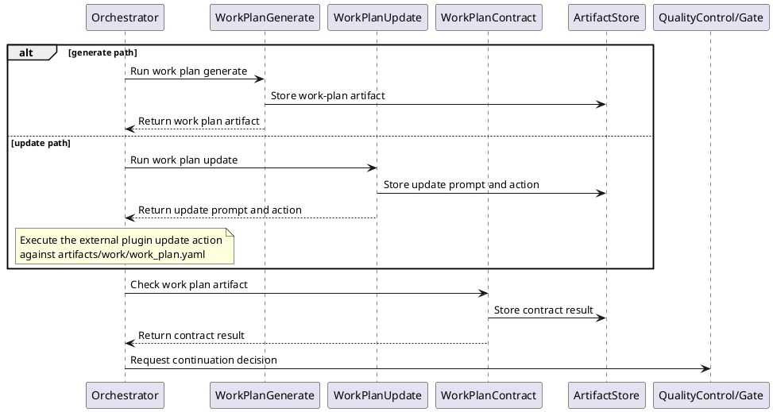
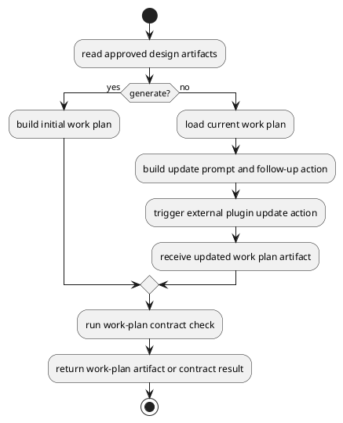
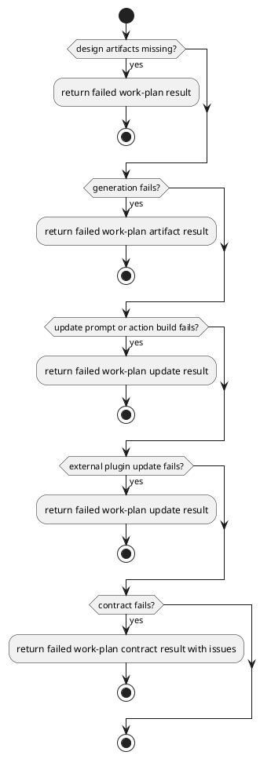

# Work Design

## 0. Document Type

- type: `functional_group_design`
- scope: define work-plan generation, early-stage work-plan update prompt/action production through one external plugin update path, and work-plan contract checking
- include: `WorkPlanGenerate`, `WorkPlanUpdate`, `WorkPlanContract`
- downstream usage: guide follow-up design for planning artifact production, plan updates, and planning validation rules

## 1. Goal

### 1.1 Purpose

Define work-plan basic units for generation, early-stage update prompt/action production through one external plugin update path, and contract checking.

### 1.2 Involved Items

This design document directly covers:

- `WorkPlanGenerate`
- `WorkPlanUpdate`
- `WorkPlanContract`

This design document collaborates with:

- `Orchestrator`
- `ArtifactStore`
- `QualityControl`

### 1.3 Core Functions

`Work Design` is the design item for work-plan generation, early-stage external-plugin-assisted update, and validation.

Its core functions are:

- Generate a work plan from approved design artifacts.
- Produce one update prompt and follow-up action for an external plugin update path for an existing work plan.
- Validate work-plan structure and planning rules.
- Expose stable work-plan outputs to work execution.
- Write each generated, updated, or contract output to `ArtifactStore` before returning.
- Remain independently callable and composable as basic execution units through the unified `Runtime` entry and current `Orchestrator` dispatch path.

`Work Design` does not own code changes, validation command execution, or runtime continuation policy.

## 2. Core Classes

### 2.1 Class Diagram



### 2.2 Core Class Responsibilities

#### 2.2.1 `WorkPlanGenerate`

Role:

- Produce initial work-plan artifacts.

Responsibilities:

- Read approved upstream design artifacts.
- Generate plan items and execution order.
- Return stable work-plan outputs.

#### 2.2.2 `WorkPlanUpdate`

Role:

- Produce one early-stage update prompt and follow-up action for one existing work plan.

Responsibilities:

- Read the current work-plan artifact together with approved upstream design artifacts.
- Preserve stable completed or unchanged work items when possible.
- Return one update prompt and follow-up action for downstream external plugin execution.

#### 2.2.3 `WorkPlanContract`

Role:

- Validate work-plan outputs.

Responsibilities:

- Check planning structure and rule compliance.
- Report plan issues.
- Stabilize downstream execution input.

## 3. Core Runtime Flow

### 3.1 Main Sequence Diagram



## 4. Detailed Design

### 4.1 Core APIs And Types

#### 4.1.1 Public API

```typescript
interface WorkPlanApi {
  generate(input: WorkPlanInput): Promise<WorkPlanArtifact>
  update(input: WorkPlanUpdateInput): Promise<WorkPlanUpdateResult>
  contract(input: WorkPlanContractInput): Promise<WorkPlanContractResult>
}
```

#### 4.1.2 Input Types

```typescript
interface WorkPlanInput {
  designArtifacts: Record<string, ArtifactContentMap>
  userInput?: string
}

interface WorkPlanUpdateInput {
  designArtifacts: Record<string, ArtifactContentMap>
  currentWorkPlanArtifact: FileArtifactMap
  userInput?: string
}

interface WorkPlanContractInput {
  workPlanArtifact: FileArtifactMap
}

interface FileArtifact {
  path: string
  content?: string
}

type FileArtifactMap = Record<string, FileArtifact>
type ArtifactContentMap = Record<string, FileArtifactMap>
```

#### 4.1.3 Runtime Types

```typescript
interface WorkPlanWorkingContext {
  designArtifacts: Record<string, ArtifactContentMap>
  userInput?: string
  currentWorkPlanArtifact?: FileArtifactMap
}

interface ExternalAction {
  tool: "external_plugin"
  operation: "update_markdown"
  targetPath: "artifacts/work/work_plan.yaml"
}
```

#### 4.1.4 Output Types

```typescript
interface WorkPlanArtifact {
  content: FileArtifactMap
}

interface WorkPlanUpdateResult {
  prompt: string
  action: ExternalAction
}

interface WorkPlanContractResult {
  passed: boolean
  issues: Array<Record<string, unknown>>
}
```

#### 4.1.5 Item-Specific Boundary Rules

- Work planning depends on approved upstream design artifacts.
- Plan updates should preserve stable completed or unchanged work items when possible.
- The current early-stage `update` unit returns a prompt plus one follow-up external plugin action instead of mutating the work-plan artifact by itself.
- Downstream execution must not start from an unaccepted work plan.
- External composition may select these basic execution units independently, but unified-entry ownership remains with `Runtime`, currently implemented through `Orchestrator`.
- Each basic unit must write its own output artifact or contract result to `ArtifactStore` before returning control.
- Template input should use the stable logical artifact name `work_plan_template`.
- Generated and updated work-plan output should use the stable logical artifact name `work_plan`.
- Contract result output should use the stable logical artifact name `work_plan_contract_result`.

### 4.2 Internal Runtime Skeleton



### 4.3 Runtime Processing Details

#### 4.3.1 WorkPlanGenerate

Input loading:

- `WorkPlanInput.designArtifacts.requirement_design.requirement_design.path`: default input path `artifacts/requirement/requirement_design.md`
- `WorkPlanInput.designArtifacts.requirement_design.requirement_design.content`: optional `requirement_design.md` markdown content
- `WorkPlanInput.designArtifacts.architecture_design.architecture_design.path`: default input path `artifacts/architecture/architecture_design.md`
- `WorkPlanInput.designArtifacts.architecture_design.architecture_design.content`: optional `architecture_design.md` markdown content
- `WorkPlanInput.designArtifacts["<target_item>_design"]["<target_item>_design"].path`: default input path for each `item_name_design.md`
- `WorkPlanInput.designArtifacts["<target_item>_design"]["<target_item>_design"].content`: optional content for each `item_name_design.md`
- `WorkPlanInput.userInput`: current `user_comment` when provided
- template source: `work_plan_template.yaml` from context or `templates/work_plan_template.yaml`

Processing:

- read upstream design content, optional template content, and optional user input into one `WorkPlanWorkingContext`
- build one work-plan-generation prompt from the working context
- call `LlmExecutor` with the generation prompt
- parse the returned model result and serialize it into one stable target format, such as `yaml`, for the `work_plan` artifact payload

Output emission:

- write the generated work-plan artifact to `ArtifactStore`
- `WorkPlanArtifact.content.work_plan.path`: default output path `artifacts/work/work_plan.yaml`
- `WorkPlanArtifact.content.work_plan.content`: optional generated `work_plan.yaml` content
- output file name: `work_plan.yaml`
- output path: `artifacts/work/work_plan.yaml`

#### 4.3.2 WorkPlanUpdate

Input loading:

- `WorkPlanUpdateInput.designArtifacts.requirement_design.requirement_design.path`: default input path `artifacts/requirement/requirement_design.md`
- `WorkPlanUpdateInput.designArtifacts.requirement_design.requirement_design.content`: optional `requirement_design.md` markdown content
- `WorkPlanUpdateInput.designArtifacts.architecture_design.architecture_design.path`: default input path `artifacts/architecture/architecture_design.md`
- `WorkPlanUpdateInput.designArtifacts.architecture_design.architecture_design.content`: optional `architecture_design.md` markdown content
- `WorkPlanUpdateInput.designArtifacts["<target_item>_design"]["<target_item>_design"].path`: default input path for each `item_name_design.md`
- `WorkPlanUpdateInput.designArtifacts["<target_item>_design"]["<target_item>_design"].content`: optional content for each `item_name_design.md`
- `WorkPlanUpdateInput.currentWorkPlanArtifact.work_plan.path`: default current artifact path `artifacts/work/work_plan.yaml`
- `WorkPlanUpdateInput.currentWorkPlanArtifact.work_plan.content`: optional current `work_plan.yaml` content
- `WorkPlanUpdateInput.userInput`: current `user_comment` when provided
- `WorkPlanUpdateResult.action.targetPath`: `artifacts/work/work_plan.yaml`

Processing:

- load the current work plan
- identify unchanged work items and changed work items
- build one update prompt that describes required plan changes
- build one `ExternalAction` for downstream external plugin execution
- expect the downstream external plugin to rewrite one stable target format result, such as `yaml`, for `work_plan`
- return one external-plugin-oriented update payload instead of mutating the artifact inside `WorkPlanUpdate`

Output emission:

- write the update prompt/action output to `ArtifactStore`
- `WorkPlanUpdateResult.prompt`: update prompt text for the external plugin
- `WorkPlanUpdateResult.action.tool`: `external_plugin`
- `WorkPlanUpdateResult.action.operation`: `update_markdown`
- `WorkPlanUpdateResult.action.targetPath`: `artifacts/work/work_plan.yaml`
- downstream plugin result: updated `WorkPlanArtifact.content.work_plan.path` and optional `.content`

#### 4.3.3 WorkPlanContract

Input loading:

- `WorkPlanContractInput.workPlanArtifact.work_plan.path`: default artifact path `artifacts/work/work_plan.yaml`
- `WorkPlanContractInput.workPlanArtifact.work_plan.content`: optional `work_plan.yaml` content
- template check source: `work_plan_template.yaml` from context or `templates/work_plan_template.yaml`

Processing:

- read work-plan content into one contract-check context
- execute one local-rule validation path when the check can be completed by planning rules and template-alignment rules
- or build one contract-check prompt and call `LlmExecutor` when the check requires model-supported validation
- parse the checked serialized structure, such as `yaml`, or model-returned findings into one normalized planning-check result
- normalize returned findings into one contract issue json list

Output emission:

- write the contract result to `ArtifactStore`
- `WorkPlanContractResult.passed`: contract pass/fail status
- `WorkPlanContractResult.issues`: contract issue json list
- output file name: `work_plan_contract_result.json`
- output path: `artifacts/work/work_plan_contract_result.json`

### 4.4 Error Handling Skeleton



### 4.5 Extension Points

- Extension point: `work-plan contract rules`
  - extend planning rule sets
  - refine issue reporting and downstream readiness rules

### 4.6 Constraints

- Work-plan generation must stay separate from work execution.
- Contract output must remain runtime-readable.
- Plan artifacts must be stored for resume and review.
- Planning rules must not be embedded in runtime control.
