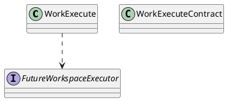
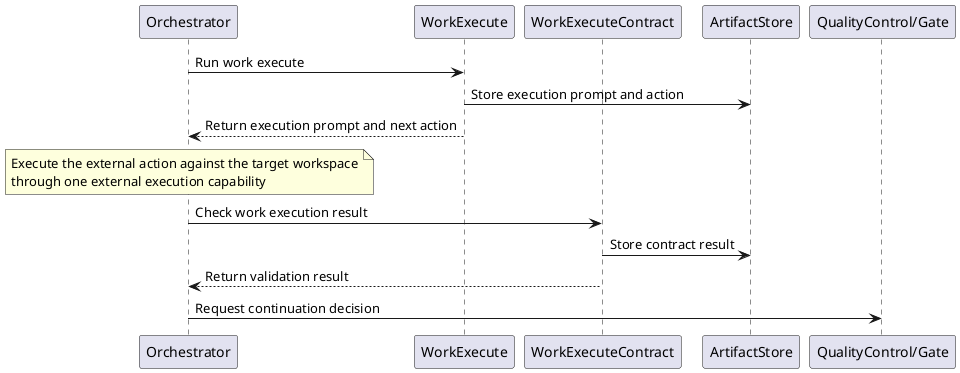
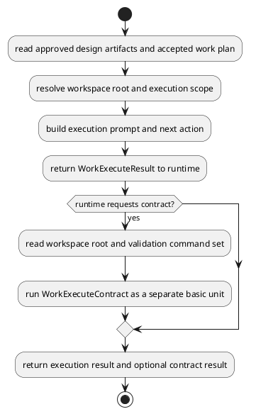
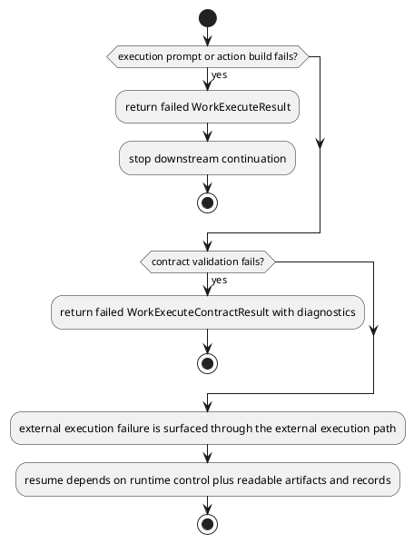

# WorkExecute Design

## 0. Document Type

- type: `functional_group_design`
- scope: define work execution prompt/action production through one external execution path and work execution validation checking
- include: `WorkExecute`, `WorkExecuteContract`
- downstream usage: guide follow-up design for workspace mutation, execution outputs, and execution-result validation

## 1. Goal

### 1.1 Purpose

Define work execution and work execution contract basic units, including external-execution prompt/action production and validation command checking.

### 1.2 Involved Items

This design document directly covers:

- `WorkExecute`
- `WorkExecuteContract`

This design document collaborates with:

- `Orchestrator`
- `ArtifactStore`
- `RecordStore`
- `QualityControl`

### 1.3 Core Functions

`WorkExecute` is the design item for workspace change execution and validation-result checking.

Its core functions are:

- Produce one execution prompt and next action for one external execution path.
- Expose visible execution targets and expected change scope to the external execution path.
- Run validation through `WorkExecuteContract`.
- Write execution output artifacts and validation results to `ArtifactStore` before returning.
- Return execution and validation results to runtime control.
- Remain independently callable and composable as basic execution units through the unified `Runtime` entry and current `Orchestrator` dispatch path.

`WorkExecute` does not own work-plan generation, gate policy, or global test-partition strategy.

## 2. Core Classes

### 2.1 Class Diagram



### 2.2 Core Class Responsibilities

#### 2.2.1 `WorkExecute`

Role:

- Produce one execution prompt and next action from approved execution inputs.

Responsibilities:

- Read work plan and design artifacts.
- Build one external-execution prompt.
- Return one next action and visible execution targets.

#### 2.2.2 `WorkExecuteContract`

Role:

- Validate execution outputs.

Responsibilities:

- Run configured validation commands.
- Report validation pass/fail and diagnostics.
- Support downstream review and continuation decisions.

## 3. Core Runtime Flow

### 3.1 Main Sequence Diagram



## 4. Detailed Design

### 4.1 Core APIs And Types

#### 4.1.1 Public API

```typescript
interface WorkExecuteApi {
  execute(input: WorkExecuteInput): Promise<WorkExecuteResult>
  contract(input: WorkExecuteContractInput): Promise<WorkExecuteContractResult>
}
```

#### 4.1.2 Input Types

```typescript
interface WorkExecuteInput {
  designArtifacts: Record<string, ArtifactContentMap>
  workPlanArtifact: FileArtifactMap
  workspaceRoot: string
  userInput?: string
}

interface WorkExecuteContractInput {
  workspaceRoot: string
  validationCommands: string[]
}

interface FileArtifact {
  path: string
  content?: string
}

type FileArtifactMap = Record<string, FileArtifact>
type ArtifactContentMap = Record<string, FileArtifactMap>
```

#### 4.1.3 Output Types

```typescript
interface ExternalAction {
  tool: "external_execution"
  operation: "apply_workspace_change"
  targetPath: string
}

interface WorkExecuteResult {
  prompt: string
  action: ExternalAction
}

interface WorkExecuteContractResult {
  passed: boolean
  diagnostics: string[]
}
```

#### 4.1.4 Item-Specific Boundary Rules

- Execution outputs must be visible as artifacts before review.
- Validation commands belong to contract execution, not generation.
- Execution and validation are separate basic units even when run back-to-back.
- `WorkExecute` returns one prompt plus one follow-up external execution action instead of mutating the workspace by itself.
- External composition may select these basic execution units independently, but unified-entry ownership remains with `Runtime`, currently implemented through `Orchestrator`.
- Each basic unit must write its own execution output or contract result to `ArtifactStore` before returning control.
- Input artifact paths should keep the logical artifact names `requirement_design`, `architecture_design`, `<target_item>_design`, and `work_plan`.
- The follow-up execution action should keep one stable workspace target path.
- Contract result paths should use the logical artifact name `work_execute_contract_result` and the file name `work_execute_contract_result.json`.

### 4.2 Internal Runtime Skeleton



### 4.3 Runtime Processing Details

#### 4.3.1 WorkExecute

Input loading:

- `WorkExecuteInput.designArtifacts.requirement_design.requirement_design.path`: default input path `artifacts/requirement/requirement_design.md`
- `WorkExecuteInput.designArtifacts.requirement_design.requirement_design.content`: optional `requirement_design.md` markdown content
- `WorkExecuteInput.designArtifacts.architecture_design.architecture_design.path`: default input path `artifacts/architecture/architecture_design.md`
- `WorkExecuteInput.designArtifacts.architecture_design.architecture_design.content`: optional `architecture_design.md` markdown content
- `WorkExecuteInput.designArtifacts["<target_item>_design"]["<target_item>_design"].path`: default input path for each `item_name_design.md`
- `WorkExecuteInput.designArtifacts["<target_item>_design"]["<target_item>_design"].content`: optional content for each `item_name_design.md`
- `WorkExecuteInput.workPlanArtifact.work_plan.path`: default input path `artifacts/work/work_plan.yaml`
- `WorkExecuteInput.workPlanArtifact.work_plan.content`: optional `work_plan.yaml` content
- `WorkExecuteInput.workspaceRoot`: current project workspace root
- `WorkExecuteInput.userInput`: current `user_comment` when provided by the runtime request

Processing:

- read design content, work-plan content, workspace target, and optional user input into one execution context
- build one execution prompt from the execution context
- build one `ExternalAction` for downstream external execution
- leave one internal future execution interface boundary without applying workspace changes inside `WorkExecute`

Output emission:

- write the execution prompt/action output to `ArtifactStore`
- `WorkExecuteResult.prompt`: execution prompt text for the external execution capability
- `WorkExecuteResult.action.tool`: `external_execution`
- `WorkExecuteResult.action.operation`: `apply_workspace_change`
- `WorkExecuteResult.action.targetPath`: current workspace target path, usually `WorkExecuteInput.workspaceRoot`

#### 4.3.2 WorkExecuteContract

Input loading:

- `WorkExecuteContractInput.workspaceRoot`: current `work_dir`
- `WorkExecuteContractInput.validationCommands`: current fixed validation script set
- `user_comment`: current validation comment when provided by the runtime request

Processing:

- execute validation commands against the current workspace state
- collect diagnostics and pass/fail status

Output emission:

- write the contract result to `ArtifactStore`
- `WorkExecuteContractResult.passed`: validation pass/fail status
- `WorkExecuteContractResult.diagnostics`: validation diagnostics list
- output file name: `work_execute_contract_result.json`
- output path: `artifacts/work/work_execute_contract_result.json`

### 4.4 Error Handling Skeleton



### 4.5 Extension Points

- Extension point: `external execution action rules`
  - refine external execution action shape
  - support future internal executor implementation through the reserved interface boundary

- Extension point: `validation command execution rules`
  - extend validation command-set handling
  - refine artifact emission for execution outputs and diagnostics

### 4.6 Constraints

- External execution must stay explicit.
- Validation command details belong to follow-up design, not architecture.
- Runtime control must decide continuation after validation.
- Execution records must remain persistable for audit and resume.
