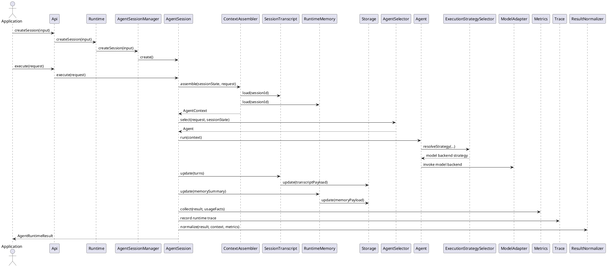
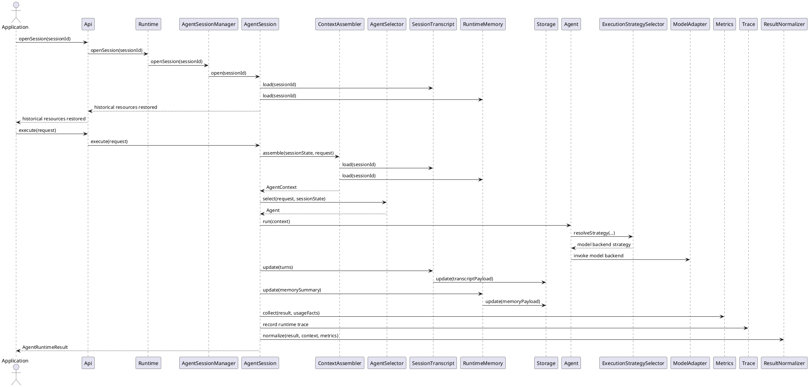
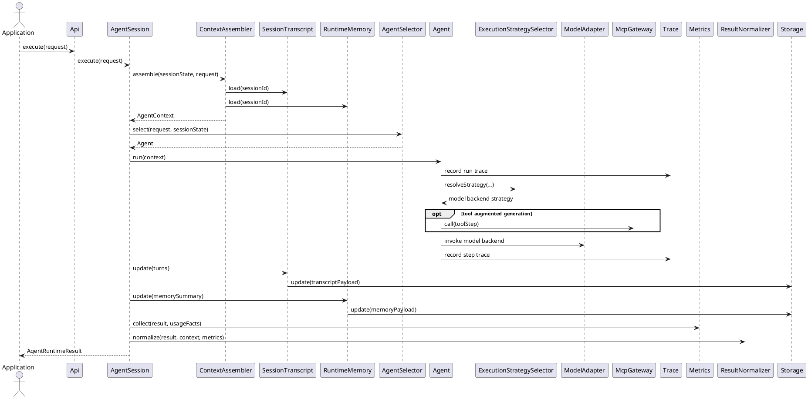
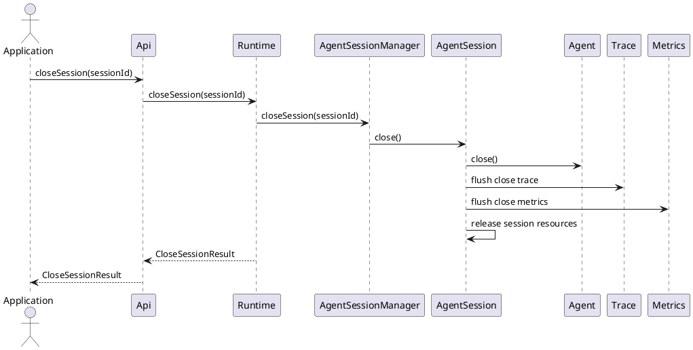
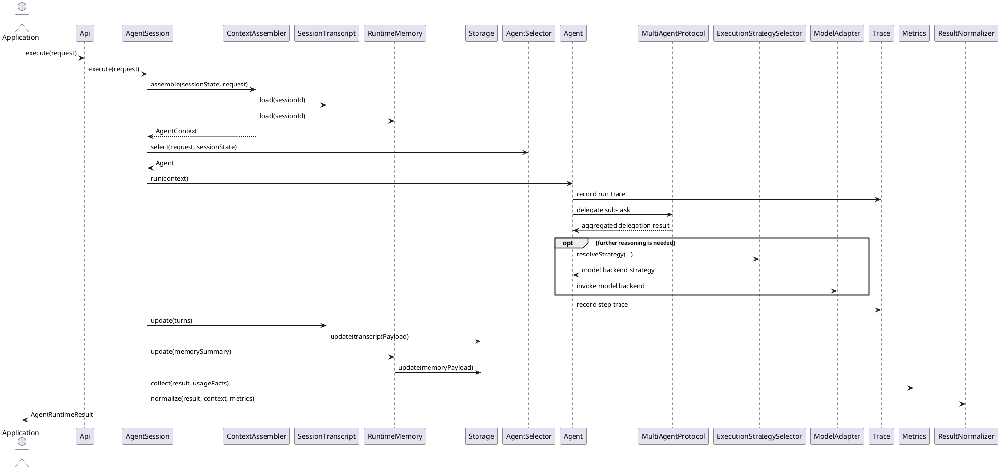

# Technical Architecture

## 1. Purpose

Define the overall technical architecture of the `AgentRuntime` SDK.

- Team members: provide one shared high-level baseline for runtime boundaries and collaboration flow.
- Senior engineers: review architecture direction, dependency boundaries, and extension points.
- Junior engineers: understand the system structure before reading the detailed runtime design document.

## 2. Scope

### 2.1 In Scope

- Overall runtime interaction and control flow for session-based agent execution.
- Major capability layers and their collaboration boundaries.
- Dependency direction between SDK entry, runtime control, context governance, capability and tooling, model integration, observability, and data parts.
- Key architecture constraints around result stability, traceability, provider abstraction, and evolution.

### 2.2 Out of Scope

- Detailed module internals and implementation logic inside agent-internal execution logic or data modules.
- Detailed API contracts, prompt wording, validation rules, and trace event fields.
- Storage schema details and file-level persistence formats.
- CLI interaction detail and terminal behavior detail.
- Operational runbooks, deployment setup, and provider-specific environment procedures.

Cross-module interaction contracts and detailed runtime boundaries are covered in follow-up design documents rather than in this architecture document.

---

## 3. Design Drivers

- Session-based runtime continuity: the SDK must expose stable session lifecycle boundaries instead of forcing callers to manage raw runtime state themselves.
- Controlled multi-step execution: the runtime must support one reusable bounded `route -> plan -> execute -> observe -> repair or stop` loop rather than one-shot generation only.
- Stable external contract: callers need one stable `RuntimeApi` / `ISession` boundary even when internal prompting, provider handling, tool policy, or trace logic evolves.
- Explicit runtime control: request routing, internal step decisions, loop stop conditions, and repair policy must remain runtime-owned control decisions rather than caller-owned prompt tricks.
- Capability governance: tool invocation, approval policy, execution environment, and sandbox boundaries must remain explicit architecture concerns rather than hidden inside agent-internal execution details.
- Provider abstraction: mock and real LLM providers must remain replaceable behind one shared model integration boundary.
- Context governance: transcript, runtime memory, retrieval context, and context budgeting or compression must evolve without redefining the runtime API.
- Observability as a first-class concern: trace, diagnostics, usage, and metrics must be available as runtime-level architecture concerns rather than ad hoc debug output.
- Extensibility: richer tool systems, streaming, cancellation, checkpoint resume, background execution, and multi-agent orchestration should be accommodated without redefining the current runtime boundary.

---

## 4. Architecture Design

### 4.1 Architecture Style

The system adopts a layered modular agent SDK architecture.

### 4.2 Layers or Partitions

- `Application Layer`: owns terminal-facing runtime entry adapters and other external-facing application modules built on top of the runtime boundary.
- `Interface Layer`: defines stable `RuntimeApi` and `ISession` contracts exposed to external callers.
- `Runtime Controller Layer`: owns runtime bootstrap, SDK-level runtime scheduling, cross-layer runtime scheduling, concrete session objects, session lifecycle entry, session-bound execution entry, caller-facing result shaping, and checkpoint-oriented runtime state coordination.
- `Agent Orchestration Layer`: owns request-level agent selection, single-agent orchestration, and multi-agent protocol orchestration.
- `Context Governance Layer`: owns transcript logic, runtime memory logic, retrieval context, context assembly, and context budgeting or compression policy.
- `Capability and Tooling Layer`: owns MCP gateway, tool registry, built-in tool handlers, approval policy, and execution-environment boundaries.
- `Model Integration Layer`: owns provider strategy selection, model backend interaction, model-request adaptation, and streaming adaptation.
- `Observability Layer`: owns trace, diagnostics, usage, and metrics logic.
- `Data Layer`: owns the shared runtime data persistence boundary through one common storage interface.

### 4.3 Allowed Dependencies

Rules:
- upper layers may depend on lower layers
- same-layer modules may depend on each other
- lower layers must not depend on upper layers

ALLOW:
- `Application Layer` -> `Interface Layer`
- `Interface Layer` -> `Runtime Controller Layer`
- `Runtime Controller Layer` -> `Agent Orchestration Layer`
- `Runtime Controller Layer` -> `Context Governance Layer`
- `Runtime Controller Layer` -> `Observability Layer`
- `Runtime Controller Layer` -> `Data Layer`
- `Agent Orchestration Layer` -> `Capability and Tooling Layer`
- `Agent Orchestration Layer` -> `Model Integration Layer`
- `Agent Orchestration Layer` -> `Observability Layer`
- `Context Governance Layer` -> `Data Layer`
- `Context Governance Layer` -> external knowledge sources
- `Capability and Tooling Layer` -> external MCP tool handlers
- `Capability and Tooling Layer` -> sandbox or execution environments
- `Model Integration Layer` -> external model providers
- `Observability Layer` -> `Data Layer`
- `Data Layer` -> local runtime storage or persistence backends

### 4.4 High-level Diagram

```text
+----------------------------+
|        Application         |
| terminal entry / external  |
| application integrations   |
+----------------------------+
             |
             v
+----------------------------+
|         Interface          |
| Api                        |
| RuntimeApi / ISession      |
+----------------------------+
             |
             v
+----------------------------+
|    Runtime Controller      |
| Runtime                    |
| AgentSession               |
| runtime scheduling /       |
| session execution /        |
| result shaping             |
+----------------------------+
             |
             v
+----------------------------+
|    Agent Orchestration     |
| AgentSelector / ChatAgent  |
| ReActAgent / PEOAgent /    |
|   MultiAgentProtocol       |
+----------------------------+
      |            |            \
      v            v             v
+-------------+ +-------------+ +------------------+
|   Context   | | Capability  | |      Model       |
| Governance  | | and Tooling | |   Integration    |
+-------------+ +-------------+ +------------------+
       \                            /
        \                          /
         v                        v
     +-------------------------------+
     |         Observability         |
     |     trace / metrics / usage   |
     +-------------------------------+
              |             \
              v              v
     +--------------------------------+
     |            Data Layer          |
     |  Storage / file / remote       |
     +--------------------------------+
```

### 4.5 Runtime Topology

- `SDK Process`: hosts the primary runtime boundary, including session lifecycle, runtime control, context assembly, tool dispatch coordination, result normalization, and trace emission in one process.
- `Provider Boundary`: real or mock model backends sit behind the shared model integration boundary and may be remote from the SDK process.
- `Tool Boundary`: MCP tool handlers are invoked through the capability and tooling boundary and remain external capability providers from the runtime perspective.
- `Execution Environment Boundary`: the baseline tool execution path is local-process oriented; sandboxed or remote execution environments remain extension boundaries in the overall architecture.
- `Runtime Storage`: transcript, runtime memory, checkpoints, trace, and metrics data are persisted through the shared `Storage` boundary under `.agent_runtime` in the caller-selected workdir for the baseline file-backed implementation.

### 4.6 Technology Choices

- `Application Layer`: `TypeScript` on `Node.js` for terminal-facing runtime adapters and other external-facing application modules.
- `Interface Layer`: `TypeScript` on `Node.js` for stable `RuntimeApi` and `ISession` contracts exposed through the SDK.
- `Runtime Controller Layer`: `TypeScript` on `Node.js` for runtime bootstrap, SDK-level runtime scheduling, cross-layer runtime scheduling, concrete session objects, session lifecycle entry, session-bound execution entry, caller-facing result shaping, and checkpoint-oriented runtime state coordination.
- `Agent Orchestration Layer`: `TypeScript` on `Node.js` for agent selection, chat orchestration, ReAct orchestration, PEO orchestration, and multi-agent protocol orchestration.
- `Context Governance Layer`: `TypeScript` for transcript logic, runtime memory logic, context assembly, retrieval loading, and context budgeting or compression inputs.
- `Capability and Tooling Layer`: `TypeScript` for MCP integration, tool registry, built-in tool handlers, and approval or execution-environment adapters.
- `Model Integration Layer`: `TypeScript` for provider abstraction, model-request adaptation, backend interaction, and streaming adapters.
- `Observability Layer`: `TypeScript` for trace logic, metrics logic, and runtime telemetry shaping.
- `Data Layer`: `TypeScript` for the shared runtime storage interface, with file-backed and remote-backed implementations.

---

## 5. System Interactions

### 5.1 Primary Interaction Path

```text
[SDK Caller]
   |
   v
[Interface Layer]
   |
   v
[Runtime Controller Layer]
   |
   +--> create/open session
   +--> execute bound session
   +--> normalize result
   |
   v
[Context Governance Layer]
   |
   +--> assemble context
   +--> transcript and memory logic
   |
   v
[Agent Orchestration Layer]
   |
   +--> select agent
   +--> ChatAgent
   +--> ReActAgent
   +--> PEOAgent
   +--> MultiAgentProtocol
   |
   +--> tool calls
   +--> model calls
   |
   +-------------> [Capability and Tooling Layer]
   |                      |
   |                      v
   +-------------> [Model Integration Layer]
   |                      |
   v                      v
[Observability Layer]  [Data Layer]
   |                      ^
   +--> metrics and trace  |
   +-----------------------+
   |
   v
[AgentRuntimeResult]
```

1. The caller creates or opens one runtime session through the stable SDK boundary.
2. The caller submits one execution request through the bound session handle.
3. The bound session object enters the runtime controller path, assembles execution context through the context-governance boundary, and selects the appropriate orchestration agent.
4. The selected agent performs model calls through the model-integration boundary and tool calls through the capability-and-tooling boundary.
5. Runtime observability updates flow through the observability boundary, and shared persisted data flows through the data boundary.
6. The runtime returns one stable success or failure result with diagnostics while keeping provider, tool, observability, and storage details behind internal boundaries.

`RuntimeApi` uses one reusable control shape: expose stable contracts through the interface layer, enter the runtime controller layer through `Runtime`, create or open one concrete session object, assemble context through context governance, let the bound session select and run the appropriate orchestration agent, route tool and model interaction through their dedicated boundaries, coordinate observability and data updates, and return one normalized result.

### 5.2 Core Modules

`RuntimeApi` and `ISession` are stable caller-facing contracts defined by the `Interface Layer`. The runtime modules below implement those contracts and the runtime-owned execution behavior behind them.

- **`Application Layer`**
  - `TerminalSessionDemo`
    - responsibility: provide one interactive terminal entry on top of the runtime boundary for manual runtime usage.
    - inputs: CLI arguments and interactive user input.
    - outputs: visible runtime output and session-close summary.
    - ownership boundary: owns terminal interaction only and does not redefine agent orchestration.

- **`Interface Layer`**
  - `Api`
    - responsibility: define the stable caller-facing runtime API surface, including `RuntimeApi`, `ISession`, and other shared interface contracts.
    - inputs: caller-facing API requirements and cross-layer contract constraints.
    - outputs: stable interface contracts exposed to external callers.
    - ownership boundary: owns interface definitions only and does not own runtime execution behavior.

- **`Runtime Controller Layer`**
  - `Runtime`
    - responsibility: initialize runtime dependencies, act as the SDK-level runtime scheduling entry, coordinate cross-layer runtime scheduling, and expose caller-facing session lifecycle entry operations.
    - inputs: SDK caller requests, SDK configuration input, and runtime dependency sources.
    - outputs: initialized runtime boundary, session handles, and close results.
    - ownership boundary: owns runtime bootstrap, SDK-level runtime scheduling, and caller-facing lifecycle entry behavior only and does not own session-bound execution internals, agent execution internals, or storage implementation details.
  - `AgentSession`
    - responsibility: act as the concrete session object, own in-memory session state during runtime use, and coordinate one session-bound execution cycle.
    - inputs: per-session execution requests, in-memory session state, and shared runtime collaborators.
    - outputs: stable runtime results and session-bound reads.
    - ownership boundary: owns session-bound runtime behavior but does not own storage implementation, provider internals, or tool implementation internals.
  - `AgentSessionManager`
    - responsibility: provide session lifecycle coordination for runtime-owned session objects without taking ownership of session-bound execution behavior.
    - inputs: session lifecycle requests.
    - outputs: session creation, session opening, and close results.
  - `ResultNormalizer`
    - responsibility: convert internal loop results into one stable caller-facing runtime result shape at the runtime controller boundary.
    - inputs: loop output, diagnostics, and runtime metadata.
    - outputs: stable `AgentRuntimeResult`.

- **`Agent Orchestration Layer`**
  - `AgentSelector`
    - responsibility: select the appropriate runtime agent from the agent orchestration family for the current request.
    - inputs: runtime request, session state, and runtime policy.
    - outputs: agent-selection decision.
    - ownership boundary: owns request-level agent selection only and does not own prompt shaping, model calls, or persistence internals.
  - `ChatAgent`
    - responsibility: run direct chat-oriented orchestration for requests that can be completed without ReAct-style or plan-execute-observe loops.
    - inputs: assembled `AgentContext`.
    - outputs: chat-oriented runtime result and diagnostics.
  - `ReActAgent`
    - responsibility: run ReAct-style orchestration for requests that need iterative reasoning, action, and observation.
    - inputs: assembled `AgentContext`.
    - outputs: ReAct-oriented runtime result and diagnostics.
  - `PEOAgent`
    - responsibility: run plan-execute-observe orchestration for requests that need explicit planning and bounded execution stages.
    - inputs: assembled `AgentContext`.
    - outputs: plan-execute-observe runtime result and diagnostics.
  - `MultiAgentProtocol`
    - responsibility: define agent-to-agent task delegation, handoff, and result aggregation when one agent needs another agent to complete a sub-task.
    - inputs: delegated sub-goals, agent capability metadata, and parent-run coordination state.
    - outputs: coordinated agent-task execution and aggregated delegation results.
    - ownership boundary: owns agent-to-agent collaboration protocol and does not replace single-agent orchestration.

- **`Context Governance Layer`**
  - `ContextAssembler`
    - responsibility: assemble transcript, runtime memory, retrieval context, and request payload into one execution-ready context.
    - inputs: session state, runtime request, transcript context, runtime memory context, and retrieval provider.
    - outputs: `AgentContext`.
  - `SessionTranscript`
    - responsibility: manage session-owned transcript loading and write-back logic without owning physical storage implementation.
    - inputs: session identity and normalized turns.
    - outputs: ordered transcript context.
  - `RuntimeMemory`
    - responsibility: manage runtime-owned short-term summary memory logic for follow-up execution and memory optimization paths without owning physical storage implementation.
    - inputs: session identity and runtime-memory summary items.
    - outputs: bounded runtime memory context.
  - `RetrievalProvider`
    - responsibility: provide optional retrieval-backed context to the runtime as one knowledge-source boundary.
    - inputs: runtime request and retrieval query context.
    - outputs: retrieval context fragments.

- **`Capability and Tooling Layer`**
  - `McpGateway`
    - responsibility: dispatch runtime tool calls to MCP handlers through one gateway boundary.
    - inputs: normalized tool steps.
    - outputs: structured tool results.
  - `McpToolRegistry`
    - responsibility: register and resolve built-in or external tool handlers without leaking handler selection into runtime control.
    - inputs: tool-handler registrations and tool names.
    - outputs: resolved tool handlers and tool-name listings.
  - `BuiltInToolHandlers`
    - responsibility: expose built-in runtime tool capabilities behind the shared tool contract without pushing concrete tool names into the architecture boundary.
    - inputs: normalized built-in tool requests.
    - outputs: structured built-in tool results.

- **`Model Integration Layer`**
  - `ExecutionStrategySelector`
    - responsibility: choose the current model backend strategy without exposing provider-specific handling to callers.
    - inputs: runtime dependencies and mode selection.
    - outputs: shared execution strategy for runtime agents.
  - `ModelAdapter`
    - responsibility: provide one normalized model-provider boundary for runtime agents, including request adaptation, backend invocation, and response normalization, without taking ownership of agent orchestration.
    - inputs: agent-generated model request intents, runtime context slices, response-shape requirements, and execution strategy.
    - outputs: normalized model responses.
- **`Observability Layer`**
  - `Metrics`
    - responsibility: provide the unified runtime metrics boundary for run-scoped metrics summaries and usage aggregation without mixing analytics data into transcript state.
    - inputs: normalized runtime results, request metadata, provider usage facts, tool execution facts, and run scope.
    - outputs: metrics summaries and usage summaries.
  - `Trace`
    - responsibility: provide the unified runtime trace boundary for trace event coordination, normalization, persistence, and flush behavior.
    - inputs: runtime trace events and flush requests.
    - outputs: persisted trace records and flush results.

- **`Data Layer`**
  - `Storage`
    - responsibility: provide one shared runtime storage interface for transcript, memory, checkpoint, trace, and metrics persistence without exposing storage backend details upward.
    - inputs: storage keys, load requests, save requests, and runtime data payloads.
    - outputs: loaded runtime data payloads and save results.
    - ownership boundary: owns only generic runtime data persistence and may be implemented by file-backed, network-backed, or database-backed storage adapters.

### 5.2.1 Extension Boundaries

- `RunCheckpoint`
  - responsibility: represent run checkpoint logic for retry, resume, or background execution as a runtime-controller-owned recovery boundary.
  - inputs: run snapshots and recovery metadata.
  - outputs: checkpoint state requests for later runtime recovery.

- `ContextBudgetPolicy`
  - responsibility: represent transcript, retrieval, tool-result, and memory budgeting or compression policy without changing the runtime boundary.
  - inputs: assembled context candidates and runtime limits.
  - outputs: bounded context slices for downstream orchestration and execution use.

- `RuntimePermissionPolicy`
  - responsibility: represent approval, path policy, command policy, and capability allowlist checks before tool execution.
  - inputs: runtime request, tool request, session state, and environment policy.
  - outputs: allow, deny, or approval-required decisions.

- `ExecutionEnvironmentAdapter`
  - responsibility: represent local, sandboxed, or remote execution environments for tools without redefining the tool contract.
  - inputs: normalized capability requests and environment policy.
  - outputs: environment-bound execution results.

- `StreamingEventAdapter`
  - responsibility: represent provider-stream adaptation without leaking provider-specific streaming shapes into runtime control.
  - inputs: provider stream events and runtime execution state.
  - outputs: runtime-normalized stream events.

### 5.3 Interaction Model

This section describes high-level cross-module interaction.

#### 5.3.1 Start a New Session and Ask the First Question

- user scenario: an SDK caller or interactive entry wants to start a new conversation or task from an empty runtime state.
  - InteractionGoal: create one stable session boundary and execute the first request without exposing runtime internals.



#### 5.3.2 Continue a Session with Follow-up Questions or Tasks

- user scenario: a caller reuses the same session for follow-up questions, clarifications, or incremental task progress.
  - InteractionGoal: preserve continuity through transcript and runtime memory while keeping the interaction contract unchanged.



#### 5.3.3 Execute a Tool-backed Task

- user scenario: a caller submits a request that may require tool use, multi-step reasoning, and repair before the final result can be returned.
  - InteractionGoal: let the runtime decide whether the current request stays direct or becomes tool-augmented without leaking agent-internal orchestration, provider, or tool-dispatch details.



#### 5.3.4 Close the Session

- user scenario: a caller finishes work on one session and needs one clean runtime-owned close path.
  - InteractionGoal: expose one stable close behavior without leaking runtime-owned cleanup details.



#### 5.3.5 Delegate Work Across Multiple Agents

- user scenario: a request needs one agent to delegate sub-tasks to other agents and collect the results through a stable collaboration protocol.
  - InteractionGoal: support agent-to-agent task calling without forcing single-agent orchestration modules to absorb delegation logic.



### 5.4 Key Considerations

- Session continuity and runtime-owned state are first-class architecture boundaries rather than optional caller-side helpers.
- The runtime loop must remain bounded and diagnosable; uncontrolled autonomous execution is out of scope for the current architecture.
- Request-level agent selection, single-agent orchestration, and multi-agent protocol orchestration belong to the agent-orchestration side rather than to provider or storage boundaries.
- `AgentSession` is the real session object and must remain the owner of session-bound execution behavior rather than degrading into a forwarding handle.
- Transcript, runtime memory, retrieval, and context budgeting or compression belong to the context-governance side rather than to the model-integration or storage layers.
- Tool gateway, tool registry, approval policy, and execution environments belong to the capability-and-tooling side rather than to agent-orchestration or provider logic.
- Provider strategy selection, normalized model adaptation, and streaming adaptation belong to model integration rather than to session, orchestration, or persistence boundaries.
- Provider selection, capability execution, and observability are integrated into the runtime backbone but remain behind stable internal abstractions.
- Transcript, runtime memory, checkpoints, metrics, and trace must remain logically separated even when they share one common storage boundary.

---

## 6. Non-Functional Considerations

### 6.1 High Availability

- Why it matters:
  - SDK callers need predictable runtime behavior even when provider calls or tool execution fail.
- Architectural support:
  - The runtime normalizes failures into stable result contracts rather than leaking raw internal failure paths.
  - Runtime control, context governance, capability and tooling, model integration, and observability remain separated so one boundary can degrade without collapsing the entire caller-facing API.

### 6.2 High Scalability

- Why it matters:
  - The runtime is expected to grow from the current single-session SDK usage toward richer retrieval, memory optimization, context compression, and multi-agent coordination scenarios.
- Architectural support:
  - Provider execution and MCP tool execution sit behind replaceable boundaries and can evolve independently.
  - Context governance remains separated from runtime control so retrieval and memory scaling does not force a new SDK entry contract.

### 6.3 High Performance

- Why it matters:
  - Runtime latency directly affects interactive SDK usage, especially for multi-step loops and real-provider execution.
- Architectural support:
  - Context assembly, tool dispatch, model integration, and observability are separated so buffering, caching, and trace-write optimizations can evolve within their own boundaries.
  - The runtime can choose direct generation or tool-augmented generation per step instead of forcing every request through the heaviest execution path.

### 6.4 Operational Safety

- Why it matters:
  - Agent runtimes need controlled capability execution rather than unrestricted local side effects.
- Architectural support:
  - Capability governance is kept as an explicit architecture concern so approval, allowlist, and sandbox policies can evolve without redefining the SDK contract.
  - Validation, trace, and result normalization provide bounded failure paths instead of leaking arbitrary provider or tool behavior to callers.

---

## 7. Design Documents

### 7.1 Design Document Categories

Different design documents have different focus. All of them must still follow the module boundaries, dependency rules, and shared architectural constraints defined in this architecture.

- Runtime functional-group design
- Runtime test and verification design
- Cross-module protocol or extension design

### 7.2 Design Document Breakdown

- [application_design](./breakdown_docs/application_design.md)
  - type: `functional_group_design`
  - scope: define the application-layer boundary, application-layer module responsibilities, application-layer interaction, and application-layer dependency limits
  - include: `TerminalSessionDemo`
- [sdk_interface_design](./breakdown_docs/sdk_interface_design.md)
  - type: `functional_group_design`
  - scope: define the interface-layer boundary, interface contracts, interface-level interaction, and interface-layer dependency limits
  - include: `Api`, `RuntimeApi`, and `ISession`
- [runtime_control_design](./breakdown_docs/runtime_control_design.md)
  - type: `functional_group_design`
  - scope: define the runtime-controller-layer boundary, runtime-controller module responsibilities, intra-layer interaction, and dependency limits
  - extension note: cover runtime-controller extension boundaries when they are expanded by design
  - include: `Runtime`, `AgentSession`, `AgentSessionManager`, `ResultNormalizer`, and `RunCheckpoint`
- [agent_orchestration_design](./breakdown_docs/agent_orchestration_design.md)
  - type: `functional_group_design`
  - scope: define the agent-orchestration-layer boundary, agent module responsibilities, intra-layer interaction, and dependency limits
  - extension note: cover orchestration extension boundaries when they are expanded by design
  - include: `AgentSelector`, `ChatAgent`, `ReActAgent`, `PEOAgent`, and `MultiAgentProtocol`
- [context_governance_design](./breakdown_docs/context_governance_design.md)
  - type: `functional_group_design`
  - scope: define the context-governance-layer boundary, context module responsibilities, intra-layer interaction, and dependency limits
  - extension note: cover context-governance extension boundaries when they are expanded by design
  - include: `ContextAssembler`, `SessionTranscript`, `RuntimeMemory`, `RetrievalProvider`, and `ContextBudgetPolicy`
- [capability_and_tooling_design](./breakdown_docs/capability_and_tooling_design.md)
  - type: `functional_group_design`
  - scope: define the capability-and-tooling-layer boundary, capability module responsibilities, intra-layer interaction, and dependency limits
  - extension note: cover capability-and-tooling extension boundaries when they are expanded by design
  - include: `McpGateway`, `McpToolRegistry`, `BuiltInToolHandlers`, `RuntimePermissionPolicy`, and `ExecutionEnvironmentAdapter`
- [model_integration_design](./breakdown_docs/model_integration_design.md)
  - type: `functional_group_design`
  - scope: define the model-integration-layer boundary, model module responsibilities, intra-layer interaction, and dependency limits
  - extension note: cover model-integration extension boundaries when they are expanded by design
  - include: `ExecutionStrategySelector`, `ModelAdapter`, and `StreamingEventAdapter`
- [observability_design](./breakdown_docs/observability_design.md)
  - type: `functional_group_design`
  - scope: define the observability-layer boundary, observability module responsibilities, intra-layer interaction, and dependency limits
  - include: `Metrics` and `Trace`
- [data_design](./breakdown_docs/data_design.md)
  - type: `functional_group_design`
  - scope: define the data-layer boundary, data module responsibilities, persistence interaction, and dependency limits
  - include: `Storage`

---

## 8. Phased Implementation

### 8.1 Phase P0 Current Mainline

- Stable `RuntimeApi` / `ISession` SDK boundary.
- Session-based, single-agent, bounded multi-step loop.
- Transcript, runtime memory, and retrieval-backed context assembly.
- Mock and real provider strategy selection.
- MCP gateway with minimal built-in file capabilities.
- File-backed storage for session state, transcript, runtime memory, and trace, plus in-result basic metrics output.

### 8.2 Phase P1 Single-Agent Production Hardening

- Make request routing explicit and make internal step decisions and repair policy boundaries clearer instead of keeping them implicit inside agent-internal orchestration behavior.
- Add capability governance modules for tool allowlist, approval policy, path policy, and execution policy.
- Expand built-in capabilities beyond file operations while keeping the same gateway contract.
- Add streaming, cancellation, timeout, and richer execution-observation policy without redefining the external runtime result contract.
- Add run checkpoint persistence and resume-ready state boundaries.
- Strengthen usage and metrics collection for provider and tool execution.

### 8.3 Phase P2 Runtime Platform Expansion

- Add context budgeting, transcript compression, memory optimization, and richer retrieval coordination.
- Add sandboxed or remote execution-environment adapters behind the capability boundary.
- Add background execution, durable run checkpoints, and long-running coordination.
- Add multi-agent coordination above the current single-loop runtime-control model.
- Add richer analytics, governance surfaces, and automation-entry integrations.

---

## 9. Open Issues

- Request-level routing and internal step decisions are still partly implicit in the current implementation and need clearer implementation boundaries later.
- The current code still centralizes too much session-bound execution logic outside `AgentSession`; implementation must be aligned with this architecture.
- Capability governance is defined at architecture level but does not yet have implementation-ready approval, sandbox, or execution-policy modules.
- Retrieval, memory optimization, context budgeting or compression, checkpoint resume, and multi-agent orchestration remain architecture-defined capabilities that still need implementation-ready detail.
- The current architecture keeps file-backed runtime storage in one SDK process; separation of storage, background execution, or remote execution environments is still open.

---
