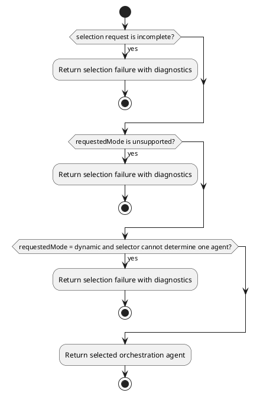
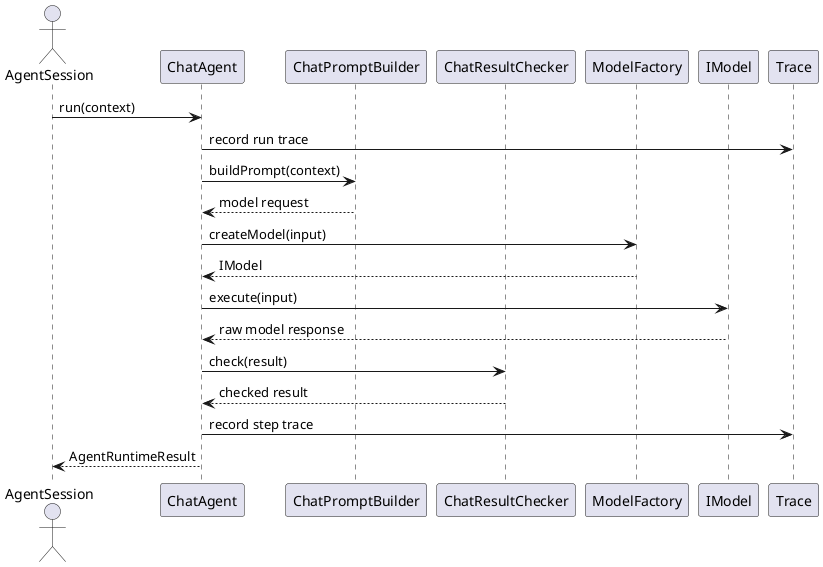
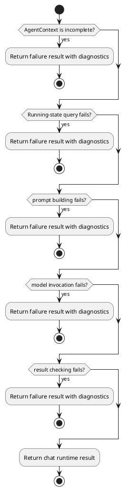
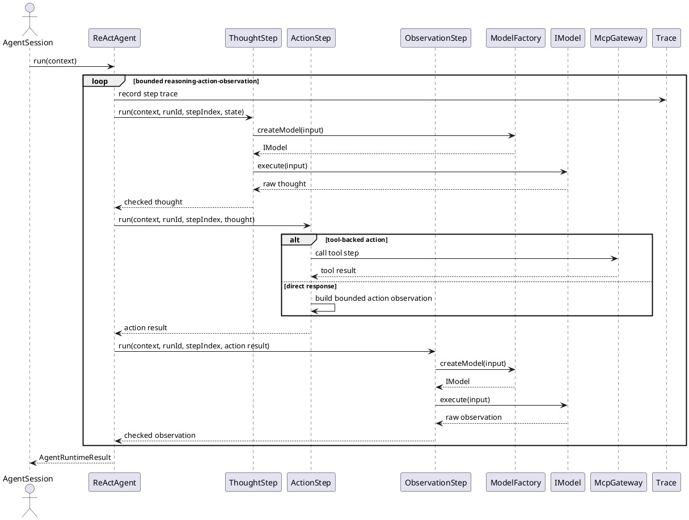
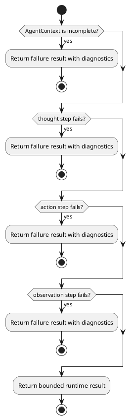
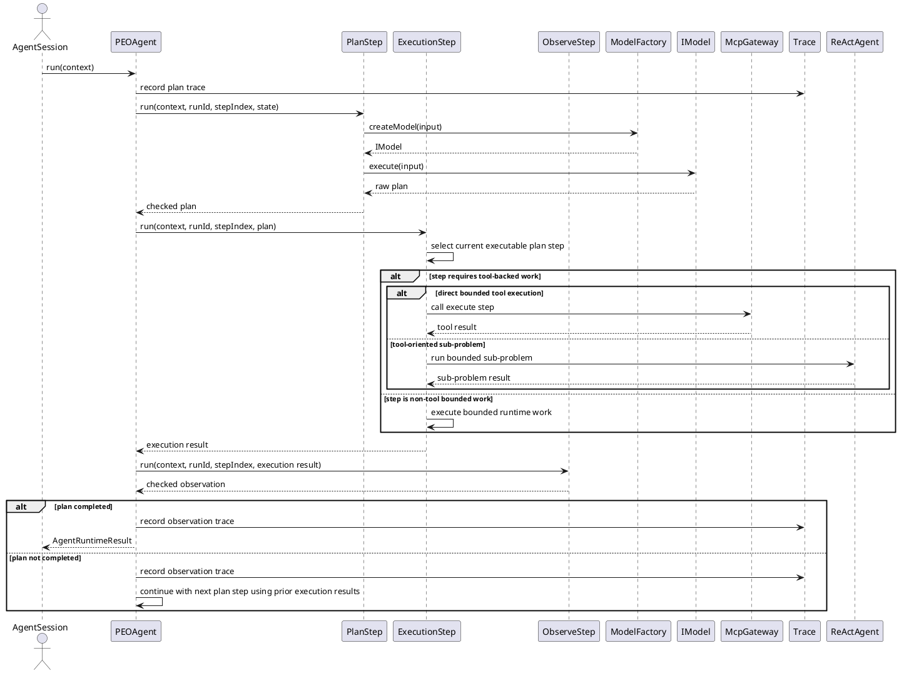
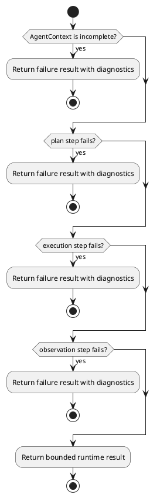
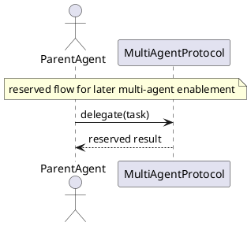
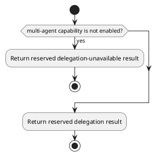

# Agent Orchestration Design


## 1. Goal


This document is the internal design document for modules defined in `Agent Orchestration Layer`. In the current architecture scope, it provides detailed internal design needed to derive code-level core logic, module-internal class collaboration, and module-facing API shape for the current layer modules.

## 2.1 Designed Module


- `AgentSelector`
  - request-level selection: choose one orchestration agent for each runtime request
  - selection boundary: keep selection logic inside the orchestration layer
- `ChatAgent`
  - direct chat path: run direct chat-oriented orchestration when no iterative tool loop is needed
  - model boundary usage: invoke the model integration boundary as needed
- `ReActAgent`
  - iterative path: run reasoning-action-observation orchestration for bounded multi-step requests
  - tool and model boundary usage: invoke model and capability boundaries as required
- `PEOAgent`
  - plan-execute-observe path: run explicit planning and bounded execution stages
  - tool and model boundary usage: invoke model and capability boundaries as required
- `MultiAgentProtocol`
  - reserved delegation protocol: keep one placeholder boundary for future multi-agent collaboration
  - collaboration boundary: do not pull delegation logic into the current implementation scope

## 2.2 Collaborating Items


- collaborating layer: `Context Governance Layer`
  - collaboration target: consume execution-ready `AgentContext` assembled for the current run
  - collaboration rule: use APIs exposed by modules in this layer
  - design doc: [context_governance_design](./context_governance_design.md)
- collaborating layer: `Capability and Tooling Layer`
  - collaboration target: execute tool-backed steps during bounded agent runs
  - collaboration rule: use APIs exposed by modules in this layer
  - design doc: [capability_and_tooling_design](./capability_and_tooling_design.md)
- collaborating layer: `Model Integration Layer`
  - collaboration target: create model instances and invoke model execution
  - collaboration rule: use APIs exposed by modules in this layer
  - design doc: [model_integration_design](./model_integration_design.md)
- collaborating layer: `Observability Layer`
  - collaboration target: collect trace and metrics for agent runs
  - collaboration rule: use APIs exposed by modules in this layer
  - design doc: [observability_design](./observability_design.md)

## 3. Modules


### 3.1 `AgentSelector`

#### 3.1.1 Core Functions

- select one orchestration agent for the current runtime request
- evaluate request-level selection inputs inside the orchestration layer
- return the selected agent to the runtime controller boundary

#### 3.1.2 API

```typescript
export interface AgentSelector {
  select(input: AgentSelectionInput): Promise<IAgent>
}

export interface IAgent {
  isRunning(): boolean
  run(context: AgentContext): Promise<AgentRuntimeResult>
}

export interface AgentRuntimeResult {
  runId: string
  traceId?: string
  content?: {
    data: string | Record<string, unknown>
    format: "text" | "json"
  }
  errorInfo?: {
    code: string
    message: string
  }
  agent: {
    prompt: {
      system: string[]
      user: Record<string, unknown>
    }
    pattern: "chat" | "react" | "peo"
    tokenUsage?: {
      inputTokens: number
      outputTokens: number
      totalTokens: number
    }
  }
  stateUpdate: {
    transcriptAppend: TranscriptTurn[]
    runtimeMemorySummaryItems: MemorySummaryItem[]
  }
  executionFacts?: {
    toolCalls: number
    failedToolCalls: number
  }
}

export interface AgentSelectionInput {
  userInput: UserInput
  sessionState: AgentSessionState
  requestedMode: AgentRunMode
}

export interface AgentSessionState {
  sessionId: string
  transcriptTurnCount: number
  hasToolHistory: boolean
}

```

#### 3.1.3 Core Class Responsibilities

##### `AgentSelector`
- role: request-level orchestration selector
- responsibilities:
  - evaluate runtime request inputs, session state, and requested `requestedMode`
  - choose one orchestration agent from the agent orchestration family according to `requestedMode`
  - treat `dynamic` as selector-owned routing logic inside the orchestration layer
  - pass the selected agent back to the runtime controller boundary
- public methods:
  - `select(input: AgentSelectionInput): Promise<IAgent>`

#### 3.1.4 Runtime Processing Flow

```plantuml
@startuml
actor AgentSession
participant AgentSelector
participant ChatAgent
participant ReActAgent
participant PEOAgent

AgentSession -> AgentSelector: select(userInput, sessionState, requestedMode)
alt requestedMode = chat
  AgentSelector -> ChatAgent: select agent
  AgentSelector --> AgentSession: selected ChatAgent
elseif requestedMode = react
  AgentSelector -> ReActAgent: select agent
  AgentSelector --> AgentSession: selected ReActAgent
elseif requestedMode = peo
  AgentSelector -> PEOAgent: select agent
  AgentSelector --> AgentSession: selected PEOAgent
else requestedMode = dynamic
  AgentSelector -> AgentSelector: evaluate routing rules
  AgentSelector --> AgentSession: selected orchestration agent
end
@enduml
```

#### 3.1.5 Error Handling Skeleton



### 3.2 `ChatAgent`

#### 3.2.1 Core Functions

- run direct chat-oriented orchestration for requests that do not require iterative tool loops
- consume execution-ready `AgentContext` from context governance
- build one chat-oriented model request from the current context
- check the returned model content before producing the runtime result
- return chat-oriented `AgentRuntimeResult`

#### 3.2.2 API

```typescript
No additional published contract beyond `IAgent`.
```

#### 3.2.3 Core Class Responsibilities

##### `ChatAgent`
- role: direct chat-oriented orchestration path
- responsibilities:
  - consume assembled `AgentContext`
  - coordinate prompt building and result checking for the chat path
  - execute one model call for the current request
  - return chat-oriented runtime result together with internal execution state
- public methods:
  - `isRunning(): boolean`
  - `run(context: AgentContext): Promise<AgentRuntimeResult>`

##### `ChatPromptBuilder`
- role: module-internal builder for chat-oriented model requests
- responsibilities:
  - build the chat request from `AgentContext`
  - shape the chat prompt around the current question and context basis
  - keep chat prompt construction separate from model invocation
- public methods:
  - `buildPrompt(context: AgentContext): Promise<Record<string, unknown>>`

##### `ChatResultChecker`
- role: module-internal checker for chat model outputs
- responsibilities:
  - validate returned chat content before runtime result assembly
  - normalize returned text or JSON payload
  - reject incomplete or invalid chat outputs
- public methods:
  - `check(result: Record<string, unknown>): Promise<Record<string, unknown>>`

#### 3.2.4 Runtime Processing Flow



#### 3.2.5 Error Handling Skeleton



### 3.3 `ReActAgent`

#### 3.3.1 Core Functions

- run bounded reasoning-action-observation orchestration
- build the next thought-oriented model request for the current run
- generate bounded thought and reasoning steps for the current run
- check the generated thought before action execution
- execute action steps through model or tool boundaries as needed
- check action outputs before observation checking
- check observation state before the next loop decision
- return ReAct-oriented `AgentRuntimeResult`

#### 3.3.2 API

```typescript
No additional published contract beyond `IAgent`.
```

#### 3.3.3 Core Class Responsibilities

##### `ReActAgent`
- role: iterative reasoning-action-observation orchestration path
- responsibilities:
  - consume assembled `AgentContext`
  - coordinate thought, action, and observation sub-roles inside one bounded loop
  - return runtime result together with internal execution state
- public methods:
  - `isRunning(): boolean`
  - `run(context: AgentContext): Promise<AgentRuntimeResult>`

##### `ThoughtStep`
- role: module-internal thought stage for ReAct
- responsibilities:
  - build the next thought request from the current question, context basis, tool definitions, and prior observations
  - invoke the model for the current thought stage
  - parse and validate the returned thought result before action execution
- public methods:
  - `run(context: AgentContext, runId: string, stepIndex: number, state: Record<string, unknown>): Promise<Record<string, unknown>>`

##### `ActionStep`
- role: module-internal action stage for ReAct
- responsibilities:
  - execute the current bounded action step without invoking the model
  - convert checked thought output into direct response or tool-backed action
  - validate tool arguments before tool execution
  - keep invalid tool arguments inside the current ReAct loop rather than sending them to the tool boundary
- public methods:
  - `run(context: AgentContext, runId: string, stepIndex: number, thought: Record<string, unknown>): Promise<Record<string, unknown>>`

##### `ObservationStep`
- role: module-internal observation stage for ReAct
- responsibilities:
  - invoke the model to summarize the current action observation
  - determine whether the current loop is complete or should continue
  - produce the current loop summary and final answer when available
- public methods:
  - `run(context: AgentContext, runId: string, stepIndex: number, input: Record<string, unknown>): Promise<Record<string, unknown>>`

#### 3.3.4 Runtime Processing Flow



#### 3.3.5 Error Handling Skeleton



### 3.4 `PEOAgent`

#### 3.4.1 Core Functions

- run explicit plan-execute-observe orchestration
- build planning requests from the current context
- produce abstract plan steps rather than direct tool calls
- check planning outputs before execution
- let execution convert one plan step into concrete tool-backed work when needed
- let later plan steps consume prior execution results as context basis
- keep tool-call failure handling inside execution
- let observation decide whether the current plan is completed
- return plan-execute-observe `AgentRuntimeResult`

#### 3.4.2 API

```typescript
export interface PEOAgent extends IAgent {
  run(context: AgentContext): Promise<AgentRuntimeResult>
}
```

#### 3.4.3 Core Class Responsibilities

##### `PEOAgent`
- role: plan-execute-observe orchestration path
- responsibilities:
  - consume assembled `AgentContext`
  - coordinate planning, execution, and observation sub-roles
  - keep planning outputs at abstract task-decomposition level
  - pass prior execution results forward for later steps
  - return runtime result together with internal execution state
- public methods:
  - `isRunning(): boolean`
  - `run(context: AgentContext): Promise<AgentRuntimeResult>`

##### `PlanStep`
- role: module-internal planning stage for PEO
- responsibilities:
  - build planning requests from `AgentContext`
  - invoke the model for the current planning stage
  - express planning outputs as high-level plan steps
  - keep planning outputs abstract rather than direct tool-call payloads
- public methods:
  - `run(context: AgentContext, runId: string, stepIndex: number, state: Record<string, unknown>): Promise<Record<string, unknown>>`

##### `ExecutionStep`
- role: module-internal execution stage for PEO
- responsibilities:
  - select the current executable plan step
  - convert that plan step into concrete execution work
  - perform tool-backed work when the current step requires tools
  - optionally reuse `ReActAgent` as an internal executor for tool-oriented sub-problems
  - keep tool-call failure handling inside the execution boundary
  - return execution results for later observation
- public methods:
  - `run(context: AgentContext, runId: string, stepIndex: number, plan: Record<string, unknown>): Promise<Record<string, unknown>>`

##### `ObserveStep`
- role: module-internal observation stage for PEO
- responsibilities:
  - evaluate the current execution result without invoking the model
  - decide whether the current plan is completed
  - determine whether another plan step should be executed
- public methods:
  - `run(context: AgentContext, runId: string, stepIndex: number, input: Record<string, unknown>): Promise<Record<string, unknown>>`

#### 3.4.4 Runtime Processing Flow



#### 3.4.5 Error Handling Skeleton



### 3.5 `MultiAgentProtocol`

#### 3.5.1 Core Functions

- reserve one agent-to-agent delegation boundary for later enablement
- keep parent-run and child-run coordination outside the current implementation scope
- keep delegated result aggregation outside the current implementation scope

#### 3.5.2 API

```typescript
export interface MultiAgentProtocol {
  delegate(input: DelegationInput): Promise<DelegationResult>
}

export interface DelegationInput {
  task: Record<string, unknown>
}

export interface DelegationResult {
  result: Record<string, unknown>
}
```

#### 3.5.3 Core Class Responsibilities

##### `MultiAgentProtocol`
- role: agent-to-agent collaboration protocol
- responsibilities:
  - reserve one stable delegation entry for later enablement
  - define one minimal placeholder contract shape for future delegation expansion
  - keep current ownership limited to protocol reservation rather than active runtime delegation
- public methods:
  - `delegate(input: DelegationInput): Promise<DelegationResult>`

#### 3.5.4 Runtime Processing Flow



#### 3.5.5 Error Handling Skeleton


