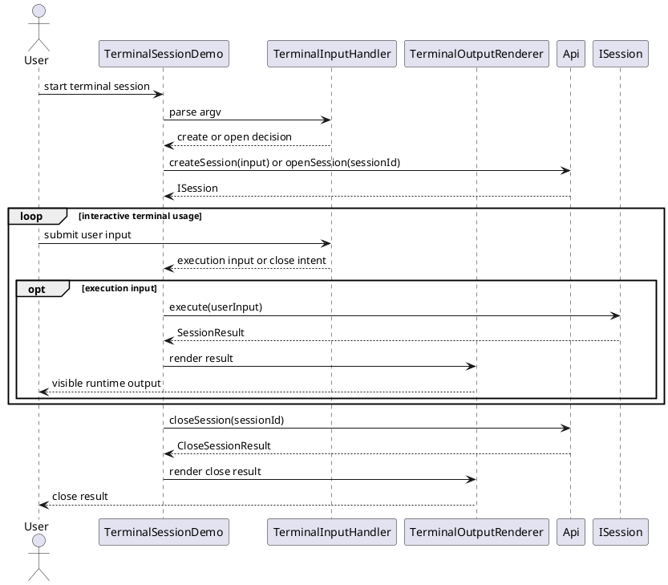
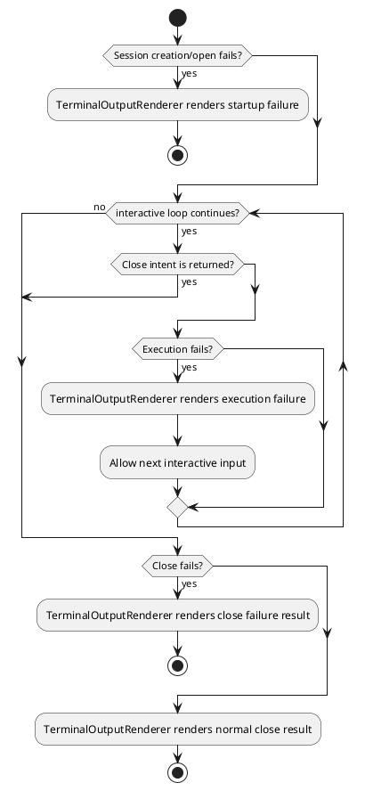

# Application Design


## 1. Goal


This document is the internal design document for modules defined in `Application Layer`. In the current architecture scope, it provides detailed internal design needed to derive code-level core logic, module-internal class collaboration, and application-facing API shape for the currently defined application-layer module.

## 2.1 Designed Module


- `TerminalSessionDemo`
  - `interactive terminal entry`: provide one interactive terminal entry on top of the runtime boundary for manual runtime usage
  - `input handling`: read CLI arguments and interactive user input
  - `session entry`: create or open one runtime session through stable interface contracts
  - `request submission`: submit execution requests through the bound session handle
  - `result presentation`: render visible runtime output and necessary session-close result

## 2.2 Collaborating Items


- collaborating layer: `Interface Layer`
  - collaboration target: provide API collaboration for modules defined in `2.1 Designed Module`
  - collaboration rule: use APIs exposed by modules in this layer for session lifecycle and request execution
  - design doc: [sdk_interface_design](./sdk_interface_design.md)

## 3. Modules


### 3.1 `TerminalSessionDemo`

#### 3.1.1 Core Functions

- accept terminal-side user input for one interactive session
- submit the current user input to the bound runtime session
- receive and render runtime output back to the terminal user
- preserve one session across multiple rounds of terminal-side interaction
- keep the active session id for the runtime-owned close path
- stop at the stable interface boundary without redefining runtime execution behavior

#### 3.1.2 API

```typescript
export interface TerminalSessionDemoEntry {
  run(input: TerminalSessionDemoOptions): Promise<TerminalSessionDemoResult>
}

export interface TerminalSessionDemoOptions {
  sessionId?: string
  sysPrompt?: string[]
  userPrompt?: Record<string, unknown>
  config?: Record<string, unknown>
}

export interface TerminalSessionDemoResult {
  sessionId: string
  closeResult: CloseSessionResult
}
```

#### 3.1.3 Core Class Responsibilities

##### `TerminalSessionDemo`
- role: application-layer facade that owns one terminal interaction session
- responsibilities:
  - coordinate terminal-side session lifecycle calls through Api
  - keep one active ISession handle during interactive usage
  - keep the active session id available for the close path
  - coordinate TerminalInputHandler and TerminalOutputRenderer
  - coordinate terminal-side session startup, interaction loop, and close flow
- public methods:
  - `run(input: TerminalSessionDemoOptions): Promise<TerminalSessionDemoResult>`

##### `TerminalInputHandler`
- role: module-internal class that owns terminal input parsing and request preparation
- responsibilities:
  - parse startup arguments and determine whether the session path is create or open
  - read terminal-side user input during interactive usage
  - classify terminal input as execution input or close intent
  - map execution-oriented terminal input into the user input sent to ISession.execute
- public methods:
  - `parseStartupInput(argv: string[]): Promise<{ mode: "create" | "open"; sessionId?: string }>`
  - `readUserInput(): Promise<{ rawText: string; closeRequested: boolean }>`
  - `toUserInput(userInput: { rawText: string; closeRequested: boolean }): UserInput`

##### `TerminalOutputRenderer`
- role: module-internal class that owns terminal-side output rendering
- responsibilities:
  - render visible runtime output returned from the bound session
  - render failure diagnostics that can be shown at terminal boundary
  - render necessary session-close result after Api.closeSession
- public methods:
  - `renderAgentOutput(output: SessionResult): void`
  - `renderFailure(error: { summary: string; traceId?: string }): void`
  - `renderCloseResult(result: CloseSessionResult): void`

#### 3.1.4 Runtime Processing Flow



#### 3.1.5 Error Handling Skeleton


