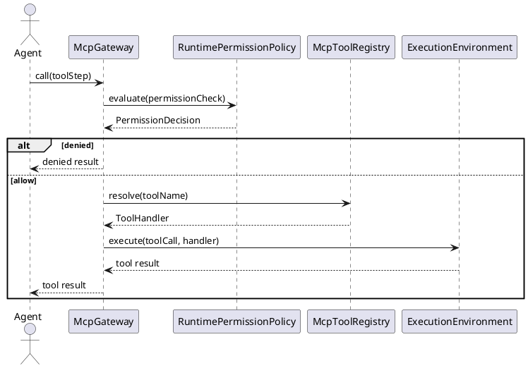
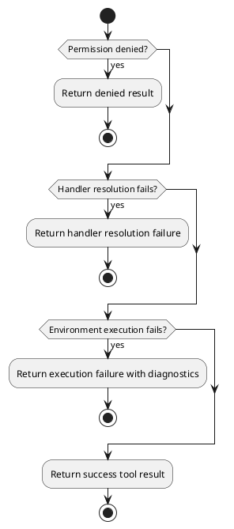
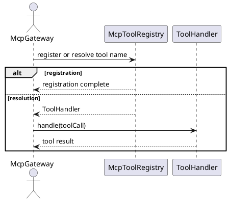
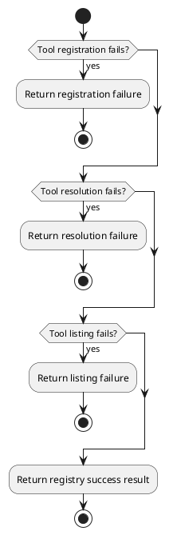
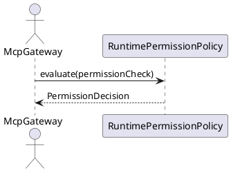
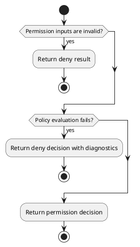
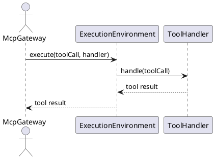
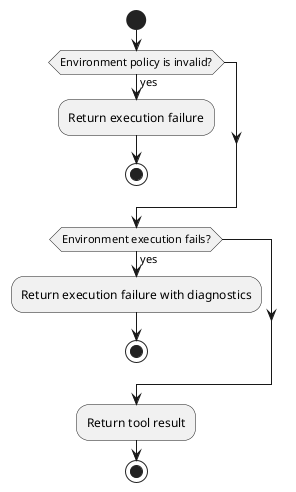

# Capability And Tooling Design


## 1. Goal


This document is the internal design document for modules defined in `Capability and Tooling Layer`. In the current architecture scope, it provides detailed internal design needed to derive code-level core logic, module-internal class collaboration, and module-facing API shape for the currently defined layer modules.

## 2.1 Designed Module


- `McpGateway`
  - `tool call dispatch`: receive normalized tool steps and coordinate execution through the capability boundary.
  - `policy coordination`: evaluate permission decisions before tool execution.
  - `handler dispatch`: resolve the concrete handler and route the request through the execution environment.
- `McpToolRegistry`
  - `handler registration`: register built-in and external tool handlers.
  - `handler resolution`: resolve handlers by tool name.
  - `inventory listing`: provide tool-name listings for runtime use.
- `RuntimePermissionPolicy`
  - `policy evaluation`: evaluate permission decisions before tool execution.
  - `capability governance`: apply tool, session, and environment policy before execution.
- `ExecutionEnvironment`
  - `environment execution`: execute tool calls in a local, sandboxed, or remote environment.
  - `contract stability`: keep tool contracts stable across environment changes.

## 2.2 Collaborating Items


- external collaborating item: `External MCP Tool Handlers`
  - collaboration target: provide executable tool handlers resolved by `McpToolRegistry`
  - collaboration rule: interact only through registered `ToolHandler` contracts
- external collaborating item: `Execution Environments`
  - collaboration target: run tool calls in local, sandboxed, or remote environments
  - collaboration rule: interact only through `ExecutionEnvironment`

## 3. Modules


### 3.1 `McpGateway`

#### 3.1.1 Core Functions

- dispatch normalized tool steps through one gateway boundary
- coordinate permission checks before tool execution
- resolve the concrete handler and route execution through the environment boundary
- return tool results to the agent orchestration layer

#### 3.1.2 API

```typescript
export interface McpGateway {
  call(input: ToolCallInput): Promise<ToolCallResult>
}

export interface ToolCallInput {
  toolName: string
  payload: Record<string, unknown>
  sessionId: string
  runId: string
  stepIndex?: number
  workingDirectory?: string
}

export interface ToolCallResult {
  content: string
  exitCode?: number
  error?: {
    code: string
    message: string
  }
  blockedByPolicy?: boolean
}
```

#### 3.1.3 Core Class Responsibilities

##### `McpGateway`
- role: unified runtime tool-call dispatch boundary
- responsibilities:
  - coordinate permission checks, handler resolution, and environment execution
  - return tool results to the caller
  - keep tool dispatch behind the capability boundary
  - collaborate with `RuntimePermissionPolicy`, `McpToolRegistry`, and `ExecutionEnvironment` without absorbing their ownership
- public methods:
  - `call(input: ToolCallInput): Promise<ToolCallResult>`

#### 3.1.4 Runtime Processing Flow



#### 3.1.5 Error Handling Skeleton



### 3.2 `McpToolRegistry`

#### 3.2.1 Core Functions

- register built-in and external tool handlers
- resolve handlers by tool name
- provide tool name listings for runtime use

#### 3.2.2 API

```typescript
export interface McpToolRegistry {
  register(toolName: string, handler: ToolHandler): Promise<void>
  resolve(toolName: string): Promise<ToolHandler>
  listToolNames(): Promise<string[]>
}

export interface ToolHandler {
  handle(input: ToolCallInput): Promise<ToolCallResult>
}
```

#### 3.2.3 Core Class Responsibilities

##### `McpToolRegistry`
- role: tool handler registration and resolution boundary
- responsibilities:
  - register built-in and external handlers
  - resolve handlers by tool name
  - provide tool name listings
- public methods:
  - `register(toolName: string, handler: ToolHandler): Promise<void>`
  - `resolve(toolName: string): Promise<ToolHandler>`
  - `listToolNames(): Promise<string[]>`

#### 3.2.4 Runtime Processing Flow



#### 3.2.5 Error Handling Skeleton



### 3.3 `RuntimePermissionPolicy`

#### 3.3.1 Core Functions

- evaluate permission decisions before tool execution
- apply tool, session, and environment policy before execution
- enforce capability governance before dispatch

#### 3.3.2 API

```typescript
export interface RuntimePermissionPolicy {
  evaluate(input: PermissionCheckInput): Promise<PermissionDecision>
}

export interface PermissionCheckInput {
  toolCall: ToolCallInput
  allowedWorkingDirectories?: string[]
}

export interface PermissionDecision {
  allowed: boolean
  reasonCode?: string
  message?: string
}
```

#### 3.3.3 Core Class Responsibilities

##### `RuntimePermissionPolicy`
- role: permission/path/command/capability governance boundary
- responsibilities:
  - evaluate permission decisions before tool execution
  - apply tool call, session, and environment restrictions
  - enforce capability execution governance before dispatch
- public methods:
  - `evaluate(input: PermissionCheckInput): Promise<PermissionDecision>`

#### 3.3.4 Runtime Processing Flow



#### 3.3.5 Error Handling Skeleton



### 3.4 `ExecutionEnvironment`

#### 3.4.1 Core Functions

- execute tool calls in selected environment
- keep tool contracts stable across environment changes
- return tool-call results

#### 3.4.2 API

```typescript
export interface ExecutionEnvironment {
  execute(input: ExecutionEnvironmentInput): Promise<ToolCallResult>
}

export interface ExecutionEnvironmentInput {
  toolCall: ToolCallInput
  handler: ToolHandler
}
```

#### 3.4.3 Core Class Responsibilities

##### `ExecutionEnvironment`
- role: local/sandbox/remote execution-environment boundary
- responsibilities:
  - execute tool calls in the selected environment
  - keep the tool contract stable across environment changes
  - return stable tool-call results to the caller
- public methods:
  - `execute(input: ExecutionEnvironmentInput): Promise<ToolCallResult>`

#### 3.4.4 Runtime Processing Flow



#### 3.4.5 Error Handling Skeleton


