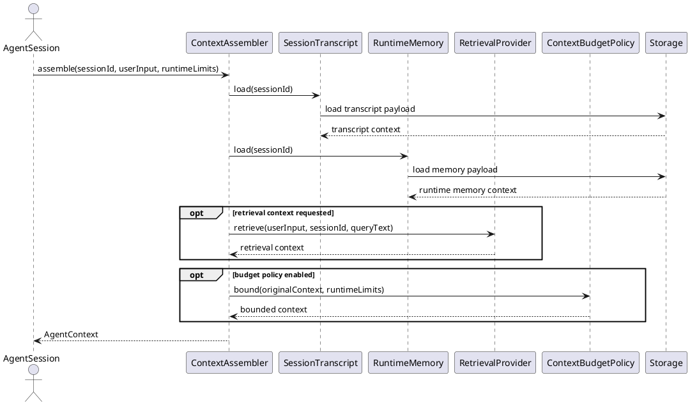
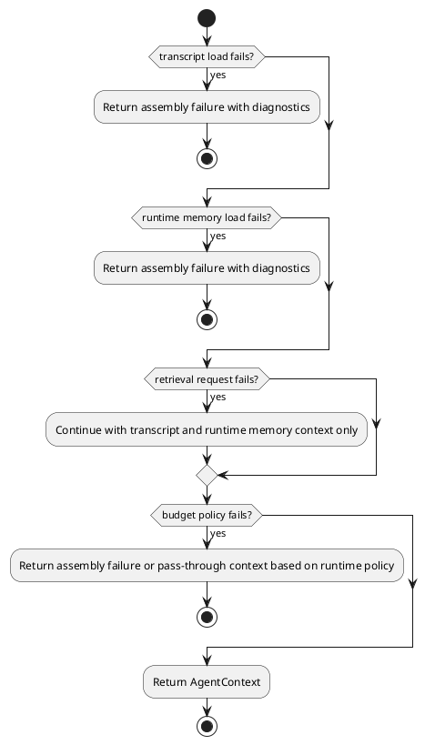
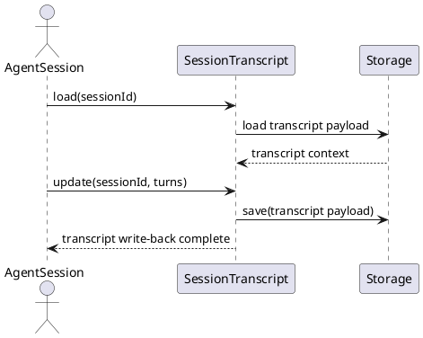
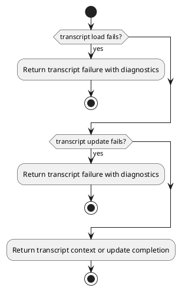
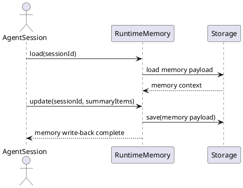
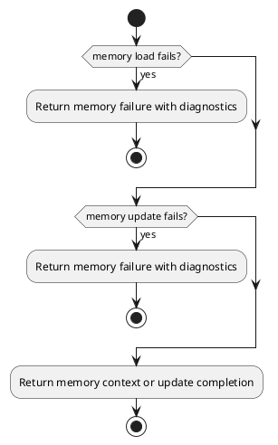
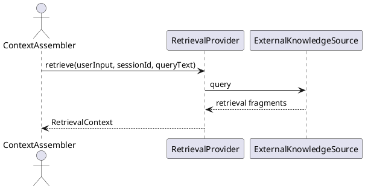
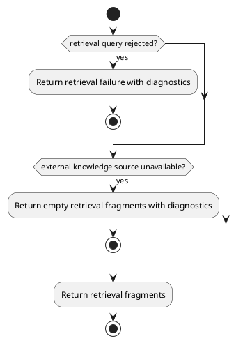
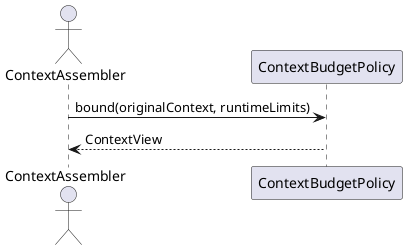
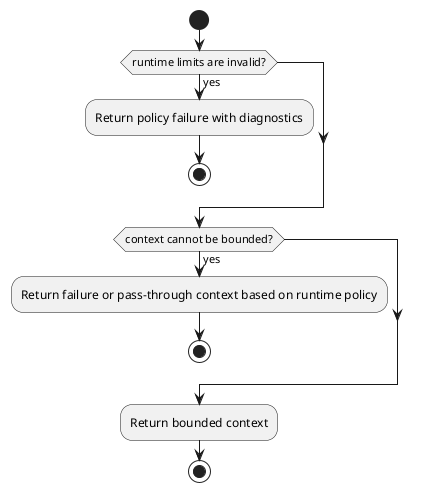

# Context Governance Design


## 1. Goal


This document is the internal design document for modules defined in `Context Governance Layer`. In the current architecture scope, it provides detailed internal design needed to derive code-level core logic, module-internal class collaboration, and module-facing API shape for the current layer modules.

## 2.1 Designed Module


- `ContextAssembler`
  - assembly boundary: combine transcript, runtime memory, and retrieval context into execution-ready context views
  - budget boundary: apply context budgeting or compression policy after context assembly
- `SessionTranscript`
  - transcript boundary: load ordered transcript context for one session
  - write-back boundary: persist normalized turns back through the data layer
- `RuntimeMemory`
  - runtime-memory boundary: load bounded summary memory for follow-up execution
  - update boundary: persist runtime-memory summary items through the data layer
- `RetrievalProvider`
  - retrieval boundary: load optional retrieval-backed context fragments for the current request
  - knowledge-source boundary: expose retrieval context without owning transcript or memory behavior
- `ContextBudgetPolicy`
  - budgeting boundary: bound assembled context candidates against runtime limits
  - compression boundary: keep transcript, retrieval, memory, and budget policy separate

## 2.2 Collaborating Items


- collaborating layer: `Data Layer`
  - collaboration target: persist transcript payloads and runtime-memory payloads through `Storage`
  - collaboration rule: use APIs exposed by modules in this layer
  - design doc: [data_design](./data_design.md)

## 3. Modules


### 3.1 `ContextAssembler`

#### 3.1.1 Core Functions

- assemble original and bounded context views into execution-ready `AgentContext`
- load context candidates through `SessionTranscript`, `RuntimeMemory`, and `RetrievalProvider`
- apply `ContextBudgetPolicy` after the candidate context is assembled

#### 3.1.2 API

```typescript
export interface ContextAssembler {
  assemble(input: ContextAssemblyInput): Promise<AgentContext>
}

export interface ContextAssemblyInput {
  sessionId: string
  userInput: UserInput
  runtimeLimits?: ContextBudgetLimits
}

export interface ContextBudgetLimits {
  maxTranscriptTurns: number
  maxMemoryItems: number
  maxRetrievalFragments: number
}

export interface AgentContext {
  originalContext: ContextView
  boundedContext?: ContextView
}

export interface ContextView {
  transcriptContext: TranscriptContext
  runtimeMemoryContext: MemoryContext
  retrievalContext?: RetrievalContext
}

export interface TranscriptTurn {
  role: "user" | "assistant" | "system" | "tool"
  content: string
  timestamp?: string
}

export interface TranscriptContext {
  turns: TranscriptTurn[]
}

export interface MemorySummaryItem {
  summary: string
  sourceTurnId?: string
}

export interface MemoryContext {
  summaryItems: MemorySummaryItem[]
}

export interface RetrievalFragment {
  content: string
  source?: string
  score?: number
}

export interface RetrievalContext {
  fragments: RetrievalFragment[]
}

```

#### 3.1.3 Core Class Responsibilities

##### `ContextAssembler`
- role: execution-ready context assembler
- responsibilities:
  - coordinate original and bounded context views into one `AgentContext`
  - load context through `SessionTranscript`, `RuntimeMemory`, and `RetrievalProvider`
  - apply `ContextBudgetPolicy` after the candidate context is assembled
- public methods:
  - `assemble(input: ContextAssemblyInput): Promise<AgentContext>`

#### 3.1.4 Runtime Processing Flow



#### 3.1.5 Error Handling Skeleton



### 3.2 `SessionTranscript`

#### 3.2.1 Core Functions

- load ordered transcript context for a session
- accept normalized turns after execution
- write transcript updates through the data layer

#### 3.2.2 API

```typescript
export interface SessionTranscript {
  load(sessionId: string): Promise<TranscriptContext>
  update(sessionId: string, turns: TranscriptTurn[]): Promise<void>
}
```

#### 3.2.3 Core Class Responsibilities

##### `SessionTranscript`
- role: session-owned transcript boundary
- responsibilities:
  - load ordered transcript context by session identity
  - accept normalized turns after execution
  - write transcript payloads through the data layer
- public methods:
  - `load(sessionId: string): Promise<TranscriptContext>`
  - `update(sessionId: string, turns: TranscriptTurn[]): Promise<void>`

#### 3.2.4 Runtime Processing Flow



#### 3.2.5 Error Handling Skeleton



### 3.3 `RuntimeMemory`

#### 3.3.1 Core Functions

- load bounded runtime-memory context for a session
- accept runtime-memory summary items after execution
- write memory updates through the data layer

#### 3.3.2 API

```typescript
export interface RuntimeMemory {
  load(sessionId: string): Promise<MemoryContext>
  update(sessionId: string, summaryItems: MemorySummaryItem[]): Promise<void>
}
```

#### 3.3.3 Core Class Responsibilities

##### `RuntimeMemory`
- role: runtime-owned short-term summary memory boundary
- responsibilities:
  - load bounded runtime-memory context by session identity
  - accept runtime-memory summary items after execution
  - write memory payloads through the data layer
- public methods:
  - `load(sessionId: string): Promise<MemoryContext>`
  - `update(sessionId: string, summaryItems: MemorySummaryItem[]): Promise<void>`

#### 3.3.4 Runtime Processing Flow



#### 3.3.5 Error Handling Skeleton



### 3.4 `RetrievalProvider`

#### 3.4.1 Core Functions

- provide optional retrieval-backed context for a request
- return retrieval fragments to the context assembler
- keep knowledge-source access separate from transcript and memory ownership

#### 3.4.2 API

```typescript
export interface RetrievalProvider {
  retrieve(userInput: UserInput, sessionId: string, queryText: string): Promise<RetrievalContext>
}
```

#### 3.4.3 Core Class Responsibilities

##### `RetrievalProvider`
- role: optional retrieval-backed context boundary
- responsibilities:
  - execute retrieval queries for the current request
  - return retrieval context fragments to `ContextAssembler`
  - expose knowledge-source context without taking ownership of transcript or memory
- public methods:
  - `retrieve(userInput: UserInput, sessionId: string, queryText: string): Promise<RetrievalContext>`

#### 3.4.4 Runtime Processing Flow



#### 3.4.5 Error Handling Skeleton



### 3.5 `ContextBudgetPolicy`

#### 3.5.1 Core Functions

- bound assembled context candidates against runtime limits
- return a bounded version of assembled context after assembly
- keep context budgeting separate from transcript, memory, and retrieval ownership

#### 3.5.2 API

```typescript
export interface ContextBudgetPolicy {
  bound(originalContext: ContextView, runtimeLimits: ContextBudgetLimits): Promise<ContextView>
}
```

#### 3.5.3 Core Class Responsibilities

##### `ContextBudgetPolicy`
- role: context budgeting and compression boundary
- responsibilities:
  - evaluate original context against runtime limits
  - compute a bounded context view after assembly
  - return bounded context results for downstream orchestration
- public methods:
  - `bound(originalContext: ContextView, runtimeLimits: ContextBudgetLimits): Promise<ContextView>`

#### 3.5.4 Runtime Processing Flow



#### 3.5.5 Error Handling Skeleton


