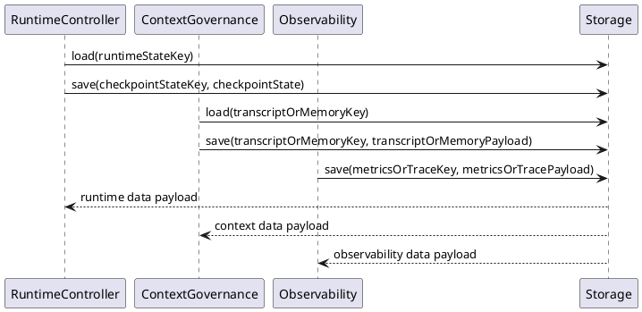
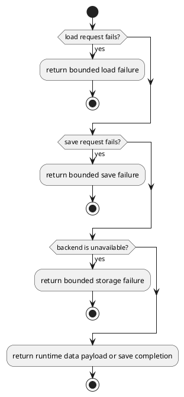

# Data Design


## 1. Goal


This document is the internal design document for modules defined in `Data Layer`. In the current architecture scope, it provides detailed internal design needed to derive code-level core logic, module-internal class collaboration, and module-facing API shape for the currently defined layer modules.

## 2.1 Designed Module


- `Storage`
  - `load runtime data`: load runtime data payloads through one shared persistence boundary
  - `save runtime data`: save runtime data payloads through one shared persistence boundary

## 2.2 Collaborating Items


- external collaborating item: `Local File Backend`
  - collaboration target: persist runtime-owned payloads under the runtime storage root
  - collaboration rule: keep file layout details behind `Storage`
- external collaborating item: `Remote Persistence Backend`
  - collaboration target: persist runtime-owned payloads when a remote backend is configured
  - collaboration rule: keep remote transport and backend protocol details behind `Storage`

## 3. Modules


### 3.1 `Storage`

#### 3.1.1 Core Functions

- load runtime data payloads from one shared persistence boundary
- save runtime data payloads through one shared persistence boundary
- keep backend-specific storage details hidden from upper layers

#### 3.1.2 API

```typescript
interface Storage {
  load(storageKey: string): Promise<Record<string, unknown>>
  save(storageKey: string, payload: Record<string, unknown>): Promise<void>
}
```

#### 3.1.3 Core Class Responsibilities

##### `Storage`
- role: shared runtime storage boundary
- responsibilities:
  - accept load and save operations for runtime-owned data
  - return loaded runtime data payloads and persist updated payloads
  - keep backend details behind the data-layer boundary
- public methods:
  - `load(storageKey: string): Promise<Record<string, unknown>>`
  - `save(storageKey: string, payload: Record<string, unknown>): Promise<void>`

#### 3.1.4 Runtime Processing Flow



#### 3.1.5 Error Handling Skeleton


