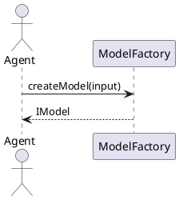
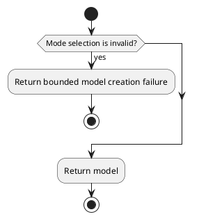
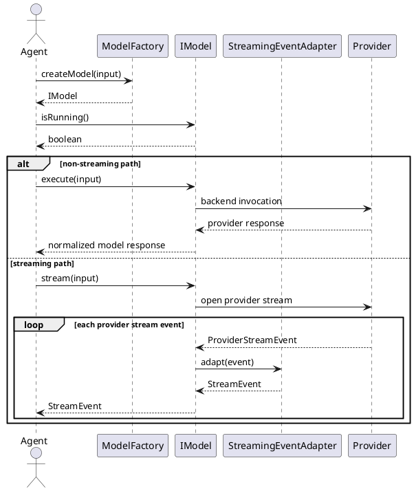
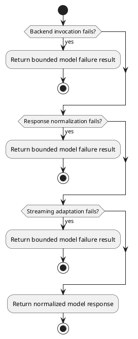
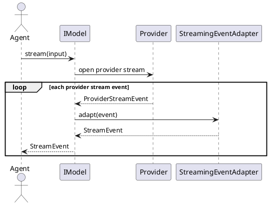
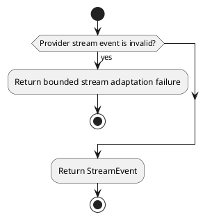

# Model Integration Design


## 1. Goal


This document is the internal design document for modules defined in `Model Integration Layer`. In the current architecture scope, it provides detailed internal design needed to derive code-level core logic, module-internal class collaboration, and module-facing API shape for the currently defined layer modules.

## 2.1 Designed Module


- `ModelFactory`
  - `model selection and creation`: choose and create one shared model instance for runtime agents.
  - `provider isolation`: keep provider-specific creation details behind one module boundary.
- `IModel`
  - `shared execution interface`: expose execute and stream through one shared model interface.
  - `runtime state query`: expose the running state of the current model instance.
- `StreamingEventAdapter`
  - `stream adaptation`: adapt provider stream events into runtime-normalized stream events.
  - `stream boundary`: keep provider-stream handling behind a dedicated boundary.

## 2.2 Collaborating Items


- external collaborating item: `Model Providers`
  - collaboration target: execute normalized model requests against real or mock backends
  - collaboration rule: interact only through `ModelFactory`, `IModel`, and `StreamingEventAdapter`
- external collaborating item: `Provider SDKs`
  - collaboration target: provide provider-specific transport and stream payload access
  - collaboration rule: keep provider-specific types behind the model-integration boundary

## 3. Modules


### 3.1 `ModelFactory`

#### 3.1.1 Core Functions

- choose the current model backend configuration from mode selection
- create one model instance from the selected configuration
- keep provider-specific handling out of caller-facing boundaries
- return one shared model interface for runtime agents

#### 3.1.2 API

```typescript
export interface ModelFactory {
  createModel(input: ModelCreationInput): IModel
}

export interface ModelCreationInput {
  mock: boolean
  modeSelection: ModeSelection
  mockInfo?: Record<string, unknown>
}

export interface ModeSelection {
  url?: string
  key?: string
  model?: string
}
```

#### 3.1.3 Core Class Responsibilities

##### `ModelFactory`
- role: model selection and creation boundary
- responsibilities:
  - resolve the current model backend configuration from mode selection
  - create one `IModel` from the selected configuration
  - keep provider-specific handling out of caller-facing boundaries
  - return one shared model interface for runtime agents
- public methods:
  - `createModel(input: ModelCreationInput): IModel`

#### 3.1.4 Runtime Processing Flow



#### 3.1.5 Error Handling Skeleton



### 3.2 `IModel`

#### 3.2.1 Core Functions

- execute model requests through one shared model interface
- accept caller-prepared model payload through one shared model interface
- invoke model backends through the created model instance
- normalize provider responses into runtime-facing results
- route streaming events through a dedicated stream adapter when streaming is active

#### 3.2.2 API

```typescript
export interface IModel {
  isRunning(): boolean
  execute(input: ModuleRequest): Promise<ModuleResponse>
  stream(input: ModuleRequest): AsyncIterable<StreamEvent>
}

export interface ModuleRequest {
  prompt: Record<string, unknown>
  stream: boolean
}

export interface ModuleResponse {
  content: string
  error: {
    code: string
    message: string
  }
}

export interface StreamEvent {
  content: string
  done: boolean
  error?: {
    code: string
    message: string
  }
}
```

#### 3.2.3 Core Class Responsibilities

##### `IModel`
- role: shared model execution interface for runtime agents
- responsibilities:
  - expose stable running-state query for the current model instance
  - execute model requests through one shared model boundary
  - stream model output through one shared streaming boundary when requested
  - accept caller-prepared model payload without owning prompt construction
  - invoke the backend through the created model instance
  - normalize provider responses into runtime-facing results
  - route streaming events through the stream adapter when streaming is active
- public methods:
  - `isRunning(): boolean`
  - `execute(input: ModuleRequest): Promise<ModuleResponse>`
  - `stream(input: ModuleRequest): AsyncIterable<StreamEvent>`

#### 3.2.4 Runtime Processing Flow



#### 3.2.5 Error Handling Skeleton



### 3.3 `StreamingEventAdapter`

#### 3.3.1 Core Functions

- adapt provider stream events into runtime-normalized stream events
- preserve a separate stream boundary for runtime consumption
- keep provider-stream handling behind a dedicated boundary

#### 3.3.2 API

```typescript
export interface StreamingEventAdapter {
  adapt(event: ProviderStreamEvent): StreamEvent
}

export interface ProviderStreamEvent {
  payload: Record<string, unknown>
}
```

#### 3.3.3 Core Class Responsibilities

##### `StreamingEventAdapter`
- role: provider-stream adaptation boundary
- responsibilities:
  - accept provider stream events
  - return shared stream events
  - keep provider-stream handling behind a dedicated boundary
- public methods:
  - `adapt(event: ProviderStreamEvent): StreamEvent`

#### 3.3.4 Runtime Processing Flow



#### 3.3.5 Error Handling Skeleton


