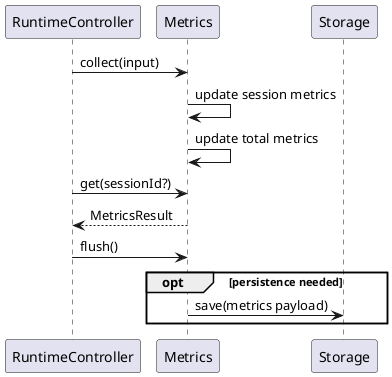
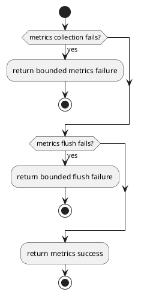
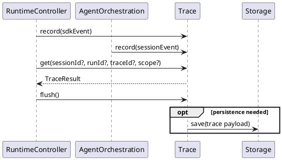
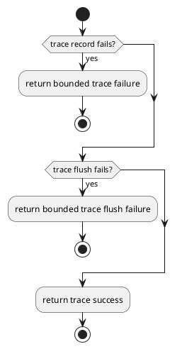

# Observability Design


## 1. Goal


This document is the internal design document for modules defined in `Observability Layer`. In the current architecture scope, it provides detailed internal design needed to derive code-level core logic, module-internal class collaboration, and module-facing API shape for the currently defined layer modules.

## 2.1 Designed Module


- `Metrics`
  - `collect and aggregate`: collect session metrics and total metrics from runtime results and usage facts
  - `flush coordination`: flush metrics payloads through the storage boundary
- `Trace`
  - `record and normalize`: record runtime trace events and normalize trace payloads
  - `persistence and flush`: persist trace payloads and flush trace data through the storage boundary

## 2.2 Collaborating Items


- collaborating layer: `Data Layer`
  - collaboration target: persist metrics summaries, trace records, and flush state through `Storage`
  - collaboration rule: use APIs exposed by modules in this layer
  - design doc: [data_design](./data_design.md)

## 3. Modules


### 3.1 `Metrics`

#### 3.1.1 Core Functions

- collect session-scoped metrics and usage facts
- aggregate both session metrics and total metrics
- flush metrics data through the shared storage boundary

#### 3.1.2 API

```typescript
interface MetricsSummary {
  requestCount: number
  toolCallCount: number
  failedRequestCount: number
  tokenUsage: {
    promptTokens: number
    completionTokens: number
    totalTokens: number
  }
}

interface MetricsResult {
  sessionMetrics: MetricsSummary
  totalMetrics: MetricsSummary
}

interface MetricsCollectInput {
  sessionId: string
  result: SessionResult
  providerUsageFacts?: {
    promptTokens: number
    completionTokens: number
  }
  toolExecutionFacts?: {
    toolCalls: number
    failedToolCalls: number
  }
  runScope?: {
    runId: string
    agentName: string
  }
}
interface Metrics {
  collect(input: MetricsCollectInput): Promise<void>
  get(sessionId?: string): Promise<MetricsResult>
  flush(): Promise<void>
}
```

#### 3.1.3 Core Class Responsibilities

##### `Metrics`
- role: unified runtime metrics boundary for run-scoped collection and aggregation
- responsibilities:
  - collect normalized runtime results and usage facts
  - maintain both session-scoped metrics and total metrics
  - return current metrics views for one session or the whole runtime
  - decide internally when persistence is needed
  - keep analytics data separate from transcript state
- public methods:
  - `collect(input: MetricsCollectInput): Promise<void>`
  - `get(sessionId?: string): Promise<MetricsResult>`
  - `flush(): Promise<void>`

#### 3.1.4 Runtime Processing Flow



#### 3.1.5 Error Handling Skeleton



### 3.2 `Trace`

#### 3.2.1 Core Functions

- record runtime trace events
- keep sdk-scoped and session-scoped trace events distinguishable
- normalize trace records for persistence
- flush trace data through the shared storage boundary

#### 3.2.2 API

```typescript
type TraceEventType =
  | "session_create_requested"
  | "session_created"
  | "session_open_requested"
  | "session_opened"
  | "session_closed"
  | "run_started"
  | "context_assembled"
  | "agent_selected"
  | "agent_step_started"
  | "model_called"
  | "model_result_recorded"
  | "tool_called"
  | "tool_result_recorded"
  | "state_persisted"
  | "run_failed"
  | "run_finished"

type TraceScope = "sdk" | "session"

interface TraceEvent {
  traceId: string
  scope: TraceScope
  eventType: TraceEventType
  timestamp: string
  caller: string
  summary: string
  sessionId?: string
  runId?: string
  stepIndex?: number
  payload?: Record<string, unknown>
  diagnostics?: Array<{
    code: string
    message: string
  }>
}

interface TraceResult {
  events: TraceEvent[]
}

interface Trace {
  record(event: TraceEvent): Promise<void>
  get(sessionId?: string, runId?: string, traceId?: string, scope?: TraceScope): Promise<TraceResult>
  flush(): Promise<void>
}
```

#### 3.2.3 Core Class Responsibilities

##### `Trace`
- role: unified runtime trace boundary for event coordination and persistence
- responsibilities:
  - coordinate runtime trace event recording
  - keep sdk-scoped and session-scoped trace events distinguishable
  - return current trace events by session, run, trace, or scope
  - normalize trace records before persistence or flush
  - decide internally when persistence is needed
  - keep trace behavior separate from transcript state and metrics state
- public methods:
  - `record(event: TraceEvent): Promise<void>`
  - `get(sessionId?: string, runId?: string, traceId?: string, scope?: TraceScope): Promise<TraceResult>`
  - `flush(): Promise<void>`

#### 3.2.4 Runtime Processing Flow



#### 3.2.5 Error Handling Skeleton


