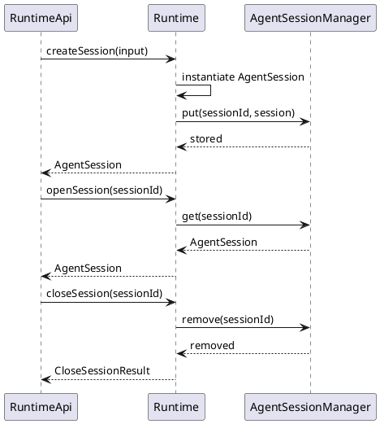
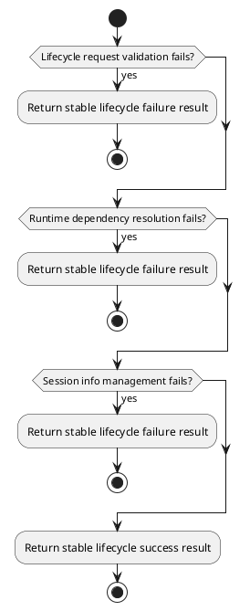
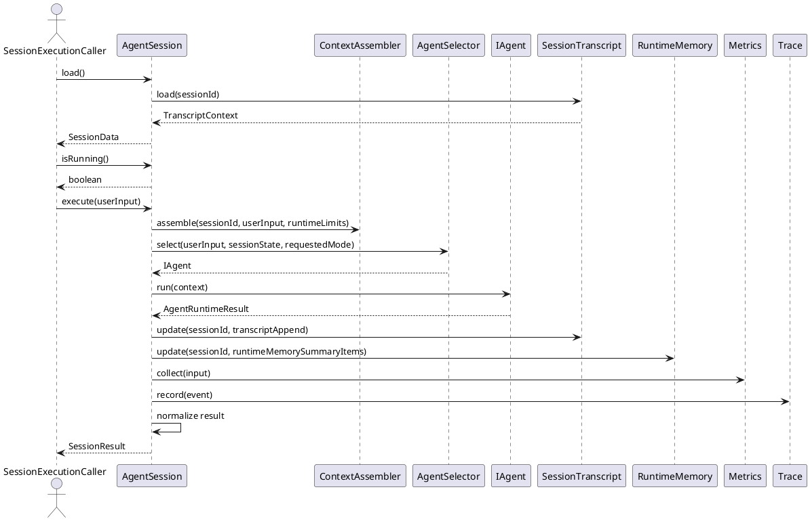
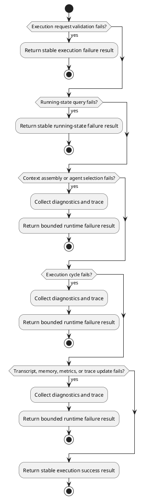
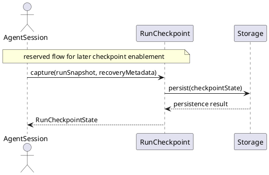
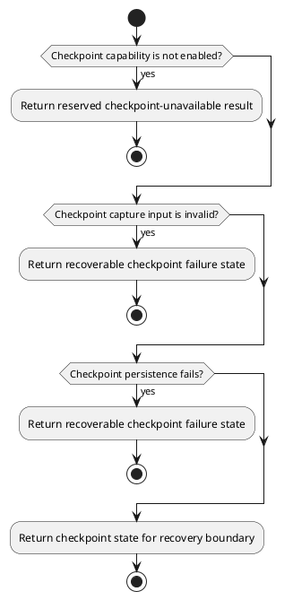

# Runtime Control Design


## 1. Goal


This document is the internal design document for modules defined in `Runtime Controller Layer`. In the current architecture scope, it provides detailed internal design needed to derive code-level core logic, module-internal class collaboration, and runtime-controller boundary API shape for the runtime-controller modules.

## 2.1 Designed Module


- `Runtime`
  - runtime bootstrap and lifecycle entry: initialize the runtime boundary and accept session lifecycle requests
  - lifecycle coordination: create, open, and close runtime-owned session objects through runtime-owned logic
  - session info coordination: manage in-memory session information through `AgentSessionManager`
  - ownership boundary: keep session-bound execution behavior out of runtime bootstrap
- `AgentSession`
  - session-bound execution ownership: run one bounded session execution cycle
  - state coordination: expose stable session data and update transcript, runtime memory, metrics, and trace
  - result coordination: normalize caller-facing results and keep a reserved checkpoint hook for later expansion
- `RunCheckpoint`
  - reserved recovery hook: keep one module-level checkpoint entry for later expansion
  - checkpoint state boundary: expose minimal checkpoint state for later runtime recovery
  - ownership boundary: do not pull checkpoint internals into the current main runtime path

## 2.2 Collaborating Items


- collaborating layer: `Agent Orchestration Layer`
  - collaboration target: route session-bound execution through agent selection and orchestration APIs
  - collaboration rule: use APIs exposed by modules in this layer
  - design doc: [agent_orchestration_design](./agent_orchestration_design.md)
- collaborating layer: `Context Governance Layer`
  - collaboration target: assemble and update transcript, runtime memory, and execution context through the layer APIs
  - collaboration rule: use APIs exposed by modules in this layer
  - design doc: [context_governance_design](./context_governance_design.md)
- collaborating layer: `Observability Layer`
  - collaboration target: record metrics, trace, and diagnostics through observability APIs
  - collaboration rule: use APIs exposed by modules in this layer
  - design doc: [observability_design](./observability_design.md)
- collaborating layer: `Data Layer`
  - collaboration target: persist shared runtime state and future checkpoint state through the storage boundary
  - collaboration rule: use APIs exposed by modules in this layer
  - design doc: [data_design](./data_design.md)

## 3. Modules


### 3.1 `Runtime`

#### 3.1.1 Core Functions

- initialize runtime dependencies and expose lifecycle entry
- create, open, and close runtime-owned session objects
- manage in-memory session information through `AgentSessionManager`
- keep session-bound execution behavior out of runtime bootstrap

#### 3.1.2 API

```typescript
export interface Runtime extends RuntimeApi {
  createSession(input: AgentSessionAccessInput): Promise<AgentSession>;
  openSession(sessionId: string): Promise<AgentSession>;
  closeSession(sessionId: string): Promise<CloseSessionResult>;
}
```

#### 3.1.3 Core Class Responsibilities

##### `Runtime`
- role: runtime bootstrap and lifecycle entry owner
- responsibilities:
  - implement the lifecycle contract published as `RuntimeApi`
  - initialize runtime-owned dependencies
  - validate lifecycle requests before delegation
  - create, open, and close runtime-owned session objects
  - coordinate in-memory session information through `AgentSessionManager`
  - return runtime-owned session handles and close results
- public methods:
  - `createSession(input: AgentSessionAccessInput): Promise<AgentSession>`
  - `openSession(sessionId: string): Promise<AgentSession>`
  - `closeSession(sessionId: string): Promise<CloseSessionResult>`

##### `AgentSessionManager`
- role: module-internal manager for in-memory session information
- responsibilities:
  - register in-memory session handles after session creation
  - resolve in-memory session handles for session reopen and runtime access
  - remove in-memory session handles when sessions are closed
  - keep in-memory session information management separate from lifecycle entry coordination
- public methods:
  - `put(sessionId: string, session: AgentSession): Promise<void>`
  - `get(sessionId: string): Promise<AgentSession>`
  - `remove(sessionId: string): Promise<void>`

#### 3.1.4 Runtime Processing Flow



#### 3.1.5 Error Handling Skeleton



### 3.2 `AgentSession`

#### 3.2.1 Core Functions

- own session-bound execution behavior and expose stable session data
- assemble context, select the runtime agent, and execute one bounded execution cycle
- update transcript, runtime memory, metrics, and trace for the execution cycle
- normalize caller-facing results and keep a reserved checkpoint hook outside the current main execution path

#### 3.2.2 API

```typescript
export interface AgentSession extends ISession {
}
```

#### 3.2.3 Core Class Responsibilities

##### `AgentSession`
- role: concrete runtime session object and owner of session-bound execution behavior
- responsibilities:
  - keep in-memory session state during runtime use
  - implement the bound-session contract published as `ISession`
  - expose stable session data through `load()`
  - expose stable running-state query through `isRunning()`
  - own `execute(userInput)` as the session-bound execution entry
  - assemble execution context through `ContextAssembler`
  - derive the effective requested mode from `userInput.mode`, defaulting to `dynamic`
  - select the runtime agent through `AgentSelector`
  - execute the selected orchestration agent for the current request
  - apply `stateUpdate` returned by the agent result to transcript and runtime memory
  - update metrics and trace from normalized runtime facts after execution
  - normalize internal `AgentRuntimeResult` into stable `SessionResult`
  - preserve one reserved checkpoint hook without making checkpoint capture part of the current main path
- public methods:
  - `load(): Promise<SessionData>`
  - `isRunning(): boolean`
  - `execute(userInput: UserInput): Promise<SessionResult>`

#### 3.2.4 Runtime Processing Flow



#### 3.2.5 Error Handling Skeleton



### 3.3 `RunCheckpoint`

#### 3.3.1 Core Functions

- expose one reserved checkpoint boundary for later recovery expansion
- define one reserved checkpoint capture contract for later enablement
- keep checkpoint state minimal until checkpoint capability is explicitly enabled
- keep checkpoint representation minimal and separate from persistence implementation details

#### 3.3.2 API

```typescript
export interface RunCheckpoint {
  capture(input: RunCheckpointInput): Promise<RunCheckpointState>
}

export interface RunCheckpointInput {
  sessionId: string
  runId: string
  stepIndex: number
  recoveryMetadata: RunRecoveryMetadata
}

export interface RunCheckpointState {
  sessionId: string
  runId: string
  stepIndex: number
  recoveryMetadata: RunRecoveryMetadata
}

export interface RunRecoveryMetadata {
  resumeToken: string
  capturedAt: string
}
```

#### 3.3.3 Core Class Responsibilities

##### `RunCheckpoint`
- role: checkpoint coordination boundary inside the runtime controller layer
- responsibilities:
  - expose one reserved checkpoint capture entry for later expansion
  - define the stable checkpoint state boundary to be used when checkpoint capability is enabled later
  - keep current checkpoint ownership limited to contract reservation rather than main-path execution integration
- public methods:
  - `capture(input: RunCheckpointInput): Promise<RunCheckpointState>`

#### 3.3.4 Runtime Processing Flow



#### 3.3.5 Error Handling Skeleton


