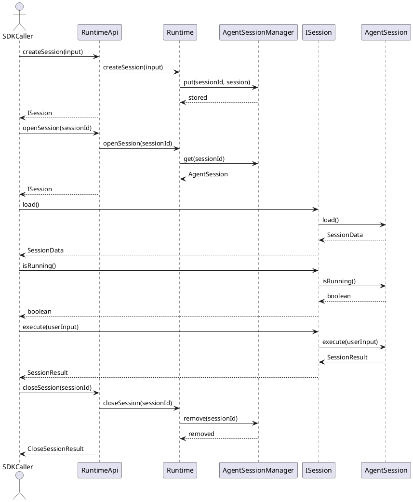
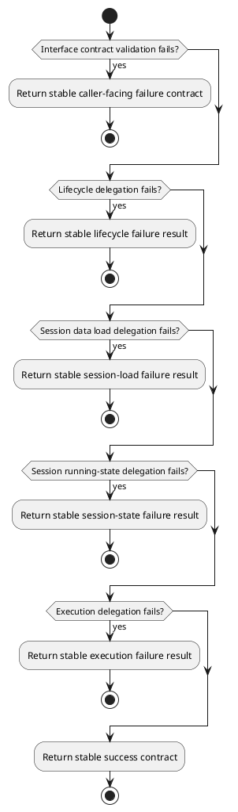

# SDK Interface Design


## 1. Goal


This document is the internal design document for modules defined in `Interface Layer`. In the current architecture scope, it provides detailed internal design needed to derive code-level core logic, module-facing API shape, and interface-boundary collaboration rules for the interface-layer modules.

## 2.1 Designed Module


- `Api`
  - stable caller-facing runtime boundary: expose the runtime entry surface used by external callers
  - contract publishing: publish `RuntimeApi` and `ISession`
  - boundary ownership: keep runtime-control internals behind interface contracts

## 2.2 Collaborating Items


- collaborating layer: `Runtime Controller Layer`
  - collaboration target: implement session lifecycle and session execution behind the interface contracts
  - collaboration rule: use APIs exposed by modules in this layer
  - design doc: [runtime_control_design](./runtime_control_design.md)

## 3. Modules


### 3.1 `Api`

#### 3.1.1 Core Functions

- expose the stable caller-facing runtime API surface
- publish the runtime lifecycle contract and session handle contract
- publish stable session data loading and session execution contracts
- keep runtime-control internals behind interface contracts

#### 3.1.2 API

```typescript
export interface RuntimeApi {
  createSession(input: AgentSessionAccessInput): Promise<ISession>;
  openSession(sessionId: string): Promise<ISession>;
  closeSession(sessionId: string): Promise<CloseSessionResult>;
}

export type AgentRunMode = "chat" | "react" | "peo" | "dynamic";

export interface ISession {
  load(): Promise<SessionData>;
  isRunning(): boolean;
  execute(userInput: UserInput): Promise<SessionResult>;
}

export interface UserInput {
  content: Record<string, unknown>;
  mode?: AgentRunMode;
  metadata?: Record<string, unknown>;
}

export interface SessionData {
  sessionId: string;
  history: ChatHistoryItem[];
}

export interface ChatHistoryItem {
  role: "user" | "assistant" | "system" | "tool";
  content: string;
}

export interface AgentSessionAccessInput {
  title?: string;
  sysPrompt?: string[];
  userPrompt?: Record<string, unknown>;
  config?: Record<string, unknown>;
}

export interface SessionResult {
  sessionId: string;
  runId: string;
  traceId?: string;
  content?: string | Record<string, unknown>;
  format?: "text" | "json";
  errorCode?: string;
  errorMessage?: string;
}

export interface CloseSessionResult {
  sessionId: string;
}
```

#### 3.1.3 Core Class Responsibilities

##### `Api`
- role: interface-layer facade that owns the caller-facing runtime boundary
- responsibilities:
  - publish RuntimeApi and ISession contracts
  - keep runtime-control internals behind interface definitions
  - provide the stable entry surface to SDK callers through published contracts

##### `RuntimeApi`
- role: stable session lifecycle contract published by `Api`
- responsibilities:
  - define session creation, opening, and closing entry points
  - return stable session handles to callers
  - keep lifecycle contracts stable for external callers
- public methods:
  - `createSession(input: AgentSessionAccessInput): Promise<ISession>`
  - `openSession(sessionId: string): Promise<ISession>`
  - `closeSession(sessionId: string): Promise<CloseSessionResult>`

##### `ISession`
- role: stable bound-session execution contract published by `Api`
- responsibilities:
  - load stable session data for the caller
  - expose stable running-state query for the caller
  - accept caller execution input for one session
  - return stable runtime results
  - keep session continuity behind the interface boundary
- public methods:
  - `load(): Promise<SessionData>`
  - `isRunning(): boolean`
  - `execute(userInput: UserInput): Promise<SessionResult>`

#### 3.1.4 Runtime Processing Flow



#### 3.1.5 Error Handling Skeleton


