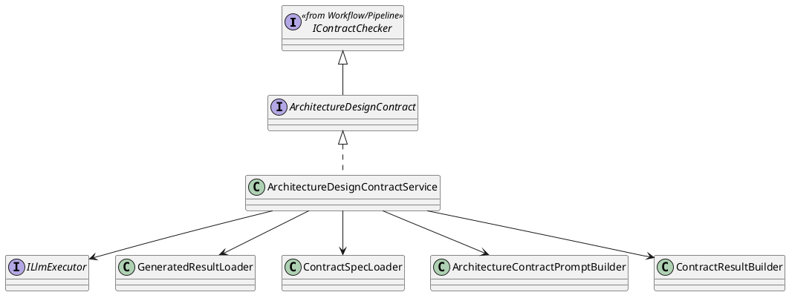
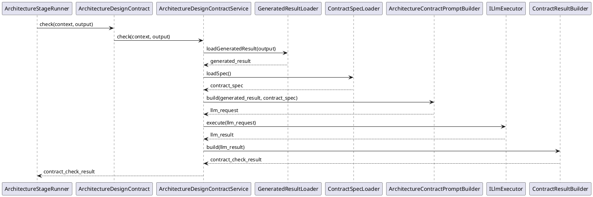

# ArchitectureDesignContract Design

## 1. Goal

### 1.1 Purpose

Define the module design of `Contract/ArchitectureDesignContract`.

### 1.2 Involved Modules

This module design directly involves:

- `Contract/ArchitectureDesignContract`

This module design collaborates with:

- `Workflow/Pipeline`
- `Execution/ArchitectureDesignGenerator`
- `SDK/LlmExecutor`

### 1.3 Core Functions

`Contract/ArchitectureDesignContract` is the architecture-design document contract-check module.

Its core functions are:

- follow the shared flow defined in [DocumentStageContractPattern.md](./DocumentStageContractPattern.md)
- check architecture-design-stage generated document output
- load the architecture-stage contract specification
- return structured `ContractCheckResult`

`ArchitectureDesignContract` does not decide workflow progression, gate approval, or artifact persistence.

## 2. Core Classes

### 2.1 Class Diagram

### 2.2 `ArchitectureDesignContract`

Role:

- architecture-stage contract-check interface

Responsibilities:

- expose `check(context, output)`
- keep architecture-stage contract entry stable for `ArchitectureStageRunner`

### 2.3 `ArchitectureDesignContractService`

Role:

- module implementation entry

Responsibilities:

- orchestrate architecture-stage contract check flow
- load generated document result
- load contract specification
- build contract-check request
- convert model result into `ContractCheckResult`

## 3. Core Runtime Flow

### 3.1 Main Sequence Diagram

## 4. Detailed Design

### 4.1 Implementation Binding

- Implementation interface: `ArchitectureDesignContract` extends `IContractChecker`
- Implementation class: `ArchitectureDesignContractService` implements `ArchitectureDesignContract`
- Bound by: `ArchitectureStageRunner`

`ArchitectureStageRunner` binds:

- `ArchitectureDesignGenerator`
- `ArchitectureDesignContract`
- `ITraceRecorder`
- `IChangeGate`
- `IArtifactStore`

### 4.2 Stage-Specific Runtime Rules

#### 4.2.1 Generation

- generation is enabled
- generator source is `Execution/ArchitectureDesignGenerator`
- generation input is requirement-stage artifact
- generation output is architecture-design-stage document artifact

#### 4.2.2 Check

- check target is architecture-design-stage generated document
- contract source is `meta_layer/resources/contract/TechnicalArchitectureTemplate.contract.json`
- contract-specific rules are architecture document structure rules, section contract rules, and architecture module-boundary consistency rules
- checker output is `ContractCheckResult`

#### 4.2.3 Record

- record stage start
- record architecture contract result
- record review result
- record accepted artifact persistence result

#### 4.2.4 Review Input / Output Limit

- review input must contain architecture-design-stage document summary and artifacts only
- review output is limited to `GateDecision`

#### 4.2.5 Persistence Limit

- only accepted architecture-design-stage artifacts may be persisted for downstream stages

### 4.3 Constraints

- reuse the shared flow from [DocumentStageContractPattern.md](./DocumentStageContractPattern.md)
- keep architecture-stage implementation names owned by this module
- do not redefine workflow-owned shared interfaces from [Pipeline.md](../Workflow/Pipeline.md)
