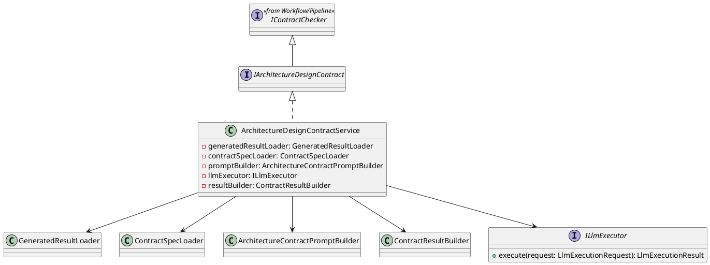
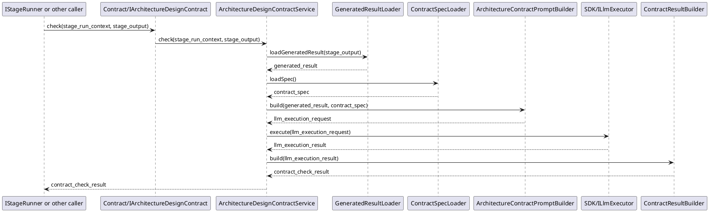

# ArchitectureDesignContract Design

## 1. Goal

### 1.1 Purpose

Define the module design of `Contract/ArchitectureDesignContract`.

### 1.2 Involved Modules

This module design directly involves:

- `Contract/ArchitectureDesignContract`

This module design collaborates with:

- `Workflow/Pipeline`
- `SDK/LlmExecutor`

### 1.3 Core Functions

`Contract/ArchitectureDesignContract` is the architecture-design validation module.

Its core functions are:

- load the structured result generated by the upstream generator
- load the target JSON contract specification file
- call the llm capability to check the generated result against JSON-defined checklist items
- return structured contract check result to the caller

`ArchitectureDesignContract` does not decide workflow progression, gate approval, or artifact persistence.

## 2. Core Classes

### 2.1 Class Diagram



### 2.2 `ArchitectureDesignContractService`

Role:

- module entry point
- owns architecture-design contract check orchestration

Responsibilities:

- accept contract check request
- load the structured generated result
- load the target JSON contract specification file
- build llm-based check request
- call shared `ILlmExecutor`
- convert check output into structured `ContractCheckResult`

### 2.3 `GeneratedResultLoader`

Role:

- generated result loading component

Responsibilities:

- load the structured result returned by the upstream generator

### 2.4 `ContractSpecLoader`

Role:

- contract specification loading component

Responsibilities:

- load the target JSON check specification file

### 2.5 `ArchitectureContractPromptBuilder`

Role:

- contract-check prompt construction component

Responsibilities:

- transform generated result and contract specification into contract-check prompt input
- convert contract specification into structured check items
- make llm focus on required check points such as format, semantic logic, ambiguity, and requirement coverage
- produce a stable `LlmExecutionRequest`

### 2.6 `ILlmExecutor`

Role:

- shared llm execution interface

Responsibilities:

- accept prompt-based execution request
- return normalized model result

### 2.7 `ContractResultBuilder`

Role:

- structured result conversion component

Responsibilities:

- convert llm check result into `ContractCheckResult`
- keep issue structure stable for downstream modules

### 2.8 `IArchitectureDesignContract`

Role:

- abstract contract interface for this module

Responsibilities:

- expose `check` (shared checker API) to the stage runner or equivalent caller

## 3. Core Runtime Flow

### 3.1 Main Sequence Diagram



## 4. Detailed Design

### 4.1 Core APIs And Fields

#### 4.1.1 Public API

```ts
interface IArchitectureDesignContract extends IContractChecker {}
```

`IContractChecker` is the shared checker interface defined in [Pipeline.md](../Workflow/Pipeline.md). This module extends that shared interface and uses `check` as the only pipeline-facing API.

#### 4.1.2 Input Types

```ts
interface GeneratedArchitectureDesignResult {
  content: string
}

interface ContractSpec {
  spec_version: string
  template_content: string
  document_contracts: DocumentContract[]
  section_contracts: SectionContract[]
}

interface DocumentContract {
  check_item_id: string
  check_item: string
  description: string
  severity: string
}

interface SectionContract {
  section_id: string
  title: string
  check_item_ids?: string[]
  checkitems: string[]
  severity: string
}
```

`StageRunContext` and `StageOutput` are defined by upstream workflow and execution contracts and are reused here directly.

#### 4.1.3 Prompt Construction

```ts
interface PromptBuildInput {
  generated_result: GeneratedArchitectureDesignResult
  contract_spec: ContractSpec
}

interface PromptInput {
  system_prompt: string
  user_prompt: string
}

interface LlmExecutionRequest {
  prompt: PromptInput
}

interface ArchitectureContractPromptBuilder {
  build(input: PromptBuildInput): LlmExecutionRequest
}
```

Prompt construction rules:

- `system_prompt` defines the contract-check role, output schema, and checking boundary.
- `user_prompt` includes the generated structured result and the target JSON contract specification file.
- document-level check requirements should be derived from `ContractSpec.document_contracts`.
- each section-level check requirement should be derived from `ContractSpec.section_contracts[].checkitems`.
- JSON contract spec is the single source of truth for check scope; the llm should not invent extra check dimensions outside this spec.
- `ArchitectureContractPromptBuilder` should convert document-level contracts and section-level check items into explicit checklist items.
- checklist items should explicitly cover document structure, section completeness, cross-section semantic logic, ambiguity detection, and requirement coverage when these are expressed by the document contracts or section contracts.
- the prompt should require the model to check every document-level item, every section, and every section check item one by one, instead of giving only a free-form review summary.
- the prompt should require evidence-based output, so every failed item includes supporting evidence from the generated result.
- the prompt should guide the model to return explicit issues rather than free-form review text.
- each returned issue should map to one JSON-defined check item id.

#### 4.1.4 LLM Invocation And Result Types

```ts
interface LlmExecutionResult {
  content: string
}

interface ILlmExecutor {
  execute(request: LlmExecutionRequest): LlmExecutionResult
}

interface ContractCheckResult {
  passed: boolean
  issues: ContractIssue[]
}

interface ContractIssue {
  check_item_id?: string
  scope: string
  section_id?: string
  check_item: string
  message: string
  severity: string
  evidence?: string
}

interface ContractResultBuilder {
  build(result: LlmExecutionResult): ContractCheckResult
}
```

Result conversion rules:

- `ContractResultBuilder` should parse the llm result into stable item-level issues.
- each issue should map back to the corresponding scope:
  - document-level issue -> `scope = "document"`
  - section-level issue -> `scope = "section"`
- each issue should map back to the corresponding `section_id` and `check_item` when available.
- each issue should map back to JSON-defined `check_item_id` when available.
- `passed` should be `true` only when no blocking issue exists in the returned checklist result.

### 4.2 Constraints

- `ArchitectureDesignContract` must not decide workflow progression.
- `ArchitectureDesignContract` must not decide whether the checked result is approved.
- `ArchitectureDesignContract` should check generated result against the target predefined JSON contract specification file.
- `ArchitectureDesignContract` should return structured issues through `ContractCheckResult`.
