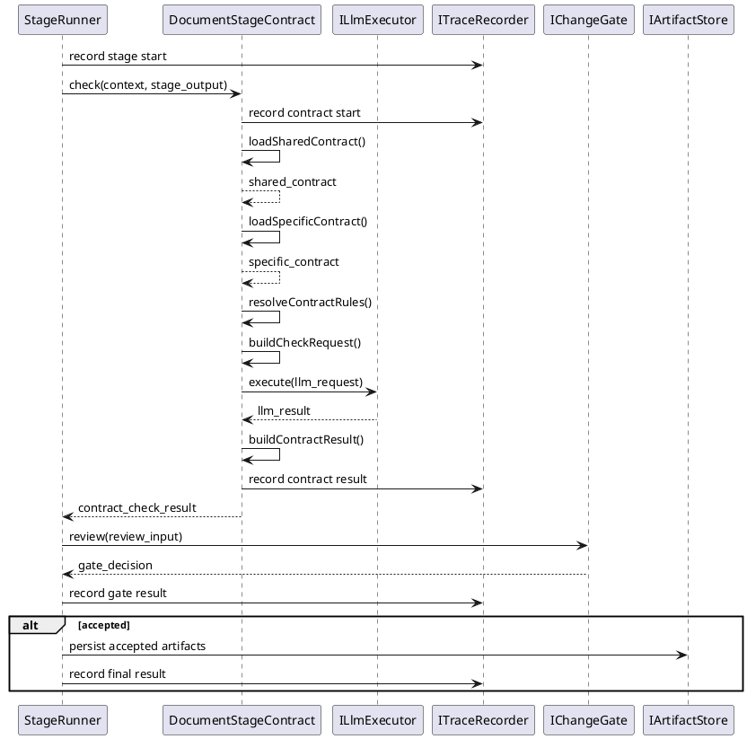
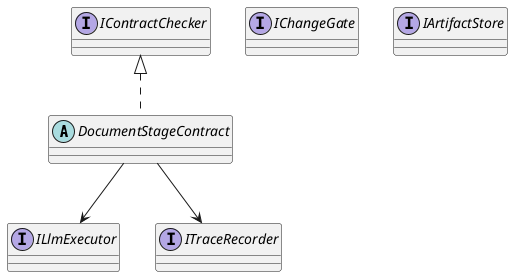

# DocumentStageContract Pattern

## 1. Purpose

Define the shared runtime pattern used by document-oriented stages whose workflow shape is:

1. receive document-stage input from the stage runner
2. load shared document-stage contract rules
3. merge specific contract rules
4. build contract-check request
5. call the shared llm execution interface
6. convert model output into contract-check result
7. record key runtime events
8. send review input to `QualityGate/ChangeGate`
9. persist accepted artifacts for downstream stages

In this pattern, `DocumentStageContract` owns the contract-check flow and contract-internal trace recording. Gate review and artifact persistence remain runner-side workflow steps that collaborate with the contract result.

This pattern is the shared design reference for:

- `Contract/RequirementContract`
- `Contract/ArchitectureDesignContract`
- `Contract/ModuleDesignContract`

Each concrete module should use one contract class as the module entry and orchestration owner.

## 2. Shared Binding

`DocumentStageRunner`-style stages bind:

- `DocumentStageContract`
- `IContractChecker`
- `ILlmExecutor`
- `ITraceRecorder`

Runner-side workflow collaboration after `check`:

- `IChangeGate`
- `IArtifactStore`

## 3. Shared Runtime Flow



## 4. Shared Interfaces

Reuse the shared workflow interfaces defined in [Pipeline.md](../Workflow/Pipeline.md):

- `DocumentStageContract`
- `IContractChecker`
- `ILlmExecutor`
- `ITraceRecorder`

Runner-side workflow collaboration interfaces referenced by this pattern:

- `IChangeGate`
- `IArtifactStore`

Parent-class method model:

```ts
abstract class DocumentStageContract implements IContractChecker {
  async check(
    context: StageRunContext,
    output: StageOutput,
  ): Promise<ContractCheckResult>

  protected abstract loadSharedContract(): Promise<ContractSpec>
  protected abstract loadSpecificContract(): Promise<ContractSpec>
  protected resolveContractRules(
    sharedContract: ContractSpec,
    specificContract: ContractSpec,
  ): ContractSpec
  protected abstract buildCheckRequest(
    output: StageOutput,
    contractSpec: ContractSpec,
  ): LlmExecutionRequest
  protected async executeCheck(
    request: LlmExecutionRequest,
  ): Promise<LlmExecutionResult>
  protected abstract buildContractResult(
    result: LlmExecutionResult,
  ): ContractCheckResult
}
```

Parent-class rule:

- `check` is shared orchestration logic
- `resolveContractRules` is shared merge logic
- `executeCheck` is shared llm execution logic
- shared contract loading, specific contract loading, check-request building, and contract-result building are extension points left to concrete subclasses
- `ITraceRecorder` is a contract-internal collaboration dependency used by `check`
- `IChangeGate` and `IArtifactStore` appear in this pattern as runner-side workflow collaboration points
- gate review is triggered after `check` returns, but gate behavior is not implemented inside `DocumentStageContract`

## 5. Shared Responsibilities



- `DocumentStageContract` owns the shared check orchestration flow.
- Shared contract loading, specific contract loading, rule resolution, check-request building, LLM execution, contract-result building, and contract trace recording are logical responsibilities inside that flow.
- gate review and artifact persistence stay runner-side workflow collaborations after `check` returns.

## 6. Shared Input And Output Boundaries

### 6.1 Contract Input

- `StageRunContext`
- document-oriented `StageOutput`

### 6.2 Contract Rule Input

- shared document-stage contract source
- specific contract rule source

Shared contract model:

```ts
interface ContractSpec {
  document_contracts: DocumentContract[]
  section_contracts: SectionContract[]
}

interface DocumentContract {
  check_item: string
  description: string
  severity: string
}

interface SectionContract {
  section_id: string
  title: string
  checkitems: string[]
  severity: string
}
```

Shared check-item rule:

- `document_contracts` check items must be read directly from the JSON fields of each `DocumentContract`
- `section_contracts` check items must be read directly from the JSON fields of each `SectionContract`
- contract checking must not invent extra check dimensions outside the loaded JSON contract source

Shared check result model:

```ts
interface ContractCheckResult {
  passed: boolean
  summary: string
  issues: ContractIssue[]
}

interface ContractIssue {
  checkItem: string
  message: string
  severity: string
}
```

Shared check result rule:

- `passed` is `true` only when all contract check items pass
- `summary` must describe the overall contract-check result
- failed items must be returned in `issues`
- each failed item must include:
  - the corresponding contract item in `checkItem`
  - the identified problem and suggested fix in `message`
  - the issue severity in `severity`

Expected result shape:

```text
passed: {true|false}
summary: {summary}
issues:
1. {checkItem}
   message: {problem + suggestion}
   severity: {severity}
2. {checkItem}
   message: {problem + suggestion}
   severity: {severity}
3. ...
```

### 6.3 LLM Check Input / Output

- input: `LlmExecutionRequest`
- output: `LlmExecutionResult`
- the parent class owns the shared llm call path
- concrete subclasses own the concrete prompt input and result interpretation

### 6.4 Review Input

- stage summary
- reviewable files or document content
- changed paths when the stage output is file-based

### 6.5 Review Output

- `GateDecision.action`
- `GateDecision.summary`
- optional `GateDecision.comment`

## 7. Stage-Specific Rule

Each concrete contract document should define only its own:

- inheritance from `DocumentStageContract`
- implementation class
- specific contract rules added on top of the shared document-stage contract
- check target and contract source
- record events or event metadata that differ from the shared pattern
- review input/output restrictions
- artifact naming restrictions
