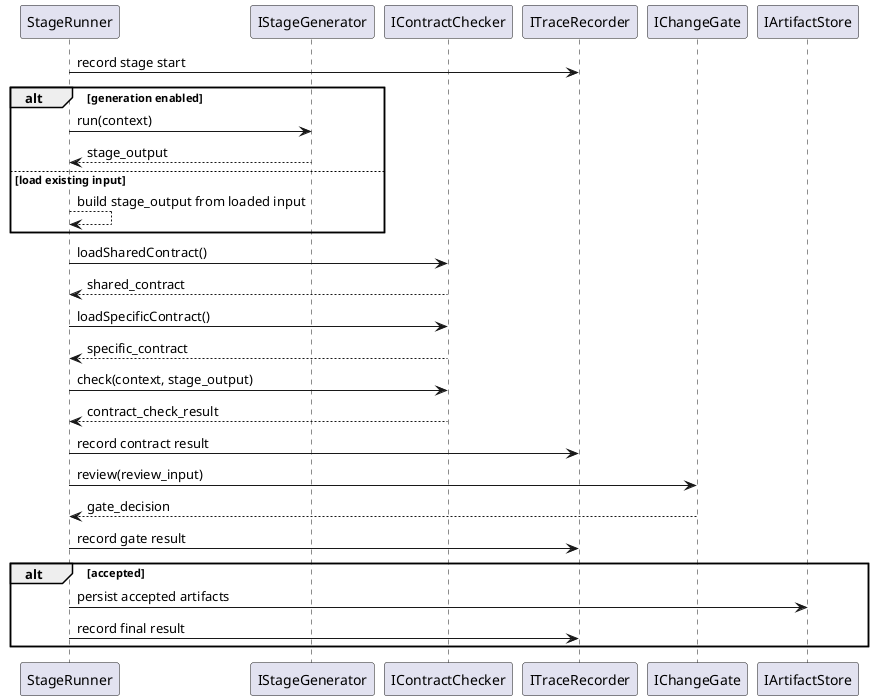
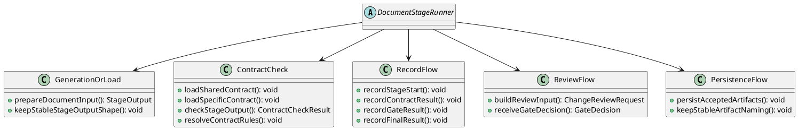

# DocumentStageContract Pattern

## 1. Purpose

Define the shared runtime pattern used by document-oriented stages whose workflow shape is:

1. generate or load document input
2. load shared document-stage contract rules
3. merge specific contract rules
4. check the document against the resolved contract rules
5. record key runtime events
6. send review input to `QualityGate/ChangeGate`
7. persist accepted artifacts for downstream stages

This pattern is the shared design reference for:

- `Contract/RequirementContract`
- `Contract/ArchitectureDesignContract`
- `Contract/ModuleDesignContract`

## 2. Shared Binding

`DocumentStageRunner`-style stages bind:

- `IStageGenerator` when the stage has generation behavior
- `IContractChecker`
- `ITraceRecorder`
- `IChangeGate`
- `IArtifactStore`

## 3. Shared Runtime Flow



## 4. Shared Interfaces

Reuse the shared workflow interfaces defined in [Pipeline.md](../Workflow/Pipeline.md):

- `IStageGenerator`
- `IContractChecker`
- `ITraceRecorder`
- `IChangeGate`
- `IArtifactStore`

## 5. Shared Responsibilities



## 6. Shared Input And Output Boundaries

### 6.1 Generation Input

- upstream stage artifacts
- current stage params
- workspace context when needed

### 6.2 Contract Input

- `StageRunContext`
- document-oriented `StageOutput`
- shared document-stage contract source
- specific contract rule source

Shared contract model:

```ts
interface ContractSpec {
  document_contracts: DocumentContract[]
  section_contracts: SectionContract[]
}

interface DocumentContract {
  check_item: string
  description: string
  severity: string
}

interface SectionContract {
  section_id: string
  title: string
  checkitems: string[]
  severity: string
}
```

Shared check-item rule:

- `document_contracts` check items must be read directly from the JSON fields of each `DocumentContract`
- `section_contracts` check items must be read directly from the JSON fields of each `SectionContract`
- contract checking must not invent extra check dimensions outside the loaded JSON contract source

Shared check result model:

```ts
interface ContractCheckResult {
  passed: boolean
  summary: string
  issues: ContractIssue[]
}

interface ContractIssue {
  checkItem: string
  message: string
  severity: string
}
```

Shared check result rule:

- `passed` is `true` only when all contract check items pass
- `summary` must describe the overall contract-check result
- failed items must be returned in `issues`
- each failed item must include:
  - the corresponding contract item in `checkItem`
  - the identified problem and suggested fix in `message`
  - the issue severity in `severity`

Expected result shape:

```text
passed: {true|false}
summary: {summary}
issues:
1. {checkItem}
   message: {problem + suggestion}
   severity: {severity}
2. {checkItem}
   message: {problem + suggestion}
   severity: {severity}
3. ...
```

### 6.3 Review Input

- stage summary
- reviewable files or document content
- changed paths when the stage output is file-based

### 6.4 Review Output

- `GateDecision.action`
- `GateDecision.summary`
- optional `GateDecision.comment`

## 7. Stage-Specific Rule

Each concrete contract document should define only its own:

- implementation interface and implementation class
- generation rule or no-generation rule
- specific contract rules added on top of the shared document-stage contract
- check target and contract source
- record events or event metadata that differ from the shared pattern
- review input/output restrictions
- artifact naming restrictions
