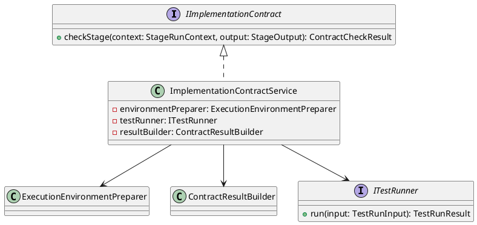
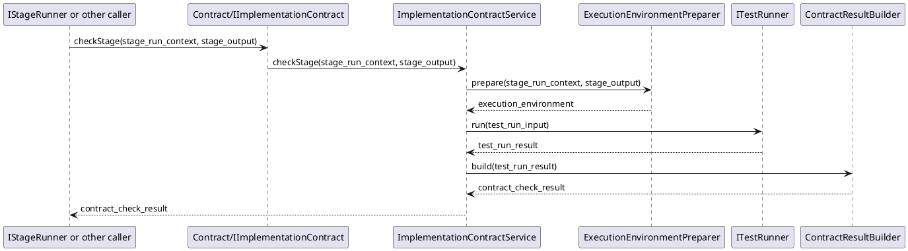

# ImplementationContract Design

## 1. Goal

### 1.1 Purpose

Define the module design of `Contract/ImplementationContract`.

### 1.2 Involved Modules

This module design directly involves:

- `Contract/ImplementationContract`

This module design collaborates with:

- `Workflow/Pipeline`
- `Execution/ImplementationGenerator`

### 1.3 Core Functions

`Contract/ImplementationContract` is the implementation-result validation module.

Its core functions are:

- accept the structured result generated by the upstream implementation generator
- prepare the runtime environment required for validation
- run one unit-test script for the changed code
- return whether the execution result is successful

`ImplementationContract` does not decide workflow progression, gate approval, or artifact persistence.

## 2. Core Classes

### 2.1 Class Diagram



### 2.2 `ImplementationContractService`

Role:

- module entry point
- owns implementation contract check orchestration

Responsibilities:

- accept contract check request
- prepare the validation environment
- run one unit-test script for the changed code in the prepared environment
- convert runtime result into structured `ContractCheckResult`

### 2.3 `ExecutionEnvironmentPreparer`

Role:

- validation environment preparation component

Responsibilities:

- prepare the runnable environment from the generated implementation result
- prepare one unit-test script execution prerequisite for the changed code
- return stable runtime input for test run

### 2.4 `ITestRunner`

Role:

- test execution interface

Responsibilities:

- run one unit-test script for the changed code in the prepared execution context
- return normalized test result

### 2.5 `ContractResultBuilder`

Role:

- structured result conversion component

Responsibilities:

- convert test run result into `ContractCheckResult`
- keep success and failure structure stable for downstream modules

### 2.6 `IImplementationContract`

Role:

- abstract contract interface for this module

Responsibilities:

- expose `checkStage` to the stage runner or equivalent caller

## 3. Core Runtime Flow

### 3.1 Main Sequence Diagram



## 4. Detailed Design

### 4.1 Core APIs And Fields

#### 4.1.1 Public API

```ts
interface IImplementationContract {
  checkStage(context: StageRunContext, output: StageOutput): ContractCheckResult
}
```

#### 4.1.2 Input Types

```ts
interface GeneratedImplementationResult {
  changed_files: ChangedFile[]
  summary: string
}

interface ChangedFile {
  path: string
  operation: string
  content?: string
}

interface UnitTestCommand {
  name: string
  command: string
}
```

`StageRunContext` and `StageOutput` are defined by upstream workflow and execution contracts and are reused here directly.

#### 4.1.3 Runtime Types

```ts
interface ExecutionEnvironment {
  generated_result: GeneratedImplementationResult
  unit_test_script: UnitTestCommand
  workdir: string
}

interface ExecutionEnvironmentPreparer {
  prepare(context: StageRunContext, output: StageOutput): ExecutionEnvironment
}

interface TestRunInput {
  environment: ExecutionEnvironment
}

interface TestRunResult {
  success: boolean
  script_name: string
  summary: string
  logs?: string
}

interface ITestRunner {
  run(input: TestRunInput): TestRunResult
}
```

#### 4.1.4 Result Types

```ts
interface ContractCheckResult {
  passed: boolean
  summary: string
  issues: ContractIssue[]
}

interface ContractIssue {
  check_item: string
  message: string
  severity: string
}

interface ContractResultBuilder {
  build(test_run_result: TestRunResult): ContractCheckResult
}
```

Result conversion rules:

- `passed` should be `true` only when the required unit-test script for the changed code passes.
- a failed unit-test script should be returned as a structured issue in `issues`.

### 4.2 Constraints

- `ImplementationContract` must not decide workflow progression.
- `ImplementationContract` must not decide whether the checked result is approved.
- `ImplementationContract` should validate the generated implementation result by executing one unit-test script for the changed code in the prepared environment.
- `ImplementationContract` should not be used as the final-program validation module.
- `ImplementationContract` should return stable success or failure result through `ContractCheckResult`.
