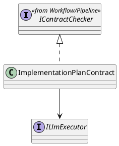
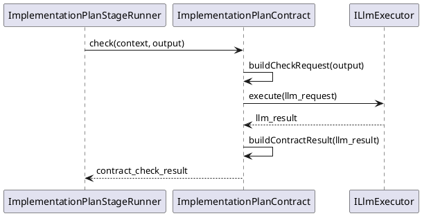

# ImplementationPlanContract Design

## 1. Goal

### 1.1 Purpose

Define the module design of `Contract/ImplementationPlanContract`.

### 1.2 Involved Modules

This module design directly involves:

- `Contract/ImplementationPlanContract`

This module design collaborates with:

- `Workflow/Pipeline`
- `Execution/ImplementationPlanGenerator`
- `SDK/LlmExecutor`

### 1.3 Core Functions

`Contract/ImplementationPlanContract` is the implementation-plan contract-check module.

Its core functions are:

- check implementation-plan-stage generated workplan output
- return structured `ContractCheckResult`

`ImplementationPlanContract` does not decide workflow progression, gate approval, or artifact persistence.

## 2. Core Classes

### 2.1 Class Diagram



## 3. Core Runtime Flow



## 4. Detailed Design

### 4.1 Check Target Rule

- check target field path is `output.artifacts.steps`

### 4.2 Review Input Rule

```ts
ChangeReviewRequest {
  taskId: context.taskId
  stageId: "implementation_plan_generation"
  summary: output.summary
  changedPaths: ["plans/implementation/{moduleName}.plan.json"]
  changedFiles: [
    {
      path: "plans/implementation/{moduleName}.plan.json",
      operation: "create_or_update",
      content: output.summary,
    },
  ]
}
```

### 4.3 Persistence Limit

- `ImplementationPlanStageRunner` persists accepted output to `plans/implementation/{moduleName}.plan.json`
- downstream `ImplementationGenerator` receives accepted output through `inputArtifacts["implementation_workplan"]`
