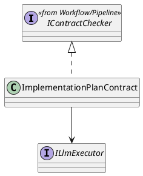
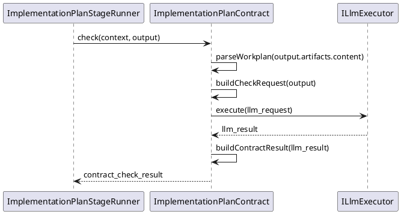

# ImplementationPlanContract Design

## 1. Goal

### 1.1 Purpose

Define the module design of `Contract/ImplementationPlanContract`.

### 1.2 Involved Modules

This module design directly involves:

- `Contract/ImplementationPlanContract`

This module design collaborates with:

- `Workflow/Pipeline`
- `Execution/ImplementationPlanGenerator`
- `SDK/LlmExecutor`

### 1.3 Core Functions

`Contract/ImplementationPlanContract` is the implementation-plan contract-check module.

Its core functions are:

- check implementation-plan-stage generated workplan output
- parse generated markdown workplan content into structured runtime workplan data
- check whether the workplan stays aligned with requirement, architecture, and module-design inputs
- provide parsed structured workplan output for downstream runtime consumption after acceptance
- return structured `ContractCheckResult`

`ImplementationPlanContract` does not decide workflow progression, gate approval, or artifact persistence.

## 2. Core Classes

### 2.1 Class Diagram



## 3. Core Runtime Flow



## 4. Detailed Design

### 4.1 Check Target Rule

- check target field path is `output.artifacts.content`
- parse target field path is `output.artifacts.content`
- alignment context sources are:
  - `context.inputArtifacts["requirement_document"]`
  - `context.inputArtifacts["architecture_document"]`
  - `context.inputArtifacts["module_design_documents"]`

Structured runtime output:

```ts
interface ImplementationWorkPlan {
  steps: ImplementationWorkPlanStep[]
}

interface ImplementationWorkPlanStep {
  stepId: string
  title: string
  status: "not_started" | "in_progress" | "completed"
  architecture_modules_in_scope: string[]
  batches: ImplementationWorkPlanBatch[]
}

interface ImplementationWorkPlanBatch {
  batchId: string
  title: string
  status: "not_started" | "in_progress" | "completed"
  tasks: string[]
}
```

Contract parsing rule:

- `ImplementationPlanContract` parses accepted markdown workplan content into `ImplementationWorkPlan`
- contract validation should be performed against the parsed structure plus upstream alignment context
- downstream runtime should consume the parsed structure instead of re-parsing raw markdown

### 4.2 Review Input Rule

```ts
ChangeReviewRequest {
  taskId: context.taskId
  stageId: "implementation_plan"
  summary: output.summary
  changedPaths: ["sdlc/docs/CodeGenerationExecutionPlan.md"]
  changedFiles: [
    {
      path: "sdlc/docs/CodeGenerationExecutionPlan.md",
      operation: "create_or_update",
      content: output.artifacts.content,
    },
  ]
}
```

### 4.3 Persistence Limit

- `ImplementationPlanStageRunner` persists accepted output to `sdlc/docs/CodeGenerationExecutionPlan.md`
- downstream `ImplementationGenerator` receives the accepted workplan through `inputArtifacts["implementation_workplan"]`
- downstream runtime also receives the parsed `ImplementationWorkPlan` structure prepared by `ImplementationPlanContract`
