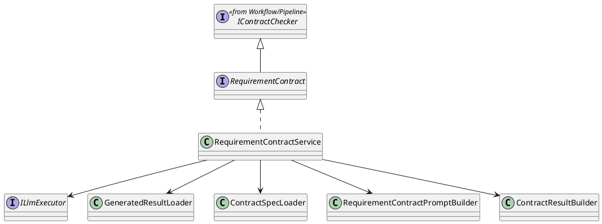
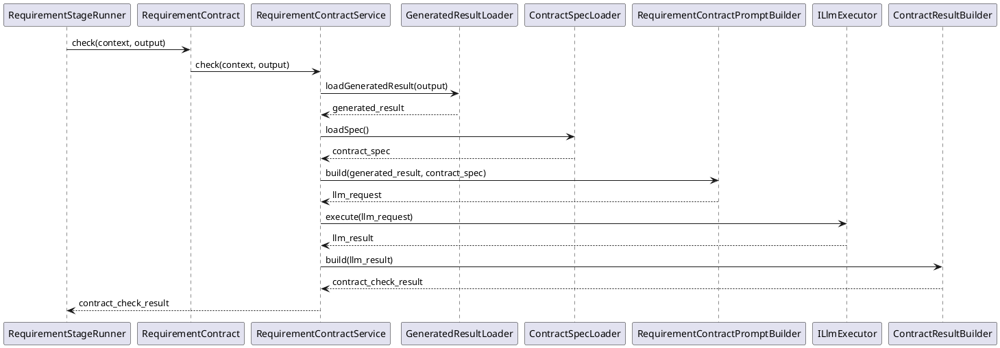

<!--
AI_EDIT_PROTECTION:
- This file is protected.
- Do not modify this file unless the user explicitly requests changes to this exact file.
-->

# RequirementContract Design

## 1. Goal

### 1.1 Purpose

Define the module design of `Contract/RequirementContract`.

### 1.2 Involved Modules

This module design directly involves:

- `Contract/RequirementContract`

This module design collaborates with:

- `Workflow/Pipeline`
- `Execution/RequirementGenerator`
- `SDK/LlmExecutor`

### 1.3 Core Functions

`Contract/RequirementContract` is the requirement-stage document contract-check module.

Its core functions are:

- follow the shared flow defined in [DocumentStageContractPattern.md](./DocumentStageContractPattern.md)
- check requirement-stage raw input or normalized requirement document
- return structured `ContractCheckResult`

`RequirementContract` does not decide workflow progression, gate approval, or artifact persistence.

## 2. Core Classes

### 2.1 Class Diagram

### 2.2 `RequirementContract`

Role:

- requirement-stage contract-check interface

Responsibilities:

- expose `check(context, output)`
- keep requirement-stage contract entry stable for `RequirementStageRunner`

### 2.3 `RequirementContractService`

Role:

- module implementation entry

Responsibilities:

- orchestrate requirement-stage contract check flow
- load requirement-stage check target
- load contract specification
- build contract-check request
- convert check result into `ContractCheckResult`

## 3. Core Runtime Flow

### 3.1 Main Sequence Diagram

## 4. Detailed Design

### 4.1 Implementation Binding

- Implementation interface: `RequirementContract` extends `IContractChecker`
- Implementation class: `RequirementContractService` implements `RequirementContract`
- Bound by: `RequirementStageRunner`

`RequirementStageRunner` binds:

- `RequirementGenerator`
- `RequirementContract`
- `ITraceRecorder`
- `IChangeGate`
- `IArtifactStore`

### 4.2 Stage-Specific Runtime Rules

#### 4.2.1 Generation

- generation rule follows requirement-stage runtime decision
- when generation is disabled, `RequirementStageRunner` loads raw requirement input directly
- when generation is enabled, output must stay requirement-stage document shaped

#### 4.2.2 Check

- check target is raw requirement-stage input or requirement-stage normalized document
- contract source is `meta_layer/resources/contract/RequirementTemplate.contract.json`
- contract-specific rules are requirement document structure rules, requirement scope consistency rules, and workflow/goal alignment rules
- checker output is `ContractCheckResult`

#### 4.2.3 Record

- record stage start
- record requirement contract result
- record review result
- record accepted artifact persistence result

#### 4.2.4 Review Input / Output Limit

- review input must contain requirement-stage document summary and artifacts only
- review output is limited to `GateDecision`

#### 4.2.5 Persistence Limit

- only accepted requirement-stage artifacts may be persisted for downstream stages

### 4.3 Constraints

- reuse the shared flow from [DocumentStageContractPattern.md](./DocumentStageContractPattern.md)
- keep requirement-stage implementation names owned by this module
- do not redefine workflow-owned shared interfaces from [Pipeline.md](../Workflow/Pipeline.md)
