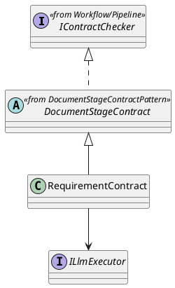
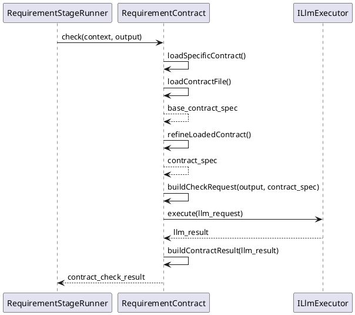

<!--
AI_EDIT_PROTECTION:
- This file is protected.
- Do not modify this file unless the user explicitly requests changes to this exact file.
-->

# RequirementContract Design

## 1. Goal

### 1.1 Purpose

Define the module design of `Contract/RequirementContract`.

### 1.2 Involved Modules

This module design directly involves:

- `Contract/RequirementContract`

This module design collaborates with:

- `Workflow/Pipeline`
- `Execution/RequirementGenerator`
- `SDK/LlmExecutor`

### 1.3 Core Functions

`Contract/RequirementContract` is the requirement-stage document contract-check module.

Its core functions are:

- follow the shared flow defined in [DocumentStageContractPattern.md](./DocumentStageContractPattern.md)
- check requirement-stage raw input or normalized requirement document
- return structured `ContractCheckResult`

`RequirementContract` does not decide workflow progression, gate approval, or artifact persistence.

## 2. Core Classes

### 2.1 Class Diagram



### 2.2 `RequirementContract`

Role:

- requirement-stage contract-check implementation entry

Responsibilities:

- expose `check(context, output)`
- keep requirement-stage contract entry stable for `RequirementStageRunner`
- implement the abstract extension points defined by `DocumentStageContract`
- provide requirement-stage-specific contract sources and check-request building
- convert check result into `ContractCheckResult`

## 3. Core Runtime Flow

### 3.1 Main Sequence Diagram



## 4. Detailed Design

### 4.1 Implementation Binding

- Parent class: `DocumentStageContract`
- Implementation class: `RequirementContract` extends `DocumentStageContract`
- Bound by: `RequirementStageRunner`

`RequirementStageRunner` binds:

- `RequirementGenerator`
- `RequirementContract`
- `ITraceRecorder`
- `IChangeGate`
- `IArtifactStore`

Overridden methods:

- `getContractFilePath()`
- `getStageId()`
- `refineLoadedContract(baseSpec)`
- `buildCheckRequest(output, contractSpec)`
- `buildContractResult(result)`

### 4.2 Stage-Specific Runtime Rules

#### 4.2.1 Generation

- generation rule follows requirement-stage runtime decision
- when generation is disabled, `RequirementStageRunner` loads raw requirement input directly
- when generation is enabled, output must stay requirement-stage document shaped

#### 4.2.2 Check

- check target is raw requirement-stage input or requirement-stage normalized document
- check target field path is `output.artifacts.content`
- contract source is `meta_layer/resources/contract/RequirementTemplate.contract.json`
- shared parent logic injects `specific_contract.source` and `specific_contract.stage`
- subclass may refine the loaded contract after file loading when later requirement-stage metadata is needed
- contract-specific rules are requirement document structure rules, requirement scope consistency rules, and workflow/goal alignment rules
- checker output is `ContractCheckResult`

#### 4.2.3 Record

- record stage start
- record requirement contract result
- record review result
- record accepted artifact persistence result

#### 4.2.4 Review Input / Output Limit

- review input must contain requirement-stage document summary and artifacts only
- review output is limited to `GateDecision`

Recommended review-request mapping:

```ts
ChangeReviewRequest {
  taskId: context.taskId
  stageId: "requirement_interpretation"
  summary: output.summary
  changedPaths: ["sdlc/docs/requirements/Requirement.md"]
  changedFiles: [
    {
      path: "sdlc/docs/requirements/Requirement.md",
      operation: "create_or_update",
      content: output.artifacts.content,
    },
  ]
}
```

#### 4.2.5 Persistence Limit

- only accepted requirement-stage artifacts may be persisted for downstream stages
- `RequirementStageRunner` persists accepted output to `sdlc/docs/requirements/Requirement.md`
- downstream `ArchitectureDesignGenerator` receives the persisted content through `inputArtifacts["requirement_document"]`

### 4.3 Constraints

- reuse the shared flow from [DocumentStageContractPattern.md](./DocumentStageContractPattern.md)
- keep shared orchestration in parent `DocumentStageContract.check`
- keep requirement-stage implementation names owned by this module
- do not redefine workflow-owned shared interfaces from [Pipeline.md](../Workflow/Pipeline.md)
