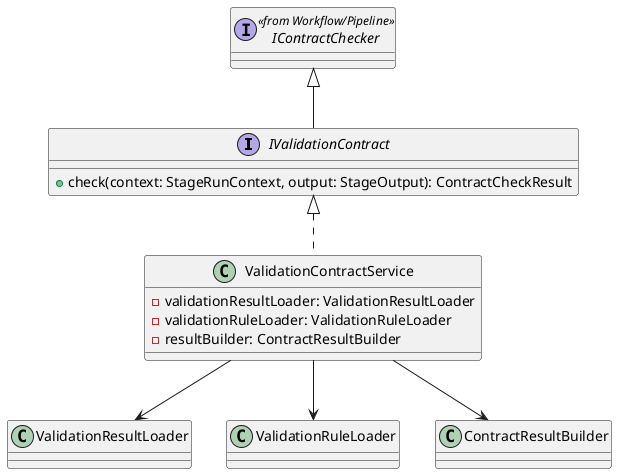
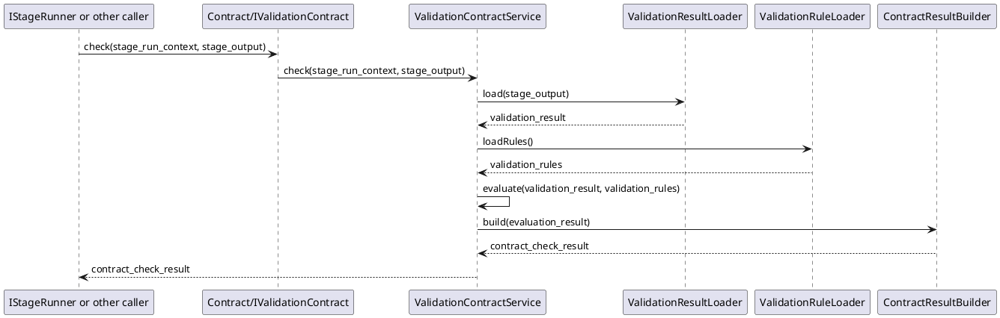

# ValidationContract Design

## 1. Goal

### 1.1 Purpose

Define the module design of `Contract/ValidationContract`.

### 1.2 Involved Modules

This module design directly involves:

- `Contract/ValidationContract`

This module design collaborates with:

- `Workflow/Pipeline`
- `Workflow/StageRunners`

### 1.3 Core Functions

`Contract/ValidationContract` is the validation-stage contract check module.

Its core functions are:

- read validation stage output data
- evaluate output against validation contract rules
- return structured `ContractCheckResult`

`ValidationContract` does not decide workflow progression, gate approval, or artifact persistence.

## 2. Core Classes

### 2.1 Class Diagram



### 2.2 `ValidationContractService`

Role:

- module entry implementation
- owns validation contract check orchestration

Responsibilities:

- accept contract check request
- load validation-stage output content
- load validation contract rules
- evaluate contract items
- build and return structured `ContractCheckResult`

### 2.3 `ValidationResultLoader`

Role:

- validation output loading component

Responsibilities:

- read required validation output data from `StageOutput`

### 2.4 `ValidationRuleLoader`

Role:

- contract rule loading component

Responsibilities:

- load validation contract rule set

### 2.5 `ContractResultBuilder`

Role:

- structured result conversion component

Responsibilities:

- convert evaluation result into `ContractCheckResult`
- keep pass/fail output structure stable

### 2.6 `IValidationContract`

Role:

- public contract-check interface of this module

Responsibilities:

- expose shared `check(context, output)` API
- stay compatible with `IContractChecker`

## 3. Core Runtime Flow

### 3.1 Main Sequence Diagram



## 4. Detailed Design

### 4.1 Core APIs And Fields

#### 4.1.1 Public API

```ts
interface IValidationContract extends IContractChecker {}

class ValidationContractService implements IValidationContract {
  check(context: StageRunContext, output: StageOutput): ContractCheckResult
}
```

`IContractChecker` is the shared checker interface defined in [Pipeline.md](../Workflow/Pipeline.md). This module extends that shared interface and uses `check` as the only pipeline-facing API.

#### 4.1.2 Input Types

```ts
interface ValidationResult {
  passed: boolean
  summary: string
  passed_commands: string[]
  failed_commands: string[]
  logs?: string
}

interface ValidationRule {
  rule_id: string
  description: string
  severity: string
}
```

`StageRunContext` and `StageOutput` are defined by upstream workflow contracts and are reused directly.

#### 4.1.3 Return Type

```ts
interface ContractCheckResult {
  passed: boolean
}
```

### 4.2 Constraints

- `ValidationContract` only evaluates validation-stage output against contract rules.
- `ValidationContract` must not execute validation scripts directly.
- `ValidationContract` must not decide workflow progression.
- `ValidationContract` must not decide gate approval.
- `ValidationContract` must not persist artifacts or traces directly.
