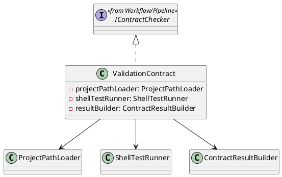
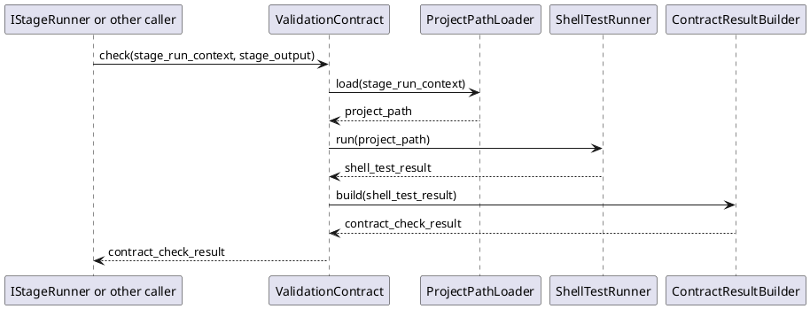

# ValidationContract Design

## 1. Goal

### 1.1 Purpose

Define the module design of `Contract/ValidationContract`.

### 1.2 Involved Modules

This module design directly involves:

- `Contract/ValidationContract`

This module design collaborates with:

- `Workflow/Pipeline`
- `Workflow/StageRunners`

### 1.3 Core Functions

`Contract/ValidationContract` is the validation-stage contract check module.

Its core functions are:

- read the target project path from validation-stage input
- execute one shell test script under that project path
- return structured `ContractCheckResult`

`ValidationContract` does not decide workflow progression, gate approval, or artifact persistence.

## 2. Core Classes

### 2.1 Class Diagram



### 2.2 `ValidationContract`

Role:

- module entry implementation
- owns validation contract check orchestration

Responsibilities:

- accept contract check request
- load the target project path
- execute one shell test script under that project path
- build and return structured `ContractCheckResult`

### 2.3 `ProjectPathLoader`

Role:

- project path loading component

Responsibilities:

- read required project path from validation-stage input
- resolve the shell test execution target path

### 2.4 `ShellTestRunner`

Role:

- shell test execution component

Responsibilities:

- run one shell test script under the target project path
- return normalized shell execution result

### 2.5 `ContractResultBuilder`

Role:

- structured result conversion component

Responsibilities:

- convert evaluation result into `ContractCheckResult`
- keep pass/fail output structure stable

## 3. Core Runtime Flow

### 3.1 Main Sequence Diagram



## 4. Detailed Design

### 4.1 Core APIs And Fields

#### 4.1.1 Public API

```ts
class ValidationContract implements IContractChecker {
  check(
    context: StageRunContext,
    output: StageOutput,
  ): Promise<ContractCheckResult>
}
```

`IContractChecker` is the shared checker interface defined in [Pipeline.md](../Workflow/Pipeline.md). `ValidationContract` implements that shared interface and uses `check` as the only pipeline-facing API.

#### 4.1.2 Input Types

```ts
interface ValidationInputArtifacts {
  project_path: string
}

interface ShellTestResult {
  passed: boolean
  summary: string
  command: string
  exit_code: number
  logs?: string
}

interface ShellTestRunner {
  run(projectPath: string): Promise<ShellTestResult>
}
```

`StageRunContext` and `StageOutput` are defined by upstream workflow contracts and are reused directly.

Validation input source:

- `StageRunContext.inputArtifacts["project_path"]`

Validation input rule:

- `ValidationContract` uses `context.inputArtifacts["project_path"]` as its only business validation input
- `output` is accepted only to stay compatible with the shared `IContractChecker.check(context, output)` signature

#### 4.1.3 Return Type

```ts
interface ContractCheckResult {
  passed: boolean
  summary: string
  issues: ContractIssue[]
}
```

### 4.2 Constraints

- `ValidationContract` validates the incoming project path by executing one shell test script.
- `ValidationContract` must not decide workflow progression.
- `ValidationContract` must not decide gate approval.
- `ValidationContract` must not persist artifacts or traces directly.

Check target rule:

- check target field path is `context.inputArtifacts["project_path"]`
- shell test execution runs under the resolved project path

### 4.3 Review Input / Output Limit

- review input must contain validation summary and shell test result only
- review output is limited to `GateDecision`

Recommended review-request mapping:

```ts
ChangeReviewRequest {
  taskId: context.taskId
  stageId: "validation"
  summary: contractCheckResult.summary
  changedPaths: []
  changedFiles: []
}
```

Validation review note:

- validation gate review is result-oriented rather than file-change-oriented
- runner should pass shell test summary and logs through review summary/comment fields instead of fabricating changed file content
