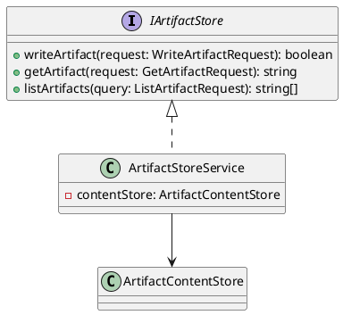
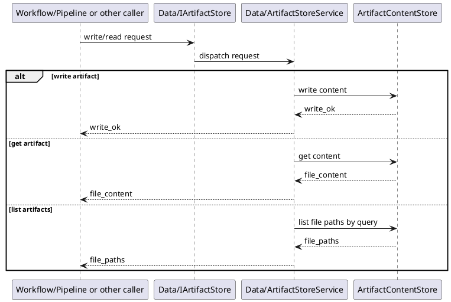

# ArtifactStore Design

## 1. Goal

### 1.1 Purpose

Define the module design of `Data/ArtifactStore`.

### 1.2 Involved Modules

This module design directly involves:

- `Data/ArtifactStore`

This module design collaborates with:

- `Workflow/Pipeline`
- `Contract/*`
- `QualityGate/ChangeGate`

### 1.3 Core Functions

`Data/ArtifactStore` is the artifact persistence module.

Its core functions are:

- persist artifact files
- load stored artifact files
- query artifacts by task and root directory

`ArtifactStore` does not decide workflow progression, contract validity, or gate approval result.

## 2. Core Classes

### 2.1 Class Diagram



### 2.2 `ArtifactStoreService`

Role:

- module entry point
- owns artifact write/read orchestration

Responsibilities:

- expose artifact write API
- expose artifact read API
- expose artifact query API
- coordinate file storage and file lookup

### 2.3 `ArtifactContentStore`

Role:

- raw content persistence component

Responsibilities:

- persist artifact content
- load artifact content by task id and file path

### 2.4 `IArtifactStore`

Role:

- pipeline-owned artifact persistence interface implemented by `Data/ArtifactStore`

Responsibilities:

- provide stable artifact write/read contract to upstream modules

Ownership rule:

- `IArtifactStore` is owned by `Workflow/Pipeline` as a cross-module collaboration interface.
- `Data/ArtifactStore` implements this interface.
- workflow assembly code or concrete stage runners may bind this implementation depending on whether the storage dependency is shared or stage-local.

## 3. Core Runtime Flow

### 3.1 Main Flow



## 4. Detailed Design

### 4.1 Core Model

```ts
type FilePath = string
```

### 4.2 Core APIs And Fields

#### 4.2.1 Public API

```ts
interface IArtifactStore {
  writeArtifact(request: WriteArtifactRequest): boolean
  getArtifact(request: GetArtifactRequest): string
  listArtifacts(query: ListArtifactRequest): string[]
}
```

#### 4.2.2 Write And Query Types

```ts
interface WriteArtifactRequest {
  task_id: string
  stage_id: string
  file_path: FilePath
  content: string
}

interface GetArtifactRequest {
  task_id: string
  stage_id: string
  file_path: FilePath
}

interface ListArtifactRequest {
  task_id: string
  stage_id: string
  root_dir: FilePath
}
```

### 4.3 Storage Shape

```text
artifact_store/
  {task_id}/
    {root_dir}/
      {file_path}
```

### 4.4 Constraints

- `ArtifactStore` must not decide whether an artifact is valid.
- `ArtifactStore` must not decide whether an artifact should be approved or applied.
- the storage model should stay caller-agnostic.
- `ArtifactStore` only stores files.
- `ArtifactStore` should remain queryable by task and root directory.
