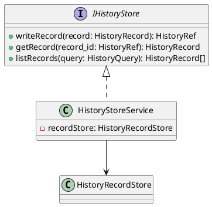
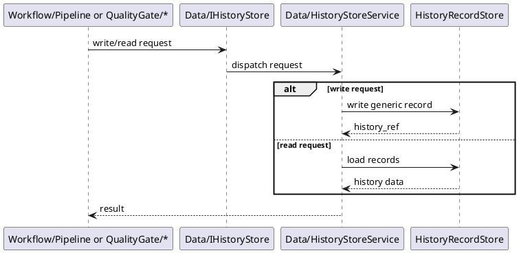

# HistoryStore Design

## 1. Goal

### 1.1 Purpose

Define the module design of `Data/HistoryStore`.

### 1.2 Involved Modules

This module design directly involves:

- `Data/HistoryStore`

This module design collaborates with:

- `Workflow/Pipeline`
- `QualityGate/Trace`
- `QualityGate/ChangeGate`

### 1.3 Core Functions

`Data/HistoryStore` is the process-history persistence module.

Its core functions are:

- persist generic history records
- persist append-only history events
- provide query capability by scope, category, and record id

`HistoryStore` does not orchestrate workflow progression and does not store artifact content.

## 2. Core Classes

### 2.1 Class Diagram



### 2.2 `HistoryStoreService`

Role:

- module entry point
- owns history read/write orchestration

Responsibilities:

- expose generic history write APIs
- expose generic history query APIs
- route persistence requests to record storage

### 2.3 `HistoryRecordStore`

Role:

- raw history record persistence component

Responsibilities:

- persist generic history records
- persist append-only history records

### 2.4 `IHistoryStore`

Role:

- abstract history persistence interface

Responsibilities:

- provide stable write/read contract to upstream modules

## 3. Core Runtime Flow

### 3.1 Main Flow



## 4. Detailed Design

### 4.1 Record Model

```ts
type HistoryRef = string

type HistoryCategory = string
```

### 4.2 Core APIs And Fields

#### 4.2.1 Public API

```ts
interface IHistoryStore {
  writeRecord(record: HistoryRecord): HistoryRef
  getRecord(record_id: HistoryRef): HistoryRecord
  listRecords(query: HistoryQuery): HistoryRecord[]
}
```

#### 4.2.2 Generic Record Types

```ts
interface HistoryRecord {
  record_id?: HistoryRef
  category: HistoryCategory
  task_id?: string
  stage_id?: string
  stage_run_id?: string
  summary?: string
  payload: Record<string, unknown>
}

interface HistoryQuery {
  category?: HistoryCategory
  task_id?: string
  stage_id?: string
  stage_run_id?: string
}
```

#### 4.2.3 Example Payload Shapes

```ts
interface TaskStatePayload {
  status: string
  current_stage_id?: string
  requested_by?: string
}

interface StageStatePayload {
  status: string
  attempt?: number
  error?: StageError
}

interface TraceEventPayload {
  event_type: string
  message: string
}

interface ReviewEventPayload {
  decision: string
  comment?: string
}
```

#### 4.2.4 Error Type

```ts
interface StageError {
  code: string
  message: string
}
```

### 4.3 Storage Shape

```text
history_store/
  records/
    {record_id}.json
```

### 4.4 Constraints

- `HistoryStore` must not store artifact content.
- `HistoryStore` must not decide workflow transition logic.
- the storage model should stay caller-agnostic.
- history records should be append-only.
- `HistoryStore` should remain queryable by scope and category string.
