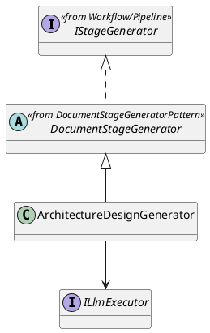
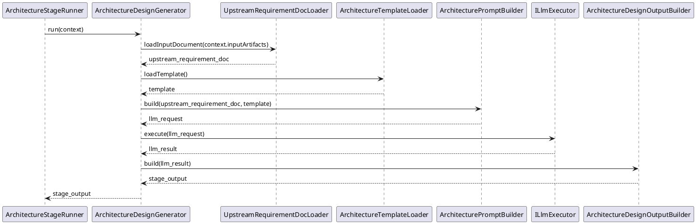

# ArchitectureDesignGenerator Design

## 1. Goal

### 1.1 Purpose

Define the module design of `Execution/ArchitectureDesignGenerator`.

### 1.2 Involved Modules

This module design directly involves:

- `Execution/ArchitectureDesignGenerator`

This module design collaborates with:

- `Workflow/Pipeline`
- `SDK/LlmExecutor`

### 1.3 Core Functions

`Execution/ArchitectureDesignGenerator` is the architecture-design document generation module.

Its core functions are:

- follow the shared flow defined in [DocumentStageGeneratorPattern.md](./DocumentStageGeneratorPattern.md)
- load requirement-stage file content
- load the architecture template file content
- generate one architecture-design file content from the two inputs
- return structured `StageOutput`

`ArchitectureDesignGenerator` does not decide workflow progression, contract validity, or gate approval result.

## 2. Core Classes

### 2.1 Class Diagram



### 2.2 `ArchitectureDesignGenerator`

Role:

- architecture-stage generator implementation entry

Responsibilities:

- expose `run(context): Promise<StageOutput>`
- keep architecture-stage generation entry stable for `ArchitectureStageRunner`
- load requirement document input
- load architecture template
- build architecture generation request
- convert generation result into `StageOutput`

## 3. Core Runtime Flow

### 3.1 Main Sequence Diagram



## 4. Detailed Design

### 4.1 Implementation Binding

- Parent class: `DocumentStageGenerator`
- Implementation class: `ArchitectureDesignGenerator` extends `DocumentStageGenerator`
- Bound by: `ArchitectureStageRunner`

`ArchitectureStageRunner` binds:

- `ArchitectureDesignGenerator`
- `ArchitectureDesignContract`
- `ITraceRecorder`
- `IChangeGate`

Overridden methods:

- `loadInputDocument(inputArtifacts)`
- `loadTemplate()`
- `buildPrompt(inputDocument, template)`
- `buildStageOutput(result)`

### 4.2 Stage-Specific Runtime Rules

#### 4.2.1 Input

- upstream file content source is `StageRunContext.inputArtifacts["requirement_document"]`
- input loader reads the requirement document content directly from runner-provided input artifacts

#### 4.2.2 Template

- template file content source is `meta_layer/resources/template/TechnicalArchitectureTemplate.md`

#### 4.2.3 Prompt

- prompt must combine requirement input and architecture template
- prompt must keep output aligned with the architecture template structure

#### 4.2.4 Output

- output is one generated architecture-design file content
- `StageOutput` wraps that file content as architecture-design-stage document artifact
- output artifact shape is:

```ts
interface ArchitectureDesignArtifacts {
  artifactKey: "architecture_document"
  content: string
}
```

- downstream `ModuleDesignGenerator` reads this output through `inputArtifacts["architecture_document"]`
- final persistence path is resolved by `ArchitectureStageRunner` after gate approval:
  - `sdlc/docs/architecture/TechnicalArchitecture.md`

### 4.3 Constraints

- reuse the shared flow from [DocumentStageGeneratorPattern.md](./DocumentStageGeneratorPattern.md)
- keep shared orchestration in parent `DocumentStageGenerator.run`
- keep architecture-stage implementation names owned by this module
- do not redefine workflow-owned shared interfaces from [Pipeline.md](../Workflow/Pipeline.md)
