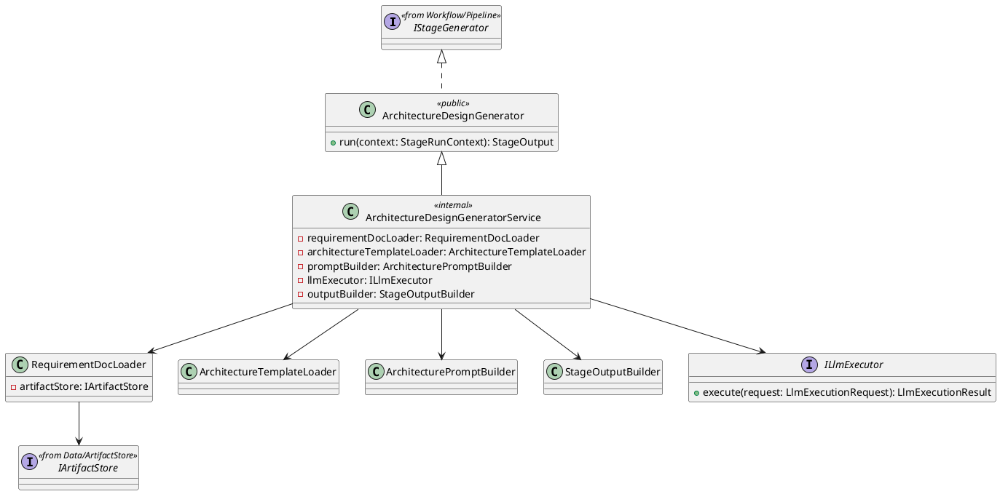
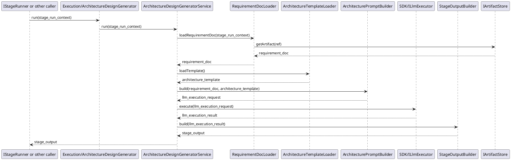

# ArchitectureDesignGenerator Design

## 1. Goal

### 1.1 Purpose

Define the module design of `Execution/ArchitectureDesignGenerator`.

### 1.2 Involved Modules

This module design directly involves:

- `Execution/ArchitectureDesignGenerator`

This module design collaborates with:

- `Workflow/Pipeline`
- `Data/ArtifactStore`

### 1.3 Core Functions

`Execution/ArchitectureDesignGenerator` is the architecture-design generation module.

Its core functions are:

- load the upstream requirement document
- load the required technical architecture template
- call the LLM execution capability to generate an architecture design document from the requirement document according to the template
- return the generated result in a structured `StageOutput`

`ArchitectureDesignGenerator` does not decide workflow progression, contract validity, or gate approval result.

## 2. Core Classes

### 2.1 Class Diagram



### 2.2 `ArchitectureDesignGeneratorService`

Role:

- internal implementation class
- owns architecture design generation orchestration

Responsibilities:

- implement internal stage run orchestration behind `ArchitectureDesignGenerator`
- load the upstream requirement document
- load the required technical architecture template
- build prompt input from the requirement document and template
- call shared `ILlmExecutor`
- convert generation result into structured `StageOutput`

### 2.3 `RequirementDocLoader`

Role:

- upstream requirement document loading component

Responsibilities:

- read the requirement document from `IArtifactStore`

### 2.4 `ArchitectureTemplateLoader`

Role:

- architecture template loading component

Responsibilities:

- load the required technical architecture template
- return stable template content for generation

### 2.5 `ArchitecturePromptBuilder`

Role:

- prompt construction component

Responsibilities:

- transform the requirement document and architecture template into architecture-design generation input
- keep prompt structure aligned with the architecture template
- produce a stable `LlmExecutionRequest` for this stage

### 2.6 `ILlmExecutor`

Role:

- shared llm execution interface

Responsibilities:

- accept prompt-based execution request
- return normalized model result
- isolate agent design and model selection details from the generator service

### 2.7 `StageOutputBuilder`

Role:

- structured output conversion component

Responsibilities:

- convert model output into `StageOutput`
- keep returned file structure stable

### 2.8 `ArchitectureDesignGenerator`

Role:

- public external API class for this module
- module entry point exposed to stage runners

Responsibilities:

- expose `run` to the stage runner or equivalent caller

## 3. Core Runtime Flow

### 3.1 Main Flow



## 4. Detailed Design

### 4.1 Core APIs And Fields

#### 4.1.1 Public API

```ts
class ArchitectureDesignGenerator implements IStageGenerator {
  run(context: StageRunContext): StageOutput
}
```

`IStageGenerator` is the shared contract defined in [Pipeline.md](../Workflow/Pipeline.md). This module does not redefine it. `ArchitectureDesignGenerator` is the only public generator API and implements `IStageGenerator`.

#### 4.1.2 Stage Input Types

```ts
type ArtifactRef = string

interface RequirementDoc {
  content: string
}

interface ArchitectureTemplate {
  content: string
}
```

`StageRunContext` is defined by the upstream workflow contract and is reused here directly.

#### 4.1.3 Prompt Construction

```ts
interface PromptBuildInput {
  requirement_doc: RequirementDoc
  architecture_template: ArchitectureTemplate
}

interface PromptInput {
  system_prompt: string
  user_prompt: string
}

interface ArchitecturePromptBuilder {
  build(input: PromptBuildInput): LlmExecutionRequest
}

interface LlmExecutionRequest {
  prompt: PromptInput
}
```

Prompt construction rules:

- `system_prompt` defines generator role, output boundary, and document quality constraints.
- `user_prompt` contains the requirement document content and the required architecture template.
- the prompt builder should keep output structure aligned with the architecture template instead of relying on free-form generation.

#### 4.1.4 LLM Invocation

```ts
interface LlmExecutionResult {
  content: string
}

interface ILlmExecutor {
  execute(request: LlmExecutionRequest): LlmExecutionResult
}
```

LLM invocation rules:

- the generator service only calls `ILlmExecutor.execute`; it does not embed agent or model invocation logic directly.
- agent design and model selection are defined in [LlmExecutor.md](../SDK/LlmExecutor.md).
- the LLM execution result is treated as raw generated document content before `StageOutputBuilder` converts it into structured output.

#### 4.1.5 Output Types

```ts

interface ArchitectureStageArtifacts {
  files: GeneratedFile[]
}

interface GeneratedFile {
  file_name: string
  content: string
}

interface StageOutputBuilder {
  build(result: LlmExecutionResult): StageOutput
}
```

`StageOutput` is the shared workflow output class defined in [Pipeline.md](../Workflow/Pipeline.md). This module only defines `ArchitectureStageArtifacts` as the stage-specific payload carried in `StageOutput.artifacts`.

#### 4.1.6 Storage Dependency Types

```ts
interface ArtifactContent {
  format: string
  body: string
}
```

`IArtifactStore` is reused from [ArtifactStore.md](../Data/ArtifactStore.md). This module does not redefine that interface.

### 4.2 Suggested Output Shape

```text
StageOutput
  architecture_design.md
```

The exact file set may expand later, but V1 should at least produce one architecture design document artifact.

### 4.3 Constraints

- `ArchitectureDesignGenerator` must not decide whether the generated output passes contract checks.
- `ArchitectureDesignGenerator` must not decide whether the generated output is approved.
- `ArchitectureDesignGenerator` should read the requirement document from upstream artifact input.
- `ArchitectureDesignGenerator` should load the required architecture template as generation constraint.
- `ArchitectureDesignGenerator` should return structured generated files as `StageOutput`.
