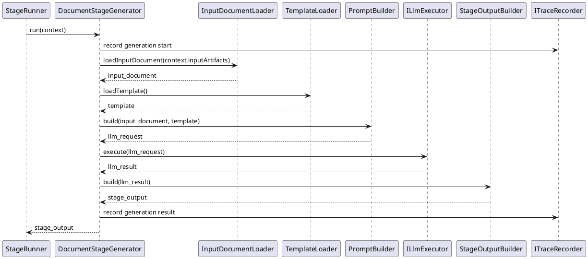
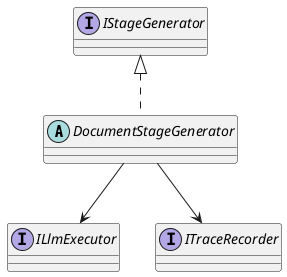

# DocumentStageGenerator Pattern

## 1. Purpose

Define the shared runtime pattern used by document-oriented generation stages.

The shared generation shape is:

- input: upstream content from `StageRunContext.inputArtifacts` + template file content
- output: one generated file content

This pattern is the shared design reference for:

- `Execution/ArchitectureDesignGenerator`
- `Execution/ModuleDesignGenerator`
- `Execution/ImplementationPlanGenerator`

This pattern does not apply to:

- `Execution/RequirementGenerator`
- `Execution/ImplementationGenerator`

`RequirementGenerator` is a required empty execution binding and does not use template-based document generation.
`ImplementationGenerator` is an independent generator module with its own runtime flow and should not inherit `DocumentStageGenerator`.

Each concrete module should use one generator class as the module entry and orchestration owner.

In this pattern, `DocumentStageGenerator` owns generation flow and generation-internal trace recording. Gate review and artifact persistence remain runner-side workflow steps that collaborate with the generated `StageOutput`.

## 2. Shared Binding

`DocumentStageRunner`-style generation stages bind:

- `DocumentStageGenerator`
- `IStageGenerator`
- `ILlmExecutor`
- `ITraceRecorder`

## 3. Shared Runtime Flow



## 4. Shared Interfaces

Reuse the shared workflow interfaces defined in [Pipeline.md](../Workflow/Pipeline.md) and the shared execution interface defined in [LlmExecutor.md](../SDK/LlmExecutor.md):

- `DocumentStageGenerator`
- `IStageGenerator`
- `ILlmExecutor`
- `ITraceRecorder`

Parent-class method model:

```ts
abstract class DocumentStageGenerator implements IStageGenerator {
  async run(context: StageRunContext): Promise<StageOutput>

  protected abstract loadInputDocument(
    inputArtifacts: StageRunContext["inputArtifacts"],
  ): Promise<string>
  protected abstract loadTemplate(): Promise<string>
  protected abstract buildPrompt(
    inputDocument: string,
    template: string,
  ): LlmExecutionRequest
  protected async executeGeneration(
    request: LlmExecutionRequest,
  ): Promise<LlmExecutionResult>
  protected abstract buildStageOutput(
    result: LlmExecutionResult,
  ): Promise<StageOutput>
}
```

Parent-class rule:

- `run` is shared orchestration logic
- `executeGeneration` is shared execution logic
- input loading, template loading, prompt building, and stage-output building are extension points left to concrete subclasses
- `ITraceRecorder` is a generator-internal collaboration dependency used by `run`
- `IChangeGate` and `IArtifactStore` are not generator-internal responsibilities and remain runner-side workflow steps

## 5. Shared Responsibilities



- `DocumentStageGenerator` owns the shared orchestration flow.
- Input loading, template loading, prompt building, generation execution, stage-output building, and generation trace recording are logical responsibilities inside that flow.
- concrete generator implementations may keep these responsibilities internal instead of defining separate helper classes.

## 6. Shared Input And Output Boundaries

### 6.1 Generation Input

- upstream file content
- upstream content is read from `StageRunContext.inputArtifacts`
- template file content

### 6.2 Prompt Input

- upstream file content
- template content

### 6.3 Generation Output

- one generated file content
- `StageOutput` wraps that generated file content into a stable stage artifact
- generator output should expose a stable `artifactKey` for downstream stage input
- final persistence file paths are resolved by the stage runner after gate approval, not by the generator itself

## 7. Stage-Specific Rule

Each concrete generator document should define only its own:

- inheritance from `DocumentStageGenerator`
- implementation class
- input artifact keys
- template source
- prompt constraints
- output artifact naming
- stage-specific generation limits
