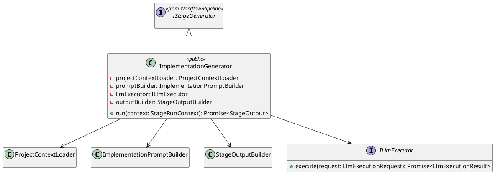
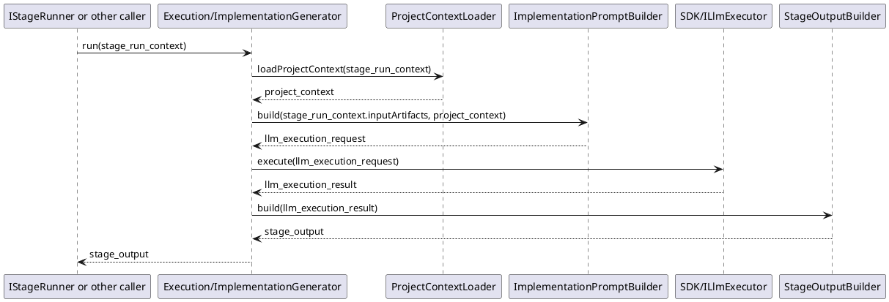

# ImplementationGenerator Design

## 1. Goal

### 1.1 Purpose

Define the module design of `Execution/ImplementationGenerator`.

### 1.2 Involved Modules

This module design directly involves:

- `Execution/ImplementationGenerator`

This module design collaborates with:

- `Workflow/Pipeline`

### 1.3 Core Functions

`Execution/ImplementationGenerator` is the implementation step-execution generation module.

Its core functions are:

- load the target project or engineering context that should be generated or updated
- call the LLM execution capability to generate candidate implementation artifacts, including code and resources
- return generated implementation file content in a structured `StageOutput`

`ImplementationGenerator` does not decide workflow progression, contract validity, or gate approval result.

`ImplementationGenerator` is independent from [DocumentStageGeneratorPattern.md](./DocumentStageGeneratorPattern.md). It does not inherit `DocumentStageGenerator` and does not follow the document-template generation flow used by architecture-design and module-design stages.

## 2. Core Classes

### 2.1 Class Diagram



### 2.2 `ProjectContextLoader`

Role:

- target engineering context loading component

Responsibilities:

- load current project context required for implementation generation
- provide relevant files and directory structure to the generator

### 2.3 `ImplementationPromptBuilder`

Role:

- prompt construction component

Responsibilities:

- transform the accepted current workplan batch, upstream design context, and target engineering context into implementation-generation input
- make the generation target explicit as code and resource updates
- produce a stable `LlmExecutionRequest` for this stage

### 2.4 `ILlmExecutor`

Role:

- shared llm execution interface

Responsibilities:

- accept prompt-based execution request
- return normalized model result
- isolate agent design and model selection details from the generator

### 2.5 `StageOutputBuilder`

Role:

- structured output conversion component

Responsibilities:

- convert generated implementation files and generation result into `StageOutput`
- keep returned generated-file summary structure stable

### 2.6 `ImplementationGenerator`

Role:

- public external API class for this module
- module entry point exposed to stage runners

Responsibilities:

- expose `run` to the stage runner or equivalent caller
- own implementation generation orchestration
- load the target project context that should be updated
- build implementation-generation prompt input
- call shared `ILlmExecutor`
- convert generated implementation files and generation result into structured `StageOutput`

## 3. Core Runtime Flow

### 3.1 Main Flow



## 4. Detailed Design

### 4.1 Core APIs And Fields

#### 4.1.1 Public API

```ts
class ImplementationGenerator implements IStageGenerator {
  run(context: StageRunContext): Promise<StageOutput>
}
```

`IStageGenerator` is the shared contract defined in [Pipeline.md](../Workflow/Pipeline.md). This module does not redefine it. `ImplementationGenerator` is the only public generator API and implements `IStageGenerator`.

#### 4.1.2 Stage Input Types

```ts
type ArtifactRef = string

interface ModuleDesignDoc {
  moduleName: string
  content: string
}

interface UpstreamImplementationContext {
  requirement_document: string
  architecture_document: string
  module_design_documents: ModuleDesignDoc[]
}

interface ProjectContext {
  root_path: string
  relevant_files: ProjectFile[]
}

interface ProjectFile {
  path: string
  content: string
}
```

`StageRunContext` is defined by the upstream workflow contract and is reused here directly.

Implementation generation input source:

- `StageRunContext.inputArtifacts["implementation_workplan"]`
- `StageRunContext.inputArtifacts["current_step"]`
- `StageRunContext.inputArtifacts["requirement_document"]`
- `StageRunContext.inputArtifacts["architecture_document"]`
- `StageRunContext.inputArtifacts["module_design_documents"]`

Expected input shape:

```ts
// Defined by Execution/ImplementationPlanGenerator design.
interface ImplementationWorkPlan
interface ImplementationWorkPlanBatch

type ModuleDesignDocumentsInput = ModuleDesignDoc[]
```

Runtime input rule:

- `ImplementationPlanContract` parses accepted workplan markdown into `ImplementationWorkPlan`
- `ImplementationGenerator` receives the parsed `ImplementationWorkPlan` structure
- `ImplementationStageRunner` reads `inputArtifacts["current_step"]` as `{ stepId, batchId }`
- `ImplementationGenerator` receives one `ImplementationWorkPlanBatch` as the current execution unit after `ImplementationStageRunner` resolves the current batch from `current_step`
- `ImplementationGenerator` should not parse markdown workplan text by itself
- `ImplementationStageRunner` selects the current execution batch from the parsed workplan structure

#### 4.1.3 Prompt Construction

```ts
interface PromptBuildInput {
  prepared_step_context: PreparedStepContext
  project_context: ProjectContext
}

interface PromptInput {
  system_prompt: string
  user_prompt: string
}

interface ImplementationPromptBuilder {
  build(input: PromptBuildInput): LlmExecutionRequest
}

interface LlmExecutionRequest {
  prompt: PromptInput
}
```

Prompt construction rules:

- `system_prompt` defines implementation role, current-batch boundary, and output structure.
- `user_prompt` contains the accepted workplan reference, current batch resolved from `current_step`, required upstream context documents, and relevant project context.
- the prompt builder should require the llm to return explicit generated file content instead of free-form implementation advice.
- the prompt builder should make generated code files and resource files distinguishable in the returned result.

#### 4.1.4 LLM Invocation

```ts
interface LlmExecutionResult {
  content: string
}

interface ILlmExecutor {
  execute(request: LlmExecutionRequest): Promise<LlmExecutionResult>
}
```

Returned result rule:

- the llm returns `changed_files`
- `StageOutputBuilder` converts `changed_files` into `StageOutput.artifacts.changedFiles`
- `ImplementationGenerator` does not expose a separate `generatedFiles` runtime field in V1

LLM invocation rules:

- the generator only calls `ILlmExecutor.execute`; it does not embed agent or model invocation logic directly.
- agent design and model selection are defined in [LlmExecutor.md](../SDK/LlmExecutor.md).
- the llm execution result is treated as raw generated-file output before `StageOutputBuilder` interprets it.

#### 4.1.5 Generated File Types

```ts
interface GeneratedImplementationFile {
  path: string
  content: string
  kind: "code" | "resource"
}

interface GenerationResult {
  generatedFiles: GeneratedImplementationFile[]
  summary: string
}
```

#### 4.1.6 Output Types

```ts
interface ImplementationStageArtifacts {
  generatedFiles: GeneratedImplementationFile[]
  summary: string
}

interface StageOutputBuilder {
  build(result: LlmExecutionResult): StageOutput
}
```

`StageOutput` is the shared workflow output class defined in [Pipeline.md](../Workflow/Pipeline.md). This module only defines `ImplementationStageArtifacts` as the stage-specific payload carried in `StageOutput.artifacts`.

Step-execution runtime rule:

- `ImplementationStageRunner` persists accepted `generatedFiles` to their generated paths
- step review result decides whether workflow advances to the next workplan step, retries the current step, or stops

### 4.2 Suggested Output Shape

```text
StageOutput
  generatedFiles[]
  summary
```

The exact output payload may expand later, but V1 should at least return generated file content and a stable generation summary for downstream modules.

### 4.3 Constraints

- `ImplementationGenerator` must not decide whether the generated output passes contract checks.
- `ImplementationGenerator` must not decide whether the generated output is approved.
- `ImplementationGenerator` should load enough project context to support targeted code and resource updates.
- `ImplementationGenerator` must not apply generated file content to the target project directly.
- `ImplementationGenerator` should return structured generated files and generation summary as `StageOutput`.
