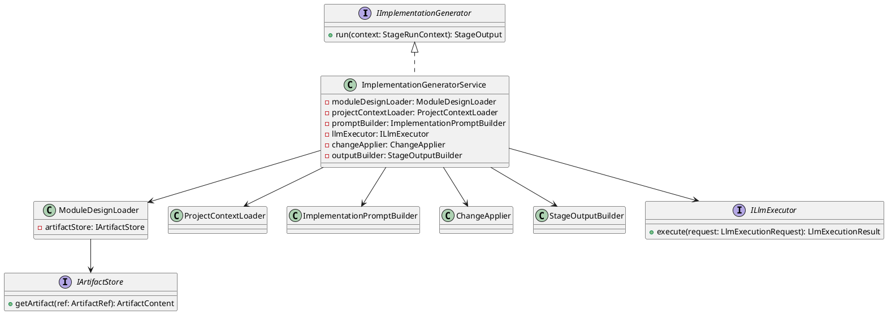
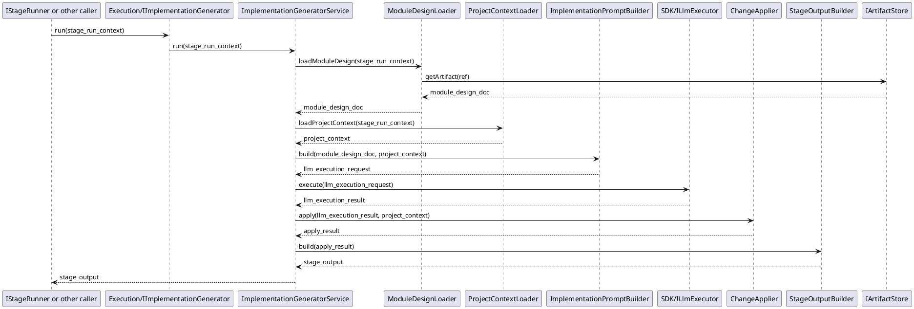

# ImplementationGenerator Design

## 1. Goal

### 1.1 Purpose

Define the module design of `Execution/ImplementationGenerator`.

### 1.2 Involved Modules

This module design directly involves:

- `Execution/ImplementationGenerator`

This module design collaborates with:

- `Workflow/Pipeline`
- `Data/ArtifactStore`

### 1.3 Core Functions

`Execution/ImplementationGenerator` is the implementation generation module.

Its core functions are:

- load the structured module design document generated by the upstream stage
- load the target project or engineering context that should be generated or updated
- call the LLM execution capability to generate or update the corresponding engineering artifacts, including code and resources
- return the applied changes and execution result in a structured `StageOutput`

`ImplementationGenerator` does not decide workflow progression, contract validity, or gate approval result.

## 2. Core Classes

### 2.1 Class Diagram



### 2.2 `ImplementationGeneratorService`

Role:

- module entry point
- owns implementation generation orchestration

Responsibilities:

- accept stage run request
- load the upstream structured module design document
- load the target project context that should be updated
- build implementation-generation prompt input
- call shared `ILlmExecutor`
- apply returned file changes to the target engineering context
- convert applied changes and generation result into structured `StageOutput`

### 2.3 `ModuleDesignLoader`

Role:

- upstream module design loading component

Responsibilities:

- read the structured module design result from `IArtifactStore`

### 2.4 `ProjectContextLoader`

Role:

- target engineering context loading component

Responsibilities:

- load current project context required for implementation generation
- provide relevant files and directory structure to the generator service

### 2.5 `ImplementationPromptBuilder`

Role:

- prompt construction component

Responsibilities:

- transform the module design document and target engineering context into implementation-generation input
- make the generation target explicit as code and resource updates
- produce a stable `LlmExecutionRequest` for this stage

### 2.6 `ILlmExecutor`

Role:

- shared llm execution interface

Responsibilities:

- accept prompt-based execution request
- return normalized model result
- isolate agent design and model selection details from the generator service

### 2.7 `ChangeApplier`

Role:

- generated change applying component

Responsibilities:

- interpret llm-generated change instructions
- generate or update target engineering files
- return the applied change set and apply result

### 2.8 `StageOutputBuilder`

Role:

- structured output conversion component

Responsibilities:

- convert applied changes and generation result into `StageOutput`
- keep returned change summary structure stable

### 2.9 `IImplementationGenerator`

Role:

- abstract execution interface for this module

Responsibilities:

- expose `run` to the stage runner or equivalent caller

## 3. Core Runtime Flow

### 3.1 Main Flow



## 4. Detailed Design

### 4.1 Core APIs And Fields

#### 4.1.1 Public API

```ts
interface IImplementationGenerator {
  run(context: StageRunContext): StageOutput
}
```

#### 4.1.2 Stage Input Types

```ts
type ArtifactRef = string

interface ModuleDesignDoc {
  content: string
}

interface ProjectContext {
  root_path: string
  relevant_files: ProjectFile[]
}

interface ProjectFile {
  path: string
  content: string
}
```

`StageRunContext` is defined by the upstream workflow contract and is reused here directly.

#### 4.1.3 Prompt Construction

```ts
interface PromptBuildInput {
  module_design_doc: ModuleDesignDoc
  project_context: ProjectContext
}

interface PromptInput {
  system_prompt: string
  user_prompt: string
}

interface ImplementationPromptBuilder {
  build(input: PromptBuildInput): LlmExecutionRequest
}

interface LlmExecutionRequest {
  prompt: PromptInput
}
```

Prompt construction rules:

- `system_prompt` defines implementation role, change boundary, and output structure.
- `user_prompt` contains the structured module design document and the relevant project context.
- the prompt builder should require the llm to return explicit file changes instead of free-form implementation advice.
- the prompt builder should make generated code changes and resource changes distinguishable in the returned result.

#### 4.1.4 LLM Invocation

```ts
interface LlmExecutionResult {
  content: string
}

interface ILlmExecutor {
  execute(request: LlmExecutionRequest): LlmExecutionResult
}
```

LLM invocation rules:

- the generator service only calls `ILlmExecutor.execute`; it does not embed agent or model invocation logic directly.
- agent design and model selection are defined in [LlmExecutor.md](../SDK/LlmExecutor.md).
- the llm execution result is treated as raw change output before `ChangeApplier` interprets and applies it.

#### 4.1.5 Change Apply Types

```ts
interface ApplyResult {
  changed_files: ChangedFile[]
  summary: string
}

interface ChangedFile {
  path: string
  operation: string
  content?: string
}

interface ChangeApplier {
  apply(result: LlmExecutionResult, context: ProjectContext): ApplyResult
}
```

#### 4.1.6 Output Types

```ts
interface StageOutput {
  changed_files: ChangedFile[]
  summary: string
}

interface StageOutputBuilder {
  build(result: ApplyResult): StageOutput
}
```

#### 4.1.7 Storage Dependency Types

```ts
interface ArtifactContent {
  format: string
  body: string
}

interface IArtifactStore {
  getArtifact(ref: ArtifactRef): ArtifactContent
}
```

### 4.2 Suggested Output Shape

```text
StageOutput
  changed_files[]
  summary
```

The exact output payload may expand later, but V1 should at least return the changed files and a stable change summary for downstream modules.

### 4.3 Constraints

- `ImplementationGenerator` must not decide whether the generated output passes contract checks.
- `ImplementationGenerator` must not decide whether the generated output is approved.
- `ImplementationGenerator` should read the structured module design document from upstream artifact input.
- `ImplementationGenerator` should load enough project context to support targeted code and resource updates.
- `ImplementationGenerator` should return structured changed files and generation summary as `StageOutput`.
