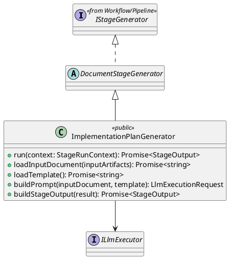
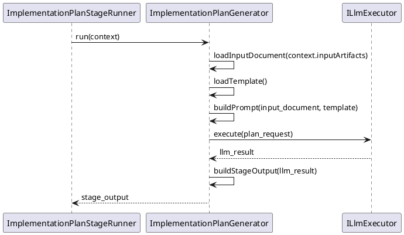

# ImplementationPlanGenerator Design

## 1. Goal

### 1.1 Purpose

Define the module design of `Execution/ImplementationPlanGenerator`.

### 1.2 Involved Modules

This module design directly involves:

- `Execution/ImplementationPlanGenerator`

This module design collaborates with:

- `Workflow/Pipeline`
- `SDK/LlmExecutor`
- `Execution/DocumentStageGenerator`

### 1.3 Core Functions

`Execution/ImplementationPlanGenerator` is the implementation-plan generation module.

Its core functions are:

- load the requirement document generated by the upstream stage
- load the architecture document generated by the upstream stage
- load all structured module design documents generated by the upstream stage
- load the implementation-plan template content
- generate one ordered implementation workplan document for the target project scope
- return the generated workplan in a structured `StageOutput`

`ImplementationPlanGenerator` does not decide workflow progression, contract validity, or gate approval result.

## 2. Core Classes

### 2.1 Class Diagram



## 3. Core Runtime Flow



## 4. Detailed Design

### 4.1 Stable Output Shape

```ts
interface ImplementationWorkPlanStep {
  stepId: string
  title: string
  goal: string
}

interface ImplementationWorkPlanArtifacts {
  artifactKey: "implementation_workplan"
  content: string
}
```

### 4.2 Input Rule

- upstream input source is `StageRunContext.inputArtifacts["requirement_document"]`
- upstream input source is `StageRunContext.inputArtifacts["architecture_document"]`
- upstream input source is `StageRunContext.inputArtifacts["module_design_documents"]`
- template source is `meta_layer/resources/template/CodeGenerationExecutionPlanTemplate.md`

### 4.3 Output Rule

- downstream `ImplementationGenerator` reads the accepted workplan through `inputArtifacts["implementation_workplan"]`
- final persistence path is resolved by `ImplementationPlanStageRunner` after gate approval:
  - `plans/implementation/ImplementationWorkPlan.md`

### 4.4 Inheritance Rule

- `ImplementationPlanGenerator extends DocumentStageGenerator`
- shared orchestration is inherited from `DocumentStageGenerator.run`
- stage-specific override points are:
  - `loadInputDocument`
  - `loadTemplate`
  - `buildPrompt`
  - `buildStageOutput`
