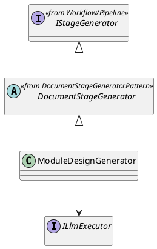
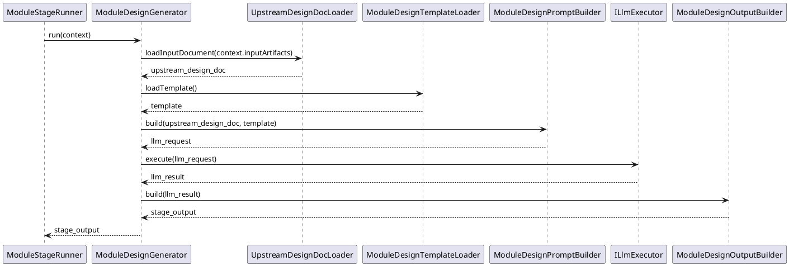

<!--
AI_EDIT_PROTECTION:
- This file is protected.
- Do not modify this file unless the user explicitly requests changes to this exact file.
-->

# ModuleDesignGenerator Design

## 1. Goal

### 1.1 Purpose

Define the module design of `Execution/ModuleDesignGenerator`.

### 1.2 Involved Modules

This module design directly involves:

- `Execution/ModuleDesignGenerator`

This module design collaborates with:

- `Workflow/Pipeline`
- `SDK/LlmExecutor`

### 1.3 Core Functions

`Execution/ModuleDesignGenerator` is the module-design document generation module.

Its core functions are:

- follow the shared flow defined in [DocumentStageGeneratorPattern.md](./DocumentStageGeneratorPattern.md)
- load architecture-stage file content
- load the module-design template file content
- generate one module-design file content from the two inputs
- return structured `StageOutput`

`ModuleDesignGenerator` does not decide workflow progression, contract validity, or gate approval result.

## 2. Core Classes

### 2.1 Class Diagram



### 2.2 `ModuleDesignGenerator`

Role:

- module-design-stage generator implementation entry

Responsibilities:

- expose `run(context): Promise<StageOutput>`
- keep module-design-stage generation entry stable for `ModuleStageRunner`
- load architecture-design document input
- load module-design template
- build generation request
- convert generation result into `StageOutput`

## 3. Core Runtime Flow

### 3.1 Main Sequence Diagram



## 4. Detailed Design

### 4.1 Implementation Binding

- Parent class: `DocumentStageGenerator`
- Implementation class: `ModuleDesignGenerator` extends `DocumentStageGenerator`
- Bound by: `ModuleStageRunner`

`ModuleStageRunner` binds:

- `ModuleDesignGenerator`
- `ModuleDesignContract`
- `ITraceRecorder`
- `IChangeGate`

Overridden methods:

- `loadInputDocument(inputArtifacts)`
- `loadTemplate()`
- `buildPrompt(inputDocument, template)`
- `buildStageOutput(result)`

### 4.2 Stage-Specific Runtime Rules

#### 4.2.1 Input

```ts
interface ModuleDescriptor {
  name: string
  responsibilities: string[]
}

interface ModuleDesignGeneratorInputArtifacts {
  architecture_document: string
  module_descriptors: ModuleDescriptor
}
```

#### 4.2.1.1 Module Descriptor Shape

```ts
interface ModuleDescriptor {
  name: string
  responsibilities: string[]
}
```

#### 4.2.2 Template

- template file content source is `meta_layer/resources/template/ModuleDesignTemplate.md`

#### 4.2.3 Prompt

- prompt must combine architecture-design input, the single module descriptor, and module-design template
- prompt must keep output aligned with the module-design template structure

#### 4.2.4 Output

- output is generated module-design file content for the single requested module
- `StageOutput` wraps that file content as module-design-stage document artifact
- output artifact shape is:

```ts
interface ModuleDesignArtifacts {
  artifactKey: "module_design_document"
  moduleName: string
  content: string
}
```

- downstream `ImplementationGenerator` reads this output through `inputArtifacts["module_design_document"]`
- final persistence paths are resolved by `ModuleStageRunner` after gate approval:
  - `sdlc/docs/module_design/{moduleName}.md`

### 4.3 Constraints

- reuse the shared flow from [DocumentStageGeneratorPattern.md](./DocumentStageGeneratorPattern.md)
- keep shared orchestration in parent `DocumentStageGenerator.run`
- keep module-design-stage implementation names owned by this module
- do not redefine workflow-owned shared interfaces from [Pipeline.md](../Workflow/Pipeline.md)
