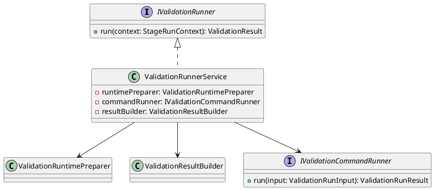
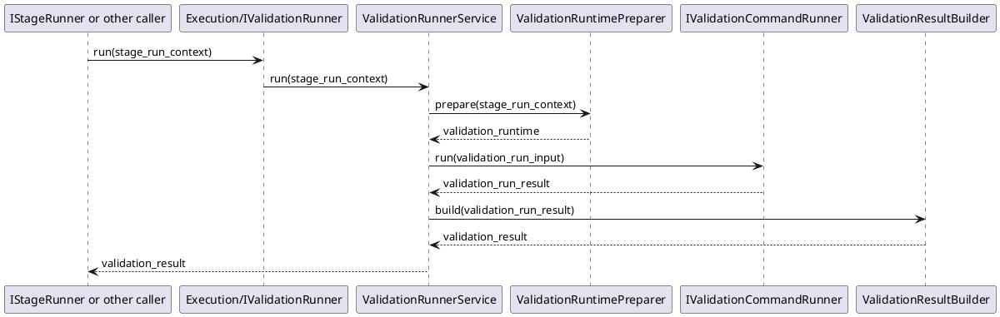

# ValidationRunner Design

## 1. Goal

### 1.1 Purpose

Define the module design of `Execution/ValidationRunner`.

### 1.2 Involved Modules

This module design directly involves:

- `Execution/ValidationRunner`

This module design collaborates with:

- `Workflow/Pipeline`
- `Execution/ImplementationGenerator`

### 1.3 Core Functions

`Execution/ValidationRunner` is the final-program validation module.

Its core functions are:

- prepare the validation runtime context
- run validation test scripts
- return structured validation results to downstream modules

`ValidationRunner` does not decide workflow progression, contract validity, or gate approval result.

## 2. Core Classes

### 2.1 Class Diagram



### 2.2 `ValidationRunnerService`

Role:

- module entry point
- owns final-program validation orchestration

Responsibilities:

- accept validation run request
- prepare the runtime context for validation
- run validation test scripts
- convert runtime output into structured `ValidationResult`

### 2.3 `ValidationRuntimePreparer`

Role:

- validation runtime preparation component

Responsibilities:

- prepare workdir and execution prerequisites
- provide stable runtime input for validation test script execution

### 2.4 `IValidationCommandRunner`

Role:

- validation command execution interface

Responsibilities:

- run validation test scripts
- return normalized command execution result

### 2.5 `ValidationResultBuilder`

Role:

- structured result conversion component

Responsibilities:

- convert validation command output into `ValidationResult`
- keep validation summary and issue structure stable

### 2.6 `IValidationRunner`

Role:

- abstract execution interface for this module

Responsibilities:

- expose `run` to the stage runner or equivalent caller

## 3. Core Runtime Flow

### 3.1 Main Sequence Diagram



## 4. Detailed Design

### 4.1 Core APIs And Fields

#### 4.1.1 Public API

```ts
interface IValidationRunner {
  run(context: StageRunContext): ValidationResult
}
```

#### 4.1.2 Runtime Input Types

```ts
interface ValidationRuntime {
  workdir: string
  scripts: ValidationScript[]
}

interface ValidationScript {
  name: string
  command: string
}
```

`StageRunContext` is defined by the upstream workflow contract and is reused here directly.

#### 4.1.3 Command Execution Types

```ts
interface ValidationRunInput {
  runtime: ValidationRuntime
}

interface ValidationRunResult {
  success: boolean
  passed_commands: string[]
  failed_commands: string[]
  summary: string
  logs?: string
}

interface IValidationCommandRunner {
  run(input: ValidationRunInput): ValidationRunResult
}
```

#### 4.1.4 Output Types

```ts
interface ValidationResult {
  passed: boolean
  summary: string
  passed_commands: string[]
  failed_commands: string[]
  logs?: string
}

interface ValidationResultBuilder {
  build(result: ValidationRunResult): ValidationResult
}
```

### 4.2 Suggested Validation Scope

```text
- startup command
- unit or integration test scripts
- other required validation scripts
```

### 4.3 Constraints

- `ValidationRunner` only runs validation scripts.
- `ValidationRunner` must not decide workflow progression.
- `ValidationRunner` must not decide whether the validated result is approved.
- `ValidationRunner` should return stable command-level validation results for downstream modules.
