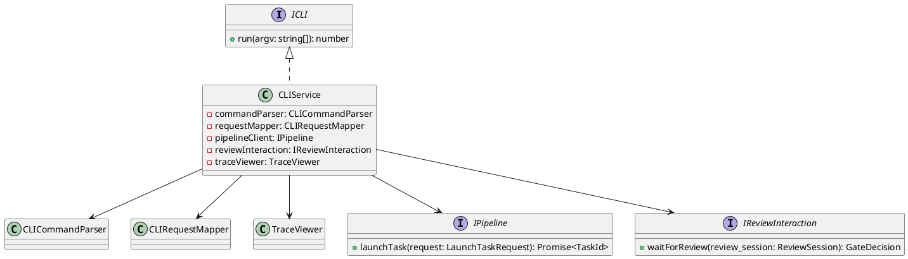
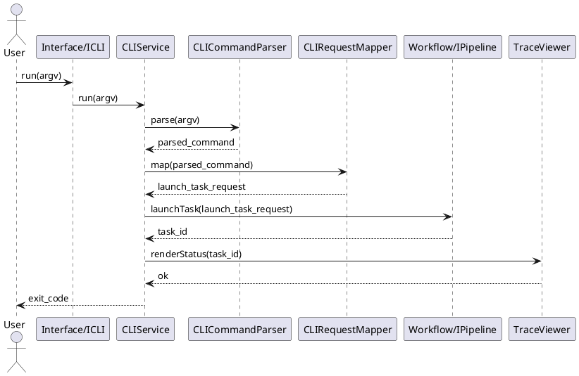

# CLI Design

## 1. Goal

### 1.1 Purpose

Define the module design of `Interface/CLI`.

### 1.2 Involved Modules

This module design directly involves:

- `Interface/CLI`

This module design collaborates with:

- `Workflow/Pipeline`
- `QualityGate/ChangeGate`
- `QualityGate/Trace`

### 1.3 Core Functions

`Interface/CLI` is the command-line entry module.

Its core functions are:

- accept user commands and arguments from the command line
- parse user input into stable command requests
- convert command requests into upstream module calls
- display task progress, review prompts, and final results to the user

`CLI` does not own workflow orchestration, contract checking, gate decision logic, or artifact persistence.

## 2. Core Classes

### 2.1 Class Diagram



### 2.2 `CLIService`

Role:

- module entry point
- owns command dispatch orchestration

Responsibilities:

- accept raw CLI arguments
- parse the target command
- map parsed arguments to upstream requests
- call upstream modules
- print progress, review prompts, and final execution result

### 2.3 `CLICommandParser`

Role:

- CLI argument parsing component

Responsibilities:

- parse command name and flags from `argv`
- validate CLI input shape
- return stable parsed command objects

### 2.4 `CLIRequestMapper`

Role:

- request mapping component

Responsibilities:

- map parsed CLI commands to upstream request objects
- keep CLI-facing options decoupled from backend module request structures

### 2.5 `TraceViewer`

Role:

- trace output rendering component

Responsibilities:

- render task progress and trace events for CLI users
- keep command-line status output stable and readable

### 2.6 `IPipeline`

Role:

- abstract workflow entry interface used by CLI

Responsibilities:

- accept task launch requests from CLI
- return task reference to CLI

### 2.7 `IReviewInteraction`

Role:

- abstract review interaction interface implemented by CLI

Responsibilities:

- expose review content to the user in command-line form
- collect user action such as `apply`, `reject`, and `comment`
- return normalized `GateDecision`

### 2.8 `ICLI`

Role:

- abstract CLI entry interface

Responsibilities:

- expose process entry for the command-line program

## 3. Core Runtime Flow

### 3.1 Main Sequence Diagram



## 4. Detailed Design

### 4.1 Core APIs And Fields

#### 4.1.1 Public API

```ts
interface ICLI {
  run(argv: string[]): number
}
```

#### 4.1.2 Command Types

```ts
interface ParsedCommand {
  command: string
  options: Record<string, string | string[]>
}

interface CLICommandParser {
  parse(argv: string[]): ParsedCommand
}
```

#### 4.1.3 Request Mapping Types

```ts
type TaskId = string

interface LaunchTaskRequest {
  start_stage: string
  input_refs: Record<string, string | string[]>
  target_step?: string
  project_path?: string
}

interface CLIRequestMapper {
  map(command: ParsedCommand): LaunchTaskRequest
}

interface IPipeline {
  launchTask(request: LaunchTaskRequest): Promise<TaskId>
}
```

#### 4.1.4 Review Interaction Types

```ts
interface ReviewSession {
  review_id: string
  task_id: string
  stage_id: string
  change_request_summary: string
  comment?: string
}

interface GateDecision {
  action: string
  summary: string
  comment?: string
}

interface IReviewInteraction {
  waitForReview(review_session: ReviewSession): GateDecision
}
```

#### 4.1.5 Trace Rendering Types

```ts
interface TraceEvent {
  task_id: string
  stage_id?: string
  event_type: string
  summary: string
}

interface TraceViewer {
  renderStatus(message: string): void
  renderTrace(event: TraceEvent): void
  renderResult(summary: string): void
}
```

### 4.2 Example Commands

```text
# start from the default first stage
meta-layer task start --input requirement=docs/Requirement.md

# start directly from architecture design stage
meta-layer task start --stage architecture_design --input requirement=artifacts/requirement.json

# start directly from module design stage with upstream architecture artifact
meta-layer task start --stage module_design --input architecture_design=artifacts/architecture_design.json

# start module design for one specific module only
meta-layer task start --stage module_design --input architecture_design=artifacts/architecture_design.json --module user_service

# start implementation plan generation with requirement, architecture, and all module-design docs
meta-layer task start \
  --stage implementation_plan \
  --input requirement_document=docs/requirements/Requirement.md \
  --input architecture_document=docs/architecture/TechnicalArchitecture.md \
  --input module_design_documents=docs/module_design/*.md

# start implementation execution with accepted workplan and current step
meta-layer task start \
  --stage implementation_execution \
  --input implementation_workplan=plans/implementation/ImplementationWorkPlan.md \
  --input current_step=step_1 \
  --project-path ./project_layer

# review a pending change
meta-layer review --review-id review_123

# view task trace
meta-layer trace --task-id task_123
```

### 4.3 Constraints

- `CLI` only acts as the command-line interaction layer.
- `CLI` must not implement workflow orchestration logic itself.
- `CLI` must not implement gate decision logic itself.
- `CLI` should convert user input into stable upstream requests.
- `CLI` should present progress and results in a stable command-line format.
- `CLI` should support both workplan-level review and per-step review.
- `CLI` should support runtime inputs required by `implementation_plan` and `implementation_execution`, including `implementation_workplan`, `current_step`, and `project_path`.
