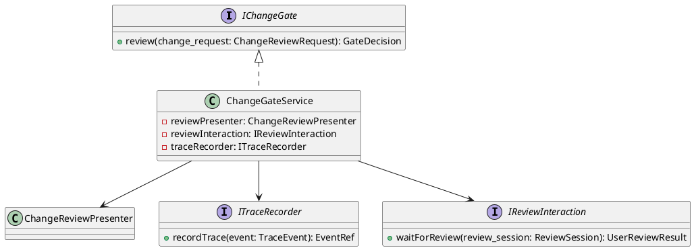
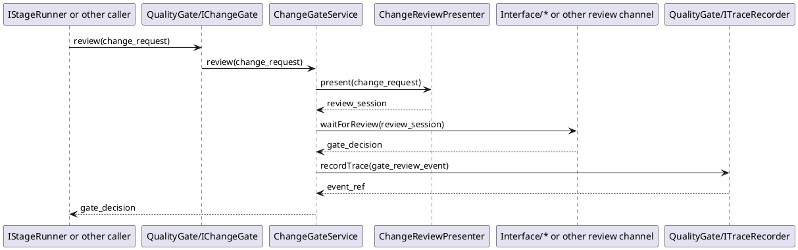

# ChangeGate Design

## 1. Goal

### 1.1 Purpose

Define the module design of `QualityGate/ChangeGate`.

### 1.2 Involved Modules

This module design directly involves:

- `QualityGate/ChangeGate`

This module design collaborates with:

- `Workflow/Pipeline`
- `QualityGate/Trace`

### 1.3 Core Functions

`QualityGate/ChangeGate` is the change review module.

Its core functions are:

- accept change content from upstream modules
- present the change content for human review
- collect the review result
- return a stable review decision to the caller
- record important review decisions through `Trace`

`ChangeGate` does not execute stage logic, does not run contract checks, and does not decide workflow progression.

## 2. Core Classes

### 2.1 Class Diagram



### 2.2 `ChangeGateService`

Role:

- module entry point
- owns change review orchestration

Responsibilities:

- accept change review request
- present change content for review
- collect review result through `IReviewInteraction`
- return structured `GateDecision`
- record important review decisions through `ITraceRecorder`

### 2.3 `ChangeReviewPresenter`

Role:

- change review presentation component

Responsibilities:

- prepare reviewable change content for the reviewer
- expose stable review input to the review flow

### 2.4 `IReviewInteraction`

Role:

- abstract user review interaction interface

Responsibilities:

- expose review content to the user
- wait for user action such as `apply`, `reject`, and `comment`
- return normalized gate decision

### 2.5 `ITraceRecorder`

Role:

- abstract trace recording interface used by `ChangeGate`

Responsibilities:

- record important gate decision events

### 2.6 `IChangeGate`

Role:

- abstract gate decision interface for upstream modules

Responsibilities:

- expose `review` to the stage runner or equivalent caller

## 3. Core Runtime Flow

### 3.1 Main Sequence Diagram



## 4. Detailed Design

### 4.1 Status Model

`ChangeGate` itself is a review coordination component and does not own an independent workflow status model.

The important design concern is stable review input and stable review decision output.

### 4.2 Core APIs And Fields

#### 4.2.1 Public API

```ts
interface IChangeGate {
  review(change_request: ChangeReviewRequest): GateDecision
}
```

#### 4.2.2 Core Review Types

```ts
interface ChangeReviewRequest {
  task_id: string
  stage_id?: string
  summary: string
  changed_files: ChangedFile[]
}

interface GateDecision {
  action: string
  summary: string
  comment?: string
}

interface ChangedFile {
  path: string
  operation: string
  content?: string
}

interface ReviewSession {
  review_id: string
  change_request: ChangeReviewRequest
}

interface ChangeReviewPresenter {
  present(change_request: ChangeReviewRequest): ReviewSession
}

interface IReviewInteraction {
  waitForReview(review_session: ReviewSession): GateDecision
}
```

#### 4.2.4 Trace Types

```ts
type EventRef = string

interface TraceEvent {
  task_id: string
  stage_id?: string
  event_type: string
  summary: string
}

interface ITraceRecorder {
  recordTrace(event: TraceEvent): EventRef
}
```

### 4.4 Example Gate Events

```ts
type GateEventType =
  | "gate_apply"
  | "gate_reject"
  | "gate_comment"
  | "gate_review_started"
```

### 4.5 Constraints

Runtime semantics:

- in V1, `IChangeGate.review(...)` is a blocking call.
- when `ChangeGate` enters review, the current stage stays blocked until the reviewer gives a final action.
- `apply` ends the review and returns a successful `GateDecision`.
- `reject` ends the review and returns a failed `GateDecision`.
- `comment` is an attached review message and does not end the review by itself.
- V1 assumes a single active reviewer decision for one review session.

- `ChangeGate` must not run generation logic.
- `ChangeGate` must not run contract checks.
- `ChangeGate` must not decide workflow progression directly.
- `ChangeGate` should return a stable human-review decision for the current stage changes.
- `ChangeGate` should record important review decisions through `ITraceRecorder`.
