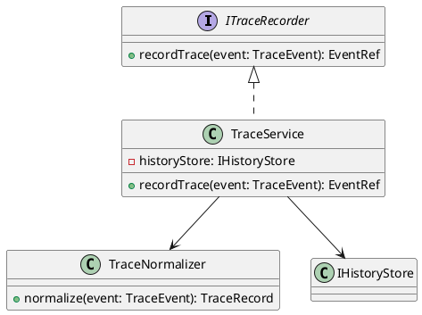
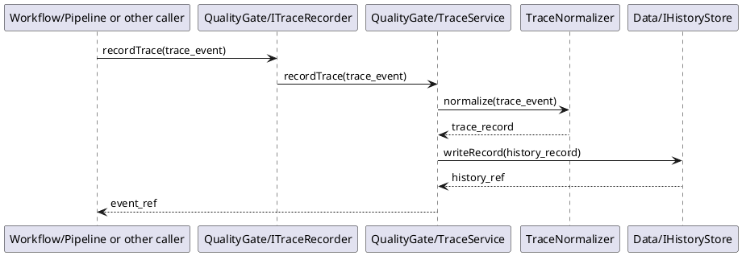

# Trace Design

## 1. Goal

### 1.1 Purpose

Define the module design of `QualityGate/Trace`.

### 1.2 Involved Modules

This module design directly involves:

- `QualityGate/Trace`
- `Data/HistoryStore`

This module design collaborates with:

- `Workflow/Pipeline`
- `Interface/CLI`

### 1.3 Core Functions

`QualityGate/Trace` is the workflow trace recording module.

Its core functions are:

- accept workflow and stage trace events from upstream modules
- normalize trace events into a consistent trace record shape
- persist trace records into `HistoryStore`
- provide stable trace references to callers

`QualityGate/Trace` does not decide workflow progression, contract validity, or gate approval result.

## 2. Core Classes

### 2.1 Class Diagram



### 2.2 `TraceService`

Role:

- module entry point
- owns trace write orchestration

Responsibilities:

- accept trace write requests
- normalize trace content
- call `IHistoryStore` to persist trace records
- return stable trace references

### 2.3 `TraceNormalizer`

Role:

- trace event normalization component

Responsibilities:

- map incoming trace events into a consistent record shape
- fill default metadata when needed
- keep trace schema stable across callers

### 2.4 `ITraceRecorder`

Role:

- workflow-owned trace recording interface implemented by `QualityGate/Trace`

Responsibilities:

- expose `recordTrace` to upstream modules

### 2.5 `IHistoryStore` Reuse

Role:

- reuse the shared persistence interface from `Data/HistoryStore`

Responsibilities:

- persist trace records through `writeRecord`
- query trace/history records through shared history APIs when needed

## 3. Core Runtime Flow

### 3.1 Main Flow



## 4. Detailed Design

### 4.1 Status Model

`Trace` itself is a write-through component and does not own an independent runtime status model.

The important design concern is trace event type consistency rather than internal status transitions.

### 4.2 Core APIs And Fields

#### 4.2.1 Public API

```ts
interface ITraceRecorder {
  recordTrace(event: TraceEvent): EventRef
}
```

#### 4.2.2 Core Runtime Types

```ts
type EventRef = string
type HistoryRef = string

interface TraceEvent {
  task_id: string
  stage_id?: string
  event_type: string
  summary: string
}

interface TraceRecord {
  task_id: string
  stage_id?: string
  event_type: string
  summary: string
  created_at: string
}
```

#### 4.2.3 Persistence Related Types

```ts
interface HistoryRecord {
  category: string
  task_id?: string
  stage_id?: string
  summary?: string
  payload: Record<string, unknown>
}
```

`ITraceRecorder` is owned by `Workflow/Pipeline` as a cross-module collaboration interface. `QualityGate/Trace` implements this interface. `IHistoryStore` is reused directly from [HistoryStore.md](../Data/HistoryStore.md#421-public-api) for persistence inside the trace module.

### 4.3 Example Event Types

```ts
type TraceEventType =
  | "task_started"
  | "stage_started"
  | "stage_failed"
  | "task_finished"
```

### 4.4 Constraints

- `Trace` only records events; it does not own workflow control logic.
- `Trace` must not decide whether a stage passes or fails.
- `Trace` must persist through `IHistoryStore`.
- `Trace` should keep event shape stable across different callers.
