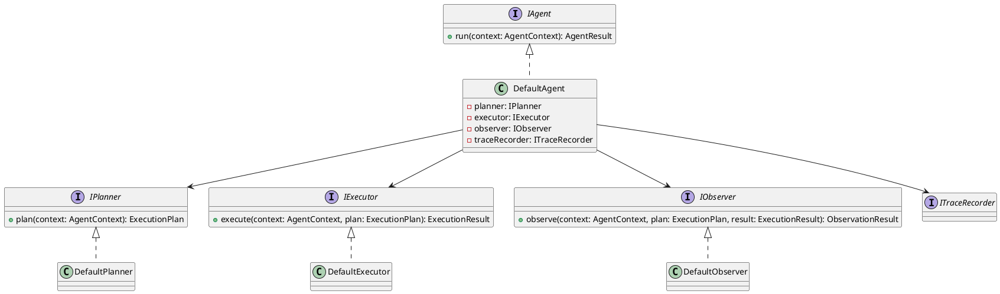
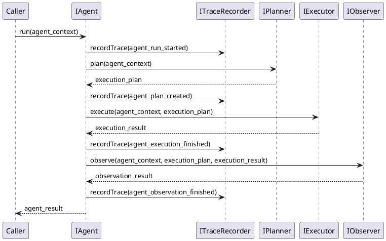

<!--
{
  "document_contracts": [
    {
      "check_item": "document_structure_complete",
      "description": "The document should contain the required top-level sections and expected subsection structure.",
      "severity": "high"
    },
    {
      "check_item": "section_contract_alignment",
      "description": "Each major section should be described by an explicit SectionContract-style comment including section_id, title, expected_format, and hints.",
      "severity": "high"
    },
    {
      "check_item": "format_consistency",
      "description": "The document should keep section formatting, code-block style, and terminology consistent across all sections.",
      "severity": "medium"
    }
  ]
}
-->

# AgentRuntime Design

## 1. Goal

### 1.1 Purpose

<!--
{
  "section_contract": {
    "section_id": "1.1",
    "title": "Purpose",
    "checkitems": [
      "define the purpose of the current module design document",
      "make the module boundary explicit"
    ],
    "severity": "medium",
    "expected_format": "`{Purpose}`"
  }
}
-->

Define the module design of `SDK/AgentRuntime`, which owns the reusable planning, execution, and observation runtime abstraction used by `SDK/LlmExecutor` and future SDK callers.

### 1.2 Involved Modules

<!--
{
  "section_contract": {
    "section_id": "1.2",
    "title": "Involved Modules",
    "checkitems": [
      "list the directly involved module",
      "list the collaborating modules only when they are necessary for understanding the design"
    ],
    "severity": "medium",
    "expected_format": "This module design directly involves:\n\n- `{ModulePath}`\n\nThis module design collaborates with:\n\n- `{CollaboratorA}`\n- `{CollaboratorB}`"
  }
}
-->

This module design directly involves:

- `SDK/AgentRuntime`

This module design collaborates with:

- `SDK/LlmExecutor`
- `Workflow/Pipeline`
- `QualityGate/Trace`

### 1.3 Core Functions

<!--
{
  "section_contract": {
    "section_id": "1.3",
    "title": "Core Functions",
    "checkitems": [
      "summarize the module role",
      "list the core functions only",
      "explicitly state what is out of scope for this module"
    ],
    "severity": "medium",
    "expected_format": "`{ModulePath}` is the `{ModuleRole}` module.\n\nIts core functions are:\n\n- `{CoreFunction1}`\n- `{CoreFunction2}`\n- `{CoreFunction3}`\n- `{CoreFunction4}`\n\n`{ModuleName}` does not `{OutOfScope1}`, `{OutOfScope2}`, or `{OutOfScope3}`."
  }
}
-->

`SDK/AgentRuntime` is the reusable agent runtime backbone module.

Its core functions are:

- define stable `plan -> execute -> observe` runtime interfaces for agent-style execution
- provide a minimal default agent loop that can be reused by `SDK/LlmExecutor` and other SDK callers
- keep planning, execution, and observation responsibilities replaceable and independently extensible
- expose stable runtime types that let upstream callers integrate agent execution without depending on provider-specific logic

`AgentRuntime` does not own provider SDK details, workflow stage progression, or artifact persistence.

## 2. Core Classes

<!--
{
  "section_contract": {
    "section_id": "2",
    "title": "Core Classes",
    "checkitems": [
      "this section must be expressed using UML class diagram language",
      "do not replace the class diagram with prose-only description"
    ],
    "severity": "medium"
  }
}
-->

### 2.1 Class Diagram

<!--
{
  "section_contract": {
    "section_id": "2.1",
    "title": "Class Diagram",
    "checkitems": [
      "show the important classes, interfaces, and dependencies",
      "keep the diagram focused on core module structure"
    ],
    "severity": "medium",
    "expected_format": "```plantuml\n' UML class diagram here\n```"
  }
}
-->



### 2.2 Core Class Responsibilities

<!--
{
  "section_contract": {
    "section_id": "2.2",
    "title": "Core Class Responsibilities",
    "checkitems": [
      "describe the role and responsibilities of the key classes or interfaces shown in the class diagram",
      "keep one subsection per important class, interface, or component",
      "do not restate every field unless it affects responsibilities or boundaries"
    ],
    "severity": "medium",
    "expected_format": "### 2.2 `PrimaryService`\n\nRole:\n\n- `{PrimaryRole}`\n\nResponsibilities:\n\n- `{Responsibility1}`\n- `{Responsibility2}`\n- `{Responsibility3}`"
  }
}
-->

### 2.2 `IAgent`

Role:

- reusable runtime entry for one agent execution

Responsibilities:

- organize one complete `plan -> execute -> observe` cycle
- hide internal planning and execution composition from upstream callers
- return one normalized `AgentResult`

### 2.2 `IPlanner`

Role:

- planning abstraction for one agent request

Responsibilities:

- build an execution plan from agent input
- choose the minimal execution mode for the current request
- keep planning logic replaceable from execution logic

### 2.2 `IExecutor`

Role:

- execution abstraction for one generated plan

Responsibilities:

- execute planned steps against the provided runtime collaborators
- normalize execution output into a stable runtime result
- isolate execution details from planning and observation

### 2.2 `IObserver`

Role:

- observation abstraction for execution evaluation

Responsibilities:

- inspect the produced execution result
- decide whether the current result is accepted
- return a stable observation output for the agent loop

### 2.2 `DefaultAgent`

Role:

- default minimal agent runtime implementation

Responsibilities:

- call planner, executor, and observer in order
- emit runtime trace at stable agent checkpoints
- provide the default reusable agent path for simple direct generation

## 3. Core Runtime Flow

<!--
{
  "section_contract": {
    "section_id": "3",
    "title": "Core Runtime Flow",
    "checkitems": [
      "this section must be expressed using UML sequence diagram language",
      "the diagram should focus on core runtime interactions between the module and its collaborators"
    ],
    "severity": "medium"
  }
}
-->

### 3.1 Main Sequence Diagram

<!--
{
  "section_contract": {
    "section_id": "3.1",
    "title": "Main Sequence Diagram",
    "checkitems": [
      "show the main runtime interaction between caller, module, and collaborators",
      "keep the flow focused on the primary success path"
    ],
    "severity": "medium",
    "expected_format": "```plantuml\n' UML sequence diagram here\n```"
  }
}
-->



## 4. Detailed Design

### 4.1 Core APIs And Fields

#### 4.1.1 Public API

<!--
{
  "section_contract": {
    "section_id": "4.1.1",
    "title": "Public API",
    "checkitems": [
      "define only the public API that upstream modules need to call",
      "keep the API structure stable and minimal"
    ],
    "severity": "medium",
    "expected_format": "```ts\ninterface I{ModuleName} {\n  {PublicMethod}({PrimaryInputName}: {PrimaryInputType}): {PrimaryOutputType}\n}\n```"
  }
}
-->

```ts
interface IAgent {
  run(context: AgentContext): Promise<AgentResult>
}
```

#### 4.1.2 Input Types

<!--
{
  "section_contract": {
    "section_id": "4.1.2",
    "title": "Input Types",
    "checkitems": [
      "define only input structures that belong to this module",
      "do not repeat upstream shared types unless this module owns them",
      "when the module contains contract-style section definitions, prefer stable names such as `document_contracts` and `section_contracts`"
    ],
    "severity": "medium",
    "expected_format": "```ts\ninterface {PrimaryInputType} {\n  {InputFieldA}: {InputFieldTypeA}\n  {InputFieldB}?: {InputFieldTypeB}\n}\n\ninterface ContractSpec {\n  document_contracts: DocumentContract[]\n  section_contracts: SectionContract[]\n}\n```"
  }
}
-->

```ts
interface AgentContext {
  request: LlmExecutionRequest
  runtime_metadata?: Record<string, string>
}
```

#### 4.1.3 Runtime Types

<!--
{
  "section_contract": {
    "section_id": "4.1.3",
    "title": "Runtime Types",
    "checkitems": [
      "define internal runtime structures only when they are necessary for understanding the design",
      "keep runtime types implementation-oriented but concise"
    ],
    "severity": "medium",
    "expected_format": "```ts\ninterface {RuntimeTypeA} {\n  {RuntimeFieldA}: {RuntimeFieldTypeA}\n}\n\ninterface {RuntimeTypeB} {\n  {RuntimeFieldB}: {RuntimeFieldTypeB}\n}\n```"
  }
}
-->

```ts
interface ExecutionPlan {
  mode: "direct_generation"
  summary: string
}

interface ExecutionResult {
  result: LlmExecutionResult
}

interface ObservationResult {
  accepted: boolean
  summary: string
}
```

#### 4.1.4 Output Types

<!--
{
  "section_contract": {
    "section_id": "4.1.4",
    "title": "Output Types",
    "checkitems": [
      "define the stable output structure produced by this module",
      "make downstream-consumed fields explicit"
    ],
    "severity": "medium",
    "expected_format": "```ts\ninterface {PrimaryOutputType} {\n  {OutputFieldA}: {OutputFieldTypeA}\n  {OutputFieldB}?: {OutputFieldTypeB}\n}\n```"
  }
}
-->

```ts
interface AgentResult {
  result: LlmExecutionResult
  plan: ExecutionPlan
  observation: ObservationResult
}
```

#### 4.1.5 Module-Specific Rules

<!--
{
  "section_contract": {
    "section_id": "4.1.5",
    "title": "Module-Specific Rules",
    "checkitems": [
      "add this subsection only when the module has important transformation, validation, mapping, or prompt-construction rules",
      "express stable rules that downstream modules depend on",
      "prefer bullets over long prose"
    ],
    "severity": "medium",
    "expected_format": "- `{Rule1}`\n- `{Rule2}`\n- `{Rule3}`"
  }
}
-->

- the minimal V1 agent runtime must support exactly one `plan -> execute -> observe` pass
- the default planner must produce a stable `direct_generation` plan so the runtime stays reusable for simple callers
- the default observer must only decide acceptance and must not mutate the execution result payload

### 4.2 Constraints

<!--
{
  "section_contract": {
    "section_id": "4.2",
    "title": "Constraints",
    "checkitems": [
      "record the key module constraints and non-goals",
      "include runtime semantics here when needed",
      "avoid implementation trivia"
    ],
    "severity": "medium",
    "expected_format": "- `{Constraint1}`\n- `{Constraint2}`\n- `{Constraint3}`\n- `{Constraint4}`"
  }
}
-->

- `AgentRuntime` must remain reusable for multiple upstream callers and must not be specialized to `ImplementationGenerator` or any single stage module.
- V1 must not require multi-step planning, MCP tool invocation, or observer-driven retry loops in order to be considered complete.
- Runtime tracing should reuse the pipeline-owned `ITraceRecorder` instead of creating a separate agent-specific trace channel.
- Provider-specific model SDK logic must remain outside `AgentRuntime`; it should be injected through execution collaborators.
