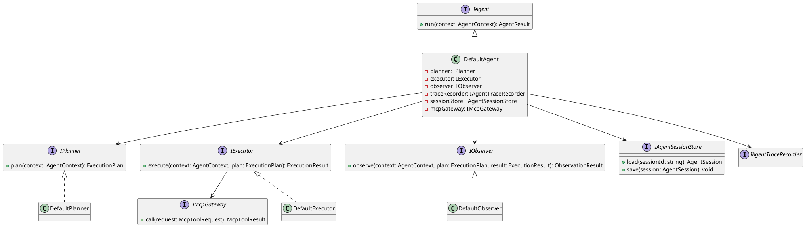
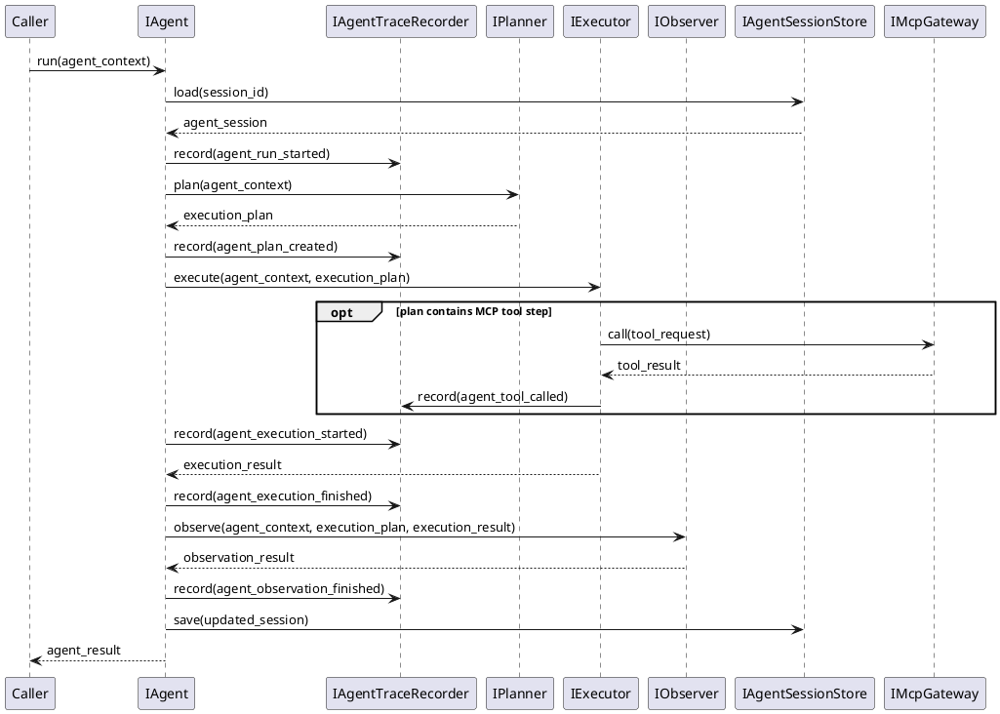
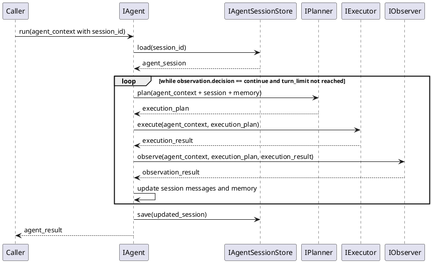

<!--
{
  "document_contracts": [
    {
      "check_item": "document_structure_complete",
      "description": "The document should contain the required top-level sections and expected subsection structure.",
      "severity": "high"
    },
    {
      "check_item": "section_contract_alignment",
      "description": "Each major section should be described by an explicit SectionContract-style comment including section_id, title, expected_format, and hints.",
      "severity": "high"
    },
    {
      "check_item": "format_consistency",
      "description": "The document should keep section formatting, code-block style, and terminology consistent across all sections.",
      "severity": "medium"
    }
  ]
}
-->

# AgentRuntime Design

## 1. Goal

### 1.1 Purpose

<!--
{
  "section_contract": {
    "section_id": "1.1",
    "title": "Purpose",
    "checkitems": [
      "define the purpose of the current module design document",
      "make the module boundary explicit"
    ],
    "severity": "medium",
    "expected_format": "`{Purpose}`"
  }
}
-->

Define the module design of `SDK/AgentRuntime`, which owns the reusable planning, execution, and observation runtime abstraction exposed as an independent SDK capability to external callers through stable SDK APIs.

### 1.2 Involved Modules

<!--
{
  "section_contract": {
    "section_id": "1.2",
    "title": "Involved Modules",
    "checkitems": [
      "list the directly involved module",
      "list the collaborating modules only when they are necessary for understanding the design"
    ],
    "severity": "medium",
    "expected_format": "This module design directly involves:\n\n- `{ModulePath}`\n\nThis module design collaborates with:\n\n- `{CollaboratorA}`\n- `{CollaboratorB}`"
  }
}
-->

This module design directly involves:

- `SDK/AgentRuntime`

This module design collaborates with:

- `SDK/LlmExecutor`
- `Workflow/Pipeline`
- `QualityGate/Trace`
- `Upstream SDK callers (through stable SDK APIs only)`
- `MCP-compatible tool providers`

### 1.3 Core Functions

<!--
{
  "section_contract": {
    "section_id": "1.3",
    "title": "Core Functions",
    "checkitems": [
      "summarize the module role",
      "list the core functions only",
      "explicitly state what is out of scope for this module"
    ],
    "severity": "medium",
    "expected_format": "`{ModulePath}` is the `{ModuleRole}` module.\n\nIts core functions are:\n\n- `{CoreFunction1}`\n- `{CoreFunction2}`\n- `{CoreFunction3}`\n- `{CoreFunction4}`\n\n`{ModuleName}` does not `{OutOfScope1}`, `{OutOfScope2}`, or `{OutOfScope3}`."
  }
}
-->

`SDK/AgentRuntime` is the reusable agent runtime backbone module.

Its core functions are:

- define stable `plan -> execute -> observe` runtime interfaces for agent-style execution
- provide a minimal default agent loop that can be reused by `SDK/LlmExecutor` and other SDK callers
- keep planning, execution, and observation responsibilities replaceable and independently extensible
- expose stable runtime types and JSON-based LLM input/output contracts that let upstream callers integrate agent execution without depending on provider-specific logic
- record runtime trace information that supports both real-time inspection and post-run traceback
- provide extension points for session-aware execution, MCP tool invocation, and agent memory management

`AgentRuntime` does not own caller-specific business logic, provider SDK details, workflow stage progression, or artifact persistence.

Current delivery baseline note:

- `Step 9 / Batch 4` only establishes the MCP-capable runtime baseline.
- that baseline means `AgentRuntime` can represent MCP-backed tool-capable execution and expose default file read/write tool semantics through `IMcpGateway`.
- session-aware runtime, memory, and full multi-turn continuation remain later runtime-evolution work and are not part of the `Step 9` completion bar.

## 2. Core Classes

<!--
{
  "section_contract": {
    "section_id": "2",
    "title": "Core Classes",
    "checkitems": [
      "this section must be expressed using UML class diagram language",
      "do not replace the class diagram with prose-only description"
    ],
    "severity": "medium"
  }
}
-->

### 2.1 Class Diagram

<!--
{
  "section_contract": {
    "section_id": "2.1",
    "title": "Class Diagram",
    "checkitems": [
      "show the important classes, interfaces, and dependencies",
      "keep the diagram focused on core module structure"
    ],
    "severity": "medium",
    "expected_format": "```plantuml\n' UML class diagram here\n```"
  }
}
-->



### 2.2 Core Class Responsibilities

<!--
{
  "section_contract": {
    "section_id": "2.2",
    "title": "Core Class Responsibilities",
    "checkitems": [
      "describe the role and responsibilities of the key classes or interfaces shown in the class diagram",
      "keep one subsection per important class, interface, or component",
      "do not restate every field unless it affects responsibilities or boundaries"
    ],
    "severity": "medium",
    "expected_format": "### 2.2 `PrimaryService`\n\nRole:\n\n- `{PrimaryRole}`\n\nResponsibilities:\n\n- `{Responsibility1}`\n- `{Responsibility2}`\n- `{Responsibility3}`"
  }
}
-->

### 2.2 `IAgent`

Role:

- reusable runtime entry for one agent execution

Responsibilities:

- organize one complete `plan -> execute -> observe` cycle
- hide internal planning and execution composition from upstream callers
- preserve the stable JSON-oriented LLM interaction contract across the full runtime cycle
- emit runtime checkpoints for real-time visibility and post-run traceback
- return one normalized `AgentResult`

### 2.2 `IPlanner`

Role:

- planning abstraction for one agent request

Responsibilities:

- build an execution plan from agent input
- choose the minimal execution mode for the current request
- decide whether the current run requires direct generation or MCP tool-augmented execution in the baseline runtime
- keep session continuation as an extension point rather than a required baseline behavior
- keep planning logic replaceable from execution logic

### 2.2 `IExecutor`

Role:

- execution abstraction for one generated plan

Responsibilities:

- execute planned steps against the provided runtime collaborators
- normalize execution output into a stable runtime result
- preserve the JSON output contract expected by downstream callers
- call MCP-compatible tools when a plan step requires external tool usage
- provide the default MCP-backed file read/write tool capability through `IMcpGateway`
- isolate execution details from planning and observation

### 2.2 `IObserver`

Role:

- observation abstraction for execution evaluation

Responsibilities:

- inspect the produced execution result
- decide whether the current result is accepted
- return a stable observation output for the agent loop

### 2.2 `IMcpGateway`

Role:

- MCP-backed tool invocation boundary

Responsibilities:

- expose stable MCP request/result types to the runtime executor
- hide MCP transport and provider-specific protocol details from runtime planning and execution
- surface tool capability metadata such as default file read/write support
- keep optional tool catalogs replaceable without changing the core agent API

### 2.2 `IAgentSessionStore`

Role:

- session and memory persistence boundary

Responsibilities:

- load existing session state when a caller provides a reusable `session_id`
- save updated session state after an accepted agent run
- persist stable `AgentMessage` and `AgentMemory` structures without leaking storage details into runtime logic
- keep the runtime compatible with both in-memory and persistent session backends

### 2.2 `DefaultAgent`

Role:

- default minimal agent runtime implementation

Responsibilities:

- call planner, executor, and observer in order
- emit runtime trace at stable agent checkpoints through `IAgentTraceRecorder`
- keep external SDK integration stable without coupling the runtime to caller code structure
- provide the default reusable agent path for simple direct generation
- provide the default reusable agent path for MCP tool-capable execution without requiring session persistence
- upgrade to session-aware, memory-aware, and multi-turn behavior through explicit runtime structures instead of caller-owned hidden state

## 3. Core Runtime Flow

<!--
{
  "section_contract": {
    "section_id": "3",
    "title": "Core Runtime Flow",
    "checkitems": [
      "this section must be expressed using UML sequence diagram language",
      "the diagram should focus on core runtime interactions between the module and its collaborators"
    ],
    "severity": "medium"
  }
}
-->

### 3.1 Main Sequence Diagram

<!--
{
  "section_contract": {
    "section_id": "3.1",
    "title": "Main Sequence Diagram",
    "checkitems": [
      "show the main runtime interaction between caller, module, and collaborators",
      "keep the flow focused on the primary success path"
    ],
    "severity": "medium",
    "expected_format": "```plantuml\n' UML sequence diagram here\n```"
  }
}
-->



### 3.2 Session-Aware And Multi-Turn Evolution Flow



## 4. Detailed Design

### 4.1 Core APIs And Fields

#### 4.1.1 Public API

<!--
{
  "section_contract": {
    "section_id": "4.1.1",
    "title": "Public API",
    "checkitems": [
      "define only the public API that upstream modules need to call",
      "keep the API structure stable and minimal"
    ],
    "severity": "medium",
    "expected_format": "```ts\ninterface I{ModuleName} {\n  {PublicMethod}({PrimaryInputName}: {PrimaryInputType}): {PrimaryOutputType}\n}\n```"
  }
}
-->

```ts
interface IAgent {
  run(context: AgentContext): Promise<AgentResult>
}
```

#### 4.1.2 Input Types

<!--
{
  "section_contract": {
    "section_id": "4.1.2",
    "title": "Input Types",
    "checkitems": [
      "define only input structures that belong to this module",
      "do not repeat upstream shared types unless this module owns them",
      "when the module contains contract-style section definitions, prefer stable names such as `document_contracts` and `section_contracts`"
    ],
    "severity": "medium",
    "expected_format": "```ts\ninterface {PrimaryInputType} {\n  {InputFieldA}: {InputFieldTypeA}\n  {InputFieldB}?: {InputFieldTypeB}\n}\n\ninterface ContractSpec {\n  document_contracts: DocumentContract[]\n  section_contracts: SectionContract[]\n}\n```"
  }
}
-->

```ts
interface AgentContext {
  request: LlmExecutionRequest
  session_id?: string
  input_payload: Record<string, unknown>
  session_policy?: "stateless" | "reuse_or_create" | "required"
  max_turns?: number
  capabilities?: AgentCapabilitySet
}
```

#### 4.1.3 Runtime Types

<!--
{
  "section_contract": {
    "section_id": "4.1.3",
    "title": "Runtime Types",
    "checkitems": [
      "define internal runtime structures only when they are necessary for understanding the design",
      "keep runtime types implementation-oriented but concise"
    ],
    "severity": "medium",
    "expected_format": "```ts\ninterface {RuntimeTypeA} {\n  {RuntimeFieldA}: {RuntimeFieldTypeA}\n}\n\ninterface {RuntimeTypeB} {\n  {RuntimeFieldB}: {RuntimeFieldTypeB}\n}\n```"
  }
}
-->

```ts
interface ExecutionPlan {
  mode: "direct_generation" | "tool_augmented_generation"
  summary: string
  steps?: ExecutionPlanStep[]
  tool_steps?: Array<{
    tool_name: string
    arguments: Record<string, unknown>
  }>
}

interface ExecutionPlanStep {
  step_id: string
  kind: "model_generation" | "tool_call" | "observation_checkpoint"
  summary: string
  tool_request?: McpToolRequest
}

interface AgentSession {
  session_id: string
  messages: AgentMessage[]
  memory?: AgentMemory
  turn_count: number
  last_updated_at?: string
}

interface AgentMessage {
  role: "system" | "user" | "assistant" | "tool"
  content: string
  tool_name?: string
  timestamp?: string
}

interface AgentMemory {
  summary: string
  facts: string[]
  working_set?: Record<string, unknown>
}

interface AgentCapabilitySet {
  mcp_enabled?: boolean
  session_enabled?: boolean
  memory_enabled?: boolean
  available_tools?: string[]
}

interface McpToolRequest {
  tool_name: string
  arguments: Record<string, unknown>
}

interface McpToolResult {
  tool_name: string
  success: boolean
  content: string
  structured_content?: Record<string, unknown>
}

interface ExecutionResult {
  result: LlmExecutionResult
  tool_results?: McpToolResult[]
  intermediate_messages?: AgentMessage[]
}

interface ObservationResult {
  decision: "accept" | "continue" | "abort"
  summary: string
  reason?: string
  next_action_hint?: string
}

interface AgentTraceEvent {
  run_id: string
  event_type: string
  summary: string
  payload?: Record<string, unknown>
}
```

#### 4.1.4 Output Types

<!--
{
  "section_contract": {
    "section_id": "4.1.4",
    "title": "Output Types",
    "checkitems": [
      "define the stable output structure produced by this module",
      "make downstream-consumed fields explicit"
    ],
    "severity": "medium",
    "expected_format": "```ts\ninterface {PrimaryOutputType} {\n  {OutputFieldA}: {OutputFieldTypeA}\n  {OutputFieldB}?: {OutputFieldTypeB}\n}\n```"
  }
}
-->

```ts
interface AgentResult {
  result: LlmExecutionResult
  plan: ExecutionPlan
  observation: ObservationResult
  session_id?: string
  session?: AgentSession
}
```

#### 4.1.5 Module-Specific Rules

<!--
{
  "section_contract": {
    "section_id": "4.1.5",
    "title": "Module-Specific Rules",
    "checkitems": [
      "add this subsection only when the module has important transformation, validation, mapping, or prompt-construction rules",
      "express stable rules that downstream modules depend on",
      "prefer bullets over long prose"
    ],
    "severity": "medium",
    "expected_format": "- `{Rule1}`\n- `{Rule2}`\n- `{Rule3}`"
  }
}
-->

- the minimal V1 agent runtime must support exactly one `plan -> execute -> observe` pass
- the default planner must produce a stable `direct_generation` plan so the runtime stays reusable for simple callers
- the `Step 9` MCP baseline may additionally produce `tool_augmented_generation` plans without requiring session continuation
- `ExecutionPlan.steps` is the forward-compatible structure for later multi-turn and mixed model/tool execution
- llm-facing input must be expressed through stable JSON fields instead of caller-specific free-form prompt assembly
- llm-facing output must remain JSON-parseable when downstream callers require structured consumption
- agent runtime must record at least plan creation, execution start, execution finish, and observation finish as trace events
- session-aware execution must keep session state in explicit runtime structures instead of leaking caller-owned state into the SDK
- session-aware execution should use `session_policy` to distinguish stateless runs from reuse-or-create and mandatory session flows
- MCP tool usage must flow through `IMcpGateway` rather than embedding MCP protocol details into planner or facade layers
- memory must be represented as stable agent-owned session data, not as implicit prompt-only concatenation
- memory update must happen after observation and before session persistence so accepted state is what gets stored
- the default observer must only decide acceptance and must not mutate the execution result payload
- default MCP-backed tools must include file read and file write as the minimum supported capability set
- multi-turn execution must be bounded by explicit turn limits and explicit `ObservationResult.decision` values

### 4.2 Constraints

<!--
{
  "section_contract": {
    "section_id": "4.2",
    "title": "Constraints",
    "checkitems": [
      "record the key module constraints and non-goals",
      "include runtime semantics here when needed",
      "avoid implementation trivia"
    ],
    "severity": "medium",
    "expected_format": "- `{Constraint1}`\n- `{Constraint2}`\n- `{Constraint3}`\n- `{Constraint4}`"
  }
}
-->

- `AgentRuntime` must remain reusable for multiple upstream callers and must not be specialized to `ImplementationGenerator` or any single stage module.
- V1 must not require multi-step planning, MCP tool invocation, or observer-driven retry loops in order to be considered complete.
- the `Step 9` MCP baseline must not require session persistence, memory persistence, or multi-turn continuation in order to be usable.
- Provider-specific model SDK logic must remain outside `AgentRuntime`; it should be injected through execution collaborators.
- `AgentRuntime` must not depend on caller-specific business modules or inspect caller code structure.
- caller adaptation and prompt shaping that depend on business code context must remain outside the SDK boundary.
- JSON-based LLM input/output is the default reusable contract for integrating this SDK across different callers.
- agent trace must support both runtime observation and post-run traceback, but caller-side trace system integration must be completed through adapters outside the SDK boundary.
- `AgentRuntime` trace abstraction is SDK-owned and must not depend on `Workflow/Pipeline` contracts.
- session persistence and memory persistence must be abstracted behind `IAgentSessionStore` so the runtime can evolve from in-memory sessions to persistent sessions without changing SDK-facing APIs.
- MCP integration must remain optional and capability-driven; callers that do not enable `IMcpGateway` should still be able to use direct-generation agent execution.
- default file read/write MCP tools should be modeled as runtime capabilities, not as workflow-owned stage logic.
- session-aware, memory-aware, and multi-turn runtime behavior should extend the same `IAgent.run` surface instead of introducing a second caller-facing runtime entrypoint.
